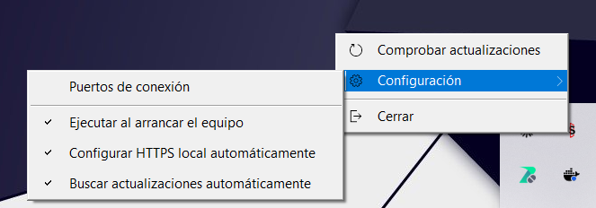
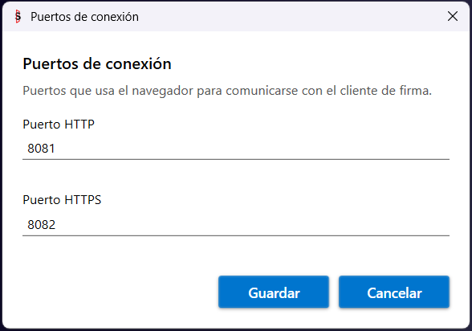
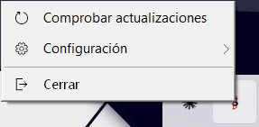
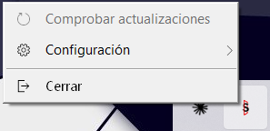
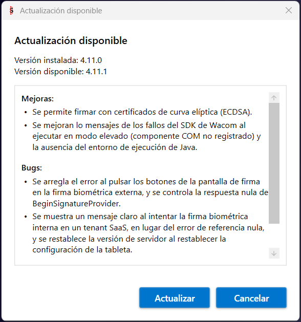
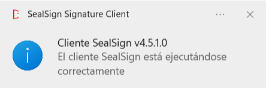
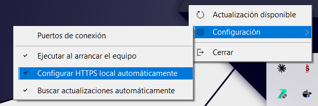
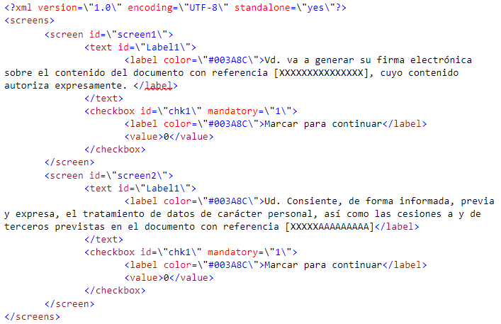
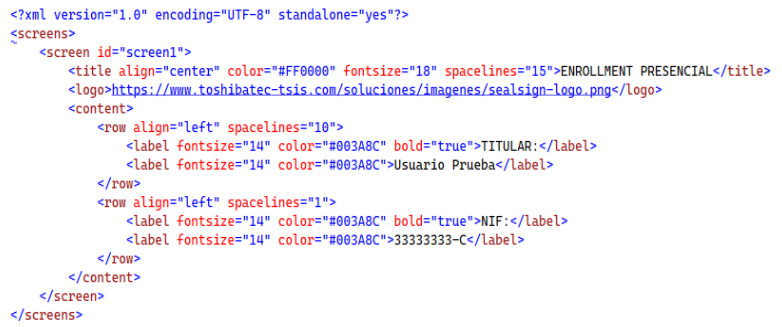
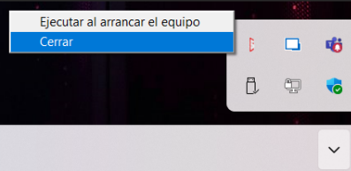

# SealSign Signature Client (ClickOnce)
## 1. Introducción

  SealSign's ClickOnce client replaces the Java Applet in Windows environments. Its deployment is based on Microsoft's ClickOnce technology, which allows the deployment of applications over the Internet. The client is able to communicate bidirectionally with the browser that has launched the signature request to achieve a behavior similar to the integration of the Applet with the browser using JavaScript.
  
  This communication is achieved using Microsoft's SignalR. More information about SignalR can be found on the official SignalR website.

  From the following link you can access a project that contains an example of how to integrate with the SealSign Signature Client (ClickOnce):
   - https://github.com/FactumID/SealSignClickOnceClientWebExample

## 2. Minimum requirements

- The client runs on .Net Framework 4.7.2 or later.
  - Supported operating systems are:
    - Windows 7
    - Windows 8
    - Windows 10
    - Windows Server 2008 R2
    - Windows Server 2012
  - The browsers supported by SignalR are:
    - Microsoft Edge
    - Google Chrome from version 50 onwards
    - Mozilla Firefox from version 46 onwards

## 3. Common tasks

  #### 3.1. Installation

  The client is distributed as an **MSI installer** that is installed **per machine**, so it requires elevation (administrator rights). The installation:

  - Creates the SealSign Signature Client icon on the desktop.
  - Creates a shortcut in the Start menu.
  - Configures the client to start at Windows logon for all users.

  

  *Image 01: SealSign ClickOnce icon.*

  The installer can be run in three ways:

  - Double-clicking the `.msi` file.
  - From the command line: `msiexec /i SealSign-Signature-Client-Setup.msi`
  - Silently, with no user interface: `msiexec /i SealSign-Signature-Client-Setup.msi /qn`

  ###### Installer parameters

  The installer accepts the following properties on the command line. All of them are optional.

  | Parameter | Purpose |
  |---|---|
  | `UPDATEURL` | `https` address of the `installer-version.json` file where the client checks for a new version. The installer must be on the same server and port as that file. If omitted, the machine keeps its existing value, otherwise the address built into the package (if any). |
  | `AUTOMATICUPDATES` | `1` = this machine checks for updates, `0` = it does not. It overrides the user preference and locks the menu option. If omitted, the user decides. |
  | `SIGNALR_HTTP_PORT` | Local HTTP port the client listens on. Default: `8081`. The web uses it at `http://localhost:<port>/signalr`. Must be between 1 and 65535, with no leading zeros, and different from the HTTPS port. |
  | `SIGNALR_HTTPS_PORT` | Local HTTPS port the client listens on. Default: `8082`. The web uses it at `https://localhost:<port>/signalr`. Same rules as the HTTP port. Changing it reconfigures the certificate binding automatically. |

  All parameters are preserved on upgrade or repair: reinstalling without them keeps what the machine already had. If a port is invalid, the installer stops with a message.

  Examples:

  ```cmd
  msiexec /i SealSign-Signature-Client-Setup.msi UPDATEURL=https://firma.miempresa.com/sealsign/installer-version.json AUTOMATICUPDATES=1
  ```

  ```cmd
  msiexec /i SealSign-Signature-Client-Setup.msi SIGNALR_HTTP_PORT=9081 SIGNALR_HTTPS_PORT=9082 /qn
  ```

  :::warning
  In on-premise environments it is mandatory to configure the allowed website origin, otherwise signing will not work. See section 3.2.
  :::

  ###### Migration from the previous ClickOnce version

  On each user's first launch, the client automatically removes the leftovers of the old ClickOnce installation:

  - Its running process.
  - Its entry in Programs and Features.
  - The `.appref-ms` shortcuts (desktop and Start menu).
  - Its startup entry.

  There is nothing to do manually.

  ###### Uninstall

  Uninstall the client from Programs and Features. This removes the SSL binding, the certificates the client created and the Firefox policy (only if the client created it).

  #### 3.2. Authorizing the website origin (AllowedOrigins)

  The client only answers authorized websites. With the value empty, it accepts by default `https://sealsign.es`, `https://pre.sealsign.es` and `https://cert.sealsign.es`, so **SaaS needs nothing**. In **on-premise** environments it is **mandatory** to authorize the origin of your website.

  :::warning
  Filling in this value **replaces** the defaults, it does not add to them. If you also use sealsign.es, include it in the list.
  :::

  The client reads it from the Windows registry:

  - Key: `HKEY_CURRENT_USER\Software\Factum Identity\SealSign Signature Client`
  - Value: `AllowedOrigins`
  - Type: `REG_SZ` (one origin) or `REG_MULTI_SZ` (several origins). The client creates it empty on first launch.

  An origin is the scheme, the domain and the port if there is one, with no path. The match is exact and case-insensitive: no wildcards and no trailing slash.

  | Correct | Incorrect |
  |---|---|
  | `https://firma.miempresa.com` | `https://firma.miempresa.com/firmar` (has a path) |
  | `http://localhost:4200` | `firma.miempresa.com` (scheme missing) |

  Single origin:

  ```cmd
  reg add "HKCU\Software\Factum Identity\SealSign Signature Client" /v AllowedOrigins /t REG_SZ /d "https://firma.miempresa.com" /f
  ```

  Several origins, separated by `\0`:

  ```cmd
  reg add "HKCU\Software\Factum Identity\SealSign Signature Client" /v AllowedOrigins /t REG_MULTI_SZ /d "https://firma.miempresa.com\0http://localhost:4200" /f
  ```

  To check the result:

  ```cmd
  reg query "HKCU\Software\Factum Identity\SealSign Signature Client" /v AllowedOrigins
  ```

  It can also be edited manually with `regedit`.

  Notes:

  - It is per Windows user: each person using the client on the machine needs the value in their own profile.
  - Restart the client after changing it; the list is read at startup.
  - An unauthorized origin receives an HTTP 403, which the browser shows as a connection or CORS error.

  #### 3.3. Mass deployment (GPO, Intune, SCCM)

  ###### Installing the MSI

  - With `msiexec` and the parameters from section 3.1, launched from Intune, SCCM or a script.
  - With **GPO software installation**. It does **not** accept MSI properties, so in that case the ports are enforced through the registry policy (see section 3.4), and the update settings can be written to HKLM by script or GPO preferences (see section 3.5).

  ###### Distributing AllowedOrigins

  **Option A - Group Policy Preferences (recommended)**. It is declarative, needs no script and is reverted as easily as it is applied.

  1. Open the Group Policy Management Console (GPMC) and edit the GPO that applies to the affected users.
  2. Go to: User Configuration → Preferences → Windows Settings → Registry → New → Registry Item.
  3. Fill in the form:

  | Field | Value |
  |---|---|
  | Action | Update |
  | Hive | `HKEY_CURRENT_USER` |
  | Key path | `Software\Factum Identity\SealSign Signature Client` |
  | Value name | `AllowedOrigins` |
  | Value type | `REG_MULTI_SZ` |
  | Value data | `https://firma.miempresa.com` (one origin per line) |

  4. Accept and link the GPO to the OU that contains those users.

  It is applied at the next logon. To force it immediately, run `gpupdate /force` on the machine.

  **Option B - Logon script**. The same result can be achieved with a logon script, published from User Configuration → Policies → Scripts, or from Intune or SCCM running in user context, using `reg add` as shown in section 3.2.

  #### 3.4. Connection ports

  The client listens on two local ports, HTTP and HTTPS (8081 and 8082 by default). They can be changed from the tray icon: right-click the icon and choose "Configuración" (Settings) → "Puertos de conexión" (Connection ports).

  

  *Image 23: "Configuración" (Settings) submenu of the client.*

  

  *Image 24: "Puertos de conexión" (Connection ports) window.*

  - Saving requires administrator rights (UAC prompt).
  - The client restarts its local server in place; there is no need to close it.
  - A confirmation prompt is shown before applying the change.
  - If the client cannot listen on the new ports, it offers to restore the previous ones.
  - Changing the HTTPS port reconfigures the certificate binding automatically.

  The window can show these messages:

  | Message | Meaning |
  |---|---|
  | Invalid number | The port must be an integer between 1 and 65535. |
  | Ports must differ | HTTP and HTTPS cannot use the same port. |
  | Port in use by another application | Warning only: it still lets you save. |
  | "Gestionado por la organización" (Managed by the organization) | The field is locked by a policy. |

  ###### Where the ports are stored

  - Key: `HKEY_LOCAL_MACHINE\SOFTWARE\WOW6432Node\Factum Identity\SealSign Signature Client`
  - Values: `SignalRHttpPort` and `SignalRHttpsPort`, type `DWORD`. Only a DWORD between 1 and 65535 is accepted.

  ###### Precedence

  For each port, the first valid value wins:

  | Order | Source | Location |
  |---|---|---|
  | 1 | Policy | `HKLM\SOFTWARE\Policies\Factum Identity\SealSign Signature Client` (same DWORD names) |
  | 2 | Machine | `HKLM\SOFTWARE\WOW6432Node\Factum Identity\SealSign Signature Client` (written by the installer) |
  | 3 | User | `HKCU\Software\Factum Identity\SealSign Signature Client` |
  | 4 | Default | 8081 and 8082 |

  The policy is how a GPO enforces the ports, and it locks the field in the window. If the ports are changed in the registry or by policy, restart the client; saving from the window does not require it.

  #### 3.5. Updates

  The client can check for new versions and update itself.

  

  *Image 21: Tray icon menu.*

  "Comprobar actualizaciones" (Check for updates) runs a manual check. It shows "Ya tienes la última versión" (You already have the latest version) or the update window.

  

  *Image 22: Menu with "Comprobar actualizaciones" greyed out.*

  The option is greyed out when automatic updates are off (the user unticked "Buscar actualizaciones automáticamente" (Check for updates automatically), or it was installed with `AUTOMATICUPDATES=0`) or when the machine has no update address (`UpdateManifestUrl` empty).

  The option "Buscar actualizaciones automáticamente" is in the "Configuración" submenu (Image 23). When the administrator sets it, it is greyed out with the tooltip "Gestionado por el administrador" (Managed by the administrator).

  ###### How it works

  - At startup the client checks silently. If there is a newer version, the menu item reads "Actualización disponible" (Update available).
  - When a signature is started, a non-blocking window appears without interrupting the signature.
  - The window has a checkbox "No volver a mostrar este mensaje" (Do not show this message again), which silences only that version.
  - "Actualizar" (Update) downloads the installer, verifies its signature, asks for UAC, closes the client and reopens it after installing.

  

  *Image 25: "Actualización disponible" (Update available) window.*

  ###### Who decides

  The first source with a value wins:

  | Order | Source | Location |
  |---|---|---|
  | 1 | Machine | `HKLM\SOFTWARE\WOW6432Node\Factum Identity\SealSign Signature Client`, value `AutomaticUpdates` (`REG_SZ` "0" or "1", written by `AUTOMATICUPDATES`) |
  | 2 | User | `HKCU\Software\Factum Identity\SealSign Signature Client`, value `AutomaticUpdates` |
  | 3 | Neither | Updates are checked |

  Empty is not the same as 0: empty means the machine says nothing, so the user decides. Use `REG_SZ`, not `DWORD`.

  ###### Update address

  `UpdateManifestUrl`, in the same `HKLM\SOFTWARE\WOW6432Node\Factum Identity\SealSign Signature Client` key, written by `UPDATEURL`. The `WOW6432Node` branch is mandatory: the client is a 32-bit application.

  ###### On-premise update server requirements

  - Both the manifest and the installer must be served over `https`.
  - The installer must be on the same server and port as `installer-version.json`.
  - The MSI must carry a valid Factum Authenticode signature, otherwise it is refused.

  #### 3.6. JavaScript client configuration

  This tutorial explains in detail how to configure an environment with SignalR, and in the example hosted on Factum's gitHub you will find all the necessary code to make it work. Once the client has been launched, it listens on the configured ports (8081 HTTP and 8082 HTTPS by default, see section 3.4). In the JavaScript part it will be necessary to:

  - Refer to the JavaScript code of the hub, located in the URL: `https://localhost:<https port>/signalr/hubs` or `http://localhost:<http port>/signalr/hubs` (by default 8082 and 8081)

  - Indicate the URL of the hub.
    ```javascript
    $.connection.hub.url = "http://localhost:8081/signalr"; // or "https://localhost:8082/signalr" (use the configured ports)
    ```

  - The SignalR's hub name is sealSignHub. 
    ```javascript
    var hub = $.connection.sealSignHub;
    ```

  - The application makes calls to different methods of the JavaScript client, either to notify that it is performing some task, or to notify that it has finished that task, or to tell the browser to redirect to a URL. The methods are:
    - Navigate:the application notifies the client that it should navigate to the URL it passes as a parameter. Normally it will be one of the URLs that have been defined as success, cancellation, rejection or error. Usage:
      ```javascript
      hub.client.Navigate = function (url) {  }
      ```
    - AsyncOperationStarted:The application notifies the client that an asynchronous, long-running operation has started. At this point the JavaScript client should relinquish control to the ClickOnce component.   It attaches a message with the details of the operation.   Usage:     
      ```javascript
      hub.client.AsyncOperationStarted = function(message){ }
      ```
    - AsyncOperationCompleted:the application notifies the client that it has completed and can take control. The function will receive a JSON parameter containing information about the status of the completed signing process, along with the document in Base64 format. 
    
      Json received as a parameter:

      ```json
      { 
        "Content": null, // Document in Base64
        "Custody": false, // Whether document custody was configured
        "FileName": null, // Name of the document
        "BiometricSignatureGraph": "", // Signature graph in jpg format
        "Signed": false, // Whether the signature was completed
        "Status": "Canceled", // Signature status in text format (Canceled, CanceledExternally, Rejected, Finish)
        "Error": false, // Whether an error occurred
        "ErrorMessage": null, // Error message
        "IsExternalBiometricSignature": false, // Whether it is an external signature
        "IsCertificateSignature": false, // Whether it is a certificate-based signature
        "IsBiometricSignature": true // Whether it is a biometric signature
      } 
      ```
      Usage:    
      ```javascript
      hub.client.AsyncOperationCompleted = function(response){ }
      ```
    - AsyncOperationInProgress: the application notifies the client that a signature is already in progress. Usage:     
      ```javascript
      hub.client.AsyncOperationInProgress = function(){ }
      ```

#### 3.7. Server version configuration

  The client supports both SealSign version 3.2 and 4.0, but it is necessary to indicate which version is being used. To configure the version being used, the setServerVersion method must be called with one of these two values:

  - V32: to use version 3.2.
  - V40: to use version 4.0 or later.

  If the function is not called, version 3.2 will be used by default.

## 4. Use cases

  #### 4.1. Running the client and launching at Windows startup

  Once the client is installed the icon will appear on the desktop, to launch it just click on it, the following message will appear.

  

  *Image 02: Client message*

  The client can be configured to start when logged on to Windows. To do this, right click on the tray icon and go to "Configuración" (Settings) → "Ejecutar al arrancar el equipo" (Run on computer startup). The MSI enables this option for all users. A standard user sees it greyed out; an administrator can change it (UAC prompt).

  

  *Image 23: "Configuración" (Settings) submenu of the client.*

#### 4.2. Using SSL connection

  To use the secure **SSL (HTTPS)** connection, the **SealSign Signature Client must be installed**.

  With the MSI installer, HTTPS is configured during installation with no prompt to the user.

  The client sets up the following:

  - A self-signed certificate `CN=localhost` in the local machine store, trusted as a root certificate.
  - The binding of that certificate to the HTTPS port.
  - The Firefox policy `EnterpriseRootsEnabled`, only if it did not already exist.

  If the client is installed another way, or SSL has not been configured yet, the first time the client is launched a system window will appear requesting permission to make changes to the computer:

  - **Users with administrator privileges**  
      Will be asked to confirm the authorization.
      
  - **Users without administrator privileges**  
      Will be prompted to enter administrator credentials.
      
  ---

  #### Behavior when SSL configuration is not authorized

  If the authorization is **not accepted** or the required credentials are **not provided**, the SSL configuration **will not be applied** and the Signing Client will operate using an **HTTP connection**.

  Additionally, **each time the Signing Client is closed and reopened**, the authorization or credential prompt will appear again. If the user declines the UAC prompt, it is not asked again for that port.

  ---

  #### How to prevent the authorization prompt from appearing

  To prevent this prompt from appearing repeatedly, you can **disable automatic SSL management**:

  1. Locate the Signing Client icon in the **system tray**.
      
  2. Go to "Configuración" (Settings) and uncheck the option **“Configurar HTTPS local automáticamente”** (Configure local HTTPS automatically).     

  

  *Image 20: "Configurar HTTPS local automáticamente" option in the "Configuración" submenu.*

  This will stop the client from requesting authorization on each startup.

  ---

  #### Proper SSL (HTTPS) connection activation

  If authorization is accepted or credentials are entered correctly:

  - The Signing Client will automatically configure SSL.
      
  - From that moment on, it will connect using **HTTPS** through **the configured HTTPS port (8082 by default)**.
      
  ---

  #### Important note for environments with many non-privileged users

  In environments where **most users do not have administrator privileges**, install the client with the MSI installer (by an administrator, or through a mass deployment, see section 3.3). The installation already configures HTTPS with administrator rights, so users are never asked for authorization.

  ###### 4.2.1. Use SSL

  In order for the client to use an SSL connection, the option must be selected.
  - Refer to the JavaScript code of the hub, located in the URL: `https://localhost:<https port>/signalr/hubs` (the configured HTTPS port, 8082 by default)
  - Indicate the URL of the hub. `$.connection.hub.url = "https://localhost:<https port>/signalr";`

  #### 4.3. Digital Signature

  This describes which functions are published to perform the digital signature of documents, as well as the JavaScript client functions that are invoked to notify the progress and completion of the process.

  ###### 4.3.1. Certificate filtering

  When performing the digital signature it is possible to filter the certificates that will be displayed in the list. The filtering can be done by issuer, by hashy by serial number:
  - **setCertificateIssuerFilter**: Filter by issuer, receives as parameter the valid issuers separated by '|'. Used to show only DNIe certificates: hub.server.setCertificateIssuerFilter('AC DNIE 001');
  - **setCertifciateHashFilter**: Filter by hash, receives as parameter the hash of the certificate to sign with. Usage:hub.server.setCertificateHashFilter('[HASH]');
  - **setCertificateSerialFilter**: Filter by the serial number of the certificate. Usage: hub.server.setCertificateSerialFilter('[SERIAL NUMBER]');

###### 4.3.2. Resetting filters

  To remove all filters set on certificates, the resetCertificateFilters function must be called.

  ###### 4.3.3. Loading a local certificate

  A document can be signed using a locally stored certificate by calling the function loadLocalCertificate, to stop using this certificate call the function clearLocalCertificate. 

  ###### 4.3.4. Document Signature 

  The signing process can be performed in the following ways. 

  - **Parameters**: All digitalSign method overloads receive as first parameter a string array where the signature is parameterized, these parameters are: 
    - URI of the document. 
    - URL of the service. 
    - Success URL. 
    - Error URL. 
    - Cancellation URL. 
    - Basic authentication user. 
    - Basic authentication password. 

  All parameters are mandatory, if any of them must be passed empty it will be passed as null.

  - **digitalSign (string[])**: The document is signed according to the parameters passed using the default configuration of the document provider. 
  - **digitalSign (string[], string)**: The document is signed according to the parameters passed using the document provider configuration passed as the second argument. 
  - **digitalSignUrl(string[], string)**: The document found at the given URL is signed. The document provider with the default configuration is used. 
  - **digitalSignUrl(string[], string, string)**: The document at the given URL is signed. The last parameter is the parameters to use with the document provider. 
  - **digitalSignBase64(string[], string)**: The document passed as parameter is signed in base 64. The document provider is used with the default configuration. 
  - **digitalSignBase64(string[], string, string)**: The document passed as parameter is signed in base 64. The last parameter is the parameters to use with the document provider. 
  - **digitalMultiSign (string[], string)**: A list of documents is signed using the default configuration of the document provider. 
  - **digitalMultiSign (string[], string, string)**: A list of documents passed as parameter is signed. The last parameter is the parameters to use with the document provider.

###### 4.3.5. Using Remote Document Provider

  In order to use the Remote Document Provider, the configuration parameters must be set, for which the following steps must be followed:
  - Set the server version to 4.0 by calling the setServerVersion method with the value 'V40'.
  - Call the function setDSSRemoteProviderConfiguration with the following parameters:
    - url: the url where the Remote Document Provider is hosted.
    - domain: domain of the user with which the call to the Remote Document Provider will be authenticated.
    - user: user with which the call to the Remote Document Provider will be authenticated.
    - password: password of the user with which the call to the Remote Document Provider will be authenticated.
    
  Important: if the call needs to be authenticated, the authentication will be basic.

#### 4.4 Biometric Signature 

###### 4.4.1 Prerequisites for Performing Biometric Signing

- If signing with ePad-Ink tablets, a 32-bit ePad driver must be installed on the computer.
- If signing with a Wacom STU-540 or higher, 32-bit Java must be installed on the computer.

###### 4.4.2 Device settings

The following functions only affect Wacom devices: 

- **setClearImage**: Sets the background image of the tablet when the signature process is completed. The image is passed in base64. 
- **setClearImageUrl**: Sets the background image of the tablet when the signing process is completed. The image is hosted at the URL passed by parameter.
  
###### 4.4.3 Document Signature

  - **Parameters**: The first parameter of the different signatures of the biometric signature methods is a string array that configures the behavior of the component. 
    - Document URI 
    - URL of the service 
    - URL of the document to sign 
    - Padding X lower left corner 
    - Padding Y bottom left corner 
    - Success URL 
    - Error URL 
    - Cancellation URL 
    - Reject URL 
    - Basic authentication user 
    - Basic authentication password 
    - Acceptance view title background color 
    - Acceptance view title 
    - Acceptance view title color 
    - Identifier 
    - Label "Step 
    - Label "from 
    - Sign button - Signature screen 
    - Continue button - on all screens 
    - Clear button - Signature screen 
    - Cancel button - on all screens 
    - Reject button - on all screens 
    - OPTIONAL text above on the signature screen 
    - XML with the configuration of the previous screens form (Optional, can be left blank if previous screens are not desired)  
    _**NOTE: This parameter is optional only in versions higher than v4.4**_
    - XML with the configuration of the final screen form with the signature panel (Optional, can be left blank if the final screen is not to be customized)  
    _**NOTE: This parameter is added in versions higher than 4.4**_
    - Global Customization Parameters (Font, Sale Width and Height, Font Size) 
  - **Form**: For the handwritten signature process a form can be added in which the user must select several checks in order to advance in the process and finally sign the signature. The configuration of this form is the last parameter of those described in the previous section.

  This is an example of a valid XML: 

  

  The XML defines the screens that will be present with the screen node. Each screen node can have several controls inside, these controls can be either labels, defined in the text nodes, or checkboxes, defined in the checkbox nodes. These checkboxes can be mandatory in order to advance in the signing process. Whether they are mandatory or not is defined in the mandatory attribute of the checkbox node of the XML file, if its value is 1 it is mandatory and if it is 0 it is optional. 

  In addition to this screen configuration, some of the parameters are used to configure the look & feel. 

  

  - **Final Screen Customization Form**: For the handwritten signature process, an XML form can be added where the user can customize the final screen where the signature scribble is entered. This customization does not allow modification of the buttons that appear on the final screen nor the signature guideline line.

  This is an example of a valid XML: 

  

  It is recommended to download the example code from FactumID's GitHub page to familiarize yourself with these parameters and see how they affect the screen. 

    - **bioSign(string[])**: Launches the signature process parameterized with the configuration passed as an argument. Uses the document provider associated with the document URI and its default setting. 
    - **bioSign(string[], string)**: Launches the signature process parameterized with the configuration passed by argument. It uses the document provider associated to the URI of the document to which the parameters of the second argument are passed. 
    - **bioSignUrl(string[], string)**: Launches the signature process parameterized with the configuration passed by argument. The document whose URL has been given is signed, it uses the document provider associated to the document URI and its default parameterization.  
    - **bioSignUrl(string[], string, string)**: Launches the signature process parameterized with the configuration passed by argument. The document whose URL has been given is signed, it uses the document provider associated to the URI of the document to which the parameters of the second argument are passed.  
    - **bioSignBase64(string[], string)**: Launches the signature process parameterized with the configuration passed by argument. It signs the document set in the second parameter in base64, uses the document provider associated to the URI of the document and its default parameterization. 
    - **bioSignBase64(string[], string, string)**: Launches the signature process parameterized with the configuration passed by argument. It signs the document set in the second parameter in base64, it uses the document provider associated to the URI of the document to which the parameters of the second argument are passed.

  ###### 4.4.4 Using Remote Document Provider

  In order to use the Remote Document Provider, the configuration parameters must be configured, for this purpose the following steps must be followed:
  - Set the server version to 4.0 by calling the setServerVersion method with the value 'V40'.
  - Call the function setDSSRemoteProviderConfiguration with the following parameters:
    - url: the url where the Remote Document Provider is hosted.
    - domain: domain of the user with which the call to the Remote Document Provider will be authenticated.
    - user: user with which the call to the Remote Document Provider will be authenticated.
    - password: password of the user with which the call to the Remote Document Provider will be authenticated.
    
  Important: if the call needs to be authenticated, the authentication will be basic.

#### 4.5 Enrollment

  - **Parameters**: The first parameter of the different signatures of the biometric signature methods is a string array that configures the behavior of the component. 
    - Service URL 
    - Success URL 
    - Error URL 
    - Cancellation URL 
    - Basic authentication user 
    - Basic authentication password 
    - User to which the enrollment will be made (Optional), if this parameter is not passed, the enrollment will be applied to the user who authenticates the service. 
    - Cancel button text 
    - Delete button text 
    - Text of the Sign button 
    - Parameters of global customization (Font, Width and height of the sale, Font size) 
    - XML with the signature panel form settings 

  The configuration of this form is the last parameter of those described in the previous section. 

  This is an example of a valid XML: 

  

  The XML defines the screens that will be present with the screen node. In addition to this screen configuration, some of the parameters are used to configure the look & feel, such as font color, logo, and text size.  

  - **bioEnrollment (string[])**: Launches the face-to-face signature enroolment process parameterized with the configuration passed as an argument. It uses the document provider associated to the document URI and its default parameterization.


  #### 4.6 Window
 To close the window you can invoke the javascript method closeWindow

  ```javascript
  hub.server.closeWindow();
  ```
NOTE: When calling the CloseWindow function, the signature window will close, and the AsyncOperationComplete function will indicate a response status of   ```CanceledExternally```, signifying that the signing process was canceled externally

  #### 4.7 Launch External Processes
Function that executes a command and allows launching external processes from the signing app

  ```javascript
  hub.server.launchExternalApp(command);
  ```
  
## 5. Troubleshooting

To resolve potential issues with the **SealSign Signature Client**, try applying one of the actions from the following list:

#### 1. The website cannot connect to the client
- Check that the website's origin is authorized in `AllowedOrigins` (see section 3.2). An unauthorized origin gets an HTTP 403, which the browser shows as a connection or CORS error.
- Check that the client is running (icon in the system tray).
- Check that the ports configured in the client (section 3.4) match the ones the website uses.

---

#### 2. "SignalR connection problem" notices
The client shows a balloon notice from the system tray when it cannot start its local server. Depending on the cause:
- **Port in use by another application**: change the ports (section 3.4).
- **Access denied**: run or reconfigure the client with administrator rights.
- **SSL certificate not bound to the port**: re-enable "Configurar HTTPS local automáticamente" (Configure local HTTPS automatically) and restart the client, or repair the installation from Programs and Features.

---

#### 3. The installer stops with a port error
The installer validates `SIGNALR_HTTP_PORT` and `SIGNALR_HTTPS_PORT` and stops with a message if they are invalid. Check that each one is a number between 1 and 65535, with no leading zeros (`09081` is rejected), and that the two are different.

---

#### 4. Close and Restart the Signature Client
- Manually close the **SealSign Signature Client** application from the taskbar.  
- Refresh the browser cache and launch the signing process again.  

> **Note:**  
> You can refresh the cache by executing the following command:  
> ```plaintext
> CTRL + SHIFT + R
> ```  
> on the page [sealsign.es](https://sealsign.es).


###### How to close the application:
Right-click on the **SealSign** icon running in the taskbar and select it to close.



---

#### 5. Reinstall the Signature Client
- Uninstall the **SealSign Signature Client** application from Programs and Features.  
- Run the MSI installer again.  
- Refresh the browser cache (CTRL + SHIFT + R on [sealsign.es](https://sealsign.es)).  
- Launch the signing process again.

---

#### 6. Try a Different Browser
- Attempt the signing process using a different browser.  
- **If it works with the new browser**, report the issue to support, indicating the name of the browser where the problem occurred.

---

#### 7. Complete Removal of the Signature Client (Last Resort)
If the previous options do not resolve the issue, remove all traces of the signature client by following these steps:

1. Verify that the `SealSign Signature Client` application is not running.  
2. Uninstall it from Programs and Features.
3. If the machine was migrated from the previous ClickOnce version and traces of it remain, also delete the contents of the following paths in the Windows File Explorer:  
  - ```plaintext
    %UserProfile%\AppData\Local\Apps
    ```
  - ```plaintext
    %UserProfile%\AppData\Roaming\11paths
    ```
4. Run CMD as an administrator and execute the following command (also only for installs migrated from the previous ClickOnce version):  
    ```bash
    reg delete HKCU\SOFTWARE\Classes\clickonce
    ```

#### Information to Send to the Support Department

If none of the previously mentioned actions resolve the issue, the following information must be sent to the support department:

- 🖥️ **Type/Model** and **name of the computer** where the signing process is being performed.  
- 🌐 **Name and version of the browser** being used for signing.  
- ✍️ **Type/Model of the digital tablet**, if performing a biometric signature.  
- 🖼️ **Evidence or screenshots of the error** encountered.  
- 📝 **Brief description of the steps** followed by the signer during the signing process.  
- 📂 **Attach the log file** located at the following path:  

```plaintext
%APPDATA%\SealSignBSSClient\SealSignBSSLog.log
```
