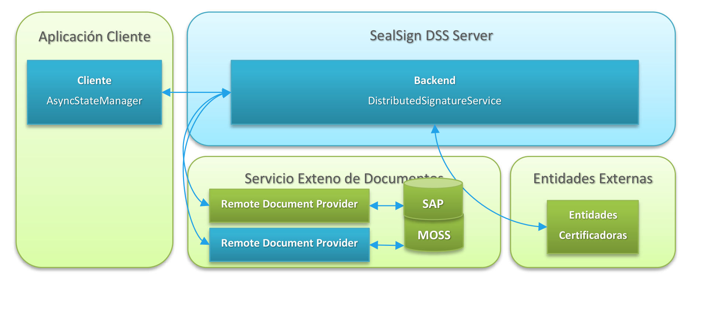

# SealSign DSS Web Services Reference Guide

## 1. Introduction

SealSign DSS (Digital Signature Services) is a product developed by Factum Identity aimed at facilitating the integration of electronic signing in corporate applications. SealSign DSS exposes its functionality through Web Services based on WCF (Windows Communication Foundation) technology. These services can be invoked by applications built on top of most of the technologies available on the market.

This document is not intended as a manual on the specific aspects of electronic signing, but rather as a technical reference manual, aimed at developers, that gathers the description of these services in order to help integrate applications with the SealSign DSS signing server.

For integration examples of the most common use cases, please refer to the various SealSign DSS application integration guides, available for each of the supported development technologies.

## 2. Web Service Interfaces of SealSign DSS

Given the heterogeneity of the technologies available on the market, and with the aim of being accessible from the vast majority of corporate applications, SealSign DSS web services are accessible through two interfaces:

- An interface based on the SOAP 1.1 specification (BasicHttpBinding).
- An interface based on the SOAP 1.2 specification and WS-Addressing (WsHttpBinding).

Depending on the technology and capabilities of the client application, either interface may be invoked.

The SOAP 1.1 interface exposes the following Web Services:

- Certificate validation service (CertificateServiceBasic.svc): allows performing certificate revocation query operations.
- Signature service (SignatureServiceBasic.svc): provides signing and signature verification capabilities.
- Timestamp service (TimestampServiceBasic.svc): provides time-stamping capabilities.
- Distributed signature service (DistributedSignatureServiceBasic.svc): provides distributed signing capabilities between the client application and the SealSign server.

The SOAP 1.2 interface exposes the following Web Services:

- Signature service (SignatureService.svc): provides signing and signature verification capabilities.
- Timestamp service (TimestampService.svc): provides time-stamping capabilities.
- Distributed signature service (DistributedSignatureService.svc): provides distributed signing capabilities between the client application and the SealSign server.

The services will be accessible under the SealSignDSSService virtual directory. For example: http://localhost/sealsigndssservice/signatureservice.svc.

#### 2.1. Common Classes

The following classes are used as parameters in the Web Services regardless of the interface through which they are published.

###### 2.1.1. CertificateReference

Each object of this class represents the information associated with a certificate stored on the SealSign server.

The CertificateReference class is defined as follows:

```csharp
public class CertificateReference
{
public int id;
public string issuer;
public string subject;
public string serial;
public DateTime validFrom;
public DateTime validTo;
public string owner;
public bool passwordRequired;
public bool passwordSealSignRequired;
public string contactInfo;
public byte[] encoded;
}
```

**MEMBERS**

- id: Identifier of the certificate on the SealSign server. This is the value that will be passed as an input parameter to the signing method in order to select the certificate.
- issuer: String containing the common name of the certificate issuer.
- subject: String containing the common name of the certificate's subject field.
- serial: String containing the certificate's serial number.
- validFrom: Date on which the certificate's validity period begins.
- validTo: Date on which the certificate's validity period ends.
- owner: String containing the owner of the certificate as specified on the SealSign server.
- passwordRequired: This value indicates whether a password is required in order to use the certificate's private keys.
- passwordSealSignRequired: When storing certificates on the SealSign server, it is possible to specify a password that will be required in order to use it. This value indicates whether this password must be supplied for the referenced certificate.
- contactInfo: Contact information of the certificate's owner.
- encoded: DER-encoded certificate.

###### 2.1.2. SignatureVerification

The Verify method returns an object of this class as the result of the signature verification process for a document.

The SignatureVerification class is defined as follows:

```csharp
public class SignatureVerification
{
public VerificationResult result;
public SignatureReference[] signatures;
}
```

**MEMBERS**

- result: Indicates the overall result of the signing process. Its possible values are:
  - Valid: All signatures found in the document are valid.
  - IncompleteValidation: At least one signature could not be validated due to a missing parameter or certificate. For more information about the specific problem, the signatures array should be traversed and the value of the signatureStatus member checked.
  - Invalid: At least one signature is not correct. For more information about the specific problem, the signatures array should be traversed and the value of the signatureStatus member checked.
- signatures: Array with the validation information for each of the signatures found in the document. The array will have as many elements as there are co-signatures at this level, and at least one element if there is a single signature.

###### 2.1.3. SignatureParameters

The SignatureParameters class is defined as follows:

```csharp
public class SignatureParameters
{
public string reason;
public string city;
public string state;
public string postalCode;
public string country;
public string signerRole;
public string policyIdentifier;
public string policyDigest;
public string policyCMSQualifierURI;
public string reference;
public PDFSignatureParameters pdfParameters;
public int timestampServerId;
public int timestampBackupServerId;
public string header;
public string signerCaption;
public string signerInfo;
public string algorithmCaption;
public string algorithmInfo;
public string documentPassword;
}
```

**MEMBERS**

- reason: Text string used to indicate the reason for which the signature is being performed.
- city: Text string used to specify the city where the signature is performed.
- state: Text string used to specify the state where the signature is performed.
- postalCode: Text string used to specify the postal code where the signature is performed.
- country: Text string used to specify the country where the signature is performed.
- signerRole: Text string used to specify the signer's role.
- policyIdentifier: Text string used to specify the identifier of the policy applied to the signature.
- policyDigest: Text string used to specify the digest of the policy applied to the signature.
- policyCMSQualifierURI: Text string with the URI of the policy applied in CMS signatures.
- reference: Reference within the XML document to which the signature is to be applied.
- pdfParameters: Object of the PDFSignatureParameters class that allows customizing some parameters of PDF document signing. If null is specified for this member, the configurations set at server level will be applied. For more information, see the documentation for the PDFSignatureParameters class.
- timestampServerId: Identifier of the timestamp server that will be used for operations requiring time stamps.
- timestampBackupServerId: Identifier of the backup timestamp server that will be used for operations requiring time stamps when the primary server (identified by the timestampServerId field) returns an error.
- header: String used to specify the header text of the signature viewer in PDF documents.
- signerCaption: String used to specify the title text for the document's signer.
- signerInfo: String used to specify information about the signer.
- algorithmCaption: String used to specify the title text of the algorithm used in the signature.
- algorithmInfo: String used to specify information about the algorithm used in the signature.
- documentPassword: Allows specifying the password of documents that have been password-protected, which will be used to open the file to be signed.

###### 2.1.4. PDFSignatureParameters

The PDFSignatureParameters class allows customizing certain parameters of both the signing and verification of PDF documents. This class is defined as follows:

```csharp
public class PDFSignatureParameters
{
public string PDFPassword;
public string PDFSignatureFieldName;
public bool PDFSignatureVisible;
public byte[] PDFSignatureBackground;
public bool PDFSignatureBackgroundStretch;
public int PDFSignatureBackgroundWidth;
public int PDFSignatureBackgroundHeight;
public bool PDFSignatureWidgetAutoPos;
public int PDFSignatureWidgetOffsetX;
public int PDFSignatureWidgetOffsetY;
public bool PDFSignatureWidgetAutoSize;
public int PDFSignatureWidgetHeight;
public int PDFSignatureWidgetWidth;
public int PDFSignatureWidgetRotate;
public bool PDFSignatureWidgetOnAllPages;
public int PDFSignatureWidgetOnPage;
public bool PDFSignatureFilterOnlyDocSignatures;
public bool PDFSignatureWidgetHideText;
public bool PDFSignatureWidgetOnLastPage;
public int PDFSignatureWidgetPageOffset;
public string PDFSignatureWidgetImageTokenText;
public string PDFSignatureWidgetDateCaptionFormat;
public int PDFSignatureWidgetDateOffsetX;
public int PDFSignatureWidgetDateOffsetY;
public TextMark TextMark;
public float? PDFSignatureWidgetDateTextSize;
}
```

**MEMBERS**

- PDFPassword Reserved for future use.
- PDFSignatureFieldName Allows specifying the name of a field in the PDF document in which the signature will be stored.
- PDFSignatureVisible Boolean indicating whether the signature widget will be visible in the document resulting from the signing operation.
- PDFSignatureBackground Byte array of the background image to be included in the signature widget. The format must be JPG. By default it will be fitted within the widget's size while preserving its aspect ratio.
- PDFSignatureBackgroundStretch Boolean indicating whether the background image will be automatically stretched to fit the widget's size.
- PDFSignatureBackgroundWidth Width of the original image specified in PDFSignatureBackground, or width of the original image to be cropped.
- PDFSignatureBackgroundHeight Height of the original image specified in PDFSignatureBackground, or height of the original image to be cropped.
- PDFSignatureWidgetAutoPos Boolean used to indicate whether the signature widget will be positioned automatically, or whether the values of the PDFSignatureWidgetOffsetX and PDFSignatureWidgetOffsetY parameters will be used instead. If automatic positioning is enabled, the widget will appear in the top-right corner of the page.
- PDFSignatureWidgetOffsetX Allows indicating, in pixels, the value of the X coordinate, measured from the bottom-left corner of the page, at which the signature widget will appear.
- PDFSignatureWidgetOffsetY Allows indicating, in pixels, the value of the Y coordinate, measured from the bottom-left corner of the page, at which the signature widget will appear.
- PDFSignatureWidgetAutoSize Boolean used to indicate whether the signature widget will be automatically resized, or whether the values of the PDFSignatureWidgetHeight and PDFSignatureWidgetWidth parameters will be used instead.
- PDFSignatureWidgetHeight Height, in pixels, of the signature widget.
- PDFSignatureWidgetWidth Width, in pixels, of the signature widget.
- PDFSignatureWidgetRotate Allows indicating the rotation angle of the signature widget. Its possible values are 0, 90, 180 or 270.
- PDFSignatureWidgetOnAllPages Indicates whether the signature widget must be included on all pages of the document.
- PDFSignatureWidgetOnPage Indicates the page number on which the signature widget will be included.
- PDFSignatureFilterOnlyDocSignatures During signature verification, indicates whether only document-type signatures will be validated, or any other signature included in the PDF.
- PDFSignatureWidgetHideText Boolean indicating whether the widget will hide the automatic text describing the signer.
- PDFSignatureWidgetOnLastPage Boolean indicating whether the widget will be shown on the last page of the signed document.
- PDFSignatureWidgetPageOffset Integer indicating the positive or negative offset of the widget, in number of pages, relative to its current position.
- PDFSignatureWidgetImageTokenText String indicating the chunk of text to search for within the document, relative to which the position of the signature widget will be established.
- PDFSignatureWidgetDateCaptionFormat String indicating the date format that will be shown in the signature widget. It is a string using standard date/time format, as described in the article https://msdn.microsoft.com/en-us/library/8kb3ddd4.aspx
- PDFSignatureWidgetDateOffsetX Indicates, in pixels, the value of the X coordinate, measured from the bottom-left corner of the widget, at which the signature date will appear.
- PDFSignatureWidgetDateOffsetY Indicates, in pixels, the value of the Y coordinate, measured from the bottom-left corner of the widget, at which the signature date will appear.
- TextMark Object of the TextMark class that allows including a custom text mark in the signature widget. For more information, see the description of the TextMark class.
- PDFSignatureWidgetDateTextSize Font size, in points, used to render the signature date in the widget.

###### 2.1.5. VerificationParameters

The VerificationParameters class represents parameters required to perform signature validation that are not included within the signature itself.

Currently, the VerificationParameters class only contains the signingCertificate attribute. This value is only necessary for those signature types in which the certificate used to sign is not embedded within the document's signature.

###### 2.1.6. SignatureReference

Each object of this class represents the verification information corresponding to a signature found in a document. The SignatureReference class is defined as follows:

```csharp
public class SignatureReference
{
public string signatureID;
public string issuerSignature;
public bool signatureIsQualified;
public bool isSealQualifiedSignature;
public bool isTimestampSignature;
public VerificationStatus signatureStatus;
public SignatureProfile signatureProfile;
public SignatureFlags signatureFlags;
public SignatureType signatureType;
public byte[] signatureCertificate;
public string signatureCertificateSubjectDN;
public string signatureCertificateCommonName;
public string signatureCertificateOrganization;
public string signatureCertificateIssuer;
public string signatureCertificateIssuerOrganization;
public bool signatureCertificateIsQualified;
public DateTime signingTime;
public HashAlgorithm hashAlgorithm;
public SignatureReference[] counterSignatures;
public TimestampReference[] timestamps;
public TimestampReference[] validationTimestamps;
}
```

**MEMBERS**

- signatureID: Identifier of the signature within the document.
- issuerSignature: Display name of the signer: the certificate's organization when the signature is a qualified electronic seal, or its common name otherwise.
- signatureIsQualified: Indicates whether the signature meets the requirements of the EU Trusted List to be considered a qualified electronic signature.
- isSealQualifiedSignature: Indicates whether the signing certificate corresponds to a qualified electronic seal (a legal entity) rather than an individual signer.
- isTimestampSignature: Indicates whether this signature is itself a signature over a time-stamp token rather than over the document.
- signatureStatus: Status of the signature after the verification process. For more information about the possible values, see the description of the VerificationStatus enumerated type.
- signatureProfile: Indicates the profile the current signature satisfies, including whether it is an advanced signature profile. For more information about the possible values, see the description of the SignatureProfile enumerated type.
- signatureFlags: Contains flags with advanced information about the signature. Among the possible values, after verifying a document, this field may contain one or more of the following values: CMSAdESExplicitPolicy, CMSAdESXType2, XMLAdESExplicitPolicy, XMLAdESXType2, PDFAdESIncludeRevocationInfo, PDFAdESIncludeTimestamp. For more information about the possible values, see the description of the SignatureFlags enumerated type.
- signatureType: Indicates the storage format of the signature within the document. Its value may be Enveloped, Enveloping or Detached, depending on whether the document contains the signature, the signature contains the document, or the signature and the document are stored separately, respectively.
- signatureCertificate: Contains the certificate used to create the signature.
- signatureCertificateSubjectDN: Full Subject Distinguished Name of the certificate used to create the signature.
- signatureCertificateCommonName: Common name (CN) of the subject of the certificate used to create the signature.
- signatureCertificateOrganization: Organization (O) of the subject of the certificate used to create the signature.
- signatureCertificateIssuer: Common name (CN) of the issuer of the certificate used to create the signature.
- signatureCertificateIssuerOrganization: Organization (O) of the issuer of the certificate used to create the signature.
- signatureCertificateIsQualified: Indicates whether the certificate used to create the signature is a qualified certificate.
- signingTime: Specifies the date and time at which the signature was created.
- hashAlgorithm: Specifies the hash algorithm used in the signature.
- counterSignatures: If the signature contains counter-signatures, this will contain an array of objects of this same class with the information corresponding to each of the co-signatures existing at this level. If there are no counter-signatures, this member will be null.
- timestamps: Array of objects of type TimestampReference with the information corresponding to the time stamps included in this signature. If the signature does not contain time stamps, this member will be null.
- validationTimestamps: For the advanced signature profiles CAdES_X, CAdES_XL (types 1 and 2), CAdES_A, XAdES_X, XAdES_XL (types 1 and 2) and XAdES_A, a special type of time stamp called "Validation Timestamp" is defined. This member will contain an array of objects of type TimestampReference with the information corresponding to this type of time stamp.

###### 2.1.7. TimestampReference

Each object of this class represents the verification information corresponding to each time stamp found in a signature. The TimestampReference class is defined as follows:

```csharp
public class TimestampReference
{
public bool timestampSuitable;
public TimestampType timestampType;
public DateTime timestampTime;
public SignatureReference[] timestampSignatures;
}
```

**MEMBERS**

- timestampSuitable: Boolean indicating whether the time stamp matches the stamped object.
- timestampType: Indicates the type of time stamp.
- timestampTime: Indicates the date and time at which the time stamp was performed.
- timestampSignatures: Array of objects of the SignatureReference class with information about the signatures included in the time stamp. This object is only created if the IncludeTimestampInfo value was specified in the options parameter of the Verify method.

###### 2.1.8. CertificateInfo

Each object of this class represents the information contained within an x509 certificate. The CertificateInfo class is defined as follows:

```csharp
public class CertificateInfo
{
public string algorithm;
public NameInfo issuer;
public NameInfo subject;
public string serialNumber;
public DateTime validFrom;
public DateTime validTo;
public KeyUsages keyUsage;
public ExtendedKeyUsages extendedKeyUsage;
public AlternativeNameInfo[] subjectAlternativeName;
public FieldInfo[] extensions;
}
```

**MEMBERS**

- algorithm: String containing the algorithm with which the certificate was signed.
- issuer: Object of the NameInfo class with the specific information of the certificate's issuer.
- subject: Object of the NameInfo class with the specific information of the certificate's subject.
- serialNumber: String containing the serial number assigned to the certificate.
- validFrom: Indicates the date on which the certificate's validity period begins.
- validTo: Indicates the date on which the certificate's validity period ends.
- keyUsage: Enumerated field of type KeyUsages. Will contain one or more values (flags) with the different uses assigned to the certificate.
- extendedKeyUsage: Enumerated field of type ExtendedKeyUsages. Will contain one or more values (flags) with the different extended uses assigned to the certificate.
- subjectAlternativeName: Array of objects of the AlternativeNameInfo class. Will contain one element for each of the values included in the certificate subject's alternative name field.
- extensions: Array of objects of the FieldInfo class. Will contain one element for each of the extensions included in the certificate.

###### 2.1.9. NameInfo

Each object of this class represents the information contained within a name-type field (issuer or subject) of an x509 certificate. The NameInfo class is defined as follows:

```csharp
public class NameInfo
{
public string Name;
public string CommonName;
public string Country;
public string EMailAddress;
public string Locality;
public string Organization;
public string OrganizationUnit;
public string StateOrProvince;
public string SerialNumber;
public string DomainComponent;
public string GivenName;
public string Initials;
public string StreetAddress;
public string SurName;
public string Title;
public FieldInfo[] RDN;
}
```

**MEMBERS**

- Name: String with the value of the name in question.
- CommonName: String with the value of the common name field.
- Country: String with the value of the country field.
- EMailAddress: String with the value of the e-mail address field.
- Locality: String with the value of the locality field.
- Organization: String with the value of the organization field.
- OrganizationUnit: String with the value of the organizational unit field.
- StateOrProvince: String with the value of the state or province field.
- SerialNumber: String with the value of the serial number field (of the issuer or the subject).
- DomainComponent: String with the value of the "DC" field or fields.
- GivenName: String with the value of the GivenName field.
- Initials: String with the value of the initials field.
- StreetAddress: String with the value of the street address field.
- SurName: String with the value of the SurName field.
- Title: String with the value of the title field.
- RDN: Array of objects of the FieldInfo class. Will contain one element for each of the elements contained within the subject or issuer field of the certificate. This array will contain all the values, both those corresponding to the rest of the fields of the NameInfo structure and any specific ones that were not included in the structure.

###### 2.1.10. AlternativeNameInfo

Each object of this class represents the information contained within an alternative name-type field of an x509 certificate. The AlternativeNameInfo class is defined as follows:

```csharp
public class AlternativeNameInfo
{
public FieldInfo[] DirectoryNames;
public string DNSName;
public string IpAddress;
public string RegisteredID;
public string RFC822Name;
public string UniformResourceIdentifier;
public FieldInfo OtherName;
}
```

**MEMBERS**

- DirectoryNames: Will contain the value of the alternative name if it is of type DirectoryName.
- DNSName: Will contain the value of the alternative name if it is of type DNSName.
- IpAddress: Will contain the value of the alternative name if it is of type IpAddress.
- RegisteredID: Will contain the value of the alternative name if it is of type RegisteredID.
- RFC822Name: Will contain the value of the alternative name if it is of type RFC822Name.
- UniformResourceIdentifier: Will contain the value of the alternative name if it is of type URI.
- OtherName: Will contain the value of the alternative name if it is none of the above types.

###### 2.1.11. FieldInfo

Each object of this class represents the information contained within a field or extension of an x509 certificate. The FieldInfo class is defined as follows:

```csharp
public class FieldInfo
{
public string OID;
public string FriendlyName;
public string Value;
public byte[] RawData;
}
```

**MEMBERS**

- OID: Will contain the OID of the field in question, as a string.
- FriendlyName: If the field is a well-known field, will contain its name as a string. The value of this field will be localized according to the system's language. If the field is not well-known, it will contain an empty string.
- Value: If the field has a format known to the system, will contain its value formatted as a string. If the field is not known, it will contain an empty string.
- RawData: Value of the field as a byte array, exactly as it appears in the certificate.

###### 2.1.12. RemoteProviderConfiguration

Each object of this class represents the information required to invoke a remote document provider. The RemoteProviderConfiguration class is defined as follows:

```csharp
public class RemoteProviderConfiguration
{
public string providerUrl;
public string providerDomain;
public string providerUser;
public string providerPassword;
public string providerParameter;
}
```

**MEMBERS**

- providerUrl: Will contain the URL of the remote document provider to be invoked.
- providerDomain: Will contain the domain corresponding to the user account used to connect to the remote document provider.
- providerUser: Will contain the user account used to connect to the remote document provider.
- providerPassword: Will contain the password corresponding to the user account used to connect to the remote document provider.
- providerParameter: Text string that allows passing information between the client and the remote document provider to customize its behavior.

###### 2.1.13. ShadowMarkInfo

Represents the information associated with the Shadow watermarks embedded in a document. The ShadowMarkInfo class is defined as follows:

```csharp
public class ShadowMarkInfo
{
public ShadowMark[] ShadowMarks;
}
```

**MEMBERS**

- ShadowMarks: array of information associated with the Shadow watermarks.

###### 2.1.14. ShadowMark

Represents the information associated with a Shadow watermark embedded in a document. The ShadowMark class is defined as follows:

```csharp
public class ShadowMark
{
public int ShadowMarkID;
public string UserName;
public string ComputerName;
public DateTime Time;
}
```

**MEMBERS**

- ShadowMarkID: Identifier of the watermark.
- UserName: User account with which the watermark was inserted.
- ComputerName: Machine from which the request to insert the watermark was made.
- Time: Time at which the watermark was created.

###### 2.1.15. TextMark

Represents a custom text mark that can be embedded in the PDF signature widget, as referenced by the TextMark member of the PDFSignatureParameters class. The TextMark class is defined as follows:

```csharp
public class TextMark
{
public List<string> Text;
public string FontFamily;
public float FontSize;
public string Color;
public bool Bold;
}
```

**MEMBERS**

- Text: List of text lines to be rendered in the signature widget.
- FontFamily: Name of the font family used to render the text.
- FontSize: Font size, in points, used to render the text.
- Color: Text color, expressed as a color name or hexadecimal value.
- Bold: Boolean indicating whether the text is rendered in bold.

#### 2.2. Common Enumerations

The following enumerated types are used as parameters in the Web Services regardless of the interface through which they are published.

###### 2.2.1. SignatureProfile

Indicates the different signature profiles that SealSign DSS can handle.

```csharp
public enum SignatureProfile
{
Default = 0,
CMS,
CAdESBES,
CAdEST,
CAdESC,
CAdESX,
CAdESXL,
CAdESA,
XMLDigSig,
XAdESBES,
XAdEST,
XAdESC,
XAdESX,
XAdESXL,
XAdESA,
PDF,
PAdESBasic,
PAdESBES,
PAdESLTV,
PAdESXML,
Office,
CAdESLTA,
PAdESLTA,
XAdESLTA
}
```

###### 2.2.2. SignatureType

Indicates the different signature storage formats supported by SealSign DSS.

```csharp
public enum SignatureType
{
Default = 0,
Enveloped,
Enveloping,
Detached,
DetachedInternal
}
```

**VALUES**

- Default: Uses the default signature storage format (Enveloped).
- Enveloped: The signature is stored contained within the document.
- Enveloping: The signature is stored in such a way that it contains the document within it.
- Detached: The signature is stored separately from the document.

###### 2.2.3. HashAlgorithm

Indicates the different hash generation algorithms supported by SealSign DSS.

```csharp
public enum HashAlgorithm
{
Default = 0,
RIPEMD160,
MD5,
SHA1,
SHA256,
SHA384,
SHA512,
SSL3
}
```

###### 2.2.4. SignatureFlags

The SignatureFlags enumerated type is used both in document signing operations and in their verification.

```csharp
public enum SignatureFlags
{
None = 0,
Default = 1,
ValidateChain = 2,
CheckRevocationStatus = 4,
XMLAddXPathRemoveSignatureTransform = 8,
XMLAdESIncludeSignerRole = 16,
XMLAdESExplicitPolicy = 32,
XMLAdESXType2 = 64,
CMSAdESExplicitPolicy = 128,
CMSAdESXType2 = 256,
PDFAdESIncludeTimestamp = 512,
PDFAdESIncludeRevocationInfo = 1024,
PDFAdESExplicitPolicy = 2048,
IncludeLocation = 4096,
XMLAdESVersion122 = 8192,
XMLAdESIncludeKeyValue = 16384,
XMLAdESVersion132 = 32768,
PDFAdESUseParametersInWidget = 65536,
XMLAdESPrettySignature = 131072,
PDFAdESHideTimestampInWidget = 262144,
XMLAdExcludeCertFromSignedProperties = 524288,
PDFAdESIncludeFontInWidget = 1048576,
IncludeShadowMark = 2097152,
CleanMetadata = 4194304,
PDFAdESHideIdentityDocumentInWidget = 8388608,
FirmaProfesionalSignature = 16777216
}
```

**VALUES**

- None: Does not specify any signature flag.
- Default: Uses the default values for signing. The default values will be composed from the options set in the administration tool.
- ValidateChain: Validates the certificate chain before signing.
- CheckRevocationStatus: Checks the revocation status before performing the signature.
- XMLAddXPathRemoveSignatureTransform: Applies the XPath signature-removal transform before signing. This flag allows signing only the content of the document without including other previously performed signatures.
- XMLAdESIncludeSignerRole: Includes the signer's role in the XAdES signature.
- XMLAdESExplicitPolicy: Explicitly includes the signature policy in the XAdES signature.
- XMLAdESXType2: Performs an XAdES-X or XAdES-XL type 2 signature.
- CMSAdESExplicitPolicy: Explicitly includes the signature policy in the CAdES signature.
- CMSAdESXType2: Performs a CAdES-X or CAdES-XL type 2 signature.
- PDFAdESIncludeTimestamp: Includes time stamp information in the PAdES-type signature.
- PDFAdESIncludeRevocationInfo: Includes revocation information in the PAdES-type signature.
- PDFAdESExplicitPolicy: Explicitly includes the signature policy in the PAdES-type signature.
- IncludeLocation: Includes information about the location of the signature.
- XMLAdESVersion122: Signs in XAdES version 1.2.2 format.
- XMLAdESIncludeKeyValue: Includes the KeyValue section in the XAdES signature.
- XMLAdESVersion132: Signs in XAdES version 1.3.2 format.
- PDFAdESUseParametersInWidget: Includes the Header, SignerCaption, SignerInfo, AlgorithmCaption and AlgorithmInfo parameters in the signature viewer.
- XMLAdESPrettySignature: Indents the electronic signature XML nodes within the resulting XML document.
- PDFAdESHideTimestampInWidget: Hides the signature date and time in the viewer.
- XMLAdExcludeCertFromSignedProperties: Allows excluding the optional node containing the signing certificate information contained within the signed properties node.
- PDFAdESIncludeFontInWidget: Includes the definition of the font used in the signature widget.
- IncludeShadowMark: Instructs the signature service to invoke the Shadow server in order to include a watermark.
- CleanMetadata: Instructs the signature service to invoke the Metashield server in order to clean metadata before signing.
- PDFAdESHideIdentityDocumentInWidget: Hides the signer's identity document number in the signature widget.
- FirmaProfesionalSignature: Routes the signing operation through the "Firma Profesional" qualified remote signature provider instead of a local certificate.

###### 2.2.5. BusinessSignatureProfile

Indicates the different business signature profiles supported by SealSign DSS.

```csharp
public enum BusinessSignatureProfile
{
Default = 0,
FacturaeEPES = 0,
FacturaeXL
}
```

**VALUES**

- Default: Signs following the Facturae EPES format defined by the Facturae signature policy.
- FacturaeEPES: Signs following the Facturae EPES format defined by the Facturae signature policy.
- FacturaeXL: Signs following the Facturae XL format defined by the Facturae signature policy.

###### 2.2.6. VerificationFlags

Allows configuring the type of signature verification that SealSign DSS will perform.

```csharp
public enum VerificationFlags
{
None = 0,
Default = 1,
ValidateChain = 2,
CheckRevocationStatus = 8,
ValidateTrusts = 64,
ValidatePolicy = 128,
IncludeTimestampInfo = 256
}
```

**VALUES**

- None: Does not specify any verification flag.
- Default: Uses the default values for verification. The default values will be composed from the options set in the administration tool.
- ValidateChain: SealSign DSS will check that the certification chain of each of the certificates involved in the signature can be correctly built on the server.
- CheckRevocationStatus: SealSign DSS will check the revocation status of each of the certificates involved in the signature.
- ValidateTrusts: SealSign DSS will check that each of the certificates involved is a trusted certificate on the server.
- ValidatePolicy: SealSign DSS will perform a verification of the signature policy in those profiles that include one.
- IncludeTimestampInfo: When validating the document, in addition to indicating whether the time stamp information is correct, a validation will be performed of each of the signatures and certificates included in the time stamp, returning the validation information for those signatures.

###### 2.2.7. VerificationStatus

Specifies the status of a signature after its verification, according to the following values:

```csharp
public enum VerificationStatus
{
Valid = 0,
SignatureCorrupted = 1,
SignerNotFound = 2,
IncompleteChain = 3,
BadCountersignature = 4,
BadTimestamp = 5,
CertificateExpired = 6,
CertificateRevoked = 7,
CertificateCorrupted = 8,
UntrustedCA = 9,
RevInfoNotFound = 10,
TimestampInfoNotFound = 11,
Failure = 12,
CertificateMalformed = 13,
Unknown = 14,
InvalidPolicy = 15,
NotValidForUsage = 16
}
```

**VALUES**

- Valid: The current signature is valid and matches the signed document.
- SignatureCorrupted: The current signature is not valid, either because the signature was modified or because the document was modified.
- SignerNotFound: The certificate used to create the signature could not be found.
- IncompleteChain: The certification chain of the signing certificate could not be built.
- BadCountersignature: The counter-signature is not correct.
- BadTimestamp: The time stamp is not valid.
- CertificateExpired: The signature's certificate has expired.
- CertificateRevoked: The signature's certificate has been revoked.
- CertificateCorrupted: The signing certificate is corrupted.
- UntrustedCA: The certificate's issuer is not trusted.
- RevInfoNotFound: The revocation information could not be found.
- TimestampInfoNotFound: The time stamp information could not be found.
- Failure: An error occurred during the verification process.
- CertificateMalformed: The signing certificate is malformed.
- Unknown: An unknown error occurred during the verification process.
- InvalidPolicy: The policy associated with the signature is not valid.
- NotValidForUsage: The certificate is not valid for the current use.

###### 2.2.8. KeyUsages

Indicates the key usage extension values of an X509 certificate, as returned in the keyUsage member of the CertificateInfo class.

```csharp
public enum KeyUsages
{
None = 0,
digitalSignature = 1,
nonRepudiation = 2,
keyEncipherment = 4,
dataEncipherment = 8,
keyAgreement = 16,
keyCertSign = 32,
cRLSign = 64,
encipherOnly = 128,
decipherOnly = 256
}
```

###### 2.2.9. ExtendedKeyUsages

Indicates the extended key usage extension values of an X509 certificate, as returned in the extendedKeyUsage member of the CertificateInfo class.

```csharp
public enum ExtendedKeyUsages
{
None = 0,
clientAuthentication = 1,
codeSigning = 2,
emailProtection = 4,
serverAuthentication = 8,
timeStamping = 16,
customUsages = 32
}
```

## 3. SOAP 1.1 Biometric Signature Verification Service

The CertificateServiceBasic.svc service of SealSign DSS allows the revocation status of a certificate to be validated centrally, following the configurations made on the SealSign server. To do this, this service exposes the Validate method, which will be accessible through SOAP 1.1.

The CertificateServiceBasic.svc service also provides the Parse method, which returns the information contained in an x509 certificate broken down into its various fields and extensions.

#### 3.1. Methods

###### 3.1.1. Validate

Performs revocation verification of a certificate and returns its status.

**SYNTAX**

```csharp
public int Validate(
byte[] validatingCertificate,
DateTime timeToUse,
ref int reason);
```

**INPUT PARAMETERS**

- validatingCertificate: Byte array containing the public part of the certificate to be validated.
- timeToUse: Date and time at which the validation must take place.
- reason: Output parameter that will indicate, if the certificate is revoked, the reason why it is.

**RETURN VALUE**

Returns an integer value corresponding to one of the values of the .NET X509ChainStatusFlags enumerated type. More information at the following link http://msdn.microsoft.com/en-us/library/system.security.cryptography.x509certificates.x509chainstatusflags.aspx

**REMARKS**

The timeToUse parameter must specify the date and time at which the validation is to be performed, or the value DateTime.MinValue (i.e. 01/01/0001 00:00:00.0) to indicate that the current date of the validation system should be used.

The value of the output parameter reason will only be meaningful if the return value of the function is equal to X509ChainStatusFlags.Revoked.

The possible values of this parameter are defined according to the following CryptoAPI constants:

| Constant | Value | Reason |
| --- | --- | --- |
| CRL_REASON_UNSPECIFIED | 0 | Unspecified reason. |
| CRL_REASON_KEY_COMPROMISE | 1 | Certificate key compromised. |
| CRL_REASON_CA_COMPROMISE | 2 | Issuing authority compromised. |
| CRL_REASON_AFFILIATION_CHANGED | 3 | Affiliation data has changed. |
| CRL_REASON_SUPERSEDED | 4 | The certificate has been superseded. |
| CRL_REASON_CESSATION_OF_OPERATION | 5 | Cessation of operation. |
| CRL_REASON_CERTIFICATE_HOLD | 6 | Certificate on hold |

###### 3.1.2. Parse

Returns the information contained in an X509 certificate.

**SYNTAX**

```csharp
public CertificateInfo Parse(
byte[] certificate);
```

**INPUT PARAMETERS**

- certificate: Byte array containing the public part of the certificate to be analyzed.

**RETURN VALUE**

Returns a CertificateInfo object with the certificate's information.

**REMARKS**

In the issuer and subject fields, each of the structure's members will contain the corresponding value (as a character string) for the equivalent field within the certificate's issuer or subject. If a field is not present in the certificate, the value of the corresponding member will be an empty string.

In both cases, the RDN member is included, containing the information of all the fields included within the issuer or the subject.

The subjectAlternativeName field is an array with the different names contained within the certificate's subjectAlternativeName. If this extension is not present in the certificate, the value of the structure will be null.

In each of the members of the subjectAlternativeName array, only one of the fields will contain a value, depending on the type of value of each of the alternative names contained in the certificate. The rest of the members will contain null or an empty string.

In members of type FieldInfo, the Value field will contain the value formatted as a character string if the field has a format known to the system (according to its OID). Otherwise it will contain an empty string.

In addition, the FriendlyName field will be localized according to the system language, so when identifying a field or extension, its OID must be used and not this field.

###### 3.1.3. ValidateCustomAudit

Performs revocation verification of a certificate and returns its status, attributing the resulting audit entry to an explicitly supplied user rather than to the calling Windows account.

**SYNTAX**

```csharp
public int ValidateCustomAudit(
string userLogin,
byte[] validatingCertificate,
DateTime timeToUse,
ref int reason);
```

**INPUT PARAMETERS**

- userLogin: Login of the user to which the audit entry for this validation will be attributed.
- validatingCertificate: Byte array containing the public part of the certificate to be validated.
- timeToUse: Date and time at which the validation must take place.
- reason: Output parameter that will indicate, if the certificate is revoked, the reason why it is.

**RETURN VALUE**

Returns an integer value corresponding to one of the values of the .NET X509ChainStatusFlags enumerated type, identically to the Validate method.

**REMARKS**

This method behaves exactly like Validate, with the sole difference that the audit entry generated by the operation is attributed to the user specified in userLogin instead of to the identity of the caller.

## 4. JSON Certificate Validation and Parsing Service

The CertificateServiceBasic.svc service of SealSign DSS allows the revocation status of a certificate to be validated centrally, following the configurations made on the SealSign server. To do this, this service exposes the Validate method, which will be accessible through JSON.

The CertificateServiceBasic.svc service also provides the Parse method, which returns the information contained in an x509 certificate broken down into its various fields and extensions.

#### 4.1. Methods

###### 4.1.1. Validate

Performs revocation verification of a certificate and returns its status.

**SYNTAX**

```csharp
public int Validate(
byte[] validatingCertificate,
DateTime timeToUse,
ref int reason);
```

**INPUT PARAMETERS**

- validatingCertificate: Byte array containing the public part of the certificate to be validated.
- timeToUse: Date and time at which the validation must take place.
- reason: Output parameter that will indicate, if the certificate is revoked, the reason why it is.

**RETURN VALUE**

Returns an integer value corresponding to one of the values of the .NET X509ChainStatusFlags enumerated type. More information at the following link http://msdn.microsoft.com/en-us/library/system.security.cryptography.x509certificates.x509chainstatusflags.aspx

**REMARKS**

The timeToUse parameter must specify the date and time at which the validation is to be performed, or the value DateTime.MinValue (i.e. 01/01/0001 00:00:00.0) to indicate that the current date of the validation system should be used.

The value of the output parameter reason will only be meaningful if the return value of the function is equal to X509ChainStatusFlags.Revoked.

The possible values of this parameter are defined according to the following CryptoAPI constants:

| Constant | Value | Reason |
| --- | --- | --- |
| CRL_REASON_UNSPECIFIED | 0 | Unspecified reason. |
| CRL_REASON_KEY_COMPROMISE | 1 | Certificate key compromised. |
| CRL_REASON_CA_COMPROMISE | 2 | Issuing authority compromised. |
| CRL_REASON_AFFILIATION_CHANGED | 3 | Affiliation data has changed. |
| CRL_REASON_SUPERSEDED | 4 | The certificate has been superseded. |
| CRL_REASON_CESSATION_OF_OPERATION | 5 | Cessation of operation. |
| CRL_REASON_CERTIFICATE_HOLD | 6 | Certificate on hold |

###### 4.1.2. Parse

Returns the information contained in an X509 certificate.

**SYNTAX**

```csharp
public CertificateInfo Parse(
byte[] certificate);
```

**INPUT PARAMETERS**

- certificate: Byte array containing the public part of the certificate to be analyzed.

**RETURN VALUE**

Returns a CertificateInfo object with the certificate's information.

**REMARKS**

In the issuer and subject fields, each of the structure's members will contain the corresponding value (as a character string) for the equivalent field within the certificate's issuer or subject. If a field is not present in the certificate, the value of the corresponding member will be an empty string.

In both cases, the RDN member is included, containing the information of all the fields included within the issuer or the subject.

The subjectAlternativeName field is an array with the different names contained within the certificate's subjectAlternativeName. If this extension is not present in the certificate, the value of the structure will be null.

In each of the members of the subjectAlternativeName array, only one of the fields will contain a value, depending on the type of value of each of the alternative names contained in the certificate. The rest of the members will contain null or an empty string.

In members of type FieldInfo, the Value field will contain the value formatted as a character string if the field has a format known to the system (according to its OID). Otherwise it will contain an empty string.

In addition, the FriendlyName field will be localized according to the system language, so when identifying a field or extension, its OID must be used and not this field.

###### 4.1.3. ValidateCustomAudit

Performs revocation verification of a certificate and returns its status, attributing the resulting audit entry to an explicitly supplied user rather than to the calling account.

**SYNTAX**

```csharp
public int ValidateCustomAudit(
string userLogin,
byte[] validatingCertificate,
DateTime timeToUse,
ref int reason);
```

**INPUT PARAMETERS**

- userLogin: Login of the user to which the audit entry for this validation will be attributed.
- validatingCertificate: Byte array containing the public part of the certificate to be validated.
- timeToUse: Date and time at which the validation must take place.
- reason: Output parameter that will indicate, if the certificate is revoked, the reason why it is.

**RETURN VALUE**

Returns an integer value corresponding to one of the values of the .NET X509ChainStatusFlags enumerated type, identically to the Validate method.

**REMARKS**

This method behaves exactly like Validate, with the sole difference that the audit entry generated by the operation is attributed to the user specified in userLogin instead of to the identity of the caller.

## 5. SOAP 1.1 Signature and Verification Service

The SignatureServiceBasic.svc service of SealSign DSS exposes the methods necessary for the generation and validation of electronic signatures through a SOAP 1.1 web service (basicHttpBinding).

The exposed methods are as follows:

- GetCertificateReferences: Obtains information on the certificates stored on the SealSign server that can be used by the user invoking the service.
- Sign: Signs an input document on the server with the configurations received as parameters.
- CounterSign: Adds a counter-signature to an existing signature within a document.
- SignProvider: Obtains a document and its signature configuration parameters through a document provider and signs it with the received server certificate.
- CounterSignProvider: Obtains a document through a document provider and adds a counter-signature to an existing signature within it.
- BusinessSign: Signs a document on the server using a high-level signature profile.
- Verify: Allows verification and retrieval of the information for each of the signatures included in a document.
- HeartBeat: Method that allows checking the health status of the service.
- GetShadowMarkInfo: Allows retrieval of the information corresponding to the Shadow watermark included in a document.

The following sections describe both the interface of each of these methods, as well as the classes and types related to them.

#### 5.1. Methods

###### 5.1.1. GetCertificateReferences

Returns a list with the information of the certificates stored on the server that a user can access.

**SYNTAX**

```csharp
public CertificateReference[] GetCertificateReferences(
string ownerName,
bool includeEncoded);
```

**INPUT PARAMETERS**

- ownerName: Optional filter indicating the name of the user whose certificates the function should return. If null is specified, the function will return all certificates the current user has access to.
- includeEncoded: Parameter indicating whether the encoded certificate should be included in the returned references.

**RETURN VALUE**

Returns an array of CertificateReference class objects with all the information of the certificates the user has access to.

**REMARKS**

The list of certificate references will subsequently be used to indicate to the signing method which certificate it should use for its process.

The usual process is to obtain the list of certificates and display it to the user so that they can select the certificate to be used in the subsequent operation. In addition, if the value of the passwordRequired field is true, the client application must ask the user for the password associated with the certificate. This password will be necessary for the subsequent call to the Sign method.

###### 5.1.2. Sign

This method signs the document received as a parameter using the indicated profiles and configurations, returning a byte array with the signed document.

**SYNTAX**

```csharp
public byte[] Sign(
int idCertificate,
SignatureProfile signatureProfile,
SignatureType signatureType,
HashAlgorithm hashAlgorithm,
SignatureFlags options,
SignatureParameters parameters,
string password,
string passwordSealSign,
byte[] detachedSignature,
byte[] signingDocument);
```

**INPUT PARAMETERS**

- idCertificate: Identifier of the server certificate used to sign the document.
- signatureProfile: Receives a SignatureProfile value that specifies the type of signature profile to be performed. For more information, see the description of the SignatureProfile enumerated type.
- signatureType: Receives a SignatureType value that specifies the storage format type of the signature. For more information about storage types, see the description of the SignatureType enumerated type.
- hashAlgorithm: Receives a HashAlgorithm value that specifies the hash algorithm to be used when performing the signature. For more information about the supported algorithms, see the description of the HashAlgorithm enumerated type.
- options: Receives one or more SignatureFlags values that allow configuring some behavior parameters in the document signing process. For more information about the supported values, see the description of the SignatureFlags enumerated type.
- parameters: SignatureParameters object that adds some extra parameters required for performing certain types of signatures. This value can be null if it is not necessary to configure any of the exposed parameters. For more information, see the description of the SignatureParameters class.
- password: Password for access to the private key of the selected certificate, or null if not necessary.
- passwordSealSign: SealSign password associated with the selected certificate, or null if not necessary.
- detachedSignature: In the case of a counter-signature in which the previous signature(s) were detached, this parameter will receive the array with the previous signature(s).
- signingDocument: Byte array with the content of the document to be signed.

**RETURN VALUE**

Returns a byte array with the signed document according to the signature parameters specified in the function call, or an exception if an error occurs. If the signature is detached, it returns the byte array corresponding solely to that signature.

**REMARKS**

The certificate identifier, the idCertificate parameter, will be obtained through a previous call to the GetCertificateReferences method. In that call, along with the identifier, the value of the password request flags (passwordRequired and passwordSealSignRequired) will be obtained. If the value of either of these flags is true, it will be necessary to provide the corresponding password in the call to the Sign method.

When indicating a signature profile in the signatureProfile field, it is necessary to take into account that only certain file types can be signed following certain profiles. For example, the PDF, PAdESBasic, PAdESBES, PAdESLTV and PAdESXML profiles are profiles for signing documents in PDF format, so that if the document to be signed with this profile is not of this type, an exception will occur. Likewise, the Office signature profile can only be used for Microsoft Office type documents.

The signatureType parameter is used to indicate how the signature is stored, i.e. whether the signature is included within the document or separated from it (Detached), and in the case of being included within it, how it will be included (Enveloped or Enveloping).

The parameters field allows adding information to the signature as needed. Specifically, it allows adding location information about where the signature is performed, as well as the role of the signer and the applied signature policies. Likewise, it allows a custom configuration of the signature viewer (Widget) for PDF documents, different from the general configuration stored on the server.

###### 5.1.3. SignProvider

This method obtains a document and its signature configuration parameters through a document provider and signs it with the server certificate indicated as an input parameter.

**SYNTAX**

```csharp
public byte[] SignProvider(
int idCertificate,
string password,
string passwordSealSign,
string uri,
string providerParameter,
byte[] signingDocument,
RemoteProviderConfiguration remoteProviderConfiguration);
```

**INPUT PARAMETERS**

- idCertificate: Identifier of the server certificate used to sign the document.
- password: Password for access to the private key of the selected certificate, or null if not necessary.
- passwordSealSign: SealSign password associated with the selected certificate, or null if not necessary.
- uri: URI identifier of the document in the repository.
- providerParameter: Text string that allows passing information between the client and the document provider to customize its behavior.
- signingDocument: Byte array with the content of the document to be signed.
- remoteProviderConfiguration: Optional parameter with the information for the connection to the remote document provider. For more information, see the description of the RemoteProviderConfiguration class.

**RETURN VALUE**

Returns a byte array once the document obtained through the call to the document provider associated with the specified uri has been signed, or an exception if an error occurs.

**REMARKS**

The certificate identifier, the idCertificate parameter, will be obtained through a previous call to the GetCertificateReferences method. In that call, along with the identifier, the value of the password request flags (passwordRequired and passwordSealSignRequired) will be obtained. If the value of either of these flags is true, it will be necessary to provide the corresponding password in the call to the Sign method.

Both the document and the parameters to be applied in the signing process are obtained by invoking the document provider associated with the uri received as a parameter.

The providerParameter parameter is not used by the platform; its value simply passes from the calling application to the document provider, serving therefore as a transparent pass-through of values between both modules.

For more information about how document providers work, see the Document Providers section of this same document.

###### 5.1.4. BusinessSign

This method allows signing a document received as a parameter using predefined high-level signature profiles in SealSign.

**SYNTAX**

```csharp
public byte[] BusinessSign(
int idCertificate,
BusinessSignatureProfile businessSignatureProfile,
string password,
string passwordSealSign,
byte[] detachedSignature,
byte[] signingDocument);
```

**INPUT PARAMETERS**

- idCertificate: Identifier of the server certificate used to sign the document.
- businessSignatureProfile: Receives a BusinessSignatureProfile value that specifies the type of high-level signature profile to be used. For more information, see the description of the BusinessSignatureProfile enumerated type.
- password: Password for access to the private key of the selected certificate, or null if not necessary.
- passwordSealSign: SealSign password associated with the selected certificate, or null if not necessary.
- detachedSignature: In the case of a detached signature, this parameter will return the byte array corresponding to that signature. In the case of a non-detached signature, it will return null.
- signingDocument: Byte array with the content of the document to be signed.

**RETURN VALUE**

Returns a byte array with the signed document according to the specified signature parameters, or an exception if an error occurs.

**REMARKS**

The certificate identifier, the idCertificate parameter, will be obtained through a previous call to the GetCertificateReferences method. In that call, along with the identifier, the value of the password request flags (passwordRequired and passwordSealSignRequired) will be obtained. If the value of either of these flags is true, it will be necessary to provide the corresponding password in the call to the Sign method.

###### 5.1.5. Verify

This method is responsible for receiving both the document to be validated and the various configurations to be used in the validation process, returning all the verification information corresponding to each and every one of the elements that make up its signature.

**SYNTAX**

```csharp
public SignatureVerification Verify(
SignatureProfile signatureProfile,
VerificationFlags options,
VerificationParameters parameters,
byte[] detachedSignature,
byte[] document);
```

**INPUT PARAMETERS**

- signatureProfile: Value of the SignatureProfile enumerated type that indicates the profile of the signature to be validated. For more information, see the description of the SignatureProfile enumerated type.
- options: Receives one or more VerificationFlags values that specify the different signature verification options. For more information, see the description of the VerificationFlags enumerated type.
- parameters: VerificationParameters object that adds some parameters necessary for the validation of certain types of signatures.
- detachedSignature: In the case of a detached signature, the byte array corresponding to that detached signature will be passed. In the case of a non-detached signature, null will be passed.
- document: Byte array with the content of the document to be verified.

**RETURN VALUE**

Returns a SignatureVerification class object with all the validation information obtained in the signature verification process, or an exception if an error occurs.

**REMARKS**

The signatureProfile parameter is used to determine the type of validation to be performed depending on the document type. When the exact profile of the signature is not known, at least the high-level profiles (SignatureProfile.CMS, SignatureProfile.PDF, SignatureProfile.XMLDigSig or SignatureProfile.Office) should be indicated, which will tell the validator whether the document type is binary, PDF, XML or a Microsoft Office document.

Currently, the VerificationParameters class only contains the signingCertificate attribute, whose value is only necessary for those signature types in which the signing certificate is not included within the signature itself. In any other case, null can be passed.

###### 5.1.6. HeartBeat

This method allows performing a check of the web service's status.

**SYNTAX**

```csharp
public void HeartBeat();
```

**REMARKS**

Performs the appropriate checks to verify that the web service is functioning correctly, and returns an exception otherwise.

###### 5.1.7. GetShadowMarkInfo

This method is responsible for extracting the Shadow watermark from the document received as an input parameter, returning all the information associated with it.

**SYNTAX**

```csharp
public ShadowMarkInfo GetShadowMarkInfo(
byte[] document,
string type);
```

**INPUT PARAMETERS**

- document: Byte array with the content of the document from which the signature is to be extracted.
- type: type of watermark. More information in the Shadow documentation.

**RETURN VALUE**

Returns a ShadowMarksInfo class object with all the information associated with the watermark, or an exception if an error occurs.

###### 5.1.8. CounterSign

This method adds a counter-signature to an existing signature within the document received as a parameter, using the indicated profiles and configurations, returning a byte array with the countersigned document.

**SYNTAX**

```csharp
public byte[] CounterSign(
int idCertificate,
SignatureProfile signatureProfile,
SignatureType signatureType,
HashAlgorithm hashAlgorithm,
SignatureFlags options,
SignatureParameters parameters,
string password,
string passwordSealSign,
byte[] detachedSignature,
byte[] signingDocument,
string signatureId);
```

**INPUT PARAMETERS**

- idCertificate: Identifier of the server certificate used to sign the document.
- signatureProfile: Receives a SignatureProfile value that specifies the type of signature profile to be performed. For more information, see the description of the SignatureProfile enumerated type.
- signatureType: Receives a SignatureType value that specifies the storage format type of the signature. For more information about storage types, see the description of the SignatureType enumerated type.
- hashAlgorithm: Receives a HashAlgorithm value that specifies the hash algorithm to be used when performing the signature. For more information about the supported algorithms, see the description of the HashAlgorithm enumerated type.
- options: Receives one or more SignatureFlags values that allow configuring some behavior parameters in the document signing process. For more information about the supported values, see the description of the SignatureFlags enumerated type.
- parameters: SignatureParameters object that adds some extra parameters required for performing certain types of signatures. This value can be null if it is not necessary to configure any of the exposed parameters. For more information, see the description of the SignatureParameters class.
- password: Password for access to the private key of the selected certificate, or null if not necessary.
- passwordSealSign: SealSign password associated with the selected certificate, or null if not necessary.
- detachedSignature: In the case of a counter-signature in which the previous signature(s) were detached, this parameter will receive the array with the previous signature(s).
- signingDocument: Byte array with the content of the document to be countersigned.
- signatureId: Identifier of the existing signature within the document to which the counter-signature will be added.

**RETURN VALUE**

Returns a byte array with the countersigned document according to the signature parameters specified in the function call, or an exception if an error occurs.

**REMARKS**

This method behaves identically to Sign, with the addition of the signatureId parameter, which identifies the signature within the document to which the new counter-signature will be attached.

###### 5.1.9. Sign (Extended)

Extended overload of the Sign method, invoked as SignExtended at the SOAP/JSON level, which accepts a nullable certificate identifier, several sets of signature parameters, and additional traceability metadata.

**SYNTAX**

```csharp
public byte[] Sign(
int? idCertificate,
SignatureProfile signatureProfile,
SignatureType signatureType,
HashAlgorithm hashAlgorithm,
SignatureFlags options,
SignatureParameters[] parameters,
SignatureData signatureData,
string password,
string passwordSealSign,
byte[] detachedSignature,
byte[] signingDocument);
```

**INPUT PARAMETERS**

- idCertificate: Identifier of the server certificate used to sign the document. It can be null when the certificate is resolved through the signatureData parameter instead.
- signatureProfile: Receives a SignatureProfile value that specifies the type of signature profile to be performed. For more information, see the description of the SignatureProfile enumerated type.
- signatureType: Receives a SignatureType value that specifies the storage format type of the signature. For more information about storage types, see the description of the SignatureType enumerated type.
- hashAlgorithm: Receives a HashAlgorithm value that specifies the hash algorithm to be used when performing the signature. For more information about the supported algorithms, see the description of the HashAlgorithm enumerated type.
- options: Receives one or more SignatureFlags values that allow configuring some behavior parameters in the document signing process. For more information about the supported values, see the description of the SignatureFlags enumerated type.
- parameters: Array of SignatureParameters objects that adds some extra parameters required for performing certain types of signatures. This value can be null if it is not necessary to configure any of the exposed parameters. For more information, see the description of the SignatureParameters class.
- signatureData: SignatureData object with the entity and traceability metadata associated with the signature. For more information, see the description of the SignatureData class.
- password: Password for access to the private key of the selected certificate, or null if not necessary.
- passwordSealSign: SealSign password associated with the selected certificate, or null if not necessary.
- detachedSignature: In the case of a counter-signature in which the previous signature(s) were detached, this parameter will receive the array with the previous signature(s).
- signingDocument: Byte array with the content of the document to be signed.

**RETURN VALUE**

Returns a byte array with the signed document according to the signature parameters specified in the function call, or an exception if an error occurs. If the signature is detached, it returns the byte array corresponding solely to that signature.

**REMARKS**

This overload behaves like Sign, but accepts an array of SignatureParameters (instead of a single object) and an optional SignatureData object carrying business/traceability metadata (user, company, request and document identifiers, browser data, contact information, geolocation, and audit information).

###### 5.1.10. SignProvider (Extended)

Extended overload of the SignProvider method, invoked as SignProviderExtended at the SOAP/JSON level, which accepts a nullable certificate identifier, several sets of signature parameters, and additional traceability metadata.

**SYNTAX**

```csharp
public byte[] SignProvider(
int? idCertificate,
string password,
string passwordSealSign,
string uri,
string providerParameter,
byte[] signingDocument,
RemoteProviderConfiguration remoteProviderConfiguration,
SignatureParameters[] parameters,
SignatureData signatureData);
```

**INPUT PARAMETERS**

- idCertificate: Identifier of the server certificate used to sign the document. It can be null when the certificate is resolved through the signatureData parameter instead.
- password: Password for access to the private key of the selected certificate, or null if not necessary.
- passwordSealSign: SealSign password associated with the selected certificate, or null if not necessary.
- uri: URI identifier of the document in the repository.
- providerParameter: Text string that allows passing information between the client and the document provider to customize its behavior.
- signingDocument: Byte array with the content of the document to be signed.
- remoteProviderConfiguration: Optional parameter with the information for the connection to the remote document provider. For more information, see the description of the RemoteProviderConfiguration class.
- parameters: Array of SignatureParameters objects that adds some extra parameters required for performing certain types of signatures.
- signatureData: SignatureData object with the entity and traceability metadata associated with the signature. For more information, see the description of the SignatureData class.

**RETURN VALUE**

Returns a byte array once the document obtained through the call to the document provider associated with the specified uri has been signed, or an exception if an error occurs.

**REMARKS**

This overload behaves like SignProvider, but accepts an array of SignatureParameters and an optional SignatureData object carrying business/traceability metadata.

###### 5.1.11. CounterSignProvider

This method obtains a document through a document provider and adds a counter-signature to an existing signature within it.

**SYNTAX**

```csharp
public byte[] CounterSignProvider(
int idCertificate,
string password,
string passwordSealSign,
string uri,
string providerParameter,
byte[] signingDocument,
string signatureId,
RemoteProviderConfiguration remoteProviderConfiguration);
```

**INPUT PARAMETERS**

- idCertificate: Identifier of the server certificate used to sign the document.
- password: Password for access to the private key of the selected certificate, or null if not necessary.
- passwordSealSign: SealSign password associated with the selected certificate, or null if not necessary.
- uri: URI identifier of the document in the repository.
- providerParameter: Text string that allows passing information between the client and the document provider to customize its behavior.
- signingDocument: Byte array with the content of the document to be countersigned.
- signatureId: Identifier of the existing signature within the document to which the counter-signature will be added.
- remoteProviderConfiguration: Optional parameter with the information for the connection to the remote document provider. For more information, see the description of the RemoteProviderConfiguration class.

**RETURN VALUE**

Returns a byte array once the document obtained through the call to the document provider associated with the specified uri has been countersigned, or an exception if an error occurs.

**REMARKS**

This method behaves like SignProvider, with the addition of the signatureId parameter, which identifies the signature within the document to which the new counter-signature will be attached.

## 6. SOAP 1.2 Signature and Verification Service

The SignatureService.svc service of SealSign DSS exposes all the methods necessary for the generation and validation of document signatures through a SOAP 1.2 service (wsHttpBinding).

The exposed methods are as follows:

- GetCertificateReferences: Obtains information on the certificates stored on the SealSign server that can be used by the user invoking the service.
- Sign: Signs an input document with the configurations received as parameters.
- CounterSign: Adds a counter-signature to an existing signature within a document.
- SignProvider: Obtains a document and its signature configuration parameters through a document provider and signs it with the received server certificate.
- CounterSignProvider: Obtains a document through a document provider and adds a counter-signature to an existing signature within it.
- BusinessSign: Signs a document using a high-level signature profile.
- Verify: Allows verification and retrieval of the information for each of the signatures included in a document.
- HeartBeat: Method that allows checking the health status of the service.
- GetShadowMarkInfo: Allows retrieval of the information corresponding to the Shadow watermark included in a document.

#### 6.1. Classes

###### 6.1.1. SignatureRequest

Input parameter of the Sign method.

```csharp
public class SignatureRequest
{
public int idCertificate;
public SignatureProfile signatureProfile;
public SignatureType signatureType;
public HashAlgorithm hashAlgorithm;
public SignatureFlags options;
public SignatureParameters parameters;
public string password;
public string passwordSealSign;
public byte[] detachedSignature;
public Stream signingDocument;
}
```

**ATTRIBUTES**

- idCertificate: Identifier of the server certificate used to sign the document.
- signatureProfile: Receives a SignatureProfile value that specifies the type of signature profile to be performed. For more information, see the description of the SignatureProfile enumerated type.
- signatureType: Receives a SignatureType value that specifies the storage format type of the signature. For more information about storage types, see the description of the SignatureType enumerated type.
- hashAlgorithm: Receives a HashAlgorithm value that specifies the hash algorithm to be used when performing the signature. For more information about the supported algorithms, see the description of the HashAlgorithm enumerated type.
- options: Receives one or more SignatureFlags values that allow configuring some behavior parameters in the document signing process. For more information about the supported values, see the description of the SignatureFlags enumerated type.
- parameters: SignatureParameters object that adds some extra parameters required for performing certain types of signatures. This value can be null if it is not necessary to configure any of the exposed parameters. For more information, see the description of the SignatureParameters class.
- password: Password associated with the .pfx storage file of the selected certificate, or null if not necessary.
- passwordSealSign: SealSign password associated with the selected certificate, or null if not necessary.
- detachedSignature: In the case of a counter-signature in which the previous signature(s) were detached, this parameter will receive the array with the previous signature(s).
- signingDocument: Byte array with the content of the document to be signed.

###### 6.1.2. SignatureResponse

Output parameter of the Sign method.

```csharp
public class SignatureResponse
{
public Stream signedDocument;
}
```

**ATTRIBUTES**

- signedDocument: Stream with the signed document resulting from the operation, or with the detached signature, as applicable.

###### 6.1.3. SignatureProviderRequest

Input parameter of the SignProvider method.

```csharp
public class SignatureProviderRequest
{
public int idCertificate;
public string password;
public string passwordSealSign;
public string uri;
public string providerParameter;
public RemoteProviderConfiguration remoteProviderConfiguration;
public Stream signingDocument;
}
```

**ATTRIBUTES**

- idCertificate: Identifier of the server certificate used to sign the document.
- password: Password associated with the .pfx storage file of the selected certificate, or null if not necessary.
- passwordSealSign: SealSign password associated with the selected certificate, or null if not necessary.
- uri: URI identifier of the document in the repository.
- providerParameter: Text string that allows passing information between the client and the document provider to customize its behavior.
- remoteProviderConfiguration: Optional parameter with the information for the connection to the remote document provider. For more information, see the description of the RemoteProviderConfiguration class.
- signingDocument: Byte array with the content of the document to be signed.

###### 6.1.4. SignatureResponse

Output parameter of the Sign method.

```csharp
public class SignatureResponse
{
public Stream signedDocument;
}
```

**ATTRIBUTES**

- signedDocument: Stream with the signed document resulting from the operation.

###### 6.1.5. BusinessSignatureRequest

Input parameter of the BusinessSign method.

```csharp
public class BusinessSignatureRequest
{
public int idCertificate;
public BusinessSignatureProfile businessSignatureProfile;
public string password;
public string passwordSealSign;
public byte[] detachedSignature;
public Stream signingDocument;
}
```

**ATTRIBUTES**

- idCertificate: Identifier of the server certificate used to sign the document.
- businessSignatureProfile: Receives a BusinessSignatureProfile value that specifies the type of high-level signature profile to be used. For more information, see the description of the BusinessSignatureProfile enumerated type.
- password: Password associated with the .pfx storage file of the selected certificate, or null if not necessary.
- passwordSealSign: SealSign password associated with the selected certificate, or null if not necessary.
- detachedSignature: In the case of a detached signature, this parameter will return the byte array corresponding to that signature. In the case of a non-detached signature, it will return null.
- signingDocument: Byte array with the content of the document to be signed.

###### 6.1.6. VerificationRequest

Input parameter of the Verify method.

```csharp
public class VerificationRequest
{
public SignatureProfile signatureProfile;
public VerificationFlags options;
public VerificationParameters parameters;
public byte[] detachedSignature;
public Stream document;
}
```

**ATTRIBUTES**

- signatureProfile: Value of the SignatureProfile enumerated type that indicates the profile of the signature to be validated. For more information, see the description of the SignatureProfile enumerated type.
- options: Receives one or more VerificationFlags values that specify the different signature verification options. For more information, see the description of the VerificationFlags enumerated type.
- parameters: VerificationParameters object that adds some parameters necessary for the validation of certain types of signatures.
- detachedSignature: In the case of a detached signature, the byte array corresponding to that detached signature will be passed. In the case of a non-detached signature, null will be passed.
- document: Object of type System.IO.Stream with the content of the document to be verified.

###### 6.1.7. VerificationResponse

Output parameter of the Verify method.

```csharp
public class VerificationResponse
{
public SignatureVerification signatureVerification;
}
```

**ATTRIBUTES**

- signatureVerification: Object of the SignatureVerification class with all the validation information obtained in the signature verification process.

###### 6.1.8. SignatureExtendedRequest

Input parameter of the extended overload of the Sign method (invoked as SignExtended at the SOAP level).

```csharp
public class SignatureExtendedRequest
{
public int? idCertificate;
public SignatureProfile signatureProfile;
public SignatureType signatureType;
public HashAlgorithm hashAlgorithm;
public SignatureFlags options;
public SignatureParameters[] parameters;
public SignatureData signatureData;
public string password;
public string passwordSealSign;
public byte[] detachedSignature;
public Stream signingDocument;
}
```

**ATTRIBUTES**

- idCertificate: Identifier of the server certificate used to sign the document. It can be null when the certificate is resolved through the signatureData attribute instead.
- signatureProfile: Receives a SignatureProfile value that specifies the type of signature profile to be performed. For more information, see the description of the SignatureProfile enumerated type.
- signatureType: Receives a SignatureType value that specifies the storage format type of the signature. For more information about storage types, see the description of the SignatureType enumerated type.
- hashAlgorithm: Receives a HashAlgorithm value that specifies the hash algorithm to be used when performing the signature. For more information about the supported algorithms, see the description of the HashAlgorithm enumerated type.
- options: Receives one or more SignatureFlags values that allow configuring some behavior parameters in the document signing process. For more information about the supported values, see the description of the SignatureFlags enumerated type.
- parameters: Array of SignatureParameters objects that adds some extra parameters required for performing certain types of signatures.
- signatureData: SignatureData object with the entity and traceability metadata associated with the signature. For more information, see the description of the SignatureData class.
- password: Password associated with the .pfx storage file of the selected certificate, or null if not necessary.
- passwordSealSign: SealSign password associated with the selected certificate, or null if not necessary.
- detachedSignature: In the case of a counter-signature in which the previous signature(s) were detached, this parameter will receive the array with the previous signature(s).
- signingDocument: Byte array with the content of the document to be signed.

###### 6.1.9. CounterSignatureRequest

Input parameter of the CounterSign method. Inherits from SignatureRequest, adding the identifier of the signature to be countersigned.

```csharp
public class CounterSignatureRequest : SignatureRequest
{
public string signatureId;
}
```

**ATTRIBUTES**

- signatureId: Identifier of the existing signature within the document to which the counter-signature will be added.

###### 6.1.10. SignatureProviderExtendedRequest

Input parameter of the extended overload of the SignProvider method (invoked as SignProviderExtended at the SOAP level).

```csharp
public class SignatureProviderExtendedRequest
{
public int? idCertificate;
public string password;
public string passwordSealSign;
public string uri;
public string providerParameter;
public RemoteProviderConfiguration remoteProviderConfiguration;
public SignatureParameters[] parameters;
public SignatureData signatureData;
public Stream signingDocument;
}
```

**ATTRIBUTES**

- idCertificate: Identifier of the server certificate used to sign the document. It can be null when the certificate is resolved through the signatureData attribute instead.
- password: Password associated with the .pfx storage file of the selected certificate, or null if not necessary.
- passwordSealSign: SealSign password associated with the selected certificate, or null if not necessary.
- uri: URI identifier of the document in the repository.
- providerParameter: Text string that allows passing information between the client and the document provider to customize its behavior.
- remoteProviderConfiguration: Optional parameter with the information for the connection to the remote document provider. For more information, see the description of the RemoteProviderConfiguration class.
- parameters: Array of SignatureParameters objects that adds some extra parameters required for performing certain types of signatures.
- signatureData: SignatureData object with the entity and traceability metadata associated with the signature. For more information, see the description of the SignatureData class.
- signingDocument: Byte array with the content of the document to be signed.

###### 6.1.11. CounterSignatureProviderRequest

Input parameter of the CounterSignProvider method. Inherits from SignatureProviderRequest, adding the identifier of the signature to be countersigned.

```csharp
public class CounterSignatureProviderRequest : SignatureProviderRequest
{
public string signatureId;
}
```

**ATTRIBUTES**

- signatureId: Identifier of the existing signature within the document to which the counter-signature will be added.

#### 6.2. Methods

###### 6.2.1. GetCertificateReferences

Returns a list with the information of the certificates stored on the server that a user can access.

**SYNTAX**

```csharp
public CertificateReference[] GetCertificateReferences(
string ownerName,
bool includeEncoded);
```

**INPUT PARAMETERS**

- ownerName: Character string indicating the name of the user whose certificates the function should return. If null is specified, the function will return all certificates the current user has access to.
- includeEncoded: Parameter indicating whether the encoded certificate should be included in the returned references.

**RETURN VALUE**

Returns an array of CertificateReference class objects with all the information of the certificates the user has access to.

**REMARKS**

The list of certificate references will subsequently be used to indicate to the signing method which certificate it should use for its process.

The usual process is to obtain the list of certificates and display it to the user so that they can select the certificate to be used in the subsequent operation. In addition, if the value of the passwordRequired field is true, the client application must ask the user for the password associated with the certificate, since it will be necessary for the subsequent call to the Sign method.

**EXAMPLE**

See the code example for the Sign method.

###### 6.2.2. Sign

This method signs the document received as a parameter according to the indicated profiles and configurations, returning a byte array with the signed document.

**SYNTAX**

```csharp
SignatureResponse Sign(
SignatureRequest request);
```

**INPUT PARAMETERS**

- request: Object of the SignatureRequest class.

**RETURN VALUE**

This method returns a SignatureResponse class object, or an exception if an error occurs.

**REMARKS**

The certificate identifier, the idCertificate parameter, will be obtained through a previous call to the GetCertificateReferences method. In that call, along with the identifier, the value of the password request flags (passwordRequired and passwordSealSignRequired) will be obtained. If the value of either of these flags is true, it will be necessary to provide the corresponding password in the call to the Sign method.

When indicating a signature profile in the signatureProfile field, it is necessary to take into account that only certain file types can be signed following certain profiles. For example, the PDF, PAdESBasic, PAdESBES, PAdESLTV and PAdESXML profiles are profiles for signing documents in PDF format, so that if the document to be signed with this profile is not of this type, an exception will occur. Likewise, the Office signature profile can only be used for Microsoft Office type documents.

The signatureType parameter is used to indicate how the signature is stored, i.e. whether the signature is included within the document or separated from it (Detached), and in the case of being included within it, how it will be included (Enveloped or Enveloping).

The parameters field allows adding information to the signature as needed. Specifically, it allows adding location information about where the signature is performed, as well as the role of the signer and the applied signature policies. Likewise, it allows a custom configuration of the signature viewer (Widget) for PDF documents, different from the general configuration stored on the server.

###### 6.2.3. SignProvider

This method obtains a document and its signature configuration parameters through a document provider and signs it with the server certificate indicated as an input parameter.

**SYNTAX**

```csharp
public SignatureResponse SignProvider(
SignatureProviderRequest request);
```

**INPUT PARAMETERS**

- request: Object of the SignatureProviderRequest class.

**RETURN VALUE**

This method returns a SignatureResponse class object, or an exception if an error occurs.

**REMARKS**

The certificate identifier, the idCertificate parameter, will be obtained through a previous call to the GetCertificateReferences method. In that call, along with the identifier, the value of the password request flags (passwordRequired and passwordSealSignRequired) will be obtained. If the value of either of these flags is true, it will be necessary to provide the corresponding password in the call to the Sign method.

Both the document and the parameters to be applied in the signing process are obtained by invoking the document provider associated with the uri received as a parameter.

The providerParameter parameter is not used by the platform; its value simply passes from the calling application to the document provider, serving therefore as a transparent pass-through of values between both modules.

For more information about how document providers work, see the Document Providers section of this same document.

###### 6.2.4. BusinessSign

This method allows signing a document received as a parameter using predefined high-level signature profiles in SealSign.

**SYNTAX**

```csharp
public SignatureResponse BusinessSign(
BusinessSignatureRequest request);
```

**INPUT PARAMETERS**

- request: Object of the BusinessSignatureRequest class

**RETURN VALUE**

This method returns a SignatureResponse class object, or an exception if an error occurs.

**REMARKS**

The certificate identifier, the idCertificate parameter, will be obtained through a previous call to the GetCertificateReferences method. In that call, along with the identifier, the value of the password request flags (passwordRequired and passwordSealSignRequired) will be obtained. If the value of either of these flags is true, it will be necessary to provide the corresponding password in the call to the Sign method.

###### 6.2.5. Verify

This method is responsible for receiving both the document to be validated and the various configurations to be used in the validation process, returning all the verification information corresponding to each and every one of the elements that make up its signature.

**SYNTAX**

```csharp
public VerificationResponse Verify(
VerificationRequest request);
```

**INPUT PARAMETERS**

- request: Object of the VerificationResponse class.

**RETURN VALUE**

This method returns a VerificationResponse class object, or an exception if an error occurs.

**REMARKS**

The signatureProfile parameter is used to determine the type of validation to be performed based on the document type. When the exact signature profile is not known, at least the high-level profiles should be indicated (SignatureProfile.CMS, SignatureProfile.PDF, SignatureProfile.XMLDigSig, or SignatureProfile.Office), which tell the validator whether the document type is binary, PDF, XML, or a Microsoft Office document.

Currently, the VerificationParameters class only contains the signingCertificate attribute, whose value is only necessary for those signature types that do not include the signing certificate within the signature itself. In any other case, a null value can be passed.

###### 6.2.6. HeartBeat

This method allows a health check of the web service to be performed.

**SYNTAX**

```csharp
public void HeartBeat();
```

**REMARKS**

Performs the appropriate checks to verify that the web service is functioning correctly and returns an exception otherwise.

###### 6.2.7. GetShadowMarkInfo

This method extracts the Shadow watermark from the document received as an input parameter, returning all the information associated with it.

**SYNTAX**

```csharp
public ShadowMarkInfo GetShadowMarkInfo(
byte[] document,
string type);
```

**INPUT PARAMETERS**

- document: Byte array with the content of the document from which the signature is to be extracted.
- type: Watermark type. More information is available in the Shadow documentation.

**RETURN VALUE**

Returns a ShadowMarksInfo class object with all the information associated with the watermark, or an exception if an error occurs.

###### 6.2.8. CounterSign

This method adds a counter-signature to an existing signature within the document received as a parameter, returning a byte array with the countersigned document.

**SYNTAX**

```csharp
public SignatureResponse CounterSign(
CounterSignatureRequest request);
```

**INPUT PARAMETERS**

- request: Object of the CounterSignatureRequest class.

**RETURN VALUE**

This method returns a SignatureResponse class object, or an exception if an error occurs.

**REMARKS**

This method behaves identically to Sign, with the addition of the signatureId attribute in the request, which identifies the signature within the document to which the new counter-signature will be attached.

###### 6.2.9. Sign (Extended)

Extended overload of the Sign method, invoked as SignExtended at the SOAP level, which accepts a nullable certificate identifier, several sets of signature parameters, and additional traceability metadata.

**SYNTAX**

```csharp
public SignatureResponse Sign(
SignatureExtendedRequest request);
```

**INPUT PARAMETERS**

- request: Object of the SignatureExtendedRequest class.

**RETURN VALUE**

This method returns a SignatureResponse class object, or an exception if an error occurs.

**REMARKS**

This overload behaves like Sign, but accepts an array of SignatureParameters (instead of a single object) and an optional SignatureData object carrying business/traceability metadata (user, company, request and document identifiers, browser data, contact information, geolocation, and audit information).

###### 6.2.10. SignProvider (Extended)

Extended overload of the SignProvider method, invoked as SignProviderExtended at the SOAP level, which accepts a nullable certificate identifier, several sets of signature parameters, and additional traceability metadata.

**SYNTAX**

```csharp
public SignatureResponse SignProvider(
SignatureProviderExtendedRequest request);
```

**INPUT PARAMETERS**

- request: Object of the SignatureProviderExtendedRequest class.

**RETURN VALUE**

This method returns a SignatureResponse class object, or an exception if an error occurs.

**REMARKS**

This overload behaves like SignProvider, but accepts an array of SignatureParameters and an optional SignatureData object carrying business/traceability metadata.

###### 6.2.11. CounterSignProvider

This method obtains a document through a document provider and adds a counter-signature to an existing signature within it.

**SYNTAX**

```csharp
public SignatureResponse CounterSignProvider(
CounterSignatureProviderRequest request);
```

**INPUT PARAMETERS**

- request: Object of the CounterSignatureProviderRequest class.

**RETURN VALUE**

This method returns a SignatureResponse class object, or an exception if an error occurs.

**REMARKS**

This method behaves like SignProvider, with the addition of the signatureId attribute in the request, which identifies the signature within the document to which the new counter-signature will be attached.

## 7. JSON Signature and Verification Service

The SignatureServiceBasic.svc service of SealSign DSS exposes all the methods necessary for generating and validating document signatures through a JSON service (WebHttpBinding).

The exposed methods are as follows:

- **GetCertificateReferences**: Obtains information about the certificates stored on the SealSign server that can be used by the user invoking the service.
- **Sign**: Signs an input document with the configurations received as parameters.
- **CounterSign**: Adds a counter-signature to an existing signature within a document.
- **SignProvider**: Obtains a document and the signature configuration parameters through a document provider and signs it with the received server certificate.
- **CounterSignProvider**: Obtains a document through a document provider and adds a counter-signature to an existing signature within it.
- **BusinessSign**: Signs a document using a high-level signature profile.
- **Verify**: Allows verifying and obtaining the information of each of the signatures included in a document.
- **HeartBeat**: Method that allows checking the health status of the service.
- **GetShadowMarkInfo**: Allows obtaining the information corresponding to the Shadow watermark included in a document.

#### 7.1. Methods

###### 7.1.1. GetCertificateReferences

Returns a list with the information of the certificates stored on the server that a user can access.

**SYNTAX**

```csharp
public CertificateReference[] GetCertificateReferences(
    string ownerName,
    bool includeEncoded);
```

**INPUT PARAMETERS**

- **ownerName**: Optional filter that indicates the name of the user whose certificates the function should return. If a null is specified, the function will return all the certificates the current user has access to.
- **includeEncoded**: Parameter that indicates whether the returned references should include the encoded certificate.

**RETURN VALUE**

Returns an array of CertificateReference class objects with all the information of the certificates the user has access to.

**REMARKS**

The list of certificate references will subsequently be used to indicate to the signing method which certificate it should use for its process.

The usual process is to obtain the list of certificates and show it to the user so they can select the certificate to be used in the subsequent operation. Additionally, if the value of the passwordRequired field is true, the client application must request the password associated with the certificate from the user. This password will be necessary for the subsequent call to the Sign method.

###### 7.1.2. Sign

This method signs the document received as a parameter using the indicated profiles and configurations, returning a byte array with the signed document.

**SYNTAX**

```csharp
public byte[] Sign(
    int idCertificate,
    SignatureProfile signatureProfile,
    SignatureType signatureType,
    HashAlgorithm hashAlgorithm,
    SignatureFlags options,
    SignatureParameters parameters,
    string password,
    string passwordSealSign,
    byte[] detachedSignature,
    byte[] signingDocument);
```

**INPUT PARAMETERS**

- **idCertificate**: Identifier of the server certificate used to sign the document.
- **signatureProfile**: Receives a SignatureProfile type value that specifies the type of signature profile to be performed. For more information, see the description of the SignatureProfile enumerated type.
- **signatureType**: Receives a SignatureType type value that specifies the storage format type of the signature. For more information about the storage types, see the description of the SignatureType enumerated type.
- **hashAlgorithm**: Receives a HashAlgorithm type value that specifies the hash algorithm to be used when performing the signature. For more information about the supported algorithms, see the description of the HashAlgorithm enumerated type.
- **options**: Receives one or more SignatureFlags type values that allow configuring some behavior parameters in the document signing process. For more information about the supported values, see the description of the SignatureFlags enumerated type.
- **parameters**: SignatureParameters type object that adds some extra parameters needed to perform certain types of signatures. This value can be null if it is not necessary to configure any of the exposed parameters. For more information, see the description of the SignatureParameters class.
- **password**: Password to access the private key of the selected certificate, or null if not necessary.
- **passwordSealSign**: SealSign password associated with the selected certificate, or null if not necessary.
- **detachedSignature**: If it is a detached signature, this parameter will return the byte array corresponding to that signature. If the signature is not detached, it will return null.
- **signingDocument**: Byte array with the content of the document to be signed.

**RETURN VALUE**

Returns a byte array with the signed document according to the signature parameters specified in the function call, or an exception if any type of error occurs.

**REMARKS**

The certificate identifier, the idCertificate parameter, will be obtained through a previous call to the GetCertificateReferences method. In that call, together with the identifier, the value of the password request flags will be obtained (passwordRequired and passwordSealSignRequired). If the value of any of these flags is true, it will be necessary to provide the corresponding password in the call to the Sign method.

When indicating a signature profile in the signatureProfile field, it is necessary to take into account that only some file types can be signed following certain profiles. For example, the PDF, PAdESBasic, PAdESBES, PAdESLTV and PAdESXML profiles are profiles for signing documents in PDF format, so that, if the document to be signed with this profile is not of this type, an exception will occur. Likewise, the Office signature profile can only be used for Microsoft Office type documents.

The signatureType parameter is used to indicate how the signature is stored, that is, whether the signature is included within the document or separated from it (Detached), and in the case of being included within it, how it will be included (Enveloped or Enveloping).

The parameters field allows adding information to the signature as needed. Specifically, it allows adding location information about where the signature is performed, as well as the signer's role and the applied signature policies. It also allows performing a custom configuration of the signature viewer (Widget) for PDF documents, different from the general configuration stored on the server.

###### 7.1.3. SignProvider

This method obtains a document and the signature configuration parameters through a document provider and signs it with the server certificate indicated as an input parameter.

**SYNTAX**

```csharp
public byte[] SignProvider(
    int idCertificate,
    string password,
    string passwordSealSign,
    string uri,
    string providerParameter,
    byte[] signingDocument,
    RemoteProviderConfiguration remoteProviderConfiguration);
```

**INPUT PARAMETERS**

- **idCertificate**: Identifier of the server certificate used to sign the document.
- **password**: Password to access the private key of the selected certificate, or null if not necessary.
- **passwordSealSign**: SealSign password associated with the selected certificate, or null if not necessary.
- **uri**: URI identifier of the document in the repository.
- **providerParameter**: Text string that allows passing information between the client and the document provider to customize its behavior.
- **signingDocument**: Byte array with the content of the document to be signed.
- **remoteProviderConfiguration**: Optional parameter with the information for the connection to the remote document provider. For more information, see the description of the RemoteProviderConfiguration class.

**RETURN VALUE**

Returns a byte array once the document obtained through the call to the document provider associated with the specified uri has been signed, or an exception if any type of error occurs.

**REMARKS**

The certificate identifier, the idCertificate parameter, will be obtained through a previous call to the GetCertificateReferences method. In that call, together with the identifier, the value of the password request flags will be obtained (passwordRequired and passwordSealSignRequired). If the value of any of these flags is true, it will be necessary to provide the corresponding password in the call to the Sign method.

Both the document and the parameters that will be applied in the signing process are obtained by invoking the document provider associated with the uri received as a parameter.

The providerParameter parameter is not used by the platform; its value simply passes from the calling application to the document provider, thus serving as a transparent way to pass values between both modules.

For more information about how document providers work, see the Document Providers section of this same document.

###### 7.1.4. BusinessSign

This method allows signing a document received as a parameter using predefined high-level signature profiles in SealSign.

**SYNTAX**

```csharp
public byte[] BusinessSign(
    int idCertificate,
    BusinessSignatureProfile businessSignatureProfile,
    string password,
    string passwordSealSign,
    byte[] detachedSignature,
    byte[] signingDocument);
```

**INPUT PARAMETERS**

- **idCertificate**: Identifier of the server certificate used to sign the document.
- **businessSignatureProfile**: Receives a BusinessSignatureProfile type value that specifies the type of high-level signature profile to be used. For more information, see the description of the BusinessSignatureProfile enumerated type.
- **password**: Password to access the private key of the selected certificate, or null if not necessary.
- **passwordSealSign**: SealSign password associated with the selected certificate, or null if not necessary.
- **detachedSignature**: If it is a detached signature, this parameter will return the byte array corresponding to that signature. If the signature is not detached, it will return null.
- **signingDocument**: Byte array with the content of the document to be signed.

**RETURN VALUE**

Returns a byte array with the signed document according to the specified signature parameters, or an exception if any type of error occurs.

**REMARKS**

The certificate identifier, the idCertificate parameter, will be obtained through a previous call to the GetCertificateReferences method. In that call, together with the identifier, the value of the password request flags will be obtained (passwordRequired and passwordSealSignRequired). If the value of any of these flags is true, it will be necessary to provide the corresponding password in the call to the Sign method.

###### 7.1.5. Verify

This method is responsible for receiving both the document to be validated and the various configurations to be used in the validation process, returning all the verification information corresponding to each and every one of the elements that make up its signature.

**SYNTAX**

```csharp
public SignatureVerification Verify(
    SignatureProfile signatureProfile,
    VerificationFlags options,
    VerificationParameters parameters,
    byte[] detachedSignature,
    byte[] document);
```

**INPUT PARAMETERS**

- **signatureProfile**: Value of the SignatureProfile enumerated type that indicates the profile of the signature to be validated. For more information, see the description of the SignatureProfile enumerated type.
- **options**: Receives one or more VerificationFlags type values that specify the different signature verification options. For more information, see the description of the VerificationFlags enumerated type.
- **parameters**: VerificationParameters type object that adds some parameters necessary for validating certain types of signatures.
- **detachedSignature**: If it is a detached signature, the byte array corresponding to that detached signature will be passed. If the signature is not detached, a null will be passed.
- **document**: Byte array with the content of the document to be verified.

**RETURN VALUE**

Returns a SignatureVerification class object with all the validation information obtained in the signature verification process, or an exception if any type of error occurs.

**REMARKS**

The signatureProfile parameter is used to know the type of validation to be performed based on the document type. When the exact profile of the signature is not known, at least the high-level profiles (SignatureProfile.CMS, SignatureProfile.PDF, SignatureProfile.XMLDigSig or SignatureProfile.Office) should be indicated, which will tell the validator whether the document type is binary, PDF, XML or a Microsoft Office document.

Currently, the VerificationParameters class only contains the signingCertificate attribute, whose value is only necessary in those signature types that do not include the signing certificate within the signature itself. In any other case, a null can be passed.

###### 7.1.6. HeartBeat

This method allows performing a check of the web service status.

**SYNTAX**

```csharp
public void HeartBeat();
```

**REMARKS**

Performs the appropriate checks to verify whether the web service is functioning correctly and returns an exception otherwise.

###### 7.1.7. GetShadowMarkInfo

This method is responsible for extracting the Shadow watermark from the document received as an input parameter, returning all the information associated with it.

**SYNTAX**

```csharp
public ShadowMarkInfo GetShadowMarkInfo(
    byte[] document,
    string type);
```

**INPUT PARAMETERS**

- **document**: Byte array with the content of the document from which the signature is to be extracted.
- **type**: Watermark type. More information in the Shadow documentation.

**RETURN VALUE**

Returns a ShadowMarksInfo class object with all the information associated with the watermark, or an exception if any type of error occurs.

###### 7.1.8. CounterSign

This method adds a counter-signature to an existing signature within the document received as a parameter, using the indicated profiles and configurations, returning a byte array with the countersigned document.

**SYNTAX**

```csharp
public byte[] CounterSign(
    int idCertificate,
    SignatureProfile signatureProfile,
    SignatureType signatureType,
    HashAlgorithm hashAlgorithm,
    SignatureFlags options,
    SignatureParameters parameters,
    string password,
    string passwordSealSign,
    byte[] detachedSignature,
    byte[] signingDocument,
    string signatureId);
```

**INPUT PARAMETERS**

- **idCertificate**: Identifier of the server certificate used to sign the document.
- **signatureProfile**: Receives a SignatureProfile type value that specifies the type of signature profile to be performed. For more information, see the description of the SignatureProfile enumerated type.
- **signatureType**: Receives a SignatureType type value that specifies the storage format type of the signature. For more information about the storage types, see the description of the SignatureType enumerated type.
- **hashAlgorithm**: Receives a HashAlgorithm type value that specifies the hash algorithm to be used when performing the signature. For more information about the supported algorithms, see the description of the HashAlgorithm enumerated type.
- **options**: Receives one or more SignatureFlags type values that allow configuring some behavior parameters in the document signing process. For more information about the supported values, see the description of the SignatureFlags enumerated type.
- **parameters**: SignatureParameters type object that adds some extra parameters needed to perform certain types of signatures. This value can be null if it is not necessary to configure any of the exposed parameters. For more information, see the description of the SignatureParameters class.
- **password**: Password to access the private key of the selected certificate, or null if not necessary.
- **passwordSealSign**: SealSign password associated with the selected certificate, or null if not necessary.
- **detachedSignature**: In the case of a counter-signature in which the previous signature(s) were detached, this parameter will receive the array with the previous signature(s).
- **signingDocument**: Byte array with the content of the document to be countersigned.
- **signatureId**: Identifier of the existing signature within the document to which the counter-signature will be added.

**RETURN VALUE**

Returns a byte array with the countersigned document according to the signature parameters specified in the function call, or an exception if any type of error occurs.

**REMARKS**

This method behaves identically to Sign, with the addition of the signatureId parameter, which identifies the signature within the document to which the new counter-signature will be attached.

###### 7.1.9. Sign (Extended)

Extended overload of the Sign method, invoked as SignExtended at the JSON level, which accepts a nullable certificate identifier, several sets of signature parameters, and additional traceability metadata.

**SYNTAX**

```csharp
public byte[] Sign(
    int? idCertificate,
    SignatureProfile signatureProfile,
    SignatureType signatureType,
    HashAlgorithm hashAlgorithm,
    SignatureFlags options,
    SignatureParameters[] parameters,
    SignatureData signatureData,
    string password,
    string passwordSealSign,
    byte[] detachedSignature,
    byte[] signingDocument);
```

**INPUT PARAMETERS**

- **idCertificate**: Identifier of the server certificate used to sign the document. It can be null when the certificate is resolved through the signatureData parameter instead.
- **signatureProfile**: Receives a SignatureProfile type value that specifies the type of signature profile to be performed. For more information, see the description of the SignatureProfile enumerated type.
- **signatureType**: Receives a SignatureType type value that specifies the storage format type of the signature. For more information about the storage types, see the description of the SignatureType enumerated type.
- **hashAlgorithm**: Receives a HashAlgorithm type value that specifies the hash algorithm to be used when performing the signature. For more information about the supported algorithms, see the description of the HashAlgorithm enumerated type.
- **options**: Receives one or more SignatureFlags type values that allow configuring some behavior parameters in the document signing process. For more information about the supported values, see the description of the SignatureFlags enumerated type.
- **parameters**: Array of SignatureParameters type objects that adds some extra parameters needed to perform certain types of signatures. This value can be null if it is not necessary to configure any of the exposed parameters. For more information, see the description of the SignatureParameters class.
- **signatureData**: SignatureData type object with the entity and traceability metadata associated with the signature. For more information, see the description of the SignatureData class.
- **password**: Password to access the private key of the selected certificate, or null if not necessary.
- **passwordSealSign**: SealSign password associated with the selected certificate, or null if not necessary.
- **detachedSignature**: In the case of a counter-signature in which the previous signature(s) were detached, this parameter will receive the array with the previous signature(s).
- **signingDocument**: Byte array with the content of the document to be signed.

**RETURN VALUE**

Returns a byte array with the signed document according to the signature parameters specified in the function call, or an exception if any type of error occurs. If the signature is detached, it returns the byte array corresponding solely to that signature.

**REMARKS**

This overload behaves like Sign, but accepts an array of SignatureParameters (instead of a single object) and an optional SignatureData object carrying business/traceability metadata (user, company, request and document identifiers, browser data, contact information, geolocation, and audit information).

###### 7.1.10. SignProvider (Extended)

Extended overload of the SignProvider method, invoked as SignProviderExtended at the JSON level, which accepts a nullable certificate identifier, several sets of signature parameters, and additional traceability metadata.

**SYNTAX**

```csharp
public byte[] SignProvider(
    int? idCertificate,
    string password,
    string passwordSealSign,
    string uri,
    string providerParameter,
    byte[] signingDocument,
    RemoteProviderConfiguration remoteProviderConfiguration,
    SignatureParameters[] parameters,
    SignatureData signatureData);
```

**INPUT PARAMETERS**

- **idCertificate**: Identifier of the server certificate used to sign the document. It can be null when the certificate is resolved through the signatureData parameter instead.
- **password**: Password to access the private key of the selected certificate, or null if not necessary.
- **passwordSealSign**: SealSign password associated with the selected certificate, or null if not necessary.
- **uri**: URI identifier of the document in the repository.
- **providerParameter**: Text string that allows passing information between the client and the document provider to customize its behavior.
- **signingDocument**: Byte array with the content of the document to be signed.
- **remoteProviderConfiguration**: Optional parameter with the information for the connection to the remote document provider. For more information, see the description of the RemoteProviderConfiguration class.
- **parameters**: Array of SignatureParameters type objects that adds some extra parameters needed to perform certain types of signatures.
- **signatureData**: SignatureData type object with the entity and traceability metadata associated with the signature. For more information, see the description of the SignatureData class.

**RETURN VALUE**

Returns a byte array once the document obtained through the call to the document provider associated with the specified uri has been signed, or an exception if any type of error occurs.

**REMARKS**

This overload behaves like SignProvider, but accepts an array of SignatureParameters and an optional SignatureData object carrying business/traceability metadata.

###### 7.1.11. CounterSignProvider

This method obtains a document through a document provider and adds a counter-signature to an existing signature within it.

**SYNTAX**

```csharp
public byte[] CounterSignProvider(
    int idCertificate,
    string password,
    string passwordSealSign,
    string uri,
    string providerParameter,
    byte[] signingDocument,
    string signatureId,
    RemoteProviderConfiguration remoteProviderConfiguration);
```

**INPUT PARAMETERS**

- **idCertificate**: Identifier of the server certificate used to sign the document.
- **password**: Password to access the private key of the selected certificate, or null if not necessary.
- **passwordSealSign**: SealSign password associated with the selected certificate, or null if not necessary.
- **uri**: URI identifier of the document in the repository.
- **providerParameter**: Text string that allows passing information between the client and the document provider to customize its behavior.
- **signingDocument**: Byte array with the content of the document to be countersigned.
- **signatureId**: Identifier of the existing signature within the document to which the counter-signature will be added.
- **remoteProviderConfiguration**: Optional parameter with the information for the connection to the remote document provider. For more information, see the description of the RemoteProviderConfiguration class.

**RETURN VALUE**

Returns a byte array once the document obtained through the call to the document provider associated with the specified uri has been countersigned, or an exception if any type of error occurs.

**REMARKS**

This method behaves like SignProvider, with the addition of the signatureId parameter, which identifies the signature within the document to which the new counter-signature will be attached.

## 8. SOAP 1.1 Timestamp Service

The TimestampServiceBasic.svc service of SealSign DSS exposes the methods necessary for generating timestamps through a SOAP 1.1 web service (basicHttpBinding). The exposed methods are as follows:

- **AddArchiveTimestamp**: Adds an archive timestamp to a document with a valid signature. This type of timestamp is used to secure the signature over time, since it is possible that the algorithms used for the signature may be compromised in the future.

The following sections describe both the interface of each of these methods, as well as the classes and types related to them.

#### 8.1. Methods

###### 8.1.1. AddArchiveTimestamp

This method adds the timestamp to the document received as a parameter according to the indicated profiles and configurations, returning a byte array with the timestamped document.

**SYNTAX**

```csharp
public byte[] AddArchiveTimestamp(SignatureProfile signatureProfile,
    SignatureType signatureType,
    HashAlgorithm hashAlgorithm,
    int signatureIndex,
    byte[] detachedSignature,
    byte[] signedDocument);
```

**INPUT PARAMETERS**

- **signatureProfile**: Receives a SignatureProfile type value that specifies the type of signature profile with which the document was signed. For more information, see the description of the SignatureProfile enumerated type.
- **signatureType**: Receives a SignatureType type value that specifies the storage format type of the signature. For more information about the storage types, see the description of the SignatureType enumerated type.
- **hashAlgorithm**: Receives a HashAlgorithm type value that specifies the hash algorithm to be used when performing the timestamp. For more information about the supported algorithms, see the description of the HashAlgorithm enumerated type.
- **signatureIndex**: Index of the signature to be timestamped.
- **detachedSignature**: If it is a detached signature, this parameter will return the byte array corresponding to that signature. If the signature is not detached, it will be null.
- **signedDocument**: Byte array with the content of the document to be timestamped.

**RETURN VALUE**

Returns a byte array with the timestamped document according to the timestamp parameters specified in the function call, or an exception if any type of error occurs.

**REMARKS**

To obtain the document's signatures, the Verify method of the signature verification service is used.

## 9. SOAP 1.2 Timestamp Service

The TimestampService.svc service of SealSign DSS exposes all the methods necessary for generating timestamps through a SOAP 1.2 service (wsHttpBinding). The exposed methods are as follows:

- **AddArchiveTimestamp**: Adds an archive timestamp to a document with a valid signature. This type of timestamp is used to secure the signature over time, since it is possible that the algorithms used for the signature may be compromised in the future.

The following sections describe both the interface of each of these methods, as well as the classes and types related to them.

#### 9.1. Classes

###### 9.1.1. ArchiveTimestampRequest

Input parameter of the AddArchiveTimestamp method.

```csharp
public class ArchiveTimestampRequest
{
    public SignatureProfile signatureProfile;
    public SignatureType signatureType;
    public HashAlgorithm hashAlgorithm;
    public int signatureIndex;
    public byte[] detachedSignature;
    public Stream signedDocument;
}
```

**ATTRIBUTES**

- **signatureProfile**: Receives a SignatureProfile type value that specifies the type of signature profile with which the document was signed. For more information, see the description of the SignatureProfile enumerated type.
- **signatureType**: Receives a SignatureType type value that specifies the storage format type of the signature. For more information about the storage types, see the description of the SignatureType enumerated type.
- **hashAlgorithm**: Receives a HashAlgorithm type value that specifies the hash algorithm to be used when performing the timestamp. For more information about the supported algorithms, see the description of the HashAlgorithm enumerated type.
- **signatureIndex**: Index of the signature to be timestamped.
- **detachedSignature**: If it is a detached signature, this parameter will return the byte array corresponding to that signature. If the signature is not detached, it will be null.
- **signedDocument**: Byte array with the content of the document to be timestamped.

###### 9.1.2. TimestampResponse

Output parameter of the AddArchiveTimestamp method.

```csharp
public class TimestampResponse
{
    public Stream timestampedDocument;
}
```

**ATTRIBUTES**

- **timestampedDocument**: Stream with the content of the timestamped document.

#### 9.2. Methods

###### 9.2.1. AddArchiveTimestamp

This method adds the timestamp to the document received as a parameter according to the indicated profiles and configurations, returning a byte array with the timestamped document.

**SYNTAX**

```csharp
public TimestampResponse AddArchiveTimestamp(
    ArchiveTimestampRequest request);
```

**INPUT PARAMETERS**

- **request**: Object of the ArchiveTimestampRequest class.

**RETURN VALUE**

This method returns a TimestampResponse class object, or an exception if any type of error occurs.

## 10. Client-Side Distributed Signing

Although the electronic signature procedure is a priori simple (calculating and encrypting the document hash), there are scenarios in which it can become complex and costly in terms of processing and time depending on the profile required, for example, XAdES-XL, XAdES-A, etc. These profiles require obtaining elements external to the system, such as CRLs or OCSP responses from certification authorities, third-party timestamps, etc. In addition, it is increasingly common for the document and the signer's private key to be located in separate remote systems, for example, a user signing from an Internet browser a document residing on the server.

One of the advantages provided by SealSign DSS is distributed signing, which allows the scenarios described above to be resolved in a very flexible and simple way. Distributed signing consists of performing the entire signing process on the server side, except for the hash encryption, which takes place on the client side, where the signer's private key resides. This unifies and optimizes the retrieval of external elements and drastically reduces the information exchanged.

This process is carried out securely in SealSign DSS, thereby ensuring data integrity at two levels: at the application level, by encrypting the information exchanged, and at the infrastructure level, by allowing the use of the underlying communication technologies (SSL, authentication, etc.).

An additional advantage of this model is the simplicity of the client, which makes it easy to integrate a multitude of heterogeneous technologies, such as different operating systems (Windows, Linux, etc.) and different devices (PCs, mobile phones, tablets, etc.).

This section shows how to integrate this functionality into applications and technologies of different natures.

#### 10.1. Distributed Signature Architecture

Distributed signature functionality in SealSign DSS is provided mainly by three components:



<center><i>Distributed signature architecture in SealSign DSS: Client Application, SealSign DSS Server and External Document Service</i></center>

1. SealSign DSS backend service (DistributedSignatureService.svc or DistributedSignatureServiceBasic.svc for SOAP 1.1 environments): This service is responsible for orchestrating the communication between the client and the service that accesses the repository where the original document is located, as well as for carrying out the signing process on the requested document.
2. Client-side encryption component (AsyncStateManager): This component is responsible for composing the encrypted hash associated with the document being signed. The SealSign DSS platform includes versions of this component for .NET, Java, Blackberry, Android, and iOS applications.

#### 10.2. Client-Side Encryption Component (AsyncStateManager)

In SealSign DSS, hash handling on the client must be performed through the AsyncStateManager encryption component, which is responsible for checking the received hash, encrypting it, and securely preparing it for its return to the distributed signature services layer.

## 11. SOAP 1.1 Distributed Signature Service

The DistributedSignatureServiceBasic.svc service of SealSign DSS exposes the methods necessary to implement distributed document signing through a SOAP 1.1 (basicHttpBinding) web service. The exposed methods are as follows:

- BeginSignature: Indicates to the service the start of a distributed signature. The server processes the document up to the generation of the digest, which is returned to the client within the signature context to be encrypted.
- BeginCounterSignature: Indicates to the service the start of a distributed counter-signature over an existing signature within a document.
- EndSignature: The client updates the signature on the server with the encrypted document digest.
- EndCounterSignature: The client updates the counter-signature on the server with the encrypted document digest.
- BeginSignatureProvider: Indicates to the service the start of a distributed signature with a document provider. The server obtains the document and the signature parameters by calling a remote document provider; from there, it processes the document up to the generation of the digest, which is returned to the client within the signature context to be encrypted.
- BeginCounterSignatureProvider: Indicates to the service the start of a distributed counter-signature with a document provider.
- EndSignatureProvider: The client updates the signature on the server with the encrypted document digest, and the server invokes a remote document provider to store the final document.
- EndCounterSignatureProvider: The client updates the counter-signature on the server with the encrypted document digest, and the server invokes a remote document provider to store the final document.
- HeartBeat: Method that allows checking the health status of the service.

The following sections describe both the interface of each of these methods, as well as the classes and types related to them.

#### 11.1. Classes

###### 11.1.1. DistributedSignatureBeginResponseBasic

Type returned by the BeginSignature and BeginSignatureProvider methods.

```csharp
public class DistributedSignatureBeginResponseBasic
{
public Guid instance;
public byte[] asyncState;
}
```

**ATTRIBUTES**

- instance: Distributed signature transaction identifier required to complete the operation
- asyncState: Byte array containing the distributed signature context. Processing the context requires the use of the AsyncStateManager class.

#### 11.2. Methods

###### 11.2.1. BeginSignature

Starts a distributed signature process.

**SYNTAX**

```csharp
public DistributedSignatureBeginResponseBasic BeginSignature(
byte[] certificate,
SignatureProfile signatureProfile,
SignatureType signatureType,
HashAlgorithm hashAlgorithm,
SignatureFlags options,
SignatureParameters parameters,
byte[] detachedSignature,
byte[] signingDocument);
```

**INPUT PARAMETERS**

- certificate: Public part of the certificate with which the signature will be performed on the client, in byte array format.
- signatureProfile: Receives a value of type SignatureProfile that specifies the type of signature profile to be performed. For more information, see the description of the SignatureProfile enumerated type.
- signatureType: Receives a value of type SignatureType that specifies the storage format type of the signature. For more information on the storage types, see the description of the SignatureType enumerated type.
- hashAlgorithm: Receives a value of type HashAlgorithm that specifies the hash algorithm to be used when performing the signature. For more information on the supported algorithms, see the description of the HashAlgorithm enumerated type.
- options: Receives one or more values of type SignatureFlags that allow configuring certain behavior parameters in the document signing process. For more information on the supported values, see the description of the SignatureFlags enumerated type.
- parameters: Object of type SignatureParameters that adds some extra parameters necessary to perform certain types of signatures. This value can be null if it is not necessary to configure any of the exposed parameters. For more information, see the description of the SignatureParameters class.
- detachedSignature: In the case of a detached signature, this parameter will return the byte array corresponding to said signature. In the case of a non-detached signature, it will return null.
- signingDocument: Byte array with the content of the document to be signed.

**RETURN VALUE**

Returns an object of the DistributedSignatureBeginResponseBasic class with the signature transaction identifier and a byte array with the distributed signature context, to be processed on the client through the AsynStateManager class.

**REMARKS**

When specifying a signature profile in the signatureProfile field, it is necessary to take into account that only certain file types can be signed following certain profiles. For example, the PDF, PAdESBasic, PAdESBES, PAdESLTV, and PAdESXML profiles are profiles for signing documents in PDF format, so that if the document to be signed with this profile is not of this type, an exception will be thrown. Likewise, the Office signature profile can only be used for Microsoft Office type documents.

The signatureType parameter is used to indicate how the signature is stored, that is, whether the signature is included within the document or separated from it (Detached), and in the case of being included within it, how it will be included (Enveloped or Enveloping).

The parameters field allows information to be added to the signature as needed. Specifically, it allows adding location information about where the signature is performed, as well as the signer's role and the signature policies applied. It also allows a custom configuration of the signature viewer (Widget) for PDF documents, different from the general configuration stored on the server.

###### 11.2.2. BeginSignatureProvider

Starts a distributed signature process with a document provider.

**SYNTAX**

```csharp
public DistributedSignatureBeginResponseBasic BeginSignatureProvider(
byte[] certificate,
string uri,
string providerParameter,
byte[] document,
RemoteProviderConfiguration remoteProviderConfiguration);
```

**INPUT PARAMETERS**

- certificate: Public part of the certificate with which the signature will be performed on the client, in byte array format.
- uri: URI identifier of the document in the repository.
- providerParameter: Text string that allows passing information between the client and the document provider to customize its behavior.
- document: Optional parameter with the byte array of the document to be signed.
- remoteProviderConfiguration: Optional parameter with the information for the connection to the remote document provider.

**RETURN VALUE**

Returns an object of the DistributedSignatureBeginResponseBasic class with the signature transaction identifier and a byte array with the distributed signature context, to be processed on the client through the AsynStateManager class.

**REMARKS**

The byte array of the document to be signed is optional. If provided, it is used together with the signature configurations returned by the remote document provider. Otherwise, it is the remote document provider itself that must access the appropriate document repository to return the byte array of the document.

###### 11.2.3. EndSignature

Completes a distributed signature process.

**SYNTAX**

```csharp
public byte[] EndSignature(Guid instance,
byte[] asyncState)
```

**INPUT PARAMETERS**

- instance: Signature transaction identifier returned by the BeginSignature method.
- asyncState: Byte array of the distributed signature state after having been processed by the AsyncStateManager component.

**RETURN VALUE**

Returns a byte array with the signed document according to the signature parameters specified in the function call, or an exception if an error occurs.

###### 11.2.4. EndSignatureProvider

Completes a distributed signature process with a document provider.

**SYNTAX**

```csharp
public byte[] EndSignatureProvider(Guid instance,
byte[] asyncState,
string uri,
string providerParameter,
bool returnSignedDocument,
RemoteProviderConfiguration remoteProviderConfiguration)
```

**INPUT PARAMETERS**

- instance: Signature transaction identifier returned by the BeginSignature or BeginSignatureProvider methods.
- asyncState: Byte array of the distributed signature state after having been processed by the AsyncStateManager component.
- uri: URI identifier of the document in the repository.
- providerParameter: Text string that allows passing information between the client and the document provider to customize its behavior.
- returnSignedDocument: Boolean indicating whether the method should return the signed document.
- remoteProviderConfiguration: Optional parameter with the information for the connection to the remote document provider.

**RETURN VALUE**

If the returnSignedDocument parameter is true, returns a byte array with the signed document, or null otherwise.

**REMARKS**

The method will always invoke the associated remote document provider so that it stores the resulting document. If, in addition, the signed document is required to reach the calling application, the returnSignedDocument parameter can be set to true.

###### 11.2.5. HeartBeat

This method allows a check of the web service status to be performed.

**SYNTAX**

```csharp
public void HeartBeat();
```

**REMARKS**

Performs the appropriate checks to verify whether the web service is functioning correctly, and returns an exception otherwise.

###### 11.2.6. BeginCounterSignature

Starts a distributed counter-signature process over an existing signature within a document.

**SYNTAX**

```csharp
public DistributedSignatureBeginResponseBasic BeginCounterSignature(
byte[] certificate,
SignatureProfile signatureProfile,
SignatureType signatureType,
HashAlgorithm hashAlgorithm,
SignatureFlags options,
SignatureParameters parameters,
byte[] detachedSignature,
byte[] signingDocument,
string signatureId);
```

**INPUT PARAMETERS**

- certificate: Public part of the certificate with which the signature will be performed on the client, in byte array format.
- signatureProfile: Receives a value of type SignatureProfile that specifies the type of signature profile to be performed. For more information, see the description of the SignatureProfile enumerated type.
- signatureType: Receives a value of type SignatureType that specifies the storage format type of the signature. For more information on the storage types, see the description of the SignatureType enumerated type.
- hashAlgorithm: Receives a value of type HashAlgorithm that specifies the hash algorithm to be used when performing the signature. For more information on the supported algorithms, see the description of the HashAlgorithm enumerated type.
- options: Receives one or more values of type SignatureFlags that allow configuring certain behavior parameters in the document signing process. For more information on the supported values, see the description of the SignatureFlags enumerated type.
- parameters: Object of type SignatureParameters that adds some extra parameters necessary to perform certain types of signatures. This value can be null if it is not necessary to configure any of the exposed parameters. For more information, see the description of the SignatureParameters class.
- detachedSignature: In the case of a detached signature, this parameter will return the byte array corresponding to said signature. In the case of a non-detached signature, it will return null.
- signingDocument: Byte array with the content of the document to be countersigned.
- signatureId: Identifier of the existing signature within the document to which the counter-signature will be added.

**RETURN VALUE**

Returns an object of the DistributedSignatureBeginResponseBasic class with the signature transaction identifier and a byte array with the distributed signature context, to be processed on the client through the AsynStateManager class.

**REMARKS**

This method behaves identically to BeginSignature, with the addition of the signatureId parameter, which identifies the signature within the document to which the new counter-signature will be attached.

###### 11.2.7. BeginCounterSignatureProvider

Starts a distributed counter-signature process with a document provider.

**SYNTAX**

```csharp
public DistributedSignatureBeginResponseBasic BeginCounterSignatureProvider(
byte[] certificate,
string uri,
string providerParameter,
byte[] document,
string signatureId,
RemoteProviderConfiguration remoteProviderConfiguration);
```

**INPUT PARAMETERS**

- certificate: Public part of the certificate with which the signature will be performed on the client, in byte array format.
- uri: URI identifier of the document in the repository.
- providerParameter: Text string that allows passing information between the client and the document provider to customize its behavior.
- document: Optional parameter with the byte array of the document to be countersigned.
- signatureId: Identifier of the existing signature within the document to which the counter-signature will be added.
- remoteProviderConfiguration: Optional parameter with the information for the connection to the remote document provider.

**RETURN VALUE**

Returns an object of the DistributedSignatureBeginResponseBasic class with the signature transaction identifier and a byte array with the distributed signature context, to be processed on the client through the AsynStateManager class.

**REMARKS**

This method behaves identically to BeginSignatureProvider, with the addition of the signatureId parameter, which identifies the signature within the document to which the new counter-signature will be attached.

###### 11.2.8. EndCounterSignature

Completes a distributed counter-signature process.

**SYNTAX**

```csharp
public byte[] EndCounterSignature(Guid instance,
byte[] asyncState)
```

**INPUT PARAMETERS**

- instance: Signature transaction identifier returned by the BeginCounterSignature method.
- asyncState: Byte array of the distributed signature state after having been processed by the AsyncStateManager component.

**RETURN VALUE**

Returns a byte array with the countersigned document according to the signature parameters specified in the function call, or an exception if an error occurs.

###### 11.2.9. EndCounterSignatureProvider

Completes a distributed counter-signature process with a document provider.

**SYNTAX**

```csharp
public byte[] EndCounterSignatureProvider(Guid instance,
byte[] asyncState,
string uri,
string providerParameter,
bool returnSignedDocument,
RemoteProviderConfiguration remoteProviderConfiguration)
```

**INPUT PARAMETERS**

- instance: Signature transaction identifier returned by the BeginCounterSignature or BeginCounterSignatureProvider methods.
- asyncState: Byte array of the distributed signature state after having been processed by the AsyncStateManager component.
- uri: URI identifier of the document in the repository.
- providerParameter: Text string that allows passing information between the client and the document provider to customize its behavior.
- returnSignedDocument: Boolean indicating whether the method should return the signed document.
- remoteProviderConfiguration: Optional parameter with the information for the connection to the remote document provider.

**RETURN VALUE**

If the returnSignedDocument parameter is true, returns a byte array with the countersigned document, or null otherwise.

**REMARKS**

The method will always invoke the associated remote document provider so that it stores the resulting document. If, in addition, the countersigned document is required to reach the calling application, the returnSignedDocument parameter can be set to true.

## 12. SOAP 1.2 Distributed Signature Service

The DistributedSignatureService.svc service of SealSign DSS exposes the methods necessary for generating distributed document signatures through a SOAP 1.2 (wsHttpBinding) service.

The exposed methods are as follows:

- BeginSignature: Indicates to the service the start of a distributed signature. The server processes the document up to the generation of the digest, which is returned to the client within the signature context to be encrypted.
- BeginCounterSignature: Indicates to the service the start of a distributed counter-signature over an existing signature within a document.
- EndSignature: The client updates the signature on the server with the encrypted document digest.
- EndCounterSignature: The client updates the counter-signature on the server with the encrypted document digest.
- BeginSignatureProvider: Indicates to the service the start of a distributed signature with a document provider. The server obtains the document and the signature parameters by calling a remote document provider; from there, it processes the document up to the generation of the digest, which is returned to the client within the signature context to be encrypted.
- BeginCounterSignatureProvider: Indicates to the service the start of a distributed counter-signature with a document provider.
- EndSignatureProvider: The client updates the signature on the server with the encrypted document digest, and the server invokes a remote document provider to store the final document.
- EndCounterSignatureProvider: The client updates the counter-signature on the server with the encrypted document digest, and the server invokes a remote document provider to store the final document.
- HeartBeat: Method that allows checking the health status of the service.

The following sections describe both the interface of each of these methods, as well as the classes and types related to them.

#### 12.1. Classes

###### 12.1.1. DistributedSignatureBeginRequest

Input parameter of the BeginSignature method.

```csharp
public class DistributedSignatureBeginRequest
{
public byte[] certificate;
public SignatureProfile signatureProfile;
public SignatureType signatureType;
public HashAlgorithm hashAlgorithm;
public SignatureFlags options;
public SignatureParameters parameters;
public byte[] detachedSignature;
public Stream signingDocument;
}
```

**ATTRIBUTES**

- certificate: Public part of the certificate with which the signature will be performed on the client, in byte array format.
- signatureProfile: Receives a value of type SignatureProfile that specifies the type of signature profile to be performed. For more information, see the description of the SignatureProfile enumerated type.
- signatureType: Receives a value of type SignatureType that specifies the storage format type of the signature. For more information on the storage types, see the description of the SignatureType enumerated type.
- hashAlgorithm: Receives a value of type HashAlgorithm that specifies the hash algorithm to be used when performing the signature. For more information on the supported algorithms, see the description of the HashAlgorithm enumerated type.
- options: Receives one or more values of type SignatureFlags that allow configuring certain behavior parameters in the document signing process. For more information on the supported values, see the description of the SignatureFlags enumerated type.
- parameters: Object of type SignatureParameters that adds some extra parameters necessary to perform certain types of signatures. This value can be null if it is not necessary to configure any of the exposed parameters. For more information, see the description of the SignatureParameters class.
- detachedSignature: In the case of a detached signature, this parameter will return the byte array corresponding to said signature. In the case of a non-detached signature, it will return null.
- signingDocument: Stream with the content of the document to be signed.

###### 12.1.2. DistributedSignatureBeginProviderRequest

Input parameter of the BeginSignatureProvider method.

```csharp
public class DistributedSignatureBeginProviderRequest
{
public byte[] certificate;
public string uri;
public string providerParameter;
public RemoteProviderConfiguration remoteProviderConfiguration;
public Stream signingDocument;
}
```

**ATTRIBUTES**

- certificate: Public part of the certificate with which the signature will be performed on the client, in byte array format.
- uri: URI identifier of the document in the repository.
- providerParameter: Text string that allows passing information between the client and the document provider to customize its behavior.
- remoteProviderConfiguration: Optional parameter with the information for the connection to the remote document provider.
- signingDocument: Stream with the content of the document to be signed.

###### 12.1.3. DistributedSignatureBeginResponse

Output parameter of the BeginSignature method.

```csharp
public class DistributedSignatureBeginResponse
{
public Guid instance;
public byte[] asyncState;
}
```

**ATTRIBUTES**

- instance: Distributed signature transaction identifier required to complete the operation
- asyncState: Byte array containing the distributed signature context. Processing the context requires the use of the AsyncStateManager class.

###### 12.1.4. DistributedSignatureEndRequest

Input parameter of the EndSignature method.

```csharp
public class DistributedSignatureEndRequest
{
public Guid instance;
public byte[] asyncState;
}
```

**ATTRIBUTES**

- instance: Distributed signature transaction identifier required to complete the operation
- asyncState: Byte array containing the distributed signature context previously processed through the AsyncStateManager class.

###### 12.1.5. DistributedSignatureEndProviderRequest

Input parameter of the EndSignatureProvider method.

```csharp
public class DistributedSignatureEndRequest
{
public Guid instance;
public byte[] asyncState;
public string uri;
public string providerParameter;
public RemoteProviderConfiguration remoteProviderConfiguration;
public bool returnSignedDocument;
}
```

**ATTRIBUTES**

- instance: Distributed signature transaction identifier required to complete the operation.
- asyncState: Byte array containing the distributed signature context previously processed through the AsyncStateManager class.
- uri: URI identifier of the document in the repository.
- providerParameter: Text string that allows passing information between the client and the document provider to customize its behavior.
- remoteProviderConfiguration: Optional parameter with the information for the connection to the remote document provider.
- returnSignedDocument: Boolean indicating whether the method should return the signed document.

###### 12.1.6. DistributedCounterSignatureBeginRequest

Input parameter of the BeginCounterSignature method. Inherits from DistributedSignatureBeginRequest, adding the identifier of the signature to be countersigned.

```csharp
public class DistributedCounterSignatureBeginRequest : DistributedSignatureBeginRequest
{
public string signatureId;
}
```

**ATTRIBUTES**

- signatureId: Identifier of the existing signature within the document to which the counter-signature will be added.

###### 12.1.7. DistributedCounterSignatureBeginProviderRequest

Input parameter of the BeginCounterSignatureProvider method. Inherits from DistributedSignatureBeginProviderRequest, adding the identifier of the signature to be countersigned.

```csharp
public class DistributedCounterSignatureBeginProviderRequest : DistributedSignatureBeginProviderRequest
{
public string signatureId;
}
```

**ATTRIBUTES**

- signatureId: Identifier of the existing signature within the document to which the counter-signature will be added.

#### 12.2. Methods

###### 12.2.1. BeginSignature

Starts a distributed signature process.

**SYNTAX**

```csharp
public DistributedSignatureBeginResponse BeginSignature(
DistributedSignatureBeginRequest request);
```

**INPUT PARAMETERS**

- request: Instance of type DistributedSignatureBeginRequest with the signature transaction start data.

**RETURN VALUE**

Returns an object of the DistributedSignatureBeginResponse class with the signature transaction identifier and a byte array with the distributed signature context, to be processed on the client through the AsynStateManager class.

###### 12.2.2. BeginSignatureProvider

Starts a distributed signature process with a remote document provider.

**SYNTAX**

```csharp
public DistributedSignatureBeginResponse BeginSignatureProvider(
DistributedSignatureBeginProviderRequest request);
```

**INPUT PARAMETERS**

- request: Instance of type DistributedSignatureBeginProviderRequest with the signature transaction start data.

**RETURN VALUE**

Returns an object of the DistributedSignatureBeginResponse class with the signature transaction identifier and a byte array with the distributed signature context, to be processed on the client through the AsynStateManager class.

**REMARKS**

The byte array of the document to be signed is optional. If provided, it is used together with the signature configurations returned by the remote document provider. Otherwise, it is the remote document provider itself that must access the appropriate document repository to return the byte array of the document.

###### 12.2.3. EndSignature

Completes a distributed signature process.

**SYNTAX**

```csharp
SignatureResponse EndSignature(
DistributedSignatureEndRequest request);
```

**INPUT PARAMETERS**

- request: Instance of type DistributedSignatureEndRequest with the data necessary to complete the signature transaction.

**RETURN VALUE**

This method returns an object of the SignatureResponse class, or an exception if an error occurs. The SignatureResponse class is defined in the SOAP 1.2 Signature and Verification Service section.

###### 12.2.4. EndSignatureProvider

Completes a distributed signature process with a remote document provider.

**SYNTAX**

```csharp
public SignatureResponse EndSignatureProvider(
DistributedSignatureEndProviderRequest request)
```

**INPUT PARAMETERS**

- request: Instance of type DistributedSignatureEndRequest with the data necessary to complete the signature transaction.

**RETURN VALUE**

This method returns an object of the SignatureResponse class, or an exception if an error occurs. The SignatureResponse class is defined in the SOAP 1.2 Signature and Verification Service section.

###### 12.2.5. HeartBeat

This method allows a check of the web service status to be performed.

**SYNTAX**

```csharp
public void HeartBeat();
```

**REMARKS**

Performs the appropriate checks to verify whether the web service is functioning correctly, and returns an exception otherwise.

###### 12.2.6. BeginCounterSignature

Starts a distributed counter-signature process over an existing signature within a document.

**SYNTAX**

```csharp
public DistributedSignatureBeginResponse BeginCounterSignature(
DistributedCounterSignatureBeginRequest request);
```

**INPUT PARAMETERS**

- request: Instance of type DistributedCounterSignatureBeginRequest with the counter-signature transaction start data.

**RETURN VALUE**

Returns an object of the DistributedSignatureBeginResponse class with the signature transaction identifier and a byte array with the distributed signature context, to be processed on the client through the AsynStateManager class.

**REMARKS**

This method behaves identically to BeginSignature, with the addition of the signatureId attribute in the request, which identifies the signature within the document to which the new counter-signature will be attached.

###### 12.2.7. BeginCounterSignatureProvider

Starts a distributed counter-signature process with a document provider.

**SYNTAX**

```csharp
public DistributedSignatureBeginResponse BeginCounterSignatureProvider(
DistributedCounterSignatureBeginProviderRequest request);
```

**INPUT PARAMETERS**

- request: Instance of type DistributedCounterSignatureBeginProviderRequest with the counter-signature transaction start data.

**RETURN VALUE**

Returns an object of the DistributedSignatureBeginResponse class with the signature transaction identifier and a byte array with the distributed signature context, to be processed on the client through the AsynStateManager class.

**REMARKS**

This method behaves identically to BeginSignatureProvider, with the addition of the signatureId attribute in the request, which identifies the signature within the document to which the new counter-signature will be attached.

###### 12.2.8. EndCounterSignature

Completes a distributed counter-signature process.

**SYNTAX**

```csharp
public SignatureResponse EndCounterSignature(
DistributedSignatureEndRequest request);
```

**INPUT PARAMETERS**

- request: Instance of type DistributedSignatureEndRequest with the data necessary to complete the counter-signature transaction.

**RETURN VALUE**

This method returns an object of the SignatureResponse class, or an exception if an error occurs. The SignatureResponse class is defined in the SOAP 1.2 Signature and Verification Service section.

###### 12.2.9. EndCounterSignatureProvider

Completes a distributed counter-signature process with a document provider.

**SYNTAX**

```csharp
public SignatureResponse EndCounterSignatureProvider(
DistributedSignatureEndProviderRequest request)
```

**INPUT PARAMETERS**

- request: Instance of type DistributedSignatureEndProviderRequest with the data necessary to complete the counter-signature transaction.

**RETURN VALUE**

This method returns an object of the SignatureResponse class, or an exception if an error occurs. The SignatureResponse class is defined in the SOAP 1.2 Signature and Verification Service section.

## 13. JSON Distributed Signature Service

The DistributedSignatureServiceBasic.svc service of SealSign DSS exposes the methods necessary to implement distributed document signing through a JSON (WebHttpBinding) web service. The exposed methods are as follows:

- BeginSignature: Indicates to the service the start of a distributed signature. The server processes the document up to the generation of the digest, which is returned to the client within the signature context to be encrypted.
- BeginCounterSignature: Indicates to the service the start of a distributed counter-signature over an existing signature within a document.
- EndSignature: The client updates the signature on the server with the encrypted document digest.
- EndCounterSignature: The client updates the counter-signature on the server with the encrypted document digest.
- BeginSignatureProvider: Indicates to the service the start of a distributed signature with a document provider. The server obtains the document and the signature parameters by calling a remote document provider; from there, it processes the document up to the generation of the digest, which is returned to the client within the signature context to be encrypted.
- BeginCounterSignatureProvider: Indicates to the service the start of a distributed counter-signature with a document provider.
- EndSignatureProvider: The client updates the signature on the server with the encrypted document digest, and the server invokes a remote document provider to store the final document.
- EndCounterSignatureProvider: The client updates the counter-signature on the server with the encrypted document digest, and the server invokes a remote document provider to store the final document.
- HeartBeat: Method that allows checking the health status of the service.

The following sections describe both the interface of each of these methods, as well as the classes and types related to them.

#### 13.1. Classes

###### 13.1.1. DistributedSignatureBeginResponseBasic

Type returned by the BeginSignature and BeginSignatureProvider methods.

```csharp
public class DistributedSignatureBeginResponseBasic
{
public Guid instance;
public byte[] asyncState;
}
```

**ATTRIBUTES**

- instance: Distributed signature transaction identifier required to complete the operation
- asyncState: Byte array containing the distributed signature context. Processing the context requires the use of the AsyncStateManager class.

#### 13.2. Methods

###### 13.2.1. BeginSignature

Starts a distributed signature process.

**SYNTAX**

```csharp
public DistributedSignatureBeginResponseBasic BeginSignature(
byte[] certificate,
SignatureProfile signatureProfile,
SignatureType signatureType,
HashAlgorithm hashAlgorithm,
SignatureFlags options,
SignatureParameters parameters,
byte[] detachedSignature,
byte[] signingDocument);
```

**INPUT PARAMETERS**

- certificate: Public part of the certificate with which the signature will be performed on the client, in byte array format.
- signatureProfile: Receives a value of type SignatureProfile that specifies the type of signature profile to be performed. For more information, see the description of the SignatureProfile enumerated type.
- signatureType: Receives a value of type SignatureType that specifies the storage format type of the signature. For more information on the storage types, see the description of the SignatureType enumerated type.
- hashAlgorithm: Receives a value of type HashAlgorithm that specifies the hash algorithm to be used when performing the signature. For more information on the supported algorithms, see the description of the HashAlgorithm enumerated type.
- options: Receives one or more values of type SignatureFlags that allow configuring certain behavior parameters in the document signing process. For more information on the supported values, see the description of the SignatureFlags enumerated type.
- parameters: Object of type SignatureParameters that adds some extra parameters necessary to perform certain types of signatures. This value can be null if it is not necessary to configure any of the exposed parameters. For more information, see the description of the SignatureParameters class.
- detachedSignature: In the case of a detached signature, this parameter will return the byte array corresponding to said signature. In the case of a non-detached signature, it will return null.
- signingDocument: Byte array with the content of the document to be signed.

**RETURN VALUE**

Returns an object of the DistributedSignatureBeginResponseBasic class with the signature transaction identifier and a byte array with the distributed signature context, to be processed on the client through the AsynStateManager class.

**REMARKS**

When specifying a signature profile in the signatureProfile field, it is necessary to take into account that only certain file types can be signed following certain profiles. For example, the PDF, PAdESBasic, PAdESBES, PAdESLTV, and PAdESXML profiles are profiles for signing documents in PDF format, so that if the document to be signed with this profile is not of this type, an exception will be thrown. Likewise, the Office signature profile can only be used for Microsoft Office type documents.

The signatureType parameter is used to indicate how the signature is stored, that is, whether the signature is included within the document or separated from it (Detached), and in the case of being included within it, how it will be included (Enveloped or Enveloping).

The parameters field allows information to be added to the signature as needed. Specifically, it allows adding location information about where the signature is performed, as well as the signer's role and the signature policies applied. It also allows a custom configuration of the signature viewer (Widget) for PDF documents, different from the general configuration stored on the server.

###### 13.2.2. BeginSignatureProvider

Starts a distributed signature process with a document provider.

**SYNTAX**

```csharp
public DistributedSignatureBeginResponseBasic BeginSignatureProvider(
byte[] certificate,
string uri,
string providerParameter,
byte[] document,
RemoteProviderConfiguration remoteProviderConfiguration);
```

**INPUT PARAMETERS**

- certificate: Public part of the certificate with which the signature will be performed on the client, in byte array format.
- uri: URI identifier of the document in the repository.
- providerParameter: Text string that allows passing information between the client and the document provider to customize its behavior.
- document: Optional parameter with the byte array of the document to be signed.
- remoteProviderConfiguration: Optional parameter with the information for the connection to the remote document provider.

**RETURN VALUE**

Returns an object of the DistributedSignatureBeginResponseBasic class with the signature transaction identifier and a byte array with the distributed signature context, to be processed on the client through the AsynStateManager class.

**REMARKS**

The byte array of the document to be signed is optional. If provided, it is used together with the signature configurations returned by the document provider. Otherwise, it is the remote document provider itself that must access the appropriate document repository to return the byte array of the document.

###### 13.2.3. EndSignature

Completes a distributed signature process.

**SYNTAX**

```csharp
public byte[] EndSignature(Guid instance,
byte[] asyncState)
```

**INPUT PARAMETERS**

- instance: Signature transaction identifier returned by the BeginSignature method.
- asyncState: Byte array of the distributed signature state after having been processed by the AsyncStateManager component.

**RETURN VALUE**

Returns a byte array with the signed document according to the signature parameters specified in the function call, or an exception if an error occurs.

###### 13.2.4. EndSignatureProvider

Completes a distributed signature process with a document provider.

**SYNTAX**

```csharp
public byte[] EndSignatureProvider(Guid instance,
byte[] asyncState,
string uri,
string providerParameter,
bool returnSignedDocument,
RemoteProviderConfiguration remoteProviderConfiguration)
```

**INPUT PARAMETERS**

- instance: Signature transaction identifier returned by the BeginSignature or BeginSignatureProvider methods.
- asyncState: Byte array of the distributed signature state after having been processed by the AsyncStateManager component.
- uri: URI identifier of the document in the repository.
- providerParameter: Text string that allows passing information between the client and the document provider to customize its behavior.
- returnSignedDocument: Boolean indicating whether the method should return the signed document.
- remoteProviderConfiguration: Optional parameter with the information for the connection to the remote document provider.

**RETURN VALUE**

If the returnSignedDocument parameter is true, returns a byte array with the signed document, or null otherwise.

**REMARKS**

The method will always invoke the associated remote document provider so that it stores the resulting document. If, in addition, the signed document is required to reach the calling application, the returnSignedDocument parameter can be set to true.

###### 13.2.5. HeartBeat

This method allows a check of the web service status to be performed.

**SYNTAX**

```csharp
public void HeartBeat();
```

**REMARKS**

Performs the appropriate checks to verify whether the web service is functioning correctly, and returns an exception otherwise.

###### 13.2.6. BeginCounterSignature

Starts a distributed counter-signature process over an existing signature within a document.

**SYNTAX**

```csharp
public DistributedSignatureBeginResponseBasic BeginCounterSignature(
byte[] certificate,
SignatureProfile signatureProfile,
SignatureType signatureType,
HashAlgorithm hashAlgorithm,
SignatureFlags options,
SignatureParameters parameters,
byte[] detachedSignature,
byte[] signingDocument,
string signatureId);
```

**INPUT PARAMETERS**

- certificate: Public part of the certificate with which the signature will be performed on the client, in byte array format.
- signatureProfile: Receives a value of type SignatureProfile that specifies the type of signature profile to be performed. For more information, see the description of the SignatureProfile enumerated type.
- signatureType: Receives a value of type SignatureType that specifies the storage format type of the signature. For more information on the storage types, see the description of the SignatureType enumerated type.
- hashAlgorithm: Receives a value of type HashAlgorithm that specifies the hash algorithm to be used when performing the signature. For more information on the supported algorithms, see the description of the HashAlgorithm enumerated type.
- options: Receives one or more values of type SignatureFlags that allow configuring certain behavior parameters in the document signing process. For more information on the supported values, see the description of the SignatureFlags enumerated type.
- parameters: Object of type SignatureParameters that adds some extra parameters necessary to perform certain types of signatures. This value can be null if it is not necessary to configure any of the exposed parameters. For more information, see the description of the SignatureParameters class.
- detachedSignature: In the case of a detached signature, this parameter will return the byte array corresponding to said signature. In the case of a non-detached signature, it will return null.
- signingDocument: Byte array with the content of the document to be countersigned.
- signatureId: Identifier of the existing signature within the document to which the counter-signature will be added.

**RETURN VALUE**

Returns an object of the DistributedSignatureBeginResponseBasic class with the signature transaction identifier and a byte array with the distributed signature context, to be processed on the client through the AsynStateManager class.

**REMARKS**

This method behaves identically to BeginSignature, with the addition of the signatureId parameter, which identifies the signature within the document to which the new counter-signature will be attached.

###### 13.2.7. BeginCounterSignatureProvider

Starts a distributed counter-signature process with a document provider.

**SYNTAX**

```csharp
public DistributedSignatureBeginResponseBasic BeginCounterSignatureProvider(
byte[] certificate,
string uri,
string providerParameter,
byte[] document,
string signatureId,
RemoteProviderConfiguration remoteProviderConfiguration);
```

**INPUT PARAMETERS**

- certificate: Public part of the certificate with which the signature will be performed on the client, in byte array format.
- uri: URI identifier of the document in the repository.
- providerParameter: Text string that allows passing information between the client and the document provider to customize its behavior.
- document: Optional parameter with the byte array of the document to be countersigned.
- signatureId: Identifier of the existing signature within the document to which the counter-signature will be added.
- remoteProviderConfiguration: Optional parameter with the information for the connection to the remote document provider.

**RETURN VALUE**

Returns an object of the DistributedSignatureBeginResponseBasic class with the signature transaction identifier and a byte array with the distributed signature context, to be processed on the client through the AsynStateManager class.

**REMARKS**

This method behaves identically to BeginSignatureProvider, with the addition of the signatureId parameter, which identifies the signature within the document to which the new counter-signature will be attached.

###### 13.2.8. EndCounterSignature

Completes a distributed counter-signature process.

**SYNTAX**

```csharp
public byte[] EndCounterSignature(Guid instance,
byte[] asyncState)
```

**INPUT PARAMETERS**

- instance: Signature transaction identifier returned by the BeginCounterSignature method.
- asyncState: Byte array of the distributed signature state after having been processed by the AsyncStateManager component.

**RETURN VALUE**

Returns a byte array with the countersigned document according to the signature parameters specified in the function call, or an exception if an error occurs.

###### 13.2.9. EndCounterSignatureProvider

Completes a distributed counter-signature process with a document provider.

**SYNTAX**

```csharp
public byte[] EndCounterSignatureProvider(Guid instance,
byte[] asyncState,
string uri,
string providerParameter,
bool returnSignedDocument,
RemoteProviderConfiguration remoteProviderConfiguration)
```

**INPUT PARAMETERS**

- instance: Signature transaction identifier returned by the BeginCounterSignature or BeginCounterSignatureProvider methods.
- asyncState: Byte array of the distributed signature state after having been processed by the AsyncStateManager component.
- uri: URI identifier of the document in the repository.
- providerParameter: Text string that allows passing information between the client and the document provider to customize its behavior.
- returnSignedDocument: Boolean indicating whether the method should return the signed document.
- remoteProviderConfiguration: Optional parameter with the information for the connection to the remote document provider.

**RETURN VALUE**

If the returnSignedDocument parameter is true, returns a byte array with the countersigned document, or null otherwise.

**REMARKS**

The method will always invoke the associated remote document provider so that it stores the resulting document. If, in addition, the countersigned document is required to reach the calling application, the returnSignedDocument parameter can be set to true.

## 14. SealSign WCF Bindings

This section explains the configuration of WCF (Windows Communication Foundation) bindings, which is a fundamental part of the Windows architecture on which the SealSign platform is built and which is common to all modules of that platform.

For more information about WCF, visit `https://msdn.microsoft.com/es-es/library/ms731082(v=vs.90).aspx`.

#### 14.1. Types of WCF Bindings in SealSign

The WCF bindings of the different SealSign modules can be found in the directories of each module's Web applications, in a file called bindings.config.

###### 14.1.1. BasicHttpBinding (Soap 1.1)

- BasicHttpBinding_IServiceSSLIntegrated: WCF binding whose client-server communication requires security through integrated Windows authentication and SSL.
- BasicHttpBinding_IServiceNOSSLIntegrated: WCF binding whose client-server communication requires security through integrated Windows authentication without SSL.
- BasicHttpBinding_IServiceSSLBasic: WCF binding whose client-server communication requires security through basic authentication and SSL.
- BasicHttpBinding_IServiceNOSSLBasic: WCF binding whose client-server communication requires security through basic authentication without SSL.
- BasicHttpBinding_IServiceNOSSLSecNone: WCF binding whose client-server communication does not require any kind of security (anonymous).
- BasicHttpBinding_IServiceSSLSecNone: WCF binding whose client-server communication does not require any kind of security (anonymous) and uses SSL.

###### 14.1.2. WSHttpBinding (Soap 1.2)

- WSHttpBinding_IServiceSSLIntegrated: WCF binding whose client-server communication requires security through integrated Windows authentication and SSL.
- WSHttpBinding_IServiceNOSSLIntegrated: WCF binding whose client-server communication requires security through integrated Windows authentication without SSL.
- WSHttpBinding_IServiceSSLBasic: WCF binding whose client-server communication requires security through basic authentication and SSL.
- WSHttpBinding_IServiceNOSSLBasic: WCF binding whose client-server communication requires security through basic authentication without SSL.
- WSHttpBinding_IServiceNOSSLSecNone: WCF binding whose client-server communication does not require any kind of security (anonymous).
- WSHttpBinding_IServiceSSLSecNone: WCF binding whose client-server communication does not require any kind of security (anonymous) and uses SSL.

###### 14.1.3. WebHttpBinding (JSON)

- WebHttpBinding_IServiceSSLIntegrated: WCF binding whose client-server communication requires security through integrated Windows authentication and SSL.
- WebHttpBinding_IServiceNOSSLIntegrated: WCF binding whose client-server communication requires security through integrated Windows authentication without SSL.
- WebHttpBinding_IServiceSSLBasic: WCF binding whose client-server communication requires security through basic authentication and SSL.
- WebHttpBinding_IServiceNOSSLBasic: WCF binding whose client-server communication requires security through basic authentication without SSL.
- WebHttpBinding_IServiceNOSSLSecNone: WCF binding whose client-server communication does not require any kind of security (anonymous).
- WebHttpBinding_IServiceSSLSecNone: WCF binding whose client-server communication does not require any kind of security (anonymous) and uses SSL.

#### 14.2. Configuring SealSign WCF Bindings without SSL

To configure WCF in any of the SealSign modules so that they do not use SSL, simply make the following change in the Web.config file of the module in question:

```xml
...
<services configSource="servicesnossl.config"/>
<!--<services configSource="servicesssl.config"/>-->
...
```

#### 14.3. Configuring SealSign WCF Bindings with SSL

To configure WCF in any of the SealSign modules so that they use SSL, simply make the following change in the Web.config file of the module in question:

```xml
...
<!--<services configSource="servicesnossl.config"/>-->
<services configSource="servicesssl.config"/>
...
```

For more information on how to configure IIS/SSL, see `https://support.microsoft.com/en-us/kb/299875/es-es`.

#### 14.4. Invoking SealSign Services and WCF Bindings

This section shows how to invoke SealSign services and how to specify which type of WCF binding to use in the calls. Everything shown below is independent of the client platform (.NET, Android, iOS, etc.).

The previous sections covered the different types of WCF bindings supported by the SealSign platform and how to configure those bindings with and without SSL. SealSign uses HTTP-based WCF bindings, so services are always referenced by means of a service URL.

Some examples of SealSign service URLs are:

- `http://host/SealSignDSSService/SignatureService.svc`
- `http://host/SealSignBSSService/BiometricSignatureService.svc`

###### 14.4.1. Invoking SealSign Services with the Default WCF Binding

To invoke SealSign services with the default WCF bindings, it is not necessary to add anything to the service URL, so an example invocation URL for a SealSign service could be:

`http://host/SealSignDSSService/SignatureService.svc`

To see the default bindings for the services, see the servicesnossl.config file (services without SSL) or servicesssl.config (services with SSL).

###### 14.4.2. Invoking SealSign Services with a Specific WCF Binding

To invoke SealSign services with a specific WCF binding, it is necessary to add the WCF binding with which the service is to be accessed to the service URL. Below is an example for each of the available WCF bindings:

**BasicHttpBinding (Soap 1.1)**

- BasicHttpBinding_IServiceSSLIntegrated: WCF binding whose client-server communication requires security through integrated Windows authentication and SSL. `https://host/SealSignDSSService/SignatureService.svc/BSSLI`
- BasicHttpBinding_IServiceNOSSLIntegrated: WCF binding whose client-server communication requires security through integrated Windows authentication without SSL. `http://host/SealSignDSSService/SignatureService.svc/BI`
- BasicHttpBinding_IServiceSSLBasic: WCF binding whose client-server communication requires security through basic authentication and SSL. `https://host/SealSignDSSService/SignatureService.svc/BSSLB`
- BasicHttpBinding_IServiceNOSSLBasic: WCF binding whose client-server communication requires security through basic authentication without SSL. `http://host/SealSignDSSService/SignatureService.svc/BB`
- BasicHttpBinding_IServiceNOSSLSecNone: WCF binding whose client-server communication does not require any kind of security (anonymous). `http://host/SealSignDSSService/SignatureService.svc/B`
- BasicHttpBinding_IServiceSSLSecNone: WCF binding whose client-server communication does not require any kind of security (anonymous) and uses SSL. `https://host/SealSignDSSService/SignatureService.svc/BSSL`

**WSHttpBinding (Soap 1.2)**

- WSHttpBinding_IServiceSSLIntegrated: WCF binding whose client-server communication requires security through integrated Windows authentication and SSL. `https://host/SealSignDSSService/SignatureService.svc/WSSSLI`
- WSHttpBinding_IServiceNOSSLIntegrated: WCF binding whose client-server communication requires security through integrated Windows authentication without SSL. `http://host/SealSignDSSService/SignatureService.svc/WSI`
- WSHttpBinding_IServiceSSLBasic: WCF binding whose client-server communication requires security through basic authentication and SSL. `https://host/SealSignDSSService/SignatureService.svc/WSSSLB`
- WSHttpBinding_IServiceNOSSLSecNone: WCF binding whose client-server communication does not require any kind of security (anonymous). `http://host/SealSignDSSService/SignatureService.svc/WS`
- WSHttpBinding_IServiceSSLSecNone: WCF binding whose client-server communication does not require any kind of security (anonymous) and uses SSL. `https://host/SealSignDSSService/SignatureService.svc/WSSSL`

**WebHttpBinding (JSON)**

- WebHttpBinding_IServiceSSLIntegrated: WCF binding whose client-server communication requires security through integrated Windows authentication and SSL. `https://host/SealSignDSSService/SignatureServiceBasic.svc/JSSLI`
- WebHttpBinding_IServiceNOSSLIntegrated: WCF binding whose client-server communication requires security through integrated Windows authentication without SSL. `http://host/SealSignDSSService/SignatureServiceBasic.svc/JBI`
- WebHttpBinding_IServiceSSLBasic: WCF binding whose client-server communication requires security through basic authentication and SSL. `https://host/SealSignDSSService/SignatureServiceBasic.svc/JSSLB`
- WebHttpBinding_IServiceNOSSLBasic: WCF binding whose client-server communication requires security through basic authentication without SSL. `http://host/SealSignDSSService/SignatureServiceBasic.svc/JBB`
- WebHttpBinding_IServiceNOSSLSecNone: WCF binding whose client-server communication does not require any kind of security (anonymous). `http://host/SealSignDSSService/SignatureServiceBasic.svc/JB`
- WebHttpBinding_IServiceSSLSecNone: WCF binding whose client-server communication does not require any kind of security (anonymous) and uses SSL. `https://host/SealSignDSSService/SignatureServiceBasic.svc/JSSL`

**REMARKS**

The JSON (WebHttpBinding) URL suffix scheme is not identical across all SealSign services. The examples above correspond to the certificate validation and signature/verification services (CertificateServiceBasic.svc and SignatureServiceBasic.svc), which use the JBI/JBB/JB/JSSLI/JSSLB/JSSL suffixes shown here. The distributed signature service (DistributedSignatureServiceBasic.svc) instead uses JI/JB/J for its NOSSL variants (Integrated, Basic and anonymous respectively), keeping JSSLI/JSSLB/JSSL for the SSL variants. Always check the actual servicesnossl.config/servicesssl.config file of the module being integrated to confirm the exact suffix in use.

###### 14.4.3. Typical Invocation of SealSign Services

Below are the typical invocations of SealSign services, broken down by the most common client platforms.

**.NET**

In .NET, the typical way to invoke a SealSign service is through BasicHttpBinding or WSHttpBinding with integrated Windows authentication, so an example invocation URL would be:

- `https://host/SealSignDSSService/SignatureService.svc/BSSLI` (BasicHttpBinding With SSL)
- `http://host/SealSignDSSService/SignatureService.svc/BI` (BasicHttpBinding Without SSL)
- `https://host/SealSignDSSService/SignatureService.svc/WSSSLI` (WSHttpBinding With SSL)
- `http://host/SealSignDSSService/SignatureService.svc/WSI` (WSHttpBinding Without SSL)

**Windows Phone 8.1 (XAML)**

Integration with SOAP services is not supported on this platform; for this environment it is recommended to invoke SealSign services through WebHttpBinding with basic authentication, so an example invocation URL would be:

- `https://host/SealSignDSSService/SignatureService.svc/JSSLI` (WebHttpBinding With SSL)
- `http://host/SealSignDSSService/SignatureService.svc/JI` (WebHttpBinding Without SSL)

**iOS**

On iOS, the typical way to invoke a SealSign service is through BasicHttpBinding with basic authentication, so an example invocation URL would be:

- `https://host/SealSignDSSService/SignatureServiceBasic.svc/BSSLB` (With SSL)
- `http://host/SealSignDSSService/SignatureServiceBasic.svc/BB` (Without SSL)

**Android**

On Android, the typical way to invoke a SealSign service is through BasicHttpBinding with basic authentication, so an example invocation URL would be:

- `https://host/SealSignDSSService/SignatureServiceBasic.svc/BSSLB` (With SSL)
- `http://host/SealSignDSSService/SignatureServiceBasic.svc/BB` (Without SSL)

## 15. Errors

While using the product, various exceptions encapsulated in the SealSignException class may be thrown; the error codes indicate which type of exception occurred.

This section details the possible error codes, listed alphabetically:

| Error code | Hexadecimal | Error description |
|---|---|---|
| SEALSIGNDSS_ERROR_ARGUMENT | 0xC0000BC0L | This error code indicates a missing argument or a file that was not found. |
| SEALSIGNDSS_ERROR_BIOMETRIC_FORMAT | 0xC0000BDFL | This error code indicates that there is a problem with the biometric signature format. |
| SEALSIGNDSS_ERROR_CERTIFICATE | 0xC0000BBFL | This error code indicates that there is a problem with the certificate or its format. |
| SEALSIGNDSS_ERROR_CERTIFICATE_PROVIDER | 0xC0000BDDL | This error code indicates a missing certificate reference on the certificate server. |
| SEALSIGNDSS_ERROR_CKC_PKCERTIFICATELISTEMPTY | 0x00000BDAL | This error code indicates that the Central Key Control private key list is empty. |
| SEALSIGNDSS_ERROR_CKC_PKNOTGRANTED | 0x00000BD9L | This error code indicates that the machine, process, or URL does not have permission to access the Central Key Control private keys, or that the certificate list is empty. |
| SEALSIGNDSS_ERROR_CONFIGURATION | 0xC0000BC1L | This error code indicates that there is a problem with the platform configuration. It is recommended to review the platform's configuration files. |
| SEALSIGNDSS_ERROR_CRYPTOGRAPHIC_CONFIGURATION | 0xC0000BCBL | This error code indicates that there is a problem with the platform's cryptographic configuration. It is recommended to review the platform's configuration files. |
| SEALSIGNDSS_ERROR_DB_ACCESS | 0xC0000BB9L | This error code is thrown when the platform is unable to access the database. In this case, it is recommended to review the connection string and the user's permissions. |
| SEALSIGNDSS_ERROR_DECRYPTING_CREDENTIAL | 0x00000BDBL | This error code indicates that the encrypted credentials cannot be decrypted with the current certificate. |
| SEALSIGNDSS_ERROR_DISTRIBUTED_SIGNATURE | 0xC0000BC9L | This error code indicates that an error occurred during distributed signing. |
| SEALSIGNDSS_ERROR_DOCUMENT_FORMAT | 0xC0000BC4L | This error code indicates that there is a problem with the document or its format. |
| SEALSIGNDSS_ERROR_LATCH_LOCKED | 0xC0000BE0 | This error code indicates that the associated LATCH is in a locked state. |
| SEALSIGNDSS_ERROR_LICENSE | 0xC0000BC3L | This error code indicates that there was a problem validating the license. |
| SEALSIGNDSS_ERROR_LICENSE_NOT_INITIALIZED | 0xC0000BC6L | This error code indicates that the license initialization was not performed correctly. |
| SEALSIGNDSS_ERROR_PKCS11 | 0xC0000BBAL | This error code indicates that there was an error with the public key certificate. |
| SEALSIGNDSS_ERROR_PKCS11_PASSWORD | 0xC0000BC7L | This error code indicates that there was an error with the certificate password. |
| SEALSIGNDSS_ERROR_PKCS12 | 0xC0000BBDL | This error code indicates that there was an error with the public key certificate. |
| SEALSIGNDSS_ERROR_PKCS12_PASSWORD | 0xC0000BBEL | This error code indicates that there was an error with the certificate password. |
| SEALSIGNDSS_ERROR_REVOCATION_INFO | 0xC0000BCAL | This error code indicates that an error related to revocation information occurred. |
| SEALSIGNDSS_ERROR_SECURITY_DENIED | 0xC0000BCCL | This error code indicates that an attempt was made to access a protected resource by a user who does not have the appropriate permissions. |
| SEALSIGNDSS_ERROR_SIGNATURE_NOT_FOUND | 0xC0000BC2L | This error code indicates that the signature was not found. |
| SEALSIGNDSS_ERROR_TIMEOUT | 0xC0000BDEL | This error code indicates that the request timed out. |
| SEALSIGNDSS_ERROR_TIMESTAMP | 0xC0000BBBL | This error code indicates a problem with the timestamp. |
| SEALSIGNDSS_ERROR_TIMESTAMP_CERTIFICATE | 0xC0000BBCL | This error code indicates a problem with the timestamp of the certificate. |
| SEALSIGNDSS_ERROR_TIMESTAMP_TRYING_BACKUP | 0xC0000BDCL | This error code indicates a problem with the timestamp while attempting a security backup. |
| SEALSIGNDSS_ERROR_UNHANDLED | 0xC0000BB8L | This error code indicates an exception not handled by the platform. |
| SEALSIGNDSS_ERROR_LATCH_LOCKED | 0xC0000BE0L | This error code indicates that the use of the certificate is locked by means of a Latch instance. |
| SEALSIGNDSS_ERROR_DEFAULT_DOCUMENT_PROVIDER | 0xC0000BC5L | This error code indicates that an error occurred during the invocation of a remote document provider. |
| SEALSIGNDSS_ERROR_CERTIFICATE_LOCKED | 0xC0000BF4L | This error code indicates that the use of the certificate is locked on the SealSign server. |
| OTP_INCORRECT_CODE_ERROR | 0xC0000BF5L | This error code indicates that the code entered for the OTP signature is incorrect. |
| SEALSIGNDSS_ERROR_DEFAULT_OTP_PROVIDER | 0xC0000BF6L | This error code indicates that there is an error in the Remote OTP Provider configuration. |
| SEALSIGNDSS_ERROR_DEFAULT_SMS_PROVIDER | 0xC0000BF7L | This error code indicates that there is an error in the Remote SMS Provider configuration. |
| SEALSIGNDSS_ERROR_DEFAULT_DOCUMENT_PROVIDER | 0xC0000BF8L | This error code indicates that there is an error in the Remote Document Provider configuration. |
| OTP_EXPIRED_CODE_ERROR | 0xC0000BF9L | This error code indicates that the OTP code used to perform a signature has expired. |
| OTP_VERIFICATION_ATTEMPT_EXCEEDED | 0xC0000BFAL | This error code indicates that the maximum number of OTP code validation attempts has been reached. |
