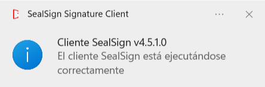
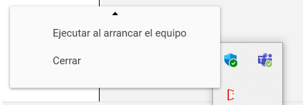
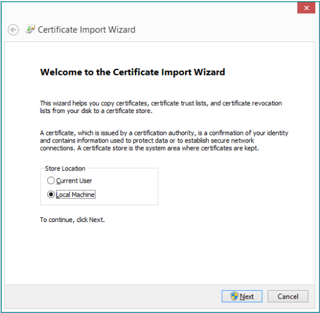
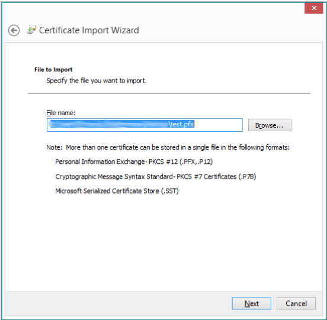
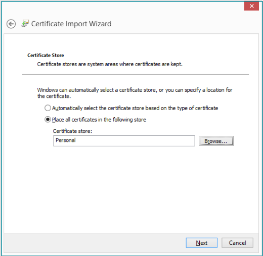
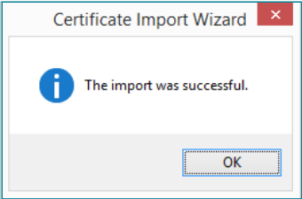
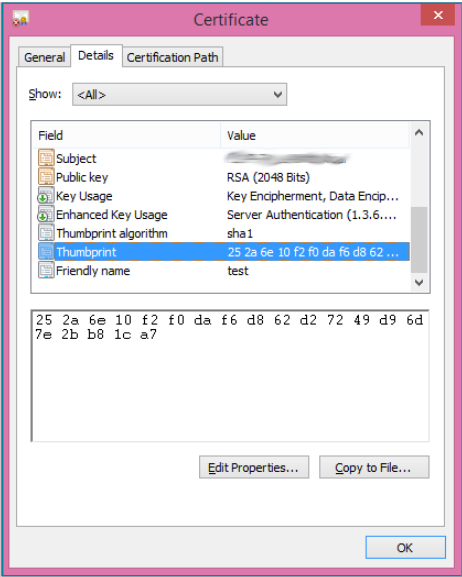
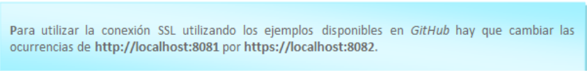
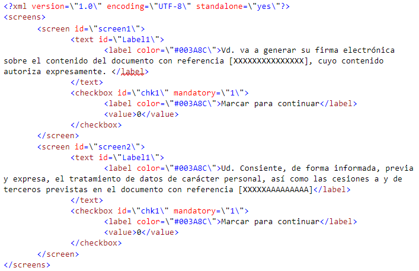

# **SealSign Signature Client (ClickOnce)**

# 1. Introducción

  SealSign's ClickOnce client replaces the Java Applet in Windows environments. Its deployment is based on Microsoft's ClickOnce technology, which allows the deployment of applications over the Internet. The client is able to communicate bidirectionally with the browser that has launched the signature request to achieve a behavior similar to the integration of the Applet with the browser using JavaScript. This communication is achieved using Microsoft's SignalR. More information about SignalR can be found on the official SignalR website.

  From the following link you can access a project that contains an example of how to integrate with the SealSign Signature Client (ClickOnce):
   - https://github.com/FactumID/SealSignClickOnceClientWebExample

# 2. Minimum requirements

- The client runs on .Net Framework 4.5.
  - Supported operating systems are:
    - Windows 7
    - Windows 8
    - Windows 10
    - Windows Server 2008 R2
    - Windows Server 2012
  - The browsers supported by SignalR are:
    - Microsoft Edge
    - Google Chrome from version 50 onwards
    - Mozilla Firefox from version 46 onwards

# 3. Common tasks

  ## 3.1. Off-premises Installation

  The ClickOnce client is hosted on Factum ID servers. On the download page you can install both the client and the client prerequisites. Once installed, the icon will appear on the desktop.

  

  *Image 01: SealSign ClickOnce icon.*

  ## 3.2. On-premises installation

  If it is necessary to deploy the client on a server other than the Factum Identity server, the following steps must be followed.

  - Unzip the client found in the version 4.6 SDK download.
  - To modify the ClickOnce deployment files, download and install the Windows SDK.
  - Change the publishing URL with the following command: mage -u SealSignClient.application -pu http://[URL]/SealSignClient.application
  - Reassign the application manifest with: mage -u SealSignClient.application -AppManifest "Application Files "Application Files SealSignClient_1_0_0_0_0SealSignClient.exe.manifest".
  - Finally, sign the file with the command: mage -sign SealSignClient.application -cf [certificate path] -pwd [certificate password].

  Once these steps are done, the ClickOnce client can be deployed on the server. For everything to work correctly you have to check that the web server has the following MIME types configured:

  - .application -> application/x-ms-application
  - .manifest -> application/x-ms-manifest
  - .deploy -> application/octet-stream

  ## 3.3. JavaScript client configuration

  This tutorial explains in detail how to configure an environment with SignalR, and in the example hosted on Factum's gitHub you will find all the necessary code to make it work, it should be noted that once the client has been launched, it listens on port 8081 when it is http and 8082 when the connection has been configured by https. In the JavaScript part it will be necessary to:

  - Refer to the JavaScript code of the hub, located in the URL: http://localhost:8081/signalr/hubs

  - Indicate the URL of the hub. $.connection.hub.url = "http://localhost:8081/signalr";

  - The application makes calls to different methods of the JavaScript client, either to notify that it is performing some task, or to notify that it has finished that task, or to tell the browser to redirect to a URL. The methods are:
    - Navigate:the application notifies the client that it should navigate to the URL it passes as a parameter. Normally it will be one of the URLs that have been defined as success, cancellation, rejection or error. Usage: hub.client.Navigate = function (url) { }
    - AsyncOperationStarted:The application notifies the client that an asynchronous, long-running operation has started. At this point the JavaScript client should relinquish control to the ClickOnce component.   It attaches a message with the details of the operation.   Usage: hub.client.AsyncOperationStarted = function(message){ }
    - AsyncOperationCompleted:the application notifies the client that it has completed and can take control. Usage: hub.client.AsyncOperationCompleted = function(){ }
    - AsyncOperationInProgress: the application notifies the client that a signature is already in progress. Usage: hub.client.AsyncOperationInProgress= function(){ }

## 3.4. Server version configuration

  The client supports both SealSign version 3.2 and 4.0, but it is necessary to indicate which version is being used. To configure the version being used, the setServerVersion method must be called with one of these two values:

  - V32: to use version 3.2.
  - V40: to use version 4.0 or later.

  If the function is not called, version 3.2 will be used by default.

# 4. Use cases

  ## 4.1. Running the client and launching at Windows startup

  Once the client is installed the icon will appear on the desktop, to launch it just click on it, the following message will appear.

  

  *Image 02: Client message*

  The client can be configured to start when logged on to Windows, to do this right click on the icon and click on the option "Run on computer startup".

  

  *Image 03: Contextual menu of the tool*

## 4.2. Using SSL connection

  ### 4.2.1. Certificate Configuration

  In order to use an SSL connection between the web and the SealSignh client, a certificate must be installed on the client computer and bound to port 8082.

  Installing the certificate in the store. The certificate to be installed must contain the public key and the private key. To install it, double click on the file. An installation wizard is displayed.

  

  *Image 04: Certificate import wizard*

  Select the "Local computer" store and click "Next". On the next screen, click "Next".

  

  *Image 05: Selection of the certificate to import*

  In the next screen we enter the certificate password and click "Next".

  

  *Image 06: Protection of the private key*

  On the next screen check the option "Place all certificates in the following store" and select the "Personal" store and click "Next".

  

  *Image 07: Location of the certificates*

  In the summary window, click "Finish".

  

  *Image 08: Completion of the import*

  If there is no problem we should see the following message:

  

  *Image 09: Certificate successfully imported*

  Once the certificate is installed, the certificate manager is launched, for this we press the Windows+ R key and enter "certlm.msc", inside the Personal store we look for the certificate we imported previously.

  

  *Image 10: Certificate Store*

  Double-clicking on the certificate will display the certificate details.

  

  *Image 11: Certificate properties*

  In the tab details select the property "Fingerprint".

  

  *Image 12: Fingerprint of the certificate*

  With that value, you have to open the console in administrator mode and execute the following command: 
  ```netsh http add sslcert certhash=<certificate hash> ipport=0.0.0.0.0:8082 appid={00112233-4455-6677-8899-AABBCCDDEEFF}
  ```
  This last instruction associates the certificate to port 8082.

  

  ### 4.2.2. Use SSL

  In order for the client to use an SSL connection, the option must be selected.
  - Refer to the JavaScript code of the hub, located in the URL: https://localhost:8082/signalr/hubs
  - Indicate the URL of the hub. $.connection.hub.url = "https://localhost:8082/signalr";

  ## 4.3. Digital Signature

  This describes which functions are published to perform the digital signature of documents, as well as the JavaScript client functions that are invoked to notify the progress and completion of the process.

  ### 4.3.1. Certificate filtering

  When performing the digital signature it is possible to filter the certificates that will be displayed in the list. The filtering can be done by issuer, by hashy by serial number:
  - **setCertificateIssuerFilter**: Filter by issuer, receives as parameter the valid issuers separated by '|'. Used to show only DNIe certificates: hub.server.setCertificateIssuerFilter('AC DNIE 001');
  - **setCertifciateHashFilter**: Filter by hash, receives as parameter the hash of the certificate to sign with. Usage:hub.server.setCertificateHashFilter('[HASH]');
  - **setCertificateSerialFilter**: Filter by the serial number of the certificate. Usage: hub.server.setCertificateSerialFilter('[SERIAL NUMBER]');

### 4.3.2. Resetting filters

  To remove all filters set on certificates, the resetCertificateFilters function must be called.

  ### 4.3.3. Loading a local certificate

  A document can be signed using a locally stored certificate by calling the function loadLocalCertificate, to stop using this certificate call the function clearLocalCertificate. 

  ### 4.3.4. Document Signature 

  The signing process can be performed in the following ways. 

  - **Parameters**: All digitalSign method overloads receive as first parameter a string array where the signature is parameterized, these parameters are: 
    - URI of the document. 
    - URL of the service. 
    - Success URL. 
    - Error URL. 
    - Cancellation URL. 
    - Basic authentication user. 
    - Basic authentication password. 

  All parameters are mandatory, if any of them must be passed empty it will be passed as null.

  - **digitalSign (string[])**: The document is signed according to the parameters passed using the default configuration of the document provider. 
  - **digitalSign (string[], string)**: The document is signed according to the parameters passed using the document provider configuration passed as the second argument. 
  - **digitalSignUrl(string[], string)**: The document found at the given URL is signed. The document provider with the default configuration is used. 
  - **digitalSignUrl(string[], string, string)**: The document at the given URL is signed. The last parameter is the parameters to use with the document provider. 
  - **digitalSignBase64(string[], string)**: The document passed as parameter is signed in base 64. The document provider is used with the default configuration. 
  - **digitalSignBase64(string[], string, string)**: The document passed as parameter is signed in base 64. The last parameter is the parameters to use with the document provider. 
  - **digitalMultiSign (string[], string)**: A list of documents is signed using the default configuration of the document provider. 
  - **digitalMultiSign (string[], string, string)**: A list of documents passed as parameter is signed. The last parameter is the parameters to use with the document provider.

### 4.3.5. Using Remote Document Provider

  In order to use the Remote Document Provider, the configuration parameters must be set, for which the following steps must be followed:
  - Set the server version to 4.0 by calling the setServerVersion method with the value 'V40'.
  - Call the function setDSSRemoteProviderConfiguration with the following parameters:
    - url: the url where the Remote Document Provider is hosted.
    - domain: domain of the user with which the call to the Remote Document Provider will be authenticated.
    - user: user with which the call to the Remote Document Provider will be authenticated.
    - password: password of the user with which the call to the Remote Document Provider will be authenticated.
    
  Important: if the call needs to be authenticated, the authentication will be basic.

## 4.4 Biometric Signature 

  ### 4.4.1 Device settings

  The following functions only affect Wacom devices: 

  - **setClearImage**: Sets the background image of the tablet when the signature process is completed. The image is passed in base64. 
  - **setClearImageUrl**: Sets the background image of the tablet when the signing process is completed. The image is hosted at the URL passed by parameter.
  
### 4.4.2 Document Signature

  - **Parameters**: The first parameter of the different signatures of the biometric signature methods is a string array that configures the behavior of the component. 
    - Document URI 
    - URL of the service 
    - URL of the document to sign 
    - Padding X lower left corner 
    - Padding Y bottom left corner 
    - Success URL 
    - Error URL 
    - Cancellation URL 
    - Reject URL 
    - Basic authentication user 
    - Basic authentication password 
    - Acceptance view title background color 
    - Acceptance view title 
    - Acceptance view title color 
    - Identifier 
    - Label "Step 
    - Label "from 
    - Sign button - Signature screen 
    - Continue button - on all screens 
    - Clear button - Signature screen 
    - Cancel button - on all screens 
    - Reject button - on all screens 
    - OPTIONAL text above on the signature screen 
    - XML with signature panel form settings 
    - Global Customization Parameters (Font, Sale Width and Height, Font Size) 
  - **Form**: For the handwritten signature process a form can be added in which the user must select several checks in order to advance in the process and finally sign the signature. The configuration of this form is the last parameter of those described in the previous section.

  This is an example of a valid XML: 

  

  The XML defines the screens that will be present with the screen node. Each screen node can have several controls inside, these controls can be either labels, defined in the text nodes, or checkboxes, defined in the checkbox nodes. These checkboxes can be mandatory in order to advance in the signing process. Whether they are mandatory or not is defined in the mandatory attribute of the checkbox node of the XML file, if its value is 1 it is mandatory and if it is 0 it is optional. 

  In addition to this screen configuration, some of the parameters are used to configure the look & feel. 

  

  It is recommended to download the example code from FactumID's GitHub page to familiarize yourself with these parameters and see how they affect the screen. 

    - **bioSign(string[])**: Launches the signature process parameterized with the configuration passed as an argument. Uses the document provider associated with the document URI and its default setting. 
    - **bioSign(string[], string)**: Launches the signature process parameterized with the configuration passed by argument. It uses the document provider associated to the URI of the document to which the parameters of the second argument are passed. 
    - **bioSignUrl(string[], string)**: Launches the signature process parameterized with the configuration passed by argument. The document whose URL has been given is signed, it uses the document provider associated to the document URI and its default parameterization.  
    - bioSignUrl(string[], string, string)**: Launches the signature process parameterized with the configuration passed by argument. The document whose URL has been given is signed, it uses the document provider associated to the URI of the document to which the parameters of the second argument are passed.  
    - **bioSignBase64(string[], string)**: Launches the signature process parameterized with the configuration passed by argument. It signs the document set in the second parameter in base64, uses the document provider associated to the URI of the document and its default parameterization. 
    - **bioSignBase64(string[], string, string)**: Launches the signature process parameterized with the configuration passed by argument. It signs the document set in the second parameter in base64, it uses the document provider associated to the URI of the document to which the parameters of the second argument are passed.

  ### 4.4.3 Using Remote Document Provider

  In order to use the Remote Document Provider, the configuration parameters must be configured, for this purpose the following steps must be followed:
  - Set the server version to 4.0 by calling the setServerVersion method with the value 'V40'.
  - Call the function setDSSRemoteProviderConfiguration with the following parameters:
    - url: the url where the Remote Document Provider is hosted.
    - domain: domain of the user with which the call to the Remote Document Provider will be authenticated.
    - user: user with which the call to the Remote Document Provider will be authenticated.
    - password: password of the user with which the call to the Remote Document Provider will be authenticated.
    
  Important: if the call needs to be authenticated, the authentication will be basic.

## 4.5 Enrollment

  - **Parameters**: The first parameter of the different signatures of the biometric signature methods is a string array that configures the behavior of the component. 
    - Service URL 
    - Success URL 
    - Error URL 
    - Cancellation URL 
    - Basic authentication user 
    - Basic authentication password 
    - User to which the enrollment will be made (Optional), if this parameter is not passed, the enrollment will be applied to the user who authenticates the service. 
    - Cancel button text 
    - Delete button text 
    - Text of the Sign button 
    - Parameters of global customization (Font, Width and height of the sale, Font size) 
    - XML with the signature panel form settings 

  The configuration of this form is the last parameter of those described in the previous section. 

  This is an example of a valid XML: 

  

  The XML defines the screens that will be present with the screen node. In addition to this screen configuration, some of the parameters are used to configure the look & feel, such as font color, logo, and text size.  

  - **bioEnrollment (string[])**: Launches the face-to-face signature enroolment process parameterized with the configuration passed as an argument. It uses the document provider associated to the document URI and its default parameterization.