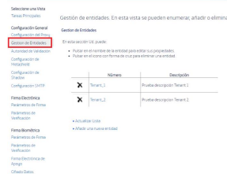
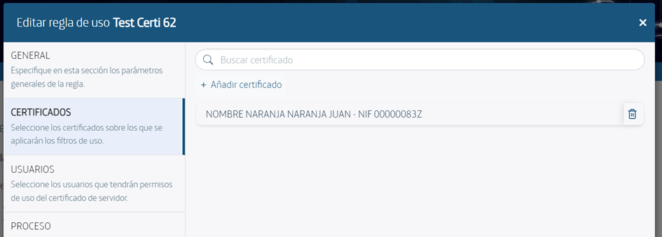

# **Administration Guide**

# 1. Introduction

SealSign DSS is a product developed by Factum Identity that facilitates the integration of electronic signing in corporate applications. Although the basic process of electronic signing is straightforward, there are many different signature profiles and formats, as well as external elements such as CRLs or OCSP responses from certification authorities, time-stamping certificates, etc. Additionally, many of these profiles require obtaining elements outside of the system, such as a user signing a document from a remote location using a web browser.

SealSign DSS solves these problems by providing a unified and transparent way to manage all of the elements involved in the electronic signing process. It supports multiple signature profiles and can access external providers to obtain all of the required elements. The current version of SealSign DSS supports the following signature formats: CMS, CAdES, XMLDigSig, XAdES, PDF, PAdES, Microsoft Office, and OpenOffice.

One of the advantages of SealSign DSS is distributed signing, which allows for a flexible and simple solution to handle complex scenarios. Distributed signing involves performing the entire signing process on the server side except for hash encryption, which occurs on the client-side where the user's private key is located. This unifies and optimizes the retrieval of external elements and reduces the amount of information exchanged.

SealSign DSS also provides validation services using TrustID Revoke Server, which allows for obtaining the state of any certificate by connecting to multiple certification authority providers in a centralized and configurable manner.

One of the challenges in electronic signing is managing certificates and keys used for document signing. SealSign DSS addresses this problem by providing an internal database for storing certificates and keys within its configuration database. Additionally, it can use certificates stored in external almacenes, such as Windows certificate stores or PKCS#11.

SealSign DSS also provides time-stamping services using an authority local or external to the organization. In version 4.3, SealSign OTPSS (One Time Password Signature Services) is introduced, a product developed by Factum Identity for integrating unique one-time password signing in corporate applications.

However, there are still challenges to be addressed in electronic signing, such as user reluctance or lack of knowledge about digital signatures, and the inability to use secure storage devices like smart cards in certain mobile terminals. SealSign OTPSS addresses these issues by providing a unique one-time password signature solution for situations where it is difficult or impossible to use digital certificates.

Finally, SealSign provides an audit service that can track all signing, validation, and time-stamping operations performed by the server.

# 2. Task Configuration

## 2.1. Administration Tool

Centralized management and configuration of SealSign DSS is carried out through a web-based administration platform. To access this, simply launch an instance in a browser by visiting the address:
 **http://servername:portnumber/SealSignDSSWeb**.

By default, when executing the administration tool, only users who are members of the SealSignDSS Admins group on the server can administer the SealSign configuration. Therefore, the first task that an administrator must perform before being able to manage the server is to add the appropriate user accounts to this group.

## 2.2.Corporate Proxy Parameters Configuration

To meet the requirements of different types of signatures, the SealSign DSS server may need to communicate with external providers offering various services such as time-stamping or certificate validation services. 

If communication is conducted through a corporate proxy server, it will be necessary to configure the proxy parameters in the SealSign administration web interface. To configure the proxy parameters in the SealSign server, the following steps can be taken:

1. Open the SealSign DSS administration website.

2. In the main page, select the link **Configure corporate proxy parameters** from the group.

Relative tasks to the general platform configuration or select the left-hand menu link Proxy Configuration 

3. The text will appear: The parameters configuration page will appear.. 

4. Select Use Proxy and the rest of the page parameters.

5. Set the values for the Host Name and Port fields. If the proxy is authenticated, you will need to configure a user account and password.

6. Finally, click the Save button to update the server configuration.

## 2.3. Manage PKcs#11 Providers

When accessing external container certificates, SealSign DSS can use, in addition to the cryptographic service providers (CSPs) installed on the device, other PKCS#11 modules developed by third parties. To do this, in addition to installing the provider on the server, it is necessary to configure the list of PKCS#11 providers that SealSign DSS must manage.

### 2.3.1. Pkcs#11 Configured Pkcs#11 Suppliers Query

To view the list of configured PKCS#11 providers on the server, you can follow these steps:

1. Open the SealSign DSS administration web interface.

2. On the main page, select the "Manage the registration of PKCS#11 Providers" link in the Main Task group or select the "PKCS#11 Providers" menu on the left.

3. The list of all configured PKCS#11 providers on the server will appear.

### 2.3.2. Add A New Supplier Pkcs#11

To add a new PKCS#11 provider, follow these steps:

4. On the main webpage of the administration section, select the "Manage the registration of PKCS#11 providers" link from the Main Tasks group. There is also a link to access this page from the list of PKCS#11 providers viewed earlier.

5. Specify the configuration parameters for the provider:

 - a. The "Name" field is a required label to identify the provider being configured.

 - b. The "Library" field specifies the complete path of the dynamic link library (DLL) of the PKCS#11 provider. Ensure that the provider is correctly installed on all SealSign DSS servers for proper functionality.

6. Click the "Insert" button to save the changes.

### 2.3.3. Edit Pkcs#11 Supplier

To modify the configuration of a PKCS#11 provider, follow these steps:

1. Access the List of PKCS#11 Providers by selecting the "Manage the registration of PKCS#11 providers" link in the Main Tasks page or by clicking on the "PKCS#11 Providers" menu on the left.

2. Select the provider you want to modify from the list.

3. Make the desired modifications.

4. Click the "Save" button.

### 2.3.4. Remove Pkcs#11 Supplier

To eliminate a PKCS#11 provider, you can follow these steps:

1. Access the List of PKCS#11 Providers by selecting the "Manage the registration of PKCS#11 providers" link in the Main Tasks page or by clicking on the "PKCS#11 Providers" menu on the left.

2. In the list of PKCS#11 providers, click the cross icon located to the left of the provider you wish to eliminate.

## 2.11. Manage Entities

In the Entities section, you will be able to create entities, which can have personalized usage configurations, such as using a different support certificate for each entity.

The fields that will be displayed in this section are:
- Key
- Name
- Description

On entering this section, a list of entities with a unique key and a description will be displayed, if any configuration has already been created. From the "Add a new entity" link you will access the entity creation screen where two configuration parameters will appear.

- KEY: must be unique as it is the identifier that customers will use to select the configuration they wish to use. The maximum number of characters is 150 and is mandatory.

- Name: compulsory text field of 150 characters.

- Description: text field of 255 characters, not compulsory.

# 3. Electronic Signature Parameters Configuration

SealSign DSS allows you to configure some parameters of electronic signatures in a general and centralized manner. To configure these parameters, the administrator can follow these steps:

1. Open the SealSign DSS administration website.

2. On the main page, select the "Manage Electronic Signature Parameters" link in the Main Tasks menu or click on the "Signature Parameters" link in the left-hand menu.

3. On the parameter page, you can configure the following values:

- a: General Parameters of Signature:
        
    i. Check Certificate Chain Validation indicates if the server should build the certificate chain corresponding to the signed certificate received, so that if the chain is not valid and trusted in the server, the server will return an error during the signing process.
        
    ii. Check Revocation Status indicates if the server should verify if the signed certificate is revoked or not, so that if the certificate is revoked, the server will return an error during the signing process.
        
    iii. Server Time Stamp for Signature by Default allows selecting, from the list of configured servers for time stamping in SealSign, which server will be used in signature operations that require time stamps.
        
    iv. Server Backup Time Stamp for Signature by Default allows selecting, from the list of configured servers for time stamping in SealSign, which server will be used in signature operations that require time stamps in the backup server.

- b: Signature of XML Documents (XAdES):

        i. Add XPath Transformation eliminates previous signatures before applying the XPath transformation to the document before signing.
        
    ii. XAdES-X Signature Type 2 indicates the type of signature used.

- c: CMS Signature (CAdES):

        i. The CAdES-X Signature Type 2 field allows configuring signatures with the CAdES-X and CAdES-XL profile to comply with type 2 of the CAdES-X standard instead of type 1 (default value).

- d: PDF Document Signing (PAdES Basic):
  
  i. The Include Timestamp field allows configuring whether to include a timestamp when signing PDF documents.

  ii. The Include Revocation Information field indicates whether the signature shall include the CRLs or OCSP responses. 

  CRLs or OCSP responses related to the certificates involved in the process will be included in the signature.

  iii. The Display Signature Widget field indicates whether the PDF document resulting from the signature will display the signature widget with the signature information.

  iv. The Position Widget Automatically field indicates whether the signature widget is positioned automatically or whether the values configured in the following 2 fields must be used. If the widget is positioned automatically it will appear in the top right corner of the resulting PDF document.

  v. The Widget Position - X-Coordinate field allows you to set the X-coordinate of the widget's position in pixel 
  of the Widget position in pixels from the bottom left corner of the page. 

  vi. The Widget Position - Y-Coordinate field allows you to set the Y-coordinate of the Widget position in pixels from the bottom left corner of the page. vi. 
  coordinate of the Widget's position in pixels from the bottom left corner of the page. 

  vii. The Automatic Widget Size field indicates whether the signature viewer will be resized automatically or whether the values configured in the next 2 fields should be used. 

  viii. The Widget Height field allows configuring, in pixels, the height of the signature viewer.
        
  ix. The Widget Width field allows configuring, in pixels, the width of the signature display.

  x. The Widget Rotation field allows you to select the angle of rotation of the signature viewer. Possible values are 0º, 90º, 180º and 270º.

  xi. The Include Widget on All Pages field indicates whether the signature viewer shall be displayed on all pages of the document.

  xii. The Include Widget Only on Page Number field indicates the number of the page on which the signature viewer shall be displayed.

  xiii. The Include Background Image field allows configuring the inclusion of an image in the signature widget.

  xiv. The Background Image field allows the selection of a file with the image to be displayed as the background of the Widget. It is important to mention that the file must be in JPEG 2000 format and that a normal JPEG file is not valid as a background image.

  xv. The Image Height field allows configuring, in pixels, the height of the image selected in the previous field.

  xvi. The Image Width field allows setting, in pixels, the width, in pixels, of the image selected in the Background Image field.

  xvii. The AutoFit Image field indicates whether the background image shall be stretched to cover the width of the signature viewer. 

4. Finally, click the "Save" button to update the configuration settings.

## 3.1.Configuration Of Electronic Signature Verification Parameters

SealSign DSS allows the configuration of some parameters that will govern the electronic signature verification process. This configuration is carried out by means of the following steps:
1. Open the SealSign DSS administration website.

2. On the main page, select the Manage electronic signature verification parameters link from the Electronic Signature and Verification Tasks group or select the Verification Parameters link from the menu on the left.

3. On the signature verification parameters page the following values can be configured:

    a. The Check Signing Certificate Certificate Chain field indicates whether the server shall construct the certificate chain corresponding to the signing certificate, so that if the chain is not valid and trusted by the SealSign server, the server will return an error in the verification process.

    b. The Check Revocation Status field indicates whether the server shall verify whether the signing certificate is revoked or not, so that if the certificate is revoked, the server shall return an error in the verification process.

    c. The Include extended timestamp information field indicates whether the response of the verification process shall include the information corresponding to each of the timestamps and their signatures.

    d. The Include only document type signatures in PDF files field indicates whether the PDF document verification process shall include all extended signatures (e.g. PDF encryption signatures) or only document type signatures (user signatures). 

4. Finally, click the Save button to update the server configuration.

# 4. Configuration Of Biometric Signature Parameters

SealSign BSS allows the configuration of some handwritten signature parameters in a general and centralised manner. To configure these parameters, the administrator can carry out the following steps:
1. Open the SealSign administration website.

2. On the main page, select the Manage biometric signature parameters link from the Biometric Signature and Verification Tasks group or select the Signature Parameters link from the Biometric Signature section of the menu on the left.

3. The following values can be configured in the signature parameters page:

    a. General Signature Parameters:
    
    i. The Verify Signatory's Biometric Identity field indicates whether the server shall verify the biometric data of the signature before including it in the document to be signed.

    ii. The Include Timestamp field indicates whether the server shall add a timestamp to the biometric signature.

    b. Graphical Representation of the Signature:
    i. The Display Signature Widget field indicates whether the resulting document after signature shall display the signature widget with the signature information.

    ii. The Include Document Hash as Watermark field indicates whether the resulting document shall display the hash as a watermark in the signature widget.

    iii. The Widget Position - X-Coordinate field allows setting the X-coordinate of the widget's position in pixel 
    of the Widget position in pixels from the bottom left corner of the page. 

    iv. The Widget Position - Y-Coordinate field allows you to set the Y-coordinate of the Widget's position in pixels from the bottom left corner of the page. iv. 
    coordinate of the Widget's position in pixels from the bottom left corner of the page. 

    v. The Automatic Widget Size field indicates whether the signature viewer will be resized automatically or whether the values configured in the following 2 fields should be used. 

    vi. The Widget Height field allows configuring, in pixels, the height of the signature display.

    vii. The Widget Width field allows configuration, in pixels, of the width of the signature viewer.

    viii. The Widget Rotation field allows the selection of the rotation angle of the signature viewer. Possible values are 0º, 90º, 180º and 270º.

    ix. The Include Widget on All Pages field indicates whether the signature viewer will be displayed on all pages of the document.

    x. The Include Widget Only on Page Number field indicates the number of the page on which the signature viewer shall be displayed.

    xi. The On Last Page field indicates whether the widget is to be added on the last page only.

    xii. The Offset field on the page (positive or negative).

4. Finally, click on the Save button to update the server configuration.

## 4.1. Configuration of Biometric Signature Verification Parameters

SealSign BSS allows the configuration of some parameters that will govern the biometric signature verification process. To configure these parameters, the administrator can carry out the following steps:

1. Open the SealSign administration website.

2. On the main page, select the Manage biometric signature verification parameters link from the Biometric Signature and Verification Tasks group or select the Verification Parameters link from the Biometric Signature section of the left-hand menu.

3. The following values can be configured on the signature verification parameters page:

    a. The Positive Recognition Threshold field indicates the range that the server should apply when validating a biometric signature as a valid signature.

    b. The Custom Score Threshold field (Format 0.00) allows the inclusion of a custom value for the applicable Score, outside the default values set in the previous field.

    c. The field Include Electronic Signature Information xxxxx.

4. Finally, click the Save button to update the server configuration.

## 4.2. Backup Electronic Signature Configuration

Among the functionalities provided by SealSign BSS is the possibility of adding an electronic signature on the server to ensure that the biometric data are valid and are not modified after the signature.

It is necessary to indicate that the configured certificate will be used to encrypt the stored biometric data, for this reason, it is important that the certificate used for the supporting signature has a key length that allows the biometric data to be safeguarded for the maximum amount of time.

To configure these parameters, the administrator can perform the following steps:

1. Open the SealSign administration website.

2. On the main page, select the link Manage biometric signature support electronic signature parameters from the Biometric Signature and Verification Tasks group or select the Support Electronic Signature link from the Biometric Signature section of the left-hand menu.

3. In the general signature parameters page the following values can be configured:

    a. The field Include Electronic Signature in Document triggers the generation of the supporting electronic signature in the document.

    b. The Use Certificate To Encrypt Biometric Data field indicates whether the certificate shall be used not only to sign the document but also to encrypt the biometric data included in the document.

    c. The Use Biometric Image as Signature Background in Supported Formats field allows using the handwritten signature network as the image background of the electronic signature.

    d. The Electronic Signature Type field indicates which type of electronic signature shall be added to the document.

    i. Enveloped ii. Enveloping iii. Detached iv. DetachedInternal e. The Abstract Function Algorithm (Hash) field indicates which type of hash will be generated for the supporting electronic signature.

    f. The Signature Server Certificate field allows the selection of the server certificate with which the supporting electronic signature will be made. This certificate must have been previously added to the SealSign DSS central certificate repository.

4. Finally, click on the Save button to update the server configuration.

## 4.3.Biometric Data Encryption Settings

When securing the biometric data included in a document, SealSign BSS allows the possibility of configuring a certificate issued by the organisation itself or by a trusted third party whose public key is used to encrypt the biometric information. In this way, the biometric information will be encrypted both with the supporting electronic signature certificate (if this possibility has been configured) and with this new certificate.

To configure the biometric data encryption certificate, the administrator must carry out the following steps:

1. Open the SealSign administration website.

2. Select the Biometric Data Encryption link in the Biometric Signature section of the left-hand menu.

3. Enable the field Include Trusted Third Party Certificate.

4. Click on the Import button. 

5. On the file selection page, browse for the file with the certificate in question and add the certificate's contact information. 

6. Click the Import button.

## 4.4.Custom Configuration

The configurations of the default parameters of the biometric signature back-up electronic signature. The custom configuration section allows the individualisation of signature parameters for different cases.

### 4.4.1 Signature parameters for Entities

Contains the list of entities with the key shared with the client for the selection of configurations. These records have an identifier field, name, description and certificates assigned for encryption and signature support.

Through this screen we can access the following actions for the parameterisation of signatures:

- Default support electronic signature: From here we can create the configuration that all the requests in the system take as predefined. When the request does not explicitly include the identification of a specific configuration, it takes this configuration.

- New configuration: From this panel we can create new configurations for different signature cases. Any request sent with the identifier of the configuration created takes the parameters of this one.

- Refresh list: Refreshes the results of the table. 

- Delete configuration: By means of the x present in the first column of every entry in the table, we can delete the configuration created.

- Modify configuration: Each identifier in the Key column allows us to click and access the modification panel of the configuration created.

- Search: Filtering of the table with search criteria by name or identity key.

### 4.4.2. Creation of Configuration Entity

1. Open the SealSign administration website.

2. On the main page, select the Customised Signature Settings link from the Biometric Signature Tasks group or select the Customised Biometric Signature Settings link from the left-hand menu.

3. On the Create Custom Signature Settings page the following values can be configured:

    a. Entity Key: Selection of the key of the previously configured Entities.

    b. Certificate for the support signature: Certificate assigned to make the support signature for biometric signatures. Certificate for the configuration, one of the two available certificates must be selected. If none is selected, the default certificate will be used. 

    c. Summary Function Algorithm (Hash):

    i. RIPEMD160 ii. MD5 iii. SHA1 iv. SHA256 v. SHA382 vi. SHA512 vii. SSL3

    d. Electronic Signature Type:

    i. Enveloped ii. Enveloping iii. Detached iv. DetachedInternal e. Use Certificate To Encrypt Biometric Signature Data: Selection indicating whether we want this same certificate to be used for data encryption.

    f. Certificate for Biometric Data Encryption: Selection of a different certificate for the biometric signature metadata encryption.

4. Finally, click on the Save button to update the configuration.

### 4.4.3. Default configuration

This section provides the possibility to create a configuration for signatures that applies to all signatures that do not specify otherwise within the request of the application.

1. Open the SealSign administration website.

2. On the main page, select the Customised Signature Settings link from the Biometric Signature Tasks group or select the Customised Biometric Signature Settings link from the left-hand menu.

3. On the Create Signature Default Settings page the following values can be configured:

    a. Include Electronic Signature in the Document: Activates the generation of the supporting electronic signature in the document.

    b. Use Certificate to Encrypt Biometric Data: Indicates whether the certificate will be used not only to sign the document but also to encrypt the biometric data included in it.

    c. Type of Electronic Signature: 
    i. Enveloped ii. Enveloping iii. Detached iv. DetachedInternal e. Hash Function Algorithm: 
    i. RIPEMD160 ii. MD5 iii. SHA1 iv. SHA256 v. SHA382 vi. SHA512 vii. SSL3 f. Signature Server Certificate: Selection of the certificate for the default configuration of the requests.

4. Finally, click on the Save button to create or update the configuration.

# 5. Otp Signature Parameter Configuration

SealSign OTPSS allows the configuration of some parameters of the one-time password signature in a general and centralised way. To configure these parameters, the administrator can carry out the following steps:

1. Open the SealSign administration website.

2. On the main page, select the Signature Parameters link in the OTP Signature section of the left-hand menu.

3. On the signature parameters page, the following values can be configured:

    a. General Signature Parameters:
    i. The Include Remote OTP Code Provider field indicates whether the OTP code is to be generated by a remote provider or whether it is to be generated by the platform itself.

    ii. The Send Type field indicates the method of sending the OTP code. You can choose between none, email or SMS.

    iii. The Expiration time field indicates the life time, in seconds, of an OTP code once it has been generated.

    iv. The Code length field indicates the length of the OTP codes that are generated from the platform.

    v. The Code Generation Algorithm field indicates which algorithm will be used to generate the OTP code. You can select between SHA1, SHA256, SHA512.

    vi. The Allowed Verification Attempts field indicates the maximum allowed number of verifications that can be performed on the One Time Password.

    vii. The Widget Height field allows you to set, in pixels, the height of the signature viewer.

    viii. The Widget Width field allows setting, in pixels, the width of the signature viewer.

    ix. The Widget Rotation field allows the selection of the rotation angle of the signature viewer. Possible values are 0º, 90º, 180º and 270º.

    x. The Include Widget on All Pages field indicates whether the signature viewer shall be displayed on all pages of the document.

    xi. The Include Widget Only on Page Number field indicates the number of the page on which the signature viewer shall be displayed.

    xii. The On Last Page field indicates whether the widget is to be added on the last page only.

    xiii. The Offset field on the page (positive or negative).

4. Finally, click on the Save button to update the server configuration.

## 5.1.Configuration of the Backup Electronic Signature

Among the functionalities provided by SealSign OTPSS is the possibility of adding an electronic signature on the server to ensure that the data is valid and is not modified after signing.

It is necessary to indicate that the certificate configured will be used to encrypt the signatory's data stored, for this reason, it is important that the certificate used for the supporting signature has a key length that allows the biometric data to be safeguarded for as long as possible.

To configure these parameters, the administrator can perform the following steps:

1. Open the SealSign administration website.

2. On the main page, select the Electronic Support Signature link from the OTP Signature section of the left-hand menu.

3. On the general signature parameters page, the following values can be configured:

    a. The Use Certificate To Encrypt Biometric Data field indicates whether the certificate will be used, not only to sign the document, but also to encrypt the biometric data included in it.

    b. The Electronic Signature Type field indicates which type of electronic signature shall be added to the document.

    i. Enveloped
    ii. Enveloping
    iii. Detached      
    iv. DetachedInternal

    c. The Abstract Function Algorithm (Hash) field indicates which type of hash will be generated for the supporting e-signature.

    d. The Signature Server Certificate field allows the selection of the server certificate with which the supporting electronic signature will be made. This certificate must have been previously added to the SealSign DSS central certificate repository.

4. Finally, click on the Save button to update the server configuration.

## 5.2.Metadata Encryption Configuration

When securing the signatory's data included in a document, SealSign OTPSS allows the possibility of configuring a certificate issued by the organisation itself or by a trusted third party whose public key is used to encrypt this biometric information. In this way, the information will be encrypted both with the supporting electronic signature certificate (if this possibility has been configured) and with this new certificate.

To configure the metadata encryption certificate, the administrator must perform the following steps:
1. Open the SealSign administration website. 

2. Select the Metadata Encryption link in the OTP Signature section of the left-hand menu.

3. Enable the Include Trusted Third Party Certificate field.

4. Click the Import button. 

5. On the file selection page, browse for the file with the certificate in question and add the certificate's contact information. 

6. Click the Import button.

## 5.3.Custom Settings

The configurations of the default parameters of the electronic signature backing up the OTP signature.

The custom configuration section allows the individualisation of the signature parameters for different cases.

### 5.3.1. Signature parameters for Entities

Contains the list of entities with the key shared with the client for the selection of configurations. These records have an identifier field, name, description and certificates assigned for encryption and signature support.

Through this screen we can access the following actions for the parameterisation of signatures:

- Default support electronic signature: From here we can create the configuration that all the requests in the system take as predefined. When the request does not explicitly include the identification of a specific configuration, it takes this configuration.

- New configuration: From this panel we can create new configurations for different signature cases. Any request sent with the identifier of the configuration created takes the parameters of this one.

- Refresh list: Refreshes the results of the table. 

- Delete configuration: By means of the x present in the first column of every entry in the table, we can delete the configuration created.

- Modify configuration: Each identifier in the Key column allows us to click and access the modification panel of the configuration created.

- Search: Filtering of the table with search criteria by name or identity key.

### 5.3.2. Creation of Configuration Entity

1. Open the SealSign administration web site. 

2. On the main page select the Custom Signature Settings link from the OTP Signature Related Tasks group or select the Custom OTP Signature Settings link from the left menu.

3. On the Create Custom Signature Settings page the following values can be configured:

    a. Entity Key: Selection of the key of the previously configured Entities.

    b. Certificate for support signature: Certificate assigned to do the support signature for OTP signatures. Certificate for the configuration, one of the two available certificates must be selected. 

    If none is selected, the default certificate will be used. 

    c. Summary Function Algorithm (Hash): 
    i. RIPEMD160 ii. MD5 iii. SHA1 iv. SHA256 v. SHA382 vi. SHA512 vii. SSL3 

    d. Electronic Signature Type: 
    i. Enveloped ii. Enveloping iii. Detached iv. DetachedInternal 

    e. Use Certificate To Encrypt OTP Signature Data: Selection that indicates if we want this same certificate to be used for data encryption.

    f. One Time Password Certificate for metadata encryption: Selection of a different certificate for OTP signature metadata encryption.

4. Finally, click on the Save button to update the configuration.

### 5.3.3. Default configuration

This section provides the possibility to create a configuration for signatures that applies to all signatures that do not specify otherwise within the request of the application.

1. Open the SealSign administration web site.

2. On the main page select the Custom Signature Settings link from the OTP Signature Related Tasks group or select the Custom OTP Signature Settings link from the left menu.

3. On the Create Signature Default Settings page the following values can be configured:

    a. Use Certificate To Encrypt OTP Signature Data: Indicate whether the default certificate is also used to encrypt the OTP signature data.

    b. Use Biometric Image as Signature Background in Supported Formats: Allows to use the graph of the handwritten signature as the background image of the electronic signature.

    c. Electronic Signature Type: 
    i. Enveloped ii. Enveloping iii. Detached iv. DetachedInternal 
    
    d. Summary Function Algorithm (Hash): 
    i. RIPEMD160 ii. MD5 iii. SHA1 iv. SHA256 v. SHA382 vi. SHA512 vii. SSL3 
    
    e. Signature Server Certificate: Selection of the certificate for the default configuration of the requests.

4. Finally, click the Save button to create or update the configuration.

# 6. Centralized Key Management

Among the functionalities provided by SealSign DSS is the possibility of electronically signing documents with certificates stored on the server. SealSign DSS server certificates can reside within the signature platform or refer to external Windows and PKCS stores. The administrator must configure which server certificates can be used and who will have access to each of them for the signature operations performed by the platform.

## 6.1.Server Certificates Management

In this administration menu you can add references to internal and external certificates that will later be available for the creation of Rules of Use in them.

### 6.1.1. Viewing the List of Server Certificates

To view the list of available server certificates, you can perform the following steps:

1. Open the SealSign DSS administration web site.

2. On the main page, select the Manage Server Certificates link from the Server Certificate Tasks group, or select the Server Certificates link from the left-hand menu called Centralized Keys.

3. The list of all server certificates that can be used in signing processes will be displayed.

**Expired Certificates:** In the list, expired certificates will be highlighted in red, with the expiration date in bright red for easy identification.

**Lock Icon:** On the left side border, a padlock icon will appear indicating whether the certificate has the lock check activated.

**Actions on Certificates:** In the list of certificates, the available actions are now grouped in a single button. Pressing it will display a menu with the following options:

  - Usage Rules: This option redirects to the usage rules section, where the list of usage rules associated to that certificate is displayed.
  
  - Audit Log: This option redirects to the audit log section, where a list of all the actions performed with that certificate is displayed.
  
  - Download Public Key: This option allows downloading the certificate's public key.

  - Delete Certificate: This option allows you to delete the certificate from the platform.

### 6.1.2. Adding a New Server Certificate

To add a new server certificate to the list, the following steps can be performed:

1. On the main page of the Administration web site, select the Import a new server certificate link from the Server Certificate Tasks group. There is also a link from the list of server certificates consulted in the previous section.

2. On the Server Certificates page, configure the following settings:

    a. The File field allows you to select the .pfx file containing the certificate to be imported into the SealSign certificate store.

    b. In the Password field, the password of the file selected in the previous field must be indicated.

    c. In the Remember Password value, specify whether the server should store the password of this file so as not to require it again when the certificate is to be used or whether, on the contrary, the user will be required to provide this password each time.

    d. The Descriptive Name field allows, optionally, to indicate a longer description of the certificate.

    e. The Owner Managed Only field allows the certificate owner to restrict the management and use of the certificate to his or her Windows user only. This way, no other user or system administrator will be able to use it.

    f. The Owner field indicates the name of the Windows user account that will act as the owner of the new certificate and will therefore have access to it. In addition to the owner it is possible to create delegates who will also be able to use this certificate. The creation of delegates is done by modifying the server certificate settings after adding it for the first time.

    g. In the value Require SealSign Password it is possible to force the need to create a specific SealSign password required each time the certificate is to be used within the platform.

    h. The SealSign Password field will be set to the password commented in the previous field.

3. By clicking on the Import button, the certificate will be saved in the SealSign certificate store.

### 6.1.3. Add a Reference to an External Server Certificate

When the certificate is stored in a location external to the SealSign server certificate store, it will be necessary to add a reference to it in the server certificate configuration. To do this, the following steps must be performed:

1. On the main page of the Administration web page select the link Add a reference to an external server certificate from the Server Certificate Related Tasks group. There is also a link from the list of server certificates consulted in the previous section.

2. On the Server certificate references page configure the following values:

    a. In the Warehouse Type field, select the type of warehouse containing the certificate. Specifically you can select between the values:

    i. WindowsStore for certificates stored in the current Windows user's certificate store.

    ii. WindowsSystemStore for certificates stored in the SealSign server's computer certificate store.

    iii. PKCS11Store for certificates stored in external stores accessible through a PCKS11 module.

    b. After selecting the type of store, click on the Select Certificate button. 

    A window will appear that will either show the available certificates (WindowsStore and WindowsSystemStore) or request the selection of the PKCS11 Provider, the Slot and the Password to access the certificate (PKCS11Store).

    c. Once the certificate is selected, the page will display the Subject, Serial Number, Issuing Entity, Validity Dates and if there is a Password Required by the Store.

    d. The Descriptive Name field allows you to optionally enter a longer description of the certificate.

    e. The Owner field indicates the name of the Windows user account that will act as the owner of the new certificate and will therefore have access to it. In addition to the owner it is possible to create delegates who will also be able to use this certificate. The creation of delegates is done by modifying the server certificate settings after adding it for the first time.

    f. In the Remember Password value it is specified whether the server should store the password for this certificate in order not to require it again when it is going to be used or if, on the contrary, the user will be required to provide this password each time.

    g. In the Password field, the password for the selected certificate must be specified.

    h. In the Require SealSign Password value it is possible to force the need to create a specific SealSign password required each time the certificate is to be used within the platform.

    i. The SealSign Password field will be configured with the password commented in the previous field.

3. By clicking on the Insert button, the certificate will be saved in the SealSign certificate store.

### 6.1.4. Sealsign Certificates Expiration Service. Smtp Configuration

This configuration is required to use the Windows SealSign Certificates Expiration Service.

The service allows automatically sending a daily mailing list of all the expired and expiring certificates of all users, as well as sending a list to each user with their expiring certificates. 

It is carried out from the SealSign administration web site:

The configuration is divided into 2 parts. The parameters of sending mails through SMTP and the parameters of certificate expiration.

CONFIGURATION OF THE **SMTP** SERVER

- Email to configure the SMTP account: Email to configure the SMTP account. 

- SMTP account password: SMTP configuration email password. 

- SMTP server address of the configured account: SMTP server of the configured account. - SMTP Port: SMTP server port. 

- Email that appears as sender: Email that will appear as sender. 

- Name to be displayed in the sender: Name to be displayed in the sender. 

- TLS/SSL: If the SMTP account uses this configuration. 

**CERTIFICATE EXPIRATION SERVICE PARAMETERS**

- Emails of general users, separated by (;): List of the emails to which the list of all expired and about to expire certificates of all users will be sent daily. 
The e-mails in this list must be separated by semicolons. 

- Number of days of notice of expired certificates: Time in days, prior to the current date in which the existence of an expired certificate will be notified. If a certificate has been expired longer than the time configured in this field, its expiration will no longer be reported. 

- Days of notification of certificates about to expire: Time in days, after the current date in which the existence of a certificate about to expire will be notified. 

- Notification sending time (hh:mm): It is the time when the email sending service will be executed. It must have the following format hh:mm. 

- Notification recipients: Configuration of the users to whom the information of expired and about to expire certificates will be sent by mail.

  - None: To nobody.

  - Certificate users: Sending notifications of the certificates about to expire to the certificate users. 

  - General users: Sending notifications of expired and about to expire certificates to the users configured in “Emails of general users separated by (;)”. 

  - All: To both certificate users and general users. 

After modifying the configuration it is advisable to restart the SealSign Certificates Expiration Service.

**CERTIFICATE USAGE SERVICE PARAMETERS**

- Recipients of the notifications, separated by (;): List of the mails to which the list of all the certificates that have been used to sign with electronic certificate will be sent daily. The e-mails in this list must be separated by semicolons.

- Period for sending notifications: Period to retrieve the list of certificates used for signing. The available periods are: daily, weekly and monthly. When selecting a period, the list of certificates that will be sent by e-mail will correspond to the previous period, not the current one. For example, if the daily period is selected, the list of certificates sent will be that of the previous day. If the weekly period is selected, the list will be that of the previous week, and so on.

NOTE: Weekly notifications will be carried out every Monday, and monthly notifications every first of the month.

- Notification sending time (hh:mm): Time when the notification service will be executed. It must have the following format hh:mm.

### 6.1.5. Modifying a Server Certificate

To modify the configuration of a PKCS provider, the following steps can be performed:

1. Access the server certificates, to do so, on the main page select the Manage Server Certificates link from the Server Certificate Related Tasks group or select the Server Certificates link from the left menu.

2. In the list of server certificates select the link of the certificate to be modified.

3. Click on the Save button to update the certificate configuration on the server.

**NEW FUNCTIONS OF THE CERTIFICATE TO MODIFY A SERVER CERTIFICATE**.

Once a certificate has been added to the server, the administrator can perform two additional operations:

1. change the password to the certificate, but for this he has to know the old one.

2. And he can lock the certificate so that it cannot be used. 

3. Pressing the Save button will update the certificate configuration on the server.

**OPERATIONS ON A USER'S CERTIFICATE**.

The administration and configuration of the user's certificate by SealSign DSS is done centrally through the user web. To open this, it is simply necessary to run an instance in a browser to the following address:
http://servername.portnumber/SealSignDSSWeb/users/ 
and a username/password will be requested to access the user's administration web site and his certificates.

Once inside the user's website, he can perform different operations:

### 6.1.6. Viewing the List of Server Certificates

To view the list of available server certificates, the following steps can be performed:

1. Open the SealSign DSS administration website.

2.	On the main page select the Server Certificates link from the left menu called Centralized Keys.

3.	The list of server certificates that can be used in the signature processes will appear.

Expired Certificates: In the list, the expired certificates will be highlighted in red, with the expiration date in bright red for easy identification.

Lock Icon: On the left side border, a padlock icon will appear indicating whether the certificate has the lock check activated.

Actions on Certificates: In the list of certificates, the available actions are now grouped in a single button. Pressing it will display a menu with the following options:

  - Usage Rules: This option redirects to the usage rules section, where the list of usage rules associated to that certificate is displayed.

  - Audit Log: This option redirects to the audit log section, where a list of all the actions performed with that certificate is displayed.

  - Download Public Key: This option allows downloading the certificate's public key.

  - Delete Certificate: This option allows you to delete the certificate from the platform.

### 6.1.7. Adding a New Server Certificate

To add a new server certificate to the list, the following steps can be performed:
1. On the main page of the website you will need to select the Import a new server certificate link.

2. On the Server Certificates page configure the following values:

  - The File field allows you to select the .pfx file containing the certificate that will be imported into the SealSign certificate store.

  - In the Password field, the password of the file selected in the previous field must be specified.

  - The Remember Password value specifies whether the server should store the password for this file so as not to require it again when the certificate is used or whether, on the contrary, the user will be required to provide this password each time.

  - The Descriptive Name field allows, optionally, to indicate a longer description of the certificate.

  - The Owner Managed Only field allows the certificate owner to restrict the management and use of the certificate to his Windows user only. This way, no other user or system administrator will be able to use it.

  - The Owner field indicates the name of the Windows user account that will act as the owner of the new certificate and will therefore have access to it. In addition to the owner it is possible to create delegates who will also be able to use this certificate. The creation of delegates is done by modifying the configuration of the server certificate after adding it for the first time.

  - In the value Require SealSign Password it is possible to force the need to create a specific SealSign password each time the certificate is to be used within the platform.

  - The SealSign Password field will be set to the password commented in the previous field.

3. By clicking on the Import button, the certificate will be saved in the SealSign certificate store.

### 6.1.8. Añadir Una Referencia A Un Certificado Externo De Servidor

Add a Reference to an External Server Certificate

When the certificate is stored in a location external to the SealSign server certificate store, it will be necessary to add a reference to it in the server certificate configuration. To do this, the following steps must be performed:

1. On the main page of the Administration web page select the link Add a reference to an external server certificate from the Server Certificate Related Tasks group. There is also a link from the list of server certificates consulted in the previous section.

2. On the Server Certificate References page configure the following values:

3. WindowsStore for certificates stored in the certificate store of the current Windows user.

4. WindowsSystemStore for certificates stored in the SealSign server's computer certificate store.

5. PKCS11Store for certificates stored in external stores accessible through a PCKS11 module.

- After selecting the type of store, click on the Select Certificate button. A window will appear that will either show the available certificates (WindowsStore and WindowsSystemStore) or will request the selection of the PKCS11 Provider, the Slot and the Password to access the certificate (PKCS11Store).

- Once the certificate is selected, the page will display the Subject, Serial Number, Issuing Entity, Validity Dates and if there is a Password Required by the Store.

- The Descriptive Name field allows, optionally, to indicate a longer description of the certificate.

- In the Warehouse Type field you can select which type of warehouse contains the certificate. Specifically, you can select from the following values:
- The Owner field indicates the name of the Windows user account that will act as the owner of the new certificate and will therefore have access to it. In addition to the owner it is possible to create delegates who will also be able to use this certificate. The creation of delegates is done by modifying the server certificate settings after adding it for the first time.

- In the Remember Password value you specify whether the server should store the password for this certificate so that it is not required again when it is used, or whether the user will be required to provide this password each time.

- In the Password field, the password for the selected certificate must be entered.

- In the Require SealSign Password value it is possible to force the need to create a specific SealSign password each time the certificate is to be used within the platform.

- The SealSign Password field will be set to the password commented in the previous field. - The Pair with Latch field allows you to protect the certificate by associating it with a Latch mobile app, which allows you to authorize the use of the certificate.

- By clicking on the Insert button, the certificate will be saved in the SealSign certificate store.

## 6.2.Usage Rules

SealSign DSS allows the association of certificates centralized in the platforms to usage rules that define who can use them and how.

### 6.2.1. Viewing the List of Usage Rules

To view the list of available Usage Rules, the following steps can be performed:

1. Open the SealSign DSS administration website.

a. In the left menu select the Usage Rules link from the Centralized Keys group.

b.	The list of all the usage rules that are available will appear.

c.	The usage rules can be filtered by criteria (Name, Description, Creator, User, Team name, Processes and URL).

d.	The usage rules can be filtered by associated certificate and by date range.

### 6.2.2. Adding a New Usage Rule

To add a new Usage Rule to the list, the following steps can be performed:
1. Select the Add a new usage rule link from the list of usage rules consulted in the previous section.

2. A modal will open where the following values can be configured:

    1.	The Name field allows us to assign an identifying key to the usage rule.
    2.	The Owner field indicates the name of the Windows user account that will act as the owner of the new usage rule. 
    3.	The Description field allows, optionally, to indicate a more extensive description of the usage rule.
    4.	The Valid From field indicates from when the usage rule will be in force, therefore being able to use the certificates associated to it.
    5.	The Valid Until field indicates until when the usage rule will be in force.

3. Pressing the Insert button the usage rule will be saved.

### 6.2.3. Modify the Configuration of a Usage Rule

To modify the configuration of a usage rule the following steps can be performed:

1. Select the usage rule to be modified from the list consulted in the 'Consultation of the Usage Rules List' section, or by pressing the 'Edit Usage Rule' button in the action menu that appears on the right side of the list of rules. 

2.	In the edit mode of the usage rule, you can manage the General parameters that were entered when inserting the usage rule as well as the Usage Filters.

These filters are divided into the following categories:

**Certificates:** In this section we manage which certificates are associated to the usage rule.

**Authorized Users:** In this section we manage which users have access to the usage rule as well as indicating for how long by means of the Valid From and Valid To dates. 

**Computers:** In this section we manage from which machines have access to the usage rule. With this filter we can configure that a certificate to sign a transaction can only be used from a series of machines specified in the rule. This filter admits as wildcard character the %. 

**Processes:** In this section we manage from which processes (Windows executable name) the usage rule can be accessed. With this filter we can configure that a certificate to sign a transaction can only be used from a series of processes specified in the rule. This filter supports % as a wildcard character. 

**URLs:** In this section we manage from which URL the rule of use can be accessed. With this filter we can configure that a certificate to sign a transaction can only be used from a series of URLs specified in the rule. This filter admits as wildcard character the %. This filter only applies to the Internet Explorer browser, that is, to the iexplore.exe process.

3.	Pressing the Save button will update the usage rule configuration.

### 6.2.4. Deleting a Usage Rule

To delete a usage rule you can perform the following steps:
1. Access the list of usage rules, to do so, in the left menu select the Usage Rules link from the Centralized Keys group.

2. In the list of usage rules, click "Delete Usage Rule" on the menu options of a usage rule.

### 6.2.5. Deleting a Server Certificate

To delete a server certificate you can perform the following steps:
1. Access the server certificates, to do this, on the main page select the Manage Server Certificates link from the Server Certificate Related Tasks group or select the Server Certificates link from the left menu.

2. In the list of server certificates, click on the Cross to the left of the certificate to be deleted.

## 6.3.EArchive

SealSign DSR allows you to configure the functional parameters of the secure document repository. To configure these parameters, the administrator can perform the following steps:

### 6.3.1. Search in the EArchive (DSR) Repository

To facilitate the administration of DSR and the management of its content, a specific page has been developed within the administration for the search of documentary objects inserted in DSR. 

To perform a search in DSR:
1. Open the SealSign administration website. 

2. On the main page select the Repository Search link from the Secure Document Repository Related Tasks group or select the Repository Search link from the Secure Repository section of the left menu.

3. The following filters can be configured on the search page:

    a. Start Date, indicates that only document objects inserted with an insertion date greater than or equal to the indicated start date will appear in the search.

    b. End Date, indicates that only document objects inserted with an insertion date less than or equal to the indicated end date will appear in the search.

    c. File Name, indicates that only document objects inserted with a name equal to the name indicated will appear in the search. Wildcards can be used to facilitate the search. The wildcard character is %.

    d. File Path, indicates that only inserted document objects whose insertion Path is equal to the indicated Path will appear in the search. Wildcards can be used to facilitate the search. The wildcard character is %.

    e. File Urn, indicates that only inserted document objects whose insertion Urn is equal to the indicated Urn will appear in the search. Wildcards can be used to facilitate the search. The wildcard character is %. The Urn is the global identifier used by DSR for the inserted document objects.

    f. Search Criteria, which indicates a search statement similar to those used in SQL WHERE clauses. The data on which a search criteria can be set are:
    i. Name ii. Path iii. Uri iv. Owner v. InsertionDate vi. LastAccessDate vii. LastSignedDate viii. UrlSource ix. WebPreview x. MimeType 

An example of search criteria would be:

"NAME LIKE '%' OR PATH LIKE '%'" 

If there is metadata associated with the repository, this can be used in the search criteria. 

Example:

"NAME LIKE '%' AND METADATA1 LIKE '%'" 

Click on the Search button and the search results will appear according to the filters provided. The content of the document can be accessed by clicking on the link associated with it.

# 7. Configuration of Local Time-Stamping Authority

SealSign DSS allows either using a local authority to create time stamps for electronic signatures or using external time stamping providers. To configure the SealSign local time-stamping authority, the following steps must be performed:
1. Open the SealSign DSS administration web.

2. On the main page select the Configure Local Time Stamping Authority link from the Time Stamping Related Tasks group or select the Local Authority link from the left menu.

3. On the Configure local time stamping authority page the following values can be configured:
4. The Time Stamping Server Certificate field allows you to select the certificate that will be used to sign the time stamps issued by the local authority. This server certificate must have been included in the list of server certificates as explained in the Server Certificate Management section.

5. The Store Issued Digital Evidence field allows configuring whether the server should keep a copy of the issued time stamps or not in case a later analysis of the time stamps is needed.

6. Finally, click on the Save button to update the server configuration.

## 7.1. Time Stamping Server Management

In those scenarios where external time-stamping authorities are to be used, it will be necessary to add the appropriate connection parameters in the SealSign DSS configuration.

### 7.1.1. Viewing the Time Stamping Server List

To view the list of available time-stamping servers, you can perform the following steps:
1. Open the SealSign DSS administration web site. 

2. On the main page select the Manage connections to sealing authorities link from the Time Stamping Related Tasks group or select the TSA Servers link from the left menu.

3. The list of all time-stamping servers that can be used in the signing process will be displayed.

### 7.1.2. Adding a New Time Stamping Server

To add a new time stamping server to the list, the following steps can be performed:

1. On the main page of the Administration web site select the Add a connection to a time stamping authority link from the Time Stamping Related Tasks group.

On the TSA Servers page configure the following values:

  a. The Name field indicates the name you want to give to the newly configured TSA server.

  b. The URL field should indicate the URL address of the time stamping server. 
  
  c. The Include Server Certificates in Response value will specify whether the server will include the timestamp generation certificates within the response issued.

  d. The Include a Seed (“Nonce”) value in the Request shall specify whether the SealSign server shall add a different seed within each request to the TSA server.

  e. If the SealSign server requires authentication on HTTP requests, the Use HTTP Authentication field shall be enabled and the appropriate values shall be set in the User Account and Password fields.

2. By clicking the Insert button the new time-stamping server configuration will be added to SealSign.

### 7.1.3. Modifying the Configuration of a Time Stamping Server

To modify the configuration of a time-stamping server the following steps can be performed:

link from the list of time-stamping server certificates consulted in the previous section.

1. Access the list of time-stamping servers by clicking on the Manage connections to sealing authorities link in the Time Stamping Related Tasks group on the main page or by selecting the TSA Servers link from the left-hand menu.

2. In the list of time-stamping servers select the link of the server to be modified.

3. Make the corresponding modifications. 

4. Click the Save button to update the server configuration.

### 7.1.4. Deleting a Time Stamping Server

To remove a time-stamping server you can perform the following steps:

1. Access the list of time stamping servers, to do so, on the main page the Manage connections to sealing authorities link from the Time Stamping Related Tasks group or select the TSA Servers link from the left menu.

2. In the list of TSA servers, click on the Cross to the left of the server to be removed.

# 8. Audit

SealSign DSS has an auditing system that will allow the administrator to know what operations are performed in the system, who performs them and the result of these operations. This section describes how to configure and view the SealSign DSS audit.

## 8.1. Audit Configuration

To configure the SealSign DSS audit service, the following steps must be performed:
1. On the main page, select the Configure Audit Parameters link from the Audit Related Tasks group or select the Audit Configuration link from the menu on the left.

2. Select the appropriate options depending on whether you want the audit to include responses with error status or with success status.

3. Click the Save button.

## 8.2.Viewing the Audit Log

To view the contents of the audit log, the following steps must be performed:
1. On the main page select the View Audit Log link from the Audit Related Tasks group or select the Audit Log link from the left menu.

2. A table will appear with the audit records included in the system on the current date. 

3. At the top of the page there are some filtering fields with which the administrator can refine the search result. To do so, the administrator must enter/select the appropriate values in the filter fields and press the Search button.

4. By clicking on the arrows at the bottom of the result table, you can browse through the result pages of the query.

## 8.3.Deleting Audit Log Contents

To delete the contents of all audit log entries the following steps can be taken:
1. On the main page select the View Audit Log link from the Audit-Related Tasks group or select the Audit Log link from the left menu.

2. Click the Delete all audit log entries link located below the query result.

# 9. Troubleshooting

During the SealSign installation process, a specific log, called SealSign DSS, will be created in the event viewer of each server. If any error occurs in the server's operation, in addition to being reported in the product's audit, events with the complete description of the error will be included in the log created for this purpose.