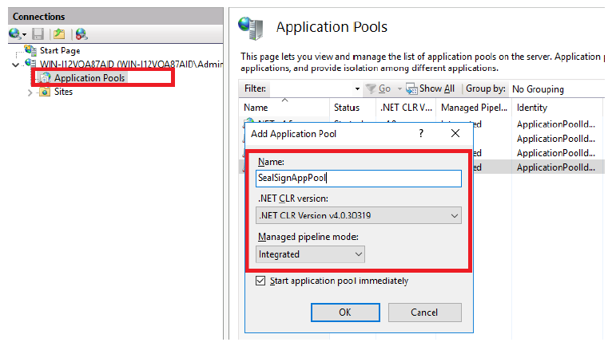
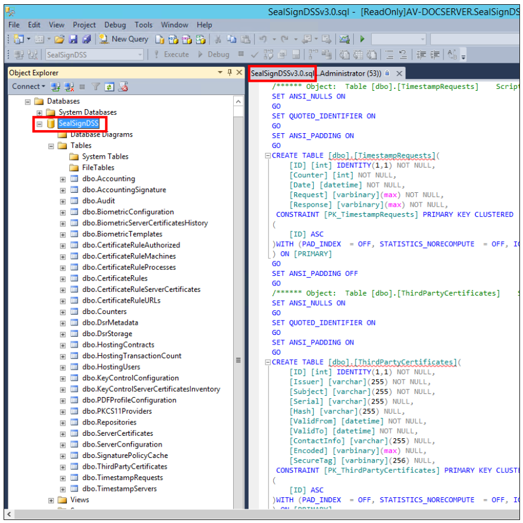
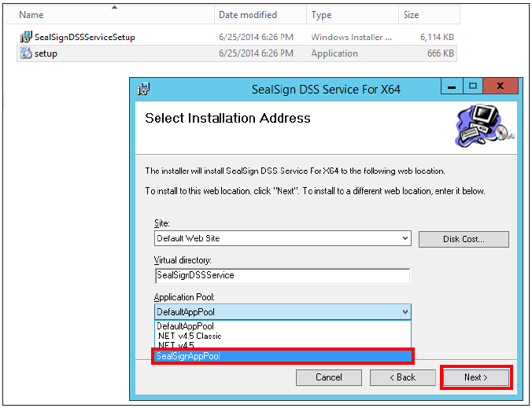
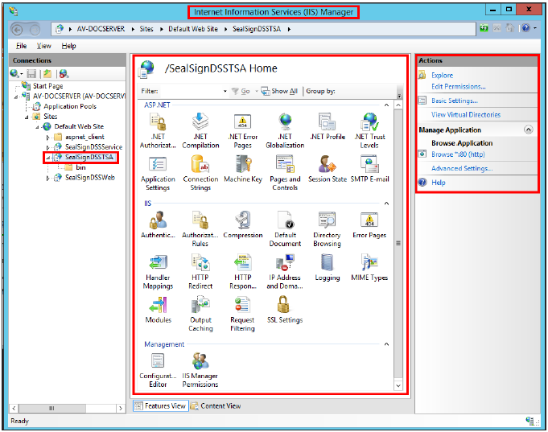
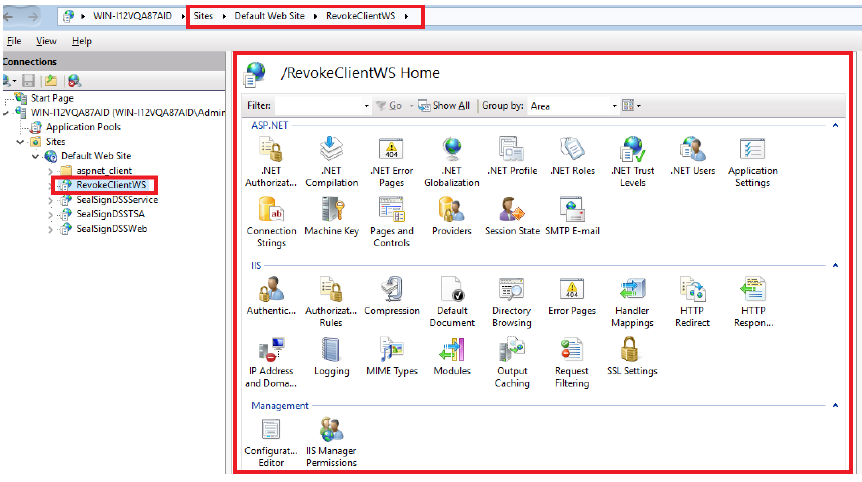

## 1. Introduction

SealSign DSS (Digital Signature Services) is a product aimed at facilitating the integration of electronic signatures in corporate applications.
in corporate applications. The product is made up of a series of modules, whose installation systems are based on MSI 3.0 technology.
based on MSI 3.0 technology.

The installation of the SealSign DSS module is followed by the installation of other modules, one or several of them depending on the needs.
depending on the needs, with the DSS Service module being the only one whose installation is mandatory,
as it is the tool used by all the others.


<center><i>Image 01: SealSign modules</i></center>

Below is a summary of the features of each one.

- **DSS Web Module (administration and configuration)**: This module is the web tool for
and administration tool of the SealSign DSS solution, which is used to manage the other modules (except for the Revoke module).
modules (except the Revoke module). Therefore, its installation is essential in case you want to install any other module.
install any other module.

- **DSS Service module (electronic signature)**: This module incorporates the electronic signature engine and the SOA interfaces of the web service required for the
SOA interfaces of the web service required to access its functionality. Its installation is
mandatory.

- **Revoke module**: This module is the certificate validation authority, it works as a certificate validation centralizer.
centralizer of certificate validations. It is totally independent of the others and also has its own
has its own administration console.

- **DSS TSA module (time stamp issuing)**: This module incorporates the time stamping authority, and should only be installed if
This module incorporates the time stamping authority, and should be installed only if time stamps are to be issued. The TSA module makes use of the
DSS Service module for its configuration and the DSS Web module for its administration.

- **DSS OTP (One Time Password Signature) module**: This is the SealSign OTPSS module, which incorporates the One Time Password signature engine.
One Time Password signature engine. It uses the DSS Service module to carry out its tasks, based on
web services and the DSS Web module for administration.

Due to the nature of the product, its installation is only possible on Microsoft Windows operating systems.
and before such installation it is necessary to perform some fundamental preliminary steps, which cannot be avoided.

This guide will show both these preliminary steps and the actual installation of the DSS modules and their configuration.
DSS modules, as well as their configuration. The installation and configuration of the SealSign modules that are not DSS
(CKC, BSS) are covered in other guides.

Both the texts and images used in this guide are based on a Microsoft Windows 2012 operating system.
Windows 2012, although any system administrator will be able to install the product in other versions.
versions.

## 2. SealSign DSS installation requirements

SealSign DSS is a server solution that publishes its functionality through an SOA interface. This solution
is designed for corporate environments that must meet the following requirements:

- **Microsoft Windows operating system**. Although in specific scenarios SealSign DSS can be installed on client operating systems, it is recommended that the product be installed on one of the following
client operating systems, it is recommended to install the product on one of the following operating systems: WS 2008, WS 2008 R2, WS 2012, WS 2012 R2 and W2016.

- **.NET Framework 4.6.2**

- **IIS 7**. Internet Information Server.

- **Database manager (SQL Server, Oracle or PostGreSQL)**: Configuration data, audit, SealSign DSS configuration, audit, cache, etc. data are stored in a database. Although in certain scenarios scenarios it will be possible to use free versions of these databases, it is recommended to use the full versions of SQL Server, Oracle 11g R2 and PostGreSQL 9.6 or higher.

The SealSign DSS architecture rests on the application services of the Microsoft platform, for so you need to add the application server role and the web server role (IIS) through the server management tool. The following points detail which options should be configured in these servers.

### 2.1. Installation of Operating System Roles

SealSign DSS requires the installation of some operating system roles. In order to install them it is necessary
run the InstallPrerequisites.ps1 script located at the following path:

**\\\\SealSign_Engine/server/PrequisitesPowerShellScripts/InstallPrerequisites.ps1**

Below are the lists of roles and features:

- FileAndStorage-Services 
- Storage-Services 
- Web-Server 
- Web-WebServer 
- Web-Common-Http 
- Web-Default-Doc 
- Web-Dir-Browsing 
- Web-Http-Errors 
- Web-Static-Content 
- Web-Http-Redirect 
- Web-Health 
- Web-Http-Logging 
- Web-Log-Libraries 
- Web-Request-Monitor 
- Web-Performance 
- Web-Stat-Compression 
- Web-Dyn-Compression 
- Web-Security 
- Web-Filtering 
- Web-Basic-Auth 
- Web-Client-Auth 
- Web-Digest-Auth 
- Web-Cert-Auth 
- Web-IP-Security 
- Web-Url-Auth 
- Web-Windows-Auth 
- Web-App-Dev 
- Web-Net-Ext 
- Web-Net-Ext45 
- Web-Asp-Net45 
- Web-ISAPI-Ext 
- Web-ISAPI-Filter 
- Web-Mgmt-Tools 
- Web-Mgmt-Console 
- Web-Mgmt-Compat 
- Web-Metabase 
- Web-Scripting-Tools 
- Web-Mgmt-Service 
- NET-Framework-Features 
- NET-Framework-Core 
- NET-HTTP-Activation 
- NET-Framework-45-Features 
- NET-Framework-45-Core 
- NET-Framework-45-ASPNET 
- NET-WCF-Services45 
- NET-WCF-HTTP-Activation45 
- NET-WCF-TCP-PortSharing45 
- PowerShellRoot 
- PowerShell 
- PowerShell-V2 
- PowerShell-ISE 
- WAS 
- WAS-Process-Model 
- WAS-NET-Environment 
- WAS-Config-APIs 
- WoW64-Support

## 3. Pre-configuration of the environment

Once you have the elements indicated in the previous point, it is necessary to configure of these. The installation of the final product depends fundamentally on the correct execution of the Next steps.

### 3.1. IIS 7 or IIS 7.5 Application Pool Configuration

This article shows the steps to follow to create a website with IIS 7, in case you are not have one, or want to create one expressly for SealSign DSS.

A new Application Pool can be created exclusively for the product, although it is also possible to use an existing one as long as it has the configurations that will be shown in this section. 

Starting with the IIS 7.0 version, the default Application Pools are executed with virtual accounts and it is recommended maintain this configuration, unless it is strictly necessary to use an existing account. The use of Virtual accounts is a security mechanism, since these accounts have limited permissions. In this case The virtual account to be used is the default one: *ApplicationPoolIdentity*.

The creation of an IIS Application Pool is done from the IIS administration console, the IIS Manager
and specifically from the context menu of the Application Pool section. The name of the Application Pool is
indifferent (SealSignAppPool in this case), but it must run with .NET version 4.0.30319, in addition
It is recommended that the integration mode chosen be Integrated (see image below).



<center><i>Image 02: Creating a new Application Pool</i></center>

Once you have an Application Pool, it is necessary to configure it and modify certain values, to do this
You must access the advanced options of the Application Pool through the context menu:

- In the Identity option, the account that will be used to run the Application Pool will be established, the
virtual account is reflected with the name ApplicationPoolIdentity and is the recommended one, although such
and as mentioned it is possible to choose another of the available ones.

- In the Load User Profile option, the value must be set to True. This is due to
that the DSS product performs operations that, by the very nature of Microsoft Windows, are
They are stored in a certificate store in the Microsoft Windows registry itself. To
accessing said certificate store the Application Pool must be able to load the certificate profile
user.


<center><i>Image 03: Advanced options for the created Application Pool</i></center>

### 3.2. Creation of the database

As already mentioned, the use of a database is necessary to store various information.
that the product requires. This section details the necessary configurations for the databases.
SQL Server, Oracle and PostGreSQL.

#### 3.2.1. SQL Server

If using SQL Server, it is necessary to create a new database for SealSign DSS. The name of
said database is indifferent (SealSignDSS in this case), and will be used later in the chains of
Connection. Once this database has been created, it is necessary to perform the following actions:

- **Run the table creation script**. A file is included in the product installation package
sql for SQL Server. This file must be executed on the created database, and it will be generated in
It contains all the elements that the product needs for its correct functioning.

**\SealSign_Engine\server\Scripts\SQL Server\SealSignDSS_vX.X_MSSQL.sql**


<center><i>Image 04: Execution of the sql file in the created database</i></center>

- **Configure database access permissions**. In the case of using integrated security for
access the database, it is necessary to provide write (datawriter) and read permissions
(datareader) to the user login with which the *IIS Application Pool* that contains the
Applications. The following Microsoft guide details how to perform this configuration. If I dont know
uses integrated security, you will also need to have a user with the permissions
mentioned.

As mentioned above, it is recommended to use a virtual account to run the
IIS Application Pool (*ApplicationPoolIdentity* in this case), and therefore it is recommended to use this same
account to access the database. This account according to the nomenclature used internally by Microsoft
It is *IIS APPPOOL*. Hence the login name is *IIS APPPOOL\SealSignAppPool*.


<center><i>Image 05: Login name configuration</i></center>

#### 3.2.2. Oracle

If you use Oracle, it is necessary to create a new tablespace for SealSign DSS, just like with SQL
Server the name of said tablespace is irrelevant. It is also necessary to have an account with
write and read permissions on the tables in the tablespace.

Once said tablespace has been created, it is necessary to perform the following actions:

- Install the Oracle Data Access Components (ODAC) component for Microsoft Windows,
including the Oracle Data Provider module.

- Give execute permissions on the Oracle dbms_crypto cryptography package to the user of the
tablespace.

- Run the table creation script. A file is included in the product installation package
sql for Oracle. This file must be executed on the created tablespace, and it will be generated in the same
all the elements that the product needs for its correct operation.

**\SealSign_Engine\server\Scripts\ORACLE\SealSignDSS_vX.X_ORACLE.sql**

Once these configurations have been made, the system is now ready to install the necessary modules.
SealSign DSS.

#### 3.2.3. PostGreSQL

If you use PostGreSQL, it is necessary to create a new DB for SealSign DSS, as with SQL.
Server the name of said DB is irrelevant. It is also necessary to have an account with permissions
of writing and reading on the database tables.

Once said DB has been created, it is necessary to execute the table creation script. In the installation package
An sql file for PostGreSQL is included in the product. This file must be executed on the created DB,
and all the elements that the product needs for its correct functioning will be generated therein.

**\SealSign_Engine\server\Scripts\PostgreSQL\SealSignDSS_vX.X_PostgreSQL.sql**

Once these configurations have been made, the system is now ready to install the necessary modules.
SealSign DSS.

### 3.3. Authorization permissions

It is necessary to add the users who are going to administer from SealSignDSSWeb to the local or domain group SealSignDSS Admins, the users who are going to upload their own certificates and create their usage rules must be in the SealSignDSS Power Users group.


<center><i>Local users and groups</i></center>

## 4. Installation of SealSign DSS Modules

### 4.1. DSS Service Module (electronic signature)

As mentioned above, this module installs a set of web services. These will be based
both in the IIS and in the database to carry out its work. This is why after installation there is
You have to configure it so that it can use these services.

#### 4.1.1. Installing the DSS Service module

The installation of the module is carried out like many Microsoft Windows programs, that is, following the
steps of an assistant.

During the installation, you must indicate from the list of available websites, the one where you want to install the
SealSign DSS electronic signature service, the virtual directory name, and the *Application Pool*
which was configured in IIS (*SealSignAppPool* in this case).



<center><i>Image 06: Configuration during installation of the DSS Service module</i></center>

After installation it has been added as another program in the list of programs in the Control Panel, and in the
IIS will be displayed as a web application.


<center><i>Image 07: Module already integrated as a web application in IIS</i></center>

#### 4.1.2. DSS Service Module Configuration

Once the module is installed, it is necessary to configure it so that it correctly uses both the database,
like the IIS.

**CONFIGURATION OF THE CONNECTION TO THE DATABASE**

It is done in the configuration file *connectionStrings.config*. This is located in the directory
*SealSignDSSService* of the Web site where the product is installed.

**\InetPub\wwwroot\SealSignDssService**


- **SQL Server**

    This file includes the connection string to the database previously created in SQL Server
    (SealSignDSS):

    ```xml
    <connectionStrings>
        <add name="SealSignDSSConnectionString"
            connectionString="Data Source=localhost;
            Initial Catalog=SealSignDSS;
            Trusted_Connection=Yes;
            persist security info=False;
            TrustServerCertificate=True" />
    </connectionStrings>
    ```

    If the database used is SQL Server, you will simply have to modify the parameters
    above to adapt to the configuration previously made in the database. In this direction
    You can learn about creating connection strings in SQL Server.

- **Oracle**

    If the database is Oracle, the following parameters must be modified:

    - Change the value of the FactoryProvider key and set it to System.Data.OracleClient in the file
    web.config located in the same directory as the connectionStrings.config file.

    - In the connectionStrings tag you must configure the connection string for access to Oracle. In
    At this address it is possible to learn about creating connection strings in Oracle.

    - You must modify the connectionString attribute of the SealSignDSSConnectionString tag, and
    set it with the following format:

    ```xml
    Data Source=(DESCRIPTION=(ADDRESS=(PROTOCOL=XXX)(HOST=XXX)(PORT=XXX))
    (CONNECT_DATA=(SID=XXX)));User Id=UserID;Password=Password;
    ```

    An example of a connection could be the following:

    - **web.config file**:

    ```xml
        ...
        <appSettings>
            <add key="FactoryProvider" value="System.Data.OracleClient" />
            ...
        </appSettings>
        ...
    ```
    - **connectionStrings.config file**:

    ```xml
    <connectionStrings>
        <add name="SealSignDSSConnectionString"
            connectionString="Data Source=(DESCRIPTION=(ADDRESS=(PROTOCOL=TCP)
            (HOST=172.54.110.112)(PORT=1521))(CONNECT_DATA=(SID=orcl)));
            User Id=SealSignDSS; Password=1234546;” />
    </connectionStrings>
    ```

- **PostgreSQL**

    If the database is PostGre, the following parameters must be modified:

    - Change the value of the FactoryProvider key and set it to Npgsql in the web.config file located
    in the same directory where the connectionStrings.config file is located.

    - In the connectionStrings tag you must configure the connection string for access to PostGre.
    At this URL address https://www.connectionstrings.com/npgsql/ it is possible to obtain information about the
    creating connection strings in Oracle.

    - You must modify the connectionString attribute of the SealSignDSSConnectionString tag, and
    set it with the following format:

    ```xml
    server=XXXX;userid=XXXX;password=XXXX;database=XXXX
    ```

    An example of a connection could be the following:

    **web.config file**:

    ```xml
        ...
        <appSettings>
            <add key="FactoryProvider" value="Npgsql" />
            ...
        </appSettings>
        ...
    ```

    **connectionStrings.config file**:

    ```xml
        <connectionStrings>
            <add name="SealSignDSSConnectionString"
                connectionString=" server=localhost;userid=postgres;password=POSTGRES;
                database=SealSignDSS”/>
        </connectionStrings>
    ```

**MODULE CONFIGURATION IN IIS**

When accessing the web service, it is necessary that you have the necessary permissions. Both the
Web application and server require Windows Integrated Security (*Windows Authentication*) to
its correct operation. This implies that this type of authentication must be activated. The
*Anonymous Authentication* is enabled by default and should not be disabled. It needs to continue like this. On the other hand, it is optional (although recommended depending on the scenario) to activate the basic authentication (*Basic Authentication*). Thanks to this, users with technologies other than those of Microsoft Windows (iOS, Android, Java, Linux, etc.) may consume said web service and therefore use the product.


<center><i>Image 09: Configuring DSS Service module permissions in IIS</i></center>

If you activate basic authentication, it is highly recommended to use SSL/TLS.


**SSL/TLS CONFIGURATION**

For more information about how to configure IIS/SSL check [https://learn.microsoft.com/en-us/iis/manage/configuring-security/how-to-set-up-ssl-on-iis](https://learn.microsoft.com/en-us/iis/manage/configuring-security/how-to-set-up-ssl-on-iis)

***Configuring WCF Bindings in SealSign with SSL***

To configure WCF in any of the SealSign modules to use SSL, simply make the following change to the `Web.config` of the module in question:

```
<!--<services configSource="servicesnossl.config"/>-->
<services configSource="servicesssl.config"/>
```

***Configuring WCF Bindings in SealSign without SSL***

To configure WCF in any of the SealSign modules to not use SSL, simply make the following change to the `Web.config` of the module in question:

```
<services configSource="servicesnossl.config"/>
<!--<services configSource="servicesssl.config"/>-->
```

### 4.2. DSS Web module (administration and configuration)

As mentioned above, this module installs an administration tool with
web application format, which is used by the other modules, therefore, its installation is mandatory.
This module is based on IIS to carry out its work, therefore, after installation it must be configured so that
can use this service.

Once the installation and configuration is complete, a user must be given permissions on the system to
that managed SealSign. The fact that the installation and configuration is carried out does not mean that you can
access the administration website.

#### 4.2.1. Installation of the DSS Web Module

The installation of the module is carried out like many Microsoft Windows programs, that is, following the
steps of an assistant. The process is the same as the one carried out before installing the DSS module
Service.

During the installation, you must indicate from the list of available websites, the one where you want to install the
management web service in addition to the virtual directory and the *Application Pool* that are
configured in IIS (*SealSignAppPool* in this case).


<center><i>Image 10: Configuration during DSS Web module installation</i></center>

After installation it has been added as another program in the list of programs in the Control Panel.
Microsoft Windows, and in IIS it will also appear as a web application, along with the DSS Service.


<center><i>Image 11: Module already integrated as a web application in IIS</i></center>

#### 4.2.2. DSS Web Module Configuration

For it to work correctly, you must have the DSS Service module referenced and you must modify the
authentication in IIS.

**CONFIGURATION OF THE REFERENCE TO THE DSS SERVICE MODULE**

It is done in the configuration file ***endpoints.config***. This is located in the directory
***SealSignDSSWeb*** of the website where the product has been installed. This file includes, among others
configurations, the addresses of three web services provided by the DSS Service. Specifically they are
the administration web service (*AdminService.svc*), the audit service (*AuditService.svc*) and the repository service
document security (*SecureStorage.svc*).
If the installation of the services established by default has been carried out, it will not be necessary
modify this file.

```xml
    <client>
        <endpoint address="http://localhost/SealSignDSSService/AuditService.svc"
        ...
        </endpoint>
        <endpoint address="http://localhost/SealSignDSSService/AdminService.svc"
        ...
        </endpoint>
        <endpoint address="http://localhost/SealSignDSRService/SecureStorage.svc"
        ...
        </endpoint>
    </client>
```

At this address you can obtain information about the displayed parameters.

#### 4.2.3. Configuring the module in IIS

For the correct functioning of the administration web application it is necessary to modify the authentication
in the IIS. To do this, access for anonymous users must be disabled (*Anonymous Authentication*) and
Enable Windows-based authentication (*Windows Authentication*).


<center><i>Image 12: Configuring DSS Web Module Permissions in IIS</i></center>

### 4.3. DSS TSA module

As mentioned above, this module installs the timestamping authority. As
that in the previous ones you have to configure the connection string to the database once it has finished
installation.

#### 4.3.1. Installing the DSS TSA module

The installation of the module is carried out like many Microsoft Windows programs, that is, following the
steps of an assistant. The process is the same as the one carried out previously when installing the DSS modules
Service and DSS Web.


<center><i>Image 13: Configuration during installation of the DSS TSA module</i></center>

After installation it has been added as another program in the list of programs in the Control Panel, and in the
IIS will also appear as a web application, along with DSS Service and DSS Web.



<center><i>Image 14: Module already integrated as a web application in IIS</i></center>

#### 4.3.2. DSS TSA Module Configuration

It is done in the configuration file ***connectionStrings.config***. This is located in the directory
***SealSign DSS TSA*** from the website where the product is installed. By default, this file includes the string
connection to the database created previously in SQL Server (*SealSignDSS*).

```xml
   <connectionStrings>
        <add name="SealSignDSSConnectionString"
            connectionString="Data Source=localhost;
            Initial Catalog=SealSignDSS;
            Trusted_Connection=Yes;
            persist security info=False;
            TrustServerCertificate=True" />
    </connectionStrings> 
```

The connection string configuration is exactly the same as previously done in the
DSS Service module. The administrator must follow the steps indicated in that section to establish the
proper connection in SQL Server, Oracle or PostGreSQL.

### 4.4. DSS Revoke module (Validation Authority)

DSS Revoke is a local digital certificate validation authority that allows you to integrate into the
organization of multiple external PSCs maintaining control of the validation process, centralizing the
revocation checking and providing auditing functions, caching, downloading CRLs and OCSP responses
and local revocation lists.

#### 4.4.1. DSS Revoke Module Installation

The installation of the module is carried out like many Microsoft Windows programs, that is, following the
steps of an assistant. The process is the same as the one carried out previously when installing the DSS modules
Service and DSS Web.


<center><i>Image 15: Configuration during installation of the DSS TSA module</i></center>

After installation it has been added as another program in the list of programs in the Control Panel, and in the
IIS will also appear as a web application, along with DSS Service and DSS Web.



<center><i>Image 16: Module already integrated as a web application in IIS</i></center>

#### 4.4.2. DSS Revoke Module Configuration

It is done in the configuration file ***connectionStrings.config***. This is located in the directory
***RevokeClientWS*** from the Web site where the product is installed. By default, this file includes the string
connection to the database created previously in SQL Server (*SealSignDSS*).

```xml
    <connectionStrings>
        <add name="SealSignDSSConnectionString"
            connectionString="Data Source=localhost;
            Initial Catalog=SealSignDSS;
            Trusted_Connection=Yes;
            persist security info=False;
            TrustServerCertificate=True" />
    </connectionStrings>
```

The connection string configuration is exactly the same as previously done in the
DSS Service module. The administrator must follow the steps indicated in that section to establish the
proper connection in SQL Server, Oracle or PostGreSQL.

### 4.5. OTPSS module (One Time Password Signature Service)

#### 4.5.1. OTPSS Module Installation

The installation of the module is carried out like many Microsoft Windows programs, that is, following the
steps of an assistant.

During the installation, you must indicate from the list of available websites, the one where you want to install the
SealSign DSS electronic signature service, the virtual directory name, and the application Application Pool
which was configured in IIS (SealSignAppPool in this case).


<center><i>Image 17: Configuration during installation of the OTPSS module</i></center>

After installation it has been added as another program in the list of programs in the Control Panel, and in the
IIS will be displayed as a web application.


<center><i>Image 18: Module already integrated as a web application in IIS</i></center>


#### 4.5.2. OTPSS Module Configuration

It is done in the configuration file ***connectionStrings.config***. This is located in the directory
***SealSignOTPSSService*** of the Web site where the product is installed. This file includes the string
connection to the database created previously in SQL Server (*SealSignDSS*), plus other parameters
What must be considered:

**\InetPub\wwwroot\SealSignOTPSSService**

- **SQL SERVER**

    This file includes the connection string to the database previously created in SQL Server
    (SealSignDSS):

    ```xml
        <connectionStrings>
            <add name="SealSignDSSConnectionString"
                connectionString="Data Source=localhost;
                Initial Catalog=SealSignDSS;Trusted_Connection=Yes;
                persist security info=False; TrustServerCertificate=True"/>
        </connectionStrings>
    ```

- **ORACLE**

    If the database is Oracle, the following parameters must be modified:

    - Change the value of the FactoryProvider key and set it to System.Data.OracleClient in the file
    web.config located in the same directory as the connectionStrings.config file.

    - In the connectionStrings tag you must configure the connection string for access to Oracle. In
    At this address it is possible to learn about creating connection strings in Oracle.

    - You must modify the connectionString attribute of the SealSignDSSConnectionString tag, and
    set it with the following format:

    ```xml
    Data Source=(DESCRIPTION=(ADDRESS=(PROTOCOL=XXX)(HOST=XXX)(PORT=XXX))
    (CONNECT_DATA=(SID=XXX)));User Id=UserID;Password=Password;
    ```

    An example of a connection could be the following:
    
    - **web.config file**:

    ```xml
        ...
        <appSettings>
            <add key="FactoryProvider" value="System.Data.OracleClient" />
            ...
        </appSettings>
        ...
    ```

    - **ConnectionStrings.config file**:

    ```xml
        <connectionStrings>
            <add name="SealSignDSSConnectionString"
                connectionString="Data Source=(DESCRIPTION=(ADDRESS=(PROTOCOL=TCP)
                (HOST=172.54.110.112)(PORT=1521))(CONNECT_DATA=(SID=orcl)));
                User Id=SealSignDSS; Password=1234546;” />
        </connectionStrings>
    ```
- **POSTGRESQL**

    If the database is PostGre, the following parameters must be modified:

    - Change the value of the FactoryProvider key and set it to Npgsql in the web.config file located
    in the same directory where the connectionStrings.config file is located.

    - In the connectionStrings tag you must configure the connection string for access to PostGre.
    At this URL address https://www.connectionstrings.com/npgsql/ it is possible to obtain information about the
    creating connection strings in Oracle.

    - You must modify the connectionString attribute of the SealSignDSSConnectionString tag, and
    set it with the following format:

    ```xml
    server=XXXX;userid=XXXX;password=XXXX;database=XXXX
    ```

    An example of a connection could be the following:

    - **web.config file**:

        ```xml
            ...
            <appSettings>
                <add key="FactoryProvider" value="Npgsql" />
                ...
            </appSettings>
            ...

        ```
    - **ConnectionStrings.config file**:

        ```xml
            <connectionStrings>
                <add name="SealSignDSSConnectionString"
                    connectionString=" server=localhost;userid=postgres;password=POSTGRES;
                    database=SealSignDSS”/>
            </connectionStrings>
        ```

## 5. Troubleshooting Installation Problems

The installation process of electronic signature services includes a monitoring system and
SealSign's own error tracking. In this way all errors, warnings and informational messages are
logged in their own application log integrated into Microsoft Windows. If you identify any
problem in the services, it is recommended to review the SealSign DSS log.


<center><i>Image 20: Microsoft Windows Event Viewer</i></center>

The most common problems that can occur during the installation of SealSign DSS are those caused
for obtaining the license, and its identifier is 3011.

```note 
    The “SealSign Monitoring Guide” includes full details on how to
    monitor the health status of the platform and see the possible errors that may occur
    during use.
```

### 5.1. Error 80070005

This error generally occurs when the user the *Application Pool* is configured with does not have
permissions to instantiate the license management component. Said component is registered in the machine
during the installation process. The generated message is the following:

```An error has occurred obtaining license information: 
    Retrieving the COM class factory for component with CLSID {554A6D3B-2FEF-4C2F-B34C-AF6185EB2759} failed due to the following error: 80070005. at SealSignDSSLibrary.SealSignDSSLicense.InitializeLicense(String licenseFile)
```

To solve this, simply provide activation permissions to the *Application Pool* user. This could be done
do with the ***DCOMCNFG.EXE*** tool, looking for the ***LicProtector Server*** component:


<center><i>Image 21: DCOMCNFG.EXE Tool</i></center>

Through the right button you can access the properties of this element, where the tab is
Security, from which you can give permissions to the Application Pool user.


<center><i>Image 21: Permission settings</i></center>

### 5.2. Error 80040154

This error generally occurs in 64-bit environments when the activation settings of the
license management component has been modified or deleted. Said component is registered in the machine
during the installation process.

The generated message is the following:

```An error has occurred obtaining license information:
    Retrieving the COM class factory for component with CLSID {554A6D3B-2FEF-4C2F-B34C-AF6185EB2759} failed due to the
    following error: 80040154. at SealSignDSSLicense.SealSignDSSLicense.InitializeLicense(String licenseFile)
```

To regenerate the component activation configuration, you can execute the ***DllSurrogate.reg*** file
supplied with installation modules.