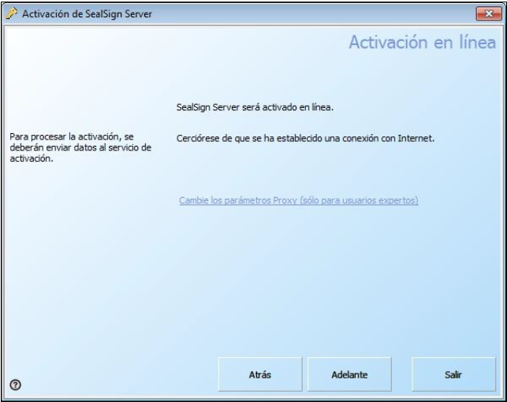

# 1. Introduction

This document will describe the licensing tool for the SealSign® family of products as follows:
like each of its options both from the graphical interface and from the command line.
This document is valid for any product in the SealSign® family, therefore, valid for:

- SealSign® DSS
- SealSign® BSS
- SealSign® TSA
- SealSign® CKC
- SealSign® DSR
- SealSign® BAS

> Although “SealSign® DSS” appears as a product in the images in this document, this This document is applicable to the rest of the SealSign® family products mentioned above.

# 2. SealSign® License Management - Options

SealSign® License Management is located in the Control Panel. If the operating system of the
computer is Windows 2008 or later, SealSign® License Management is located within the
Programs category in said control panel.

The tool looks like this:

<i>Image 01: SealSign® License Management</i>

The interface distinguishes the different options that can be made regarding the licenses. These are:

- **Activate**: If a license is in the evaluation period or expired, the Activate button will be enabled and
Its operation is to invoke the License Activation Wizard as will be seen later.
Once the product is activated, the license is associated with the computer hardware and cannot be reused.
on another computer in no way.

- **Deactivate**: If a license is activated and you want to deactivate it for migration to another computer, for
a reinstallation of the server or for any other reason, this action will deactivate the product
locally and the server will be notified to release said license. So, this released license
It can be reused on any other equipment.

- **Reactivate**: If a license has been deactivated and you want to be reactivated on the same computer,
We will only have to use this option to associate the license again with the
local team. Once the process is complete, the license is again associated with the computer's hardware
and cannot be reused on other equipment in any way.

- **Check**: Perform an online check against the Factum Identity servers of the status of
the license.

- **Refresh**: Reloads the current license page.

- **License Viewer**: Shows a window with more detailed information about the license and its status
(hardware association codes, last online verification, etc.).

# 3. License Activation

## 3.1 License Activation over the Internet

Once the SealSign® product is installed on a server, it must be activated within 90 days. For
To activate online, the administrator must perform the following steps:

1. Start SealSign® License Management from the control panel. If the operating system
If your computer is Windows 2008 or later, SealSign® License Management is located
within the Programs category in said control panel. The following window will appear:

<i>Image 02: Appearance of the "SealSign License Management" window</i>

2. Press the Activate button, select the option I have a serial number and I want to activate SealSign®
Server and press the Forward button:

<i>Image 03: Activation of SealSign® Server with serial number</i>

3. Select the Online Activation option and press the Next button:

<i>Image 04: Activation of SealSign® Server. Online activation</i>

4. Fill in the serial number, name/company and email fields and press the button
Forward. It is important to enter a correct email address to receive future
Product updates and news:

<i>Image 05: Activation of SealSign® Server. Entering the serial number</i>

5. In the Online Activation window, if necessary, modify the proxy parameters by clicking the
link, and press the Next button:

<i>Image 06: Activation of SealSign® Server. Final window</i>

6. In the result window press the Next button:

<i>Image 07: SealSign® Server activation completed</i>

If the activation has been correct, the SealSign® License Management tab will show the
change as shown in the following image:

<i>Image 08: What the "SealSign License Management" window looks like after activating the license</i>

## 3.2 License activation by email or fax

If the computer does not have an internet connection, the administrator can activate the license
via email or fax. To do this, the following steps must be carried out:

1. Start SealSign® License Management from the control panel. If the operating system
If your computer is Windows 2008 or later, License Management is located within the
Programs category.

2. Press the Activate button.

3. Select the option I have a serial number and I want to activate SealSign® Server and press the button
Forward.

4. Select the desired activation type.

5. Fill in the serial number, name/company and email fields and press the button
Forward.

6. A fax or email similar to the following will be generated:

<i>Image 09: Appearance of a registration fax for SealSign® Server</i>

7. Send the e-mail or fax as appropriate and press the Forward button. As a response you will receive
2 unlock keys to activate.

8. When the response is received, re-enter the wizard using the Activate button on the
SealSign® License Management tool.

9. The activation wizard will now require an activation key that will have been obtained as
response to e-mail or fax:

<i>Image 10: Entering the activation key</i>

10. Enter one by one each of the activation key(s) sent in the response to the request and
Press the Apply Key button for each of them.

11. When all keys have been entered, press Next.

12. If the activation has been correct, the Licensing tab will show the

# 4. License Deactivation 

This process requires an Internet connection. To carry out the deactivation, the administrator must perform
the following steps:

1. Start SealSign® License Management from the control panel. If the operating system
If your computer is Windows 2008 or later, SealSign® License Management is located
within the Programs category in said control panel.

2. We press the Deactivate button and the deactivation process will begin. Once deactivated, the license
it will look like:

<i>Image 11: "SealSign License Management" window once the license is activated</i>

<i>Image 12: "SealSign License Management" window once the license is deactivated</i>

# 5. License Reactivation

This process requires an Internet connection. To reactivate, the administrator must perform
the following steps:

1. Start SealSign® License Management from the control panel. If the operating system
If your computer is Windows 2008 or later, SealSign® License Management is located
within the Programs category in said control panel.

2. We press the Reactivate button and the reactivation process will start. Once reactivated, the license
it will look like:

<i>Image 11: "SealSign License Management" window once the license is deactivated</i>

<i>Image 12: "SealSign License Management" window once the license has been reactivated</i>

# 6. Checking License Status

This process requires an Internet connection. To perform the health check, the administrator must
perform the following steps:

1. Start SealSign® License Management from the control panel. If the operating system
If your computer is Windows 2008 or later, SealSign® License Management is located
within the Programs category in said control panel. The following window will appear:

<i>Image 15: "SealSign License Management" window once the license is activated</i>

2. We press the Check button and the verification process will start. Once verified, if the
status is correct a message will appear like:

<i>Image 16: Checking the license status</i>

If an error occurs during the check or the license is not correct, an error message will appear in
instead of the one shown above.

# 7. Show License Viewer

To display detailed license status information, the administrator must perform the following
Steps:

1. Start SealSign® License Management from the control panel. If the operating system
If your computer is Windows 2008 or later, SealSign® License Management is located
within the Programs category in said control panel.

<i>Image 17: "SealSign License Management" window once the license is activated</i>

2. We press the License Viewer button and the process will start. The following window will be displayed:

<i>Image 18: License viewer</i>

In this window we can apply activation keys, see the license code associated with the computer hardware
(13), the activation key applied, the date of the license file as well as other relevant data for
SmartAccess.

# 8. License Management via command line

In the command line examples that will be shown below, the following are being used
assumptions:

- It starts from the ***%WINDIR%\Syswow64*** directory on 64-bit systems or ***%WINDIR%\System32*** on 32-bit systems.

- The examples will be made with the SealSignDSS.lic license file which belongs to the product
SealSignDSS Service (Electronic Signature) of the SealSign® family. These examples are applicable to the rest
of products from the SealSign® family as stated in the introduction of this document.

> **View license status** SealSignADM.exe -p -l SealSignDSS.lic
>
> **Activate license** SealSignADM.exe -a -e email@domain.com -s XXXXX-XXXXXXXXXX-XXXXX-XXXXX-XXXXX -l SealSignDSS.lic
>
> **Deactivate license** SealSignADM.exe -x -l SealSignDSS.lic
>
> **Reactivate license** SealSignADM.exe -r -l SealSignDSS.lic
>
> **Check License Status** SealSignADM.exe -c -l SealSignDSS.lic
>
> **Show License Viewer** SealSignADM.exe -v -l SealSignDSS.lic