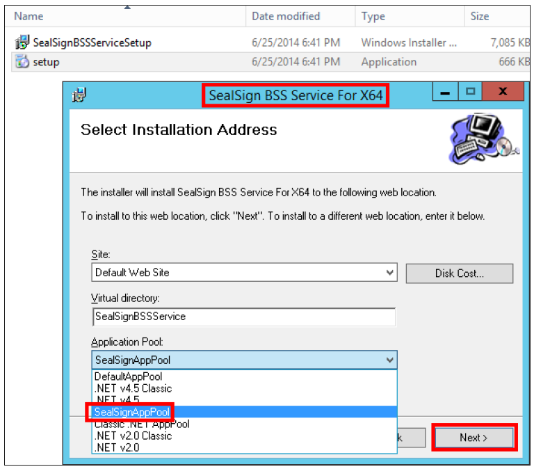
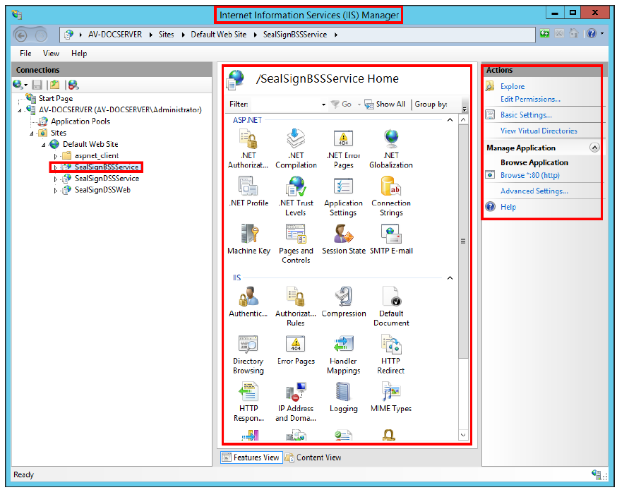

## 1. Instalación del módulo BSS

La instalación del módulo se realiza como muchos programas de Microsoft Windows, es decir, siguiendo los
pasos de un asistente.

Durante la instalación, hay que indicar de la lista de sitios web disponibles, aquel en el que se desea instalar el
servicio de firma electrónica SealSign DSS, el nombre del directorio virtual y el Application Pool de aplicación
que se configuró en el IIS (SealSignAppPool en este caso).



<center><i>Image 01: Configuración durante la instalación del módulo BSS.</i></center>

Tras la instalación se ha añadido como un programa más en la lista de programas del Panel de Control, y en el
IIS se mostrará como una aplicación web.



<center><i>Image 02: Módulo ya integrado como aplicación web en IIS.</i></center>

## 2. Configuración del módulo BSS

Se realiza en el fichero de configuración connectionStrings.config. Este se encuentra ubicado en el directorio
SealSignBSSService del sitio Web donde se haya instalado el producto. Dicho fichero incluye la cadena de
conexión a la base de datos creada anteriormente en SQL Server (SealSignDSS), además de otros parámetros
que hay que tener en cuenta:

**\InetPub\wwwroot\SealSignBSSService**

### 1.1. SQL Server

Dicho fichero incluye la cadena de conexión a la base de datos creada anteriormente en SQL Server
(SealSignDSS):

```xml
  <connectionStrings>
      <add name="SealSignDSSConnectionString"
        connectionString="Data Source=localhost;
        Initial Catalog=SealSignDSS;
        Trusted_Connection=Yes;
        persist security info=False;
        TrustServerCertificate=True" />
  </connectionStrings>
```

### 1.2. Oracle

En caso de que la base de datos sea Oracle, hay que modificar los siguientes parámetros:

- Cambiar el valor de la clave FactoryProvider y establecerlo a System.Data.OracleClient en el fichero
web.config ubicado en el mismo directorio en el que se encuentra el fichero connectionStrings.config.

- En la etiqueta connectionStrings hay que configurar la cadena de conexión para el acceso a Oracle. En
esta dirección es posible informarse sobre la creación de cadenas de conexión en Oracle.

- Hay que modificar el atributo connectionString de la etiqueta SealSignDSSConnectionString, y
establecerlo con el siguiente formato:

```xml
  Data Source=(DESCRIPTION=(ADDRESS=(PROTOCOL=XXX)(HOST=XXX)(PORT=XXX))
  (CONNECT_DATA=(SID=XXX)));User Id=identificadorUsuario;Password=Contraseña;
```

Un ejemplo de conexión podría ser el siguiente:

- **Fichero web.config**

  ```xml
    ...
    <appSettings>
      <add key="FactoryProvider" value="System.Data.OracleClient" />
      ...
    </appSettings>
    ...
  ```

- **Fichero connectionStrings.config**

  ```xml
    <connectionStrings>
      <add name="SealSignDSSConnectionString"
        connectionString="Data Source=(DESCRIPTION=(ADDRESS=(PROTOCOL=TCP)
        (HOST=172.54.110.112)(PORT=1521))(CONNECT_DATA=(SID=orcl)));
        User Id=SealSignDSS; Password=1234546;” />
    </connectionStrings>
  ```

### 1.2. PostGreSQL

En caso de que la base de datos sea PostGre, hay que modificar los siguientes parámetros:

- Cambiar el valor de la clave FactoryProvider y establecerlo a Npgsql en el fichero web.config ubicado
en el mismo directorio en el que se encuentra el fichero connectionStrings.config

- En la etiqueta connectionStrings hay que configurar la cadena de conexión para el acceso a PostGre.
En esta dirección URL https://www.connectionstrings.com/npgsql/ es posible informarse sobre la
creación de cadenas de conexión en Oracle.

- Hay que modificar el atributo connectionString de la etiqueta SealSignDSSConnectionString, y
establecerlo con el siguiente formato:

```xml
  server=XXXX;userid=XXXX;password=XXXX;database=XXXX
```
Un ejemplo de conexión podría ser el siguiente:

- **Fichero web.config**

  ```xml
    ...
    <appSettings>
      <add key="FactoryProvider" value="Npgsql" />
      ...
    </appSettings>
    ...
  ```

- **Fichero connectionStrings.config**

  ```xml
    <connectionStrings>
      <add name="SealSignDSSConnectionString"
        connectionString=" server=localhost;userid=postgres;password=POSTGRES;
        database=SealSignDSS”/>
    </connectionStrings>
  ```