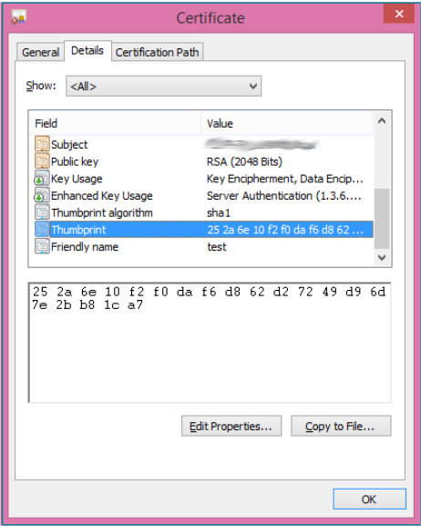
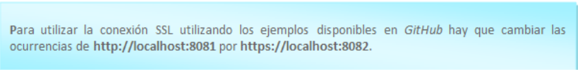

# **SealSign Signature Client (ClickOnce)**

# 1. Introducción

  El cliente ClickOnce de SealSign viene a sustituir en entornos Windows al Applet de Java. Su despliegue está basado en la tecnología ClickOnce de Microsoft que permite el despliegue de aplicaciones por internet. Para más información deberá visitarse el sitio de Microsoft. El cliente es capaz de comunicarse de forma bidireccional con el navegador que ha lanzado la petición de firma para conseguir un comportamiento similar a la integración del Applet con el navegador utilizando JavaScript. Esta comunicación se consigue utilizando SignalR de Microsoft. Para más información sobre SignalR puede visitarse el sitio oficial de SignalR.

  Desde el siguiente enlace podran acceder a un proyecto que contiene un ejemplo de como integrarse con el cliente de firma SealSign Signature Cliente (ClickOnce):
   - https://github.com/FactumID/SealSignClickOnceClientWebExample

# 2. Requisitos mínimos

  - El cliente funciona con .Net Framework 4.5
  - Los sistemas operativos soportados son:
    - Windows 7
    - Windows 8
    - Windows 10
    - Windows Server 2008 R2
    - Windows Server 2012
  - Los navegadores compatibles con SignalR son:
    - Microsoft Edge
    - Google Chrome a partir de la versión 50
    - Mozilla Firefox a partir de la versión 46

# 3. Tareas comunes

  ## 3.1. Instalación off-premises

  El cliente de ClickOnce está hospedado en los servidores de Factum ID. En la página de descarga se puede instalar tanto el cliente como los prerrequisitos del mismo. Una vez instalado aparecerá el icono en el escritorio.

  

  *Imagen 01: Icono de SealSign ClickOnce*

  ## 3.2. Instalación on-premises

  Si  es  necesario  desplegar  el  cliente  en  otro  servidor  que  no sea  el  de  Factum  Identity,  hay  que  seguir  los siguientes pasos.

  - Descomprimir el cliente que se encuentra en la descarga del SDK de la versión 4.6
  - Para  modificar  los  archivos  de  despliegue  de ClickOncehay  que  descargar  e  instalar  el SDK  de Windows
  - Cambiar  la  URL  de  publicación  con  el  siguiente  comando: mage -u  SealSignClient.application -pu http://[URL]/SealSignClient.application
  - Reasignar  el  manifiesto  de  la  aplicación  con: mage -u  SealSignClient.application -AppManifest "Application Files\SealSignClient_1_0_0_0\SealSignClient.exe.manifest"
  - Finalmente,  firmar  el  archivo  con  el  comando: mage -sign  SealSignClient.application -cf  [ruta  del certificado] -pwd [contraseña del certificado]

  Una vez hechos estos pasos se puede desplegar en el servidor el cliente de ClickOnce. Para que todo funcione correctamente hay que comprobar que el servidor web tiene los siguientes tipos MIME configurados:

  - .application –> application/x-ms-application
  - .manifest –> application/x-ms-manifest
  - .deploy –> application/octet-stream

  ## 3.3. Configuración del cliente JavaScript

  En este tutorialse explica en detalle cómo configurar un entorno con SignalR, y en el ejemplo alojado en el gitHub de Factumse encuentra todo el código necesario para hacerlo funcionar.Hay  que  tener  en  cuenta  que  una  vez  que  el  cliente  se  ha  lanzado  se  queda  escuchando  en  el  puerto  8081 cuando es http y 8082 cuando se ha configurado la conexión por https. En la parte de JavaScript habrá que:

  - Referenciar al código JavaScript del hub, situada en la URL: http://localhost:8081/signalr/hubs

  - Indicar cuál es la URL del hub. $.connection.hub.url = "http://localhost:8081/signalr";

  - El nombre del hub de SignalRes sealSignHub. var hub = $.connection.sealSignHub;

  - La  aplicación  realiza  llamadas  a  diferentes métodos del cliente JavaScript, tanto  para notificar que está  realizando  alguna  tarea,  como  para  notificar  que  ha  terminado  esa  tarea,  o  para  indicar  al navegador que debe redireccionar a una URL. Los métodos son:
    - Navigate:la aplicación comunica al cliente que debe navegar a la URL que le pasa por parámetro. Normalmente será una de las URLs que se han definido como de éxito, cancelación, rechazo o error. Uso: hub.client.Navigate = function (url) {  }
    - AsyncOperationStarted:la  aplicación  notifica  al  cliente  que  ha  comenzado  una  operación asíncrona y de larga duración. A partir de este punto el cliente JavaScriptdebería ceder el control al   componente ClickOnce.   Adjunta   un   mensaje   con   los   detalles   de   la   operación.   Uso: hub.client.AsyncOperationStarted = function(message){ }
    - AsyncOperationCompleted:la  aplicación  notifica  al  cliente  que  ya  ha  terminado  y  que  puede tomar el control. Uso: hub.client.AsyncOperationCompleted = function(){ }
    - AsyncOperationInProgress: la aplicación notifica al cliente que ya hay una firma en curso. Uso: hub.client.AsyncOperationInProgress= function(){ }

  ## 3.4. Configuración de la versión del servidor

  El  cliente  soporta  tanto  la  versión  3.2  como  la  4.0  de  SealSign,  pero  hay  que  indicar  qué  versión  se  está utilizando. Para configurar la versión que se está utilizando hay que llamar al método setServerVersioncon alguno de estos dos valores:

  - V32: para utilizar la versión 3.2
  - V40: para utilizar la versión 4.0 o posteriores

  Si no se llamara a la función, por defecto se utilizará la versión 3.2.

# 4. Casos de uso

  ## 4.1. Ejecución del cliente y lanzar al arrancar Windows

  Una vez instalado el cliente aparecerá el icono en el escritorio, para lanzarlo sólo hay que hacer click en él, aparecerá el siguiente mensaje.

  

  *Imagen 02: Mensaje del Cliente*

  El cliente se puede configurar para que se arranque cuando se inicie sesión en Windows, para ello hay que hacer click con el botón derecho sobre el icono y pulsar sobre la opción “Ejecutar al arrancar el equipo”.

  

  *Imagen 03: Menú contextual de la herramienta*

  ## 4.2. Utilizar conexión SSL

  ### 4.2.1. Configuración del certificado

  Para poder utilizar una conexión SSL entre la web y el cliente de SealSignhay que instalar un certificado en el equipo cliente y enlazarlo al puerto 8082.

  Instalación del certificado en el almacén. El certificado a instalar tiene que contener la clave pública y la clave privada. Para instalarlo hacemos doble click sobre el archivo. Se muestra un asistente para hacer la instalación.

  

  *Imagen 04: Asistente de importación de certificados*

  Seleccionamos el almacén “Equipo local” y pulsamos “Siguiente”. En la siguiente pantalla, pulsamos “Siguiente”.

  

  *Imagen 05: Elección del certificado a importar*

  En la siguiente pantalla introducimos la contraseña del certificado y pulsamos “Siguiente”

  

  *Imagen 06: Protección de la clave privada*

  En la siguiente pantalla marcar la opción “Colocar todos los certificados en el siguiente almacén” y seleccionar el almacén “Personal” y pulsar “Siguiente”.

  

  *Imagen 07: Ubicación de los certificados*

  En la ventana de resumen, pulsar “Finalizar”

  

  *Imagen 08: Finalización de la importación*

  Si no hay ningún problema deberíamos ver el siguiente mensaje:

  

  *Imagen 09: Certificado importado correctamente*

  Una vez instalado el certificado, se lanza el administrador de certificados, para ello pulsamos la tecla Windows+  R  e  introducimos  “certlm.msc”,  dentro  del  almacén Personalbuscamos  el  certificado  que  importamos anteriormente.

  

  *Imagen 10: Almacén de certificados*

  Haciendo doble click sobre el certificado se mostrarán los detalles del mismo.

  

  *Imagen 11: Propiedades del certificado*

  En la pestaña detalles seleccionar la propiedad “Huella digital”

  

  *Imagen 12: Huella digital del certificado*

  Con ese valor, hay que abrir la consola en modo administrador y ejecutar el siguiente comando: 
  ```netsh http add sslcert certhash=<certificate hash> ipport=0.0.0.0:8082 appid={00112233-4455-6677-8899-AABBCCDDEEFF}
  ```
  Con esta última instrucción se asocia el certificado al puerto 8082.

  

  ### 4.2.2. Utilizar SSL

  Para que el cliente utilice una conexión SSL hay que seleccionar la opción.
  - Referenciar al código JavaScript del hub, situada en la URL: https://localhost:8082/signalr/hubs
  - Indicar cuál es la URL del hub. $.connection.hub.url = "https://localhost:8082/signalr";

  ## 4.3. Firma Digital

  Aquí se describe qué funciones se publican para realizar la firma digital de documentos, así como las funciones del cliente JavaScript que se invocan para notificar el progreso y la finalización del proceso.

  ### 4.3.1. Filtrado de certificados

  A la hora de realizar la firma digital se pueden filtrar los certificados que se mostrarán en el listado. El filtrado se puede hacer por issuer, por hashy por serial number:
  - **setCertificateIssuerFilter**: Filtra por issuer, recibe como parámetro los issuersválidos separados por ‘|’. Se usa para mostrar únicamente los certificados del DNIe: hub.server.setCertificateIssuerFilter('AC DNIE 001');
  - **setCertifciateHashFilter**: Filtra por hash, recibe como parámetro el hashdel certificado con el que se firmará. Uso:hub.server.setCertificateHashFilter('[HASH]');
  - **setCertificateSerialFilter**: Filtra por el serial numberdel certificado. Uso: hub.server.setCertificateSerialFilter('[SERIAL NUMBER]');

  ### 4.3.2. Reinicio de filtros

  Para eliminar todos los filtros establecidos a loscertificados hay que llamar a la función resetCertificateFilters.

  ### 4.3.3. Carga de un certificado local

  Se puede realizar la firma de un documento utilizando un certificado almacenado en local, para ello hay que llamar a la función loadLocalCertificate, para dejar de usar ese certificado hay que llamar a la función clearLocalCertificate. 

  ### 4.3.4. Firma del documento 

  Se puede realizar el proceso de firma de las siguientes formas. 

  - **Parámetros**: Todas las sobrecargas de método digitalSign reciben como primer parámetro un array de string donde se parametriza la firma, estos parámetros son: 
    - URI del documento. 
    - URL del servicio. 
    - URL de éxito. 
    - URL de error. 
    - URL de cancelación. 
    - Usuario de autenticación básica. 
    - Contraseña de autenticación básica. 

  Todos los parámetros son obligatorios, si alguno de ellos debe pasarse vacío se pasará como null. 

  - **digitalSign (string[])**: Se firma el documento según los parámetros pasados utilizando la configuración por defecto del document provider. 
  - **digitalSign (string[], string)**: Se firma el documento según los parámetros pasados utilizando la configuración del document provider pasada como segundo argumento. 
  - **digitalSignUrl(string[], string)**: Se firma el documento que se encuentra en la URL dada. Se utiliza el document provider con la configuración por defecto. 
  - **digitalSignUrl(string[], string, string)**: Se firma el documento que se encuentra en la URL dada. El último parámetro son los parámetros para utilizar con el document provider. 
  - **digitalSignBase64(string[], string)**: Se firma el documento que se ha pasado como parámetro en base 64. Se utiliza el document provider con la configuración por defecto. 
  - **digitalSignBase64(string[], string, string)**: Se firma el documento que se ha pasado como parámetro en base 64. El último parámetro son los parámetros para utilizar con el document provider. 
  - **digitalMultiSign (string[], string)**: Se firma una lista de documentos utilizando la configuración por defecto del document provider 
  - **digitalMultiSign (string[], string, string)**: Se firma una lista de documentos que se han pasado como parámetro. El último parámetro son los parámetros para utilizar con el document provider. 

  ### 4.3.5. Uso de Remote Document Provider

  Para utilizar los Remote Document Providerhay que configurar los parámetros de configuración, para ello hay que seguir los siguientes pasos:
  - Configurar la versión del servidor a la 4.0 realizando una llamada al método setServerVersioncon el valor ‘V40’.
  - Llamar a la función setDSSRemoteProviderConfigurationcon los siguientes parámetros:
    - url: la url donde está alojado el Remote Document Provider.
    - domain: dominio del usuario con el que se va a autenticar la llamada al Remote Document Provider.
    - user: usuariocon el que se va a autenticar la llamada al Remote Document Provider.
    - password: contraseña del usuario con el que se autenticará la llamada al Remote Document Provider.
    
  Importante:si llamada necesita ser autenticada, la autenticación será básica.

  ## 4.4 Firma Biométrica 

  ### 4.4.1 Configuración del dispositivo

  Las siguientes funciones solo afectan a los dispositivos Wacom: 

  - **setClearImage**: Establece la imagen de fondo de la tableta cuando se completa el proceso de firma. La imagen se pasa en base64. 
  - **setClearImageUrl**: Establece la imagen de fondo de la tableta cuando se completa el proceso de firma. La imagen está alojada en la URL pasada por parámetro. 
  
  ### 4.4.2 Firma del documento

  - **Parámetros**: El primer parámetro de las diferentes firmas de los métodos de firma biométrica es un array de string que configura el comportamiento del componente. 
    - URI del documento 
    - URL del servicio 
    - URL del documento a firmar 
    - Padding X esquina inferior izquierda 
    - Padding Y esquina inferior izquierda 
    - URL de éxito 
    - URL de error 
    - URL de cancelación 
    - URL de rechazo 
    - Usuario de autenticación básica 
    - Contraseña de autenticación básica 
    - Color de fondo del título de la vista de aceptación 
    - Título de la vista de aceptación 
    - Color del título de la vista de aceptación 
    - Identificador 
    - Etiqueta “Paso” 
    - Etiqueta “de” 
    - Botón Firmar – Pantalla de firma 
    - Botón Continuar - en todas las pantallas 
    - Botón Borrar – Pantalla de Firma 
    - Botón Cancelar – en todas las pantallas 
    - Botón Rechazar – en todas las pantallas 
    - Texto OPCIONAL superior en la pantalla de firma 
    - XML con la configuración del formulario de las pantallas previas (Opcional, se puede dejar en blanco en caso de que no se deseen mostrar pantallas previas)  
    _**NOTA: Este parametro es opcional solo en versiones superiores a la v4.4**_
    - XML con la configuración del formulario de la pantalla final con el panel de firma (Opcional, se puede dejar en blanco en caso de que no se desee personalizar la pantalla final)  
    _**NOTA: Este parametro se añade apartir de versiones superiores a la 4.4**_
    - Parametros de personalizacion global (Tipo de letra, Ancho y alto de la venta, Tamaño de letra) 
  - **Formulario de pantallas previas**: Para el proceso de firma manuscrita se puede añadir un formulario en el que el usuario deba seleccionar varios checks para poder avanzar en el proceso y, finalmente, realizar la firma. La configuración de este formulario es el último parámetro de los descritos en el apartado anterior.

  Este es un ejemplo de un XML válido: 

  

  En el XML se definen las pantallas que va a haber con el nodo screen. Cada nodo screen puede tener varios controles dentro, estos controles pueden ser o bien etiquetas, definidas en los nodos text, o checkboxes, definidos en los nodos checkbox. Estos checkboxes pueden ser obligatorios para poder avanzar en el proceso de firma. Si son obligatorios o no se define en el atributo mandatory del nodo checkbox del fichero XML, si su valor es 1 es obligatorio y si es 0 es opcional. 

  Además de esta configuración de pantallas, se utilizan algunos de los parámetros para configurar el look & feel. 

  

  - **Formulario de personalización de pantalla final**: Para el proceso de firma manuscrita se puede añadir un formulario XML donde el usuario puede personalizar la pantalla final donde se introduce el garabato de la firma. Esta personalización no permite modificar los botones que aparecen en pantalla final ni la linea de guia para la firma.

  Este es un ejemplo de un XML válido: 

  

  Es recomendable descargar el código de ejemplo desde la página de GitHub de FactumID para familiarizarse con esos parámetros y ver cómo afectan a la pantalla. 

    - **bioSign(string[])**: Lanza el proceso de firma parametrizado con la configuración que se pasa por argumento. Usa el document provider asociado a la URI del documento y su parametrización por defecto. 
    - **bioSign(string[], string)**: Lanza el proceso de firma parametrizado con la configuración que se pasa por argumento. Usa el document provider asociado a la URI del documento al que se le pasan los parámetros del segundo argumento. 
    - **bioSignUrl(string[], string)**: Lanza el proceso de firma parametrizado con la configuración que se pasa por argumento. Se firma el documento del que se ha dado su URL, usa el document provider asociado a la URI del documento y su parametrización por defecto.  
    - **bioSignUrl(string[], string, string)**: Lanza el proceso de firma parametrizado con la configuración que se pasa por argumento. Se firma el documento del que se ha dado su URL, usa el document provider asociado a la URI del documento al que se le pasan los parámetros del segundo argumento.  
    - **bioSignBase64(string[], string)**: Lanza el proceso de firma parametrizado con la configuración que se pasa por argumento. Se firma el documento que se ha puesto en el segundo parámetro en base64, usa el document provider asociado a la URI del documento y su parametrización por defecto. 
    - **bioSignBase64(string[], string, string)**: Lanza el proceso de firma parametrizado con la configuración que se pasa por argumento. Se firma el documento que se ha puesto en el segundo parámetro en base64, usa el document provider asociado a la URI del documento al que se le pasan los parámetros del segundo argumento. 

  ### 4.4.3 Uso de Remote Document Provider

  Para utilizar los Remote Document Providerhay que configurar los parámetros de configuración, para ello hay que seguir los siguientes pasos:
  - Configurar la versión del servidor a la 4.0 realizando una llamada al método setServerVersioncon el valor ‘V40’.
  - Llamar a la función setDSSRemoteProviderConfigurationcon los siguientes parámetros:
    - url: la url donde está alojado el Remote Document Provider.
    - domain: dominio del usuario con el que se va a autenticar la llamada al Remote Document Provider.
    - user: usuariocon el que se va a autenticar la llamada al Remote Document Provider.
    - password: contraseña del usuario con el que se autenticará la llamada al Remote Document Provider.
    
  Importante:si llamada necesita ser autenticada, la autenticación será básica.

  ## 4.5 Enrollment

  - **Parámetros**: El primer parámetro de las diferentes firmas de los métodos de firma biométrica es un array de string que configura el comportamiento del componente. 
    - URL del servicio 
    - URL de éxito 
    - URL de error 
    - URL de cancelación 
    - Usuario de autenticación básica 
    - Contraseña de autenticación básica 
    - Usuario al que se le hara el enrollment (Opcional), de no pasar este parametro el enrollment se le aplicara al usuario que autentica el servicio 
    - Texto del botón Cancelar 
    - Texto del botón Borrar 
    - Texto del botón Firmar 
    - Parametros de personalizacion global (Tipo de letra, Ancho y alto de la venta, Tamaño de letra) 
    - XML con la configuración del formulario del panel de firma 

  La configuración de este formulario es el último parámetro de los descritos en el   apartado anterior. 

  Este es un ejemplo de un XML válido: 

  

  En el XML se define las pantalla que va a haber con el nodo screen. Además de esta configuración de pantallas, se utilizan algunos de los parámetros para 	configurar el look & feel, como el color de letra, el logo, y el tamaño de los textos.  

  - **bioEnrollment (string[])**: Lanza el proceso de enroolment presencial de firma parametrizado con la configuración que se pasa por argumento. Usa el document provider asociado a la URI del documento y su parametrización por defecto.