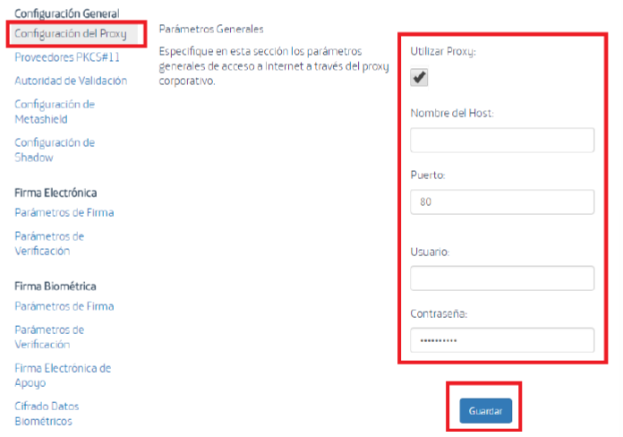
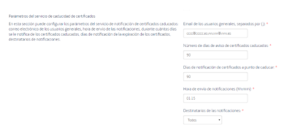
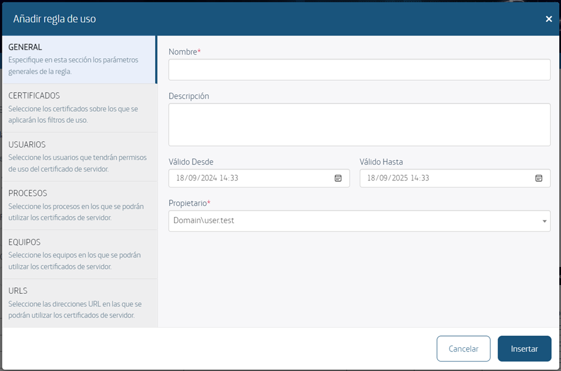
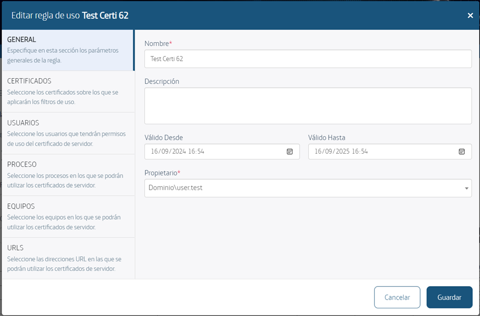
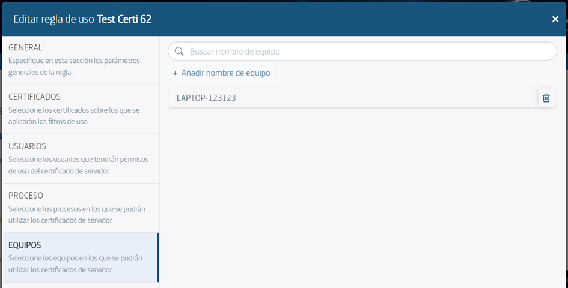

## 1. Introducción

SealSign DSS (Digital Signature Services) es un producto desarrollado íntegramente por Factum Identity dirigido a facilitar la integración de la firma electrónica en las aplicaciones corporativas.

Aunque a priori el procedimiento de firma electrónica es sencillo (calculo y cifrado del hash del documento), 
existen multitud de perfiles/formatos de firma, así como innumerables escenarios que puede resultar complejos y costosos tanto en proceso como en tiempo. Además, muchos de estos perfiles requieren obtener elementos externos al sistema, como CRLs o respuestas OCSP de las entidades certificadoras, sellos de tiempo de terceros, etc. Junto con todo esto, cada vez es más habitual que el documento y la clave privada del firmante están separados en sistemas remotos, por ejemplo, un usuario firmando desde un explorador de Internet un documento residente en el servidor.

Todo ello redunda en que la adopción de los procesos de firma electrónica en las aplicaciones corporativas suponga un problema a la hora de gestionar todos y cada uno de los elementos implicados en el procedimiento. 

SealSign está formado por un motor de firma electrónica que recibe las peticiones de operaciones de firma, a través de diversos servicios web, desde multitud de aplicaciones cliente, realizando las operaciones requeridas según los parámetros generales configurados por el administrador o según los parámetros personalizados que llegan en la petición del cliente.

SealSign DSS soporta multitud de perfiles de firma siendo capaz de acceder a proveedores externos para obtener todos y cada uno de los elementos implicados en cada perfil de manera completamente transparente a la aplicación cliente. La versión actual de SealSign DSS soporta los siguientes formatos de firma: CMS, CAdES, 
XMLDigSig, XAdES, PDF, PAdES, Microsoft Office y OpenOffice.

Una de las ventajas que proporciona SealSign DSS es la firma distribuida, que permite resolver los escenarios planteados de una forma muy flexible y sencilla. La firma distribuida consiste en realizar todo el proceso de firma en el lado del servidor salvo el cifrado del hash que se produce en el lado del cliente, donde reside la clave privada del firmante. De esta forma se unifica y optimiza la obtención de elementos externos y se reduce drásticamente la información intercambiada.

Además de los servicios de firma SealSign DSS proporciona servicios de validación de firma usando una autoridad de validación de certificados (TrustID Revoke Server) que permite obtener el estado de cualquier certificado, conectándose a multitud de proveedores de certificados externos a la organización de una manera centralizada y configurable por el administrador.

Una de las problemáticas en los procesos de firma electrónica es la gestión de los certificados y claves usados para la firma de documentos. Para resolver esto, SealSign DSS proporciona un almacén de certificados y claves dentro de su base de datos de configuración. Además, tanto en los procesos de firma en servidor como en los procesos de firma distribuida en cliente, SealSign DSS es capaz de usar certificados guardados en almacenes externos, tanto en los almacenes de certificados de Windows como en almacenes accesibles a través de módulos PKCS\#11.

Otro de los elementos que forman parte de los procesos de firma electrónica es el uso de sellos de tiempo que aseguran el momento exacto en el que se produce una firma. A la hora de gestionar la generación de sellos de tiempo, SealSign DSS permite tanto la creación de sellos mediante el uso de una autoridad local como la invocación de autoridades de sellado de tiempo externos a la organización.

En la versión 4.3 se incorpora a la solución SealSign OTPSS (One Time Password Signature Services), es un producto desarrollado por Factum Identity dirigido a facilitar la integración de la firma de contraseña única 
(One Time Password Signature) en las aplicaciones corporativas.

Existen distintas problemáticas a la hora del uso de la firma electrónica que impiden su adopción en algunos escenarios. Tales problemáticas van desde el desconocimiento y reticencia de los usuarios a la hora de utilizar un certificado digital hasta la imposibilidad de uso de dispositivos de almacenamiento seguros, tales como tarjetas inteligentes, en ciertos terminales móviles.

También existen problemáticas a la hora del uso de la firma biométrica, como puede ser el uso de un dispositivo capaz de capturar los datos biométricos de una firma manuscrita.

Para la resolución de aquellos escenarios en los que no es fácilmente adaptable el uso de certificados digitales, o el uso de la firma biométrica, SealSign OTPSS provee la tecnología necesaria para el uso de la firma OTP mediante la generación de contraseñas únicas y envío por email o sms.

Por último, SealSign dispone de un servicio de auditoría configurable que permite trazar todas las operaciones de firma, validación y sello de tiempo realizadas por el servidor.

## 2. Tareas De Configuración

### 2.1. Herramienta De Administración

La administración y configuración de SealSign DSS se realiza de manera centralizada mediante la web de administración. Para abrir esta, simplemente será necesario ejecutar una instancia en un navegador hasta la dirección:

 **http://servername:portnumber/SealSignDSSWeb**.

A la hora de ejecutar la herramienta de administración, por defecto, sólo los usuarios miembros del grupo SealSignDSS Admins del servidor pueden administrar la configuración de SealSign. Por tanto, la primera tarea que debe realizar un administrador antes de poder administrar el servidor es añadir las cuentas de usuario adecuadas a dicho grupo.

### 2.2. Configuración De Parámetros Del Proxy Corporativo

Para cumplir con los requisitos de los distintos tipos de firma, el servidor de SealSign DSS puede necesitar comunicación con proveedores externos que proporcionan servicios variados como, por ejemplo, servicios de sellado de tiempo o de validación de certificados. 

Si la comunicación con el exterior se realiza a través de un servidor proxy, será necesario configurar los parámetros del proxy corporativo en la web de administración de SealSign. Para configurarlos parámetros del proxy en el servidor de SealSign, se pueden realizar los siguientes pasos:
1. Abrir la web de administración de SealSign DSS.

2. En la página principal seleccionar el enlace **Configurar parámetros del proxy corporativo** del grupo 

Tareas Relativas a la Configuración General de la Plataforma o bien seleccionar el enlace Configuración del Proxy del menú de la izquierda.

3. Aparecerá la página de parámetros de configuración del proxy. 

4. Pinchando en el campo Utilizar Proxy se habilitarán el resto de los parámetros de la página.

5. Configurar los valores de los campos Nombre del Host y Puerto. En caso de que el proxy sea autenticado se deberá configurar una cuenta de Usuario y una Contraseña.

6. Por último, pulsar el botón Guardar para actualizar la configuración del servidor.

### 2.3. Gestión De Proveedores Pkcs#11

A la hora de acceder a contenedores de certificados externos, SealSign DSS puede utilizar, además de los proveedores de servicios criptográficos (CSPs) instalados en el equipo, otros módulos PKCS\#11 desarrollados por terceros. Para ello, además de la instalación del proveedor en el servidor, es necesario configurar la lista de proveedores PKCS\#11 que debe manejar SealSign DSS.

#### 2.3.1. Consulta De Los Proveedores Pkcs#11 Configurados

Para ver la lista de proveedores PKCS\#11 configurados en el servidor se pueden realizar los siguientes pasos:

1. Abrir la web de administración de SealSign DSS.

2. En la página principal seleccionar el enlace Gestionar el registro de proveedores PKCS\#11 del grupo Tareas Relativas a la Configuración General de la Plataforma o bien seleccionar el enlace Proveedores PKCS\#11 del menú de la izquierda.

3. Aparecerá la lista de todos los proveedores PKCS\#11 configurados en el servidor.

#### 2.3.2. Añadir Un Nuevo Proveedor Pkcs#11

Para añadir un nuevo proveedor PKCS\#11, se pueden realizar los siguientes pasos:

4. En la página principal de la web de Administración seleccionar el enlace Registrar un nuevo proveedor PKCS\#11 del grupo Tareas Relativas a la Configuración General de la Plataforma. Existe también un enlace desde la lista de proveedores PKCS\#11 consultada en el apartado anterior.

5. Especificar los parámetros de configuración del proveedor:
  
  - a. El campo Nombre es un campo obligatorio que sirve de etiqueta para conocer el proveedor que se está tratando.

  - b. El campo Librería es el path completo de la librería de enlace dinámico (DLL) del proveedor PKCS\#11. Para su correcto funcionamiento, es necesario asegurarse de que el proveedor esté correctamente instalado en todos los servidores de SealSign DSS.

6. Pulsar el botón Insertar.

#### 2.3.3. Modificar Un Proveedor Pkcs#11

Para modificar la configuración de un proveedor PKCS\#11 se pueden realizar los siguientes pasos:
1. Acceder a la Lista de Proveedores PKCS\#11, para ello, en la página principal seleccionar el enlace Gestionar el registro de proveedores PKCS\#11 del grupo Tareas Relativas a la Configuración General de la Plataforma o bien seleccionar el enlace Proveedores PKCS\#11 del menú de la izquierda.

2. En la lista de proveedores PKCS\#11 seleccionar el enlace del proveedor que se desea modificar.

3. Realizar las modificaciones deseadas.

4. Pulsar el botón Guardar.

#### 2.3.4. Eliminar Un Proveedor Pkcs#11

Para eliminar un proveedor PKCS\#11 se pueden realizar los siguientes pasos:
1. Acceder a la Lista de Proveedores PKCS\#11, para ello, en la página principal seleccionar el enlace Gestionar el registro de proveedores PKCS\#11 del grupo Tareas Relativas a la Configuración General de la Plataforma o bien seleccionar el enlace Proveedores PKCS\#11 del menú de la izquierda.

2. En la lista de proveedores PKCS\#11, pulsar la Cruz que se encuentra a la izquierda del proveedor que se desee eliminar.

### 2.11. Gestión De Entidades

Se creará una nueva sección en "Entidades" que será desde donde se podrán visualizar, crear y editar nuevas entidades.

En esta sección se podrán crear entidades, estas entidades se les podrá asignar una configuración de uso personalizado, como, por ejemplo, el uso de un certificado de apoyo distinto por entidad. 

Los campos que se mostraran en esta sección son:
- Key 
- Name 
- Description 

Al entrar en este apartado se visualizará un listado de entidades con clave única y una descripción, en caso de haber alguna configuración ya creada. Desde el enlace de "Añadir una nueva entidad" se accederá a la pantalla de creación de entidades donde aparecerán dos parámetros de configuración.

- KEY: tiene que ser único ya que es el identificador que utilizarán los clientes para seleccionar la configuración que deseen utilizar. El máximo de caracteres será 150 y obligatorio.

- Name: campo de texto obligatorio de 150 caracteres.

- Description: campo de texto de 255 caracteres, no será obligatorio.

## 3. Configuración De Parámetros De Firma Electrónica

SealSign DSS permite realizar la configuración de algunos parámetros de firma electrónica de manera general y centralizada. Para configurar estos parámetros el administrador puede realizar los siguientes pasos:
1. Abrir la web de administración de SealSign DSS.

2. En la página principal seleccionar el enlace Gestionar parámetros de firma electrónica del grupo Tareas Relativas a la Firma Electrónica y Verificación o bien seleccionar el enlace Parámetros de Firma del menú de la izquierda.

3. En la página de parámetros de firma se pueden configurar los siguientes valores:
  
- a: Parámetros Generales de Firma:

  i. El campo Comprobar Cadena de Certificación del Certificado Firmante indica si el servidor deberá construir la cadena de certificados correspondiente al certificado de firma recibido, de manera que, si la cadena no es válida y de confianza en el servidor de SealSign, el servidor retornará un error en el proceso de firma.

  ii. El campo Comprobar Estado de Revocación indica si el servidor deberá verificar si el certificado de firma recibido está revocado o no, de manera que, si el certificado está revocado, el servidor retornará un error en el proceso de firma.

  iii. El campo Servidor de Sellado de Tiempo por Defecto permite seleccionar, de la lista de servidores de sellado de tiempo configurados en SealSign, cuál se utilizará en las operaciones de firma que requieran sellos de tiempo.

  iv. El campo Servidor de Backup de Sellado de Tiempo por Defecto permite seleccionar, de la lista de servidores de sellado de tiempo configurados en SealSign, cuál se utilizará en las operaciones de firma que requieran sellos de tiempo en el servidor de BackUp.

- b: Firma De Documentos Xml (Xades):

  i. El campo Añadir Transformación XPath de Eliminación de Firmas indica si el servidor aplicará la plantilla de transformación XPath para la eliminación de firmas previas antes de realizar la firma de un documento XML.

  ii. El campo Firma XAdES-X de Tipo 2 permite configurar que las firmas con el perfil XAdES-X y XAdES-XL cumplan con el tipo 2 del estándar XAdES-X en lugar de ser de tipo 1 (valor por defecto).

- c: Firma de Mensajes CMS (CAdES):
  
  i. El campo Firma CAdES-X de Tipo 2 permite configurar que las firmas con el perfil CAdES-X y CAdES-XL cumplan con el tipo 2 del estándar CAdES-X en lugar de ser de tipo 1 (valor por defecto).

- d: Firma de Documentos PDF (PAdES Basic):
  
  i. El campo Incluir Timestamp permite configurar si se incluir un sello de tiempo a la hora de firmar documentos PDF.

  ii. El campo Incluir Información de Revocación indica si dentro de la firma se incluirán 

  las CRLs o respuestas OCSPs relacionadas con los certificados involucrados en el proceso.

  iii. El campo Visualizar Widget de Firma indica si el documento PDF resultante tras la firma mostrará el visualizador (Widget) de firma con la información de la misma.

  iv. El campo Posicionar Widget Automáticamente indica si el visualizador de firma se posiciona automáticamente o si se deben utilizar los valores configurados en los 2 siguientes campos. Si el Widget se posiciona automáticamente aparecerá en la esquina superior derecha del documento PDF resultante.

  v. El campo Posición del Widget - Coordenada X permite configurar la coordenada X 
  de la posición del Widget en pixels desde el ángulo inferior izquierdo de la página. 

  vi. El campo Posición del Widget - Coordenada Y permite configurar la coordenada Y 
  de la posición del Widget en pixels desde el ángulo inferior izquierdo de la página. 

  vii. El campo Tamaño Automático del Widget indica si el visualizador de firma se redimensionará automáticamente o si se deben utilizar los valores configurados en los 2 siguientes campos. 

  viii. El campo Alto del Widget permite configurar, en pixels, la altura del visualizador de firma.

  ix. El campo Ancho del Widget permite configurar, en pixels, la anchura del visualizador de firma.

  x. El campo Rotación del Widget permite seleccionar el ángulo de rotación del visualizador de firma. Los posibles valores son 0º, 90º, 180º y 270º.

  xi. El campo Incluir Widget en Todas las Páginas indica si el visualizador de firma se mostrará en todas las páginas del documento.

  xii. El campo Incluir Widget Sólo en la Página Número indica el número de la página en la que se mostrará el visualizador de firma.

  xiii. El campo Incluir Imagen de Fondo permite configurar la inclusión de una imagen en el Widget de firma.

  xiv. El campo Imagen de Fondo permite seleccionar un fichero con la imagen que se mostrará como fondo del Widget. Es importante mencionar que el fichero debe estar en formato JPEG 2000 y que un fichero JPEG normal no es válido como imagen de fondo.

  xv. El campo Alto de la Imagen permite configurar, en pixels, la altura que tiene la imagen seleccionada en el campo anterior.

  xvi. El campo Ancho de la Imagen permite configurar, en pixels, la anchura que tiene la imagen seleccionada en el campo Imagen de Fondo.

  xvii. El campo Autoajustar Imagen indica si la imagen de fondo se estirará para cubrir el ancho del visualizador de firma 
  

4. Por último, pulsar el botón Guardar para actualizar la configuración del servidor.

### 3.1.Configuración De Parámetros De Verificación De Firma Electrónica

SealSign DSS permite realizar la configuración de algunos parámetros que regirán el proceso de verificación de firma electrónica. Dicha configuración se realiza mediante los siguientes pasos:
1. Abrir la web de administración de SealSign DSS.

2. En la página principal seleccionar el enlace Gestionar parámetros de verificación de firma electrónica del grupo Tareas Relativas a la Firma Electrónica y Verificación o bien seleccionar el enlace Parámetros de Verificación del menú de la izquierda.

3. En la página de parámetros de verificación firma se pueden configurar los siguientes valores:

    a. El campo Comprobar Cadena de Certificación del Certificado Firmante indica si el servidor deberá construir la cadena de certificados correspondiente al certificado de firma, de manera que, si la cadena no es válida y de confianza en el servidor de SealSign, el servidor retornará un error en el proceso de verificación.

    b. El campo Comprobar Estado de Revocación indica si el servidor deberá verificar si el certificado de firma está revocado o no, de manera que, si el certificado está revocado, el servidor retornará un error en el proceso de verificación.

    c. El campo Incluir información extendida de los sellos de tiempo indica si en la respuesta del proceso de verificación se incluirá la información correspondiente a cada uno de los sellos de tiempo y sus firmas.

    d. El campo Incluir únicamente firmas de tipo documento en los archivos PDF indica si el proceso de verificación de documentos PDF deberá incluir todas las firmas extendidas (por ejemplo, las firmas de cifrado de PDF) o solamente las firmas de tipo documento (las de usuario). 

4. Por último, pulsar el botón Guardar para actualizar la configuración del servidor.

## 4. Configuración De Parámetros De Firma Biométrica

SealSign BSS permite realizar la configuración de algunos parámetros de firma manuscrita de manera general y centralizada. Para configurar estos parámetros el administrador puede realizar los siguientes pasos:
1. Abrir la web de administración de SealSign.

2. En la página principal seleccionar el enlace Gestionar parámetros de firma biométrica del grupo Tareas Relativas a la Firma Biométrica y Verificación o bien seleccionar el enlace Parámetros de Firma del apartado Firma Biométrica del menú de la izquierda.

3. En la página de parámetros de firma se pueden configurar los siguientes valores:

    a. Parámetros Generales de Firma:
    
    i. El campo Verificar Identidad Biométrica del Firmante indica si el servidor deberá verificar los datos biométricos de la firma antes de incluirlos en el documento a firmar.

    ii. El campo Incluir Timestamp indica si el servidor deberá añadir un sello de tiempo a la firma biométrica.

    b. Representación Gráfica de la Firma:
    i. El campo Visualizar Widget de Firma indica si el documento resultante tras la firma mostrará el visualizador (Widget) de firma con la información de esta.

    ii. El campo Incluir Hash del Documento Como Marca de Agua indica si en el documento resultante se mostrará el hash como marca de agua en el visualizador de firma.

    iii. El campo Posición del Widget - Coordenada X permite configurar la coordenada X 
    de la posición del Widget en píxeles desde el ángulo inferior izquierdo de la página. 

    iv. El campo Posición del Widget - Coordenada Y permite configurar la coordenada Y 
    de la posición del Widget en pixeles desde el ángulo inferior izquierdo de la página. 

    v. El campo Tamaño Automático del Widget indica si el visualizador de firma se redimensionará automáticamente o si se deben utilizar los valores configurados en los 2 siguientes campos. 

    vi. El campo Alto del Widget permite configurar, en píxeles, la altura del visualizador de firma.

    vii. El campo Ancho del Widget permite configurar, en píxeles, la anchura del visualizador de firma.

    viii. El campo Rotación del Widget permite seleccionar el ángulo de rotación del visualizador de firma. Los posibles valores son 0º, 90º, 180º y 270º.

    ix. El campo Incluir Widget en Todas las Páginas indica si el visualizador de firma se mostrará en todas las páginas del documento.

    x. El campo Incluir Widget Sólo en la Página Número indica el número de la página en la que se mostrará el visualizador de firma.

    xi. El campo En la última página indica si se ha de añadir el Widget únicamente en la última página.

    xii. El campo Offset sobre la página (positivo o negativo).

4. Por último, pulsar el botón Guardar para actualizar la configuración del servidor.

### 4.1. Configuración De Parámetros De Verificación De Firma Biométrica

SealSign BSS permite realizar la configuración de algunos parámetros que regirán el proceso de verificación de la firma biométrica. Para configurar estos parámetros el administrador puede realizar los siguientes pasos:
1. Abrir la web de administración de SealSign.

2. En la página principal seleccionar el enlace Gestionar parámetros de verificación de firma biométrica del grupo Tareas Relativas a la Firma Biométrica y Verificación o bien seleccionar el enlace Parámetros de Verificación del apartado Firma Biométrica del menú de la izquierda.

3. En la página de parámetros de verificación firma se pueden configurar los siguientes valores:

    a. El campo Umbral de Reconocimiento Positivo indica cual es el rango que debe aplicar el servidor a la hora de validar una firma biométrica como firma válida.

    b. El campo Umbral de Score Personalizado (Formato 0.00) permite incluir un valor personalizado para el Score aplicable, fuera de los valores establecidos por defecto en el campo anterior.

    c. El campo Incluir Información de Firma Electrónica xxxxx.

4. Por último, pulsar el botón Guardar para actualizar la configuración del servidor.

### 4.2.Configuración De La Firma Electrónica De Apoyo

Dentro de las funcionalidades provistas por SealSign BSS está la posibilidad de añadir una firma electrónica en el servidor para asegurar que los datos biométricos son válidos y no se modifican tras la firma.

Es necesario indicar que el certificado configurado será utilizado para cifrar los datos biométricos almacenados, por esta razón, es importante que el certificado utilizado para la firma de apoyo tenga una longitud de clave que permita salvaguardar los datos biométricos la mayor cantidad de tiempo.

Para configurar estos parámetros el administrador puede realizar los siguientes pasos:
1. Abrir la web de administración de SealSign.

2. En la página principal seleccionar el enlace Gestionar parámetros de firma electrónica de apoyo a la firma biométrica del grupo Tareas Relativas a la Firma Biométrica y Verificación o bien seleccionar el enlace Firma Electrónica de Apoyo del apartado Firma Biométrica del menú de la izquierda.

3. En la página de parámetros generales de firma se pueden configurar los siguientes valores:

    a. El campo Incluir Firma Electrónica en el Documento activa la generación de la firma electrónica de apoyo en el documento.

    b. El campo Usar Certificado Para Cifrar Datos Biométricos indica si se utilizará el certificado, no solo para firmar el documento sino también para cifrar los datos biométricos incluidos en él.

    c. El campo Usar Imagen Biométrica Como Fondo de Firma en Formatos Soportados permite utilizar el grafo de la firma manuscrita como fondo de imagen de la firma electrónica.

    d. El campo Tipo de Firma Electrónica indica cuál es el tipo de firma electrónica que se añadirá al documento.

    i. Enveloped ii. Enveloping iii. Detached iv. DetachedInternal e. El campo Algoritmo de Función Resumen (Hash) indica cuál es el tipo de hash que se generará para la firma electrónica de apoyo.

    f. El campo Certificado de Servidor de Firma permite seleccionar el certificado de servidor con el que se realizará la firma electrónica de apoyo. Este certificado deberá haber sido añadido previamente al repositorio central de certificados de SealSign DSS.

4. Por último, pulsar el botón Guardar para actualizar la configuración del servidor.

### 4.3.Configuración Del Cifrado De Datos Biométricos

A la hora de asegurar los datos biométricos incluidos en un documento, SealSign BSS permite la posibilidad de configurar un certificado emitido por la propia organización o por un tercero de confianza cuya clave pública sea utilizada para cifrar dicha información biométrica. De este modo, la información biométrica se cifrará tanto con el certificado de firma electrónica de apoyo (si se configuró esta posibilidad) como con este nuevo certificado.

Para configurar el certificado de cifrado de datos biométricos, el administrador debe realizar los siguientes pasos:

1. Abrir la web de administración de SealSign.

2. Seleccionar el enlace Cifrado de Datos Biométricos del apartado Firma Biométrica del menú de la izquierda.

3. Habilitar el campo Incluir Certificado de Tercero de Confianza.

4. Pulsar el botón Importar. 

5. En la página de selección de fichero, buscar el fichero con el certificado en cuestión y añadir la información de contacto del certificado 

6. Pulsar el botón Importar.

### 4.4.Configuración Personalizada

Las configuraciones de los parámetros predeterminados de la firma electrónica de respaldo de la firma biométrica. La sección de configuración personalizada permite la individualización de los parámetros de firma para distintas casuísticas.

#### 4.4.1 Parámetros de firma para entidades

Contiene el listado de las entidades con la clave compartida con el cliente para la selección de las configuraciones. Dichos registros tienen un campo identificador, nombre, descripción y certificados asignados para cifrado y firma de apoyo.

A través de esta pantalla podemos acceder a las siguientes acciones para la parametrización de las firmas:

- Firma electrónica de apoyo por defecto: Desde aquí podemos crear la configuración que toman como predefinida todas las solicitudes en el sistema. Cuando la petición no lleva consigo explícitamente la identificación de una configuración determinada toma esta.

- Nueva configuración: Desde este panel podemos crear nuevas configuraciones para distintas casuísticas de firma. Cualquier solicitud enviada con el identificador de la configuración creada toma los parámetros de esta.

- Actualizar lista: Refresca los resultados de la tabla. 

- Eliminar configuración: Mediante la x presente en la primera columna de toda entrada en la tabla podemos eliminar la configuración creada.

- Modificar configuración: Cada identificador de la columna Clave nos permite pinchar y acceder al panel de modificación de la configuración creada.

- Búsqueda: Filtrado de la tabla con criterio de búsqueda por nombre o clave de identidad.

#### 4.4.2. Creación de Entidad de configuración

1. Abrir la web de administración de SealSign.

2. En la página principal seleccionar el enlace Configuración personalizada de firma del grupo Tareas Relativas a la Firma Biométrica o bien seleccionar el enlace Configuración personalizada Firma Biométrica del menú de la izquierda.

3. En la página de Crear Configuración personalizada de firma se pueden configurar los siguientes valores:

    a. Clave de entidad: Selección de la clave de las Entidades previamente configuradas.

    b. Certificado para la firma de apoyo: Certificado asignado a hacer la firma de apoyo para las firmas biométricas. Certificado para la configuración, debe ser seleccionado uno de los dos que hay. En caso de no seleccionarse ninguno se usará el certificado por defecto. 

    c. Algoritmo de Función Resumen (Hash):

    i. RIPEMD160 ii. MD5 iii. SHA1 iv. SHA256 v. SHA382 vi. SHA512 vii. SSL3

    d. Tipo De Firma Electrónica:

    i. Enveloped ii. Enveloping iii. Detached iv. DetachedInternal e. Usar Certificado Para Cifrar Datos de firma biométrica: Selección que indica si queremos que este mismo certificado se use para el cifrado de los datos.

    f. Certificado para el cifrado de datos biométrico: Selección de un certificado distinto para el cifrado de los metadatos de la firma biométrica.

4. Por último, pulsar el botón Guardar para actualizar la configuración.

#### 4.4.3. Configuración por defecto

Este apartado brinda la posibilidad de crear una configuración para las firmas que se aplica a todas aquellas que no especifiquen lo contrario dentro de la petición de la solicitud.

1. Abrir la web de administración de SealSign.

2. En la página principal seleccionar el enlace Configuración personalizada de firma del grupo Tareas Relativas a la Firma Biométrica o bien seleccionar el enlace Configuración personalizada Firma Biométrica del menú de la izquierda.

3. En la página de Crear Configuración por defecto de firma se pueden configurar los siguientes valores:

    a. Incluir Firma Electrónica en el Documento: Activa la generación de la firma electrónica de apoyo en el documento.

    b. Usar Certificado Para Cifrar Datos Biometricos: Indica si se utilizará el certificado, no solo para firmar el documento sino también para cifrar los datos biométricos incluidos en él.

    c. Tipo de Firma Electrónica: 
    i. Enveloped ii. Enveloping iii. Detached iv. DetachedInternal e. Algoritmo de Función Resumen (Hash): 
    i. RIPEMD160 ii. MD5 iii. SHA1 iv. SHA256 v. SHA382 vi. SHA512 vii. SSL3 f. Certificado de Servidor de Firma: Selección del certificado para la configuración por defecto de las solicitudes.

4. Por último, pulsar el botón Guardar para crear o actualizar la configuración.

## 5. Configuración De Parámetros De Firma Otp

SealSign OTPSS permite realizar la configuración de algunos parámetros de la firma de contraseña única de manera general y centralizada. Para configurar estos parámetros el administrador puede realizar los siguientes pasos:

1. Abrir la web de administración de SealSign.

2. En la página principal seleccionar el enlace Parámetros de Firma del apartado Firma OTP del menú de la izquierda.

3. En la página de parámetros de firma se pueden configurar los siguientes valores:

    a. Parámetros Generales de Firma:
    i. El campo Incluir Proveedor remoto de código OTP indica si el código OTP se va a generar mediante un proveedor remoto o, por el contrario, lo va a generar la propia plataforma.

    ii. El campo Tipo de envío indica el método de envío del código OTP. Se puede elegir entre ninguno, email o SMS.

    iii. El campo Tiempo de expiración indica el tiempo de vida, en segundos, de un código OTP una vez generado.

    iv. El campo Longitud del código indica la longitud de los códigos OTP que se generen desde la plataforma.

    v. El campo Algoritmo de Generación de Código indica que algoritmo se utilizará para generar el código OTP. Se puede seleccionar entre SHA1, SHA256, SHA512.

    vi. EL campo Intentos de verificación permitidos indica el número máximo permitido de verificaciones que se pueden ejecutar sobre el código One Time Password.

    b. Representación Gráfica de la Firma:
    i. El campo Visualizar Widget de Firma indica si el documento resultante tras la firma mostrará el visualizador (Widget) de firma con la información de esta.

    ii. El campo Texto del widget indica el texto que se incluirá como imagen en el widget de firma.

    iii. El campo Incluir Hash del Documento Como Marca de Agua indica si en el documento resultante se mostrará el hash como marca de agua en el visualizador de firma.

    iv. El campo Posición del Widget - Coordenada X permite configurar la coordenada X 
    de la posición del Widget en píxeles desde el ángulo inferior izquierdo de la página. 

    v. El campo Posición del Widget - Coordenada Y permite configurar la coordenada Y 
    de la posición del Widget en pixeles desde el ángulo inferior izquierdo de la página. 

    vi. El campo Tamaño Automático del Widget indica si el visualizador de firma se redimensionará automáticamente o si se deben utilizar los valores configurados en los 2 siguientes campos. 

    vii. El campo Alto del Widget permite configurar, en píxeles, la altura del visualizador de firma.

    viii. El campo Ancho del Widget permite configurar, en píxeles, la anchura del visualizador de firma.

    ix. El campo Rotación del Widget permite seleccionar el ángulo de rotación del visualizador de firma. Los posibles valores son 0º, 90º, 180º y 270º.

    x. El campo Incluir Widget en Todas las Páginas indica si el visualizador de firma se mostrará en todas las páginas del documento.

    xi. El campo Incluir Widget Sólo en la Página Número indica el número de la página en la que se mostrará el visualizador de firma.

    xii. El campo En la última página indica si se ha de añadir el Widget únicamente en la última página.

    xiii. El campo Offset sobre la página (positivo o negativo).

4. Por último, pulsar el botón Guardar para actualizar la configuración del servidor.

### 5.1.Configuración De La Firma Electrónica De Apoyo

Dentro de las funcionalidades provistas por SealSign OTPSS está la posibilidad de añadir una firma electrónica en el servidor para asegurar que los datos son válidos y no se modifican tras la firma.

Es necesario indicar que el certificado configurado será utilizado para cifrar los datos del firmante almacenados, por esta razón, es importante que el certificado utilizado para la firma de apoyo tenga una longitud de clave que permita salvaguardar los datos biométricos la mayor cantidad de tiempo.

Para configurar estos parámetros el administrador puede realizar los siguientes pasos:

1. Abrir la web de administración de SealSign.

2. En la página principal seleccionar el enlace Firma Electrónica de Apoyo del apartado Firma OTP del menú de la izquierda.

3. En la página de parámetros generales de firma se pueden configurar los siguientes valores:

    a. El campo Usar Certificado Para Cifrar Datos Biométricos indica si se utilizará el certificado, no solo para firmar el documento sino también para cifrar los datos biométricos incluidos en él.

    b. El campo Tipo de Firma Electrónica indica cuál es el tipo de firma electrónica que se añadirá al documento.

    i. Enveloped
    ii. Enveloping
    iii. Detached      
    iv. DetachedInternal

    c. El campo Algoritmo de Función Resumen (Hash) indica cuál es el tipo de hash que se generará para la firma electrónica de apoyo.

    d. El campo Certificado de Servidor de Firma permite seleccionar el certificado de servidor con el que se realizará la firma electrónica de apoyo. Este certificado deberá haber sido añadido previamente al repositorio central de certificados de SealSign DSS.

4. Por último, pulsar el botón Guardar para actualizar la configuración del servidor.

### 5.2.Configuración Del Cifrado De Metadatos

A la hora de asegurar los datos del firmante incluidos en un documento, SealSign OTPSS permite la posibilidad de configurar un certificado emitido por la propia organización o por un tercero de confianza cuya clave pública sea utilizada para cifrar dicha información biométrica. De este modo, la información se cifrará tanto con el certificado de firma electrónica de apoyo (si se configuró esta posibilidad) como con este nuevo certificado.

Para configurar el certificado de cifrado de metadatos, el administrador debe realizar los siguientes pasos:
1. Abrir la web de administración de SealSign. 

2. Seleccionar el enlace Cifrado de metadatos del apartado Firma OTP del menú de la izquierda.

3. Habilitar el campo Incluir Certificado de Tercero de Confianza.

4. Pulsar el botón Importar. 

5. En la página de selección de fichero, buscar el fichero con el certificado en cuestión y añadir la información de contacto del certificado 
6. Pulsar el botón Importar.

### 5.3.Configuración Personalizada

Las configuraciones de los parámetros predeterminados de la firma electrónica de respaldo de la firma OTP.

La sección de configuración personalizada permite la individualización de los parámetros de firma para distintas casuísticas.

### 5.3.1. Parámetros de firma para entidades

Contiene el listado de las entidades con la clave compartida con el cliente para la selección de las configuraciones. Dichos registros tienen un campo identificador, nombre, descripción y certificados asignados para cifrado y firma de apoyo.

A través de esta pantalla podemos acceder a las siguientes acciones para la parametrización de las firmas:

- Firma electrónica de apoyo por defecto: Desde aquí podemos crear la configuración que toman como predefinida todas las solicitudes en el sistema. Cuando la petición no lleva consigo explícitamente la identificación de una configuración determinada toma esta.

- Nueva configuración: Desde este panel podemos crear nuevas configuraciones para distintas casuísticas de firma. Cualquier solicitud enviada con el identificador de la configuración creada toma los parámetros de esta.

- Actualizar lista: Refresca los resultados de la tabla. 

- Eliminar configuración: Mediante la x presente en la primera columna de toda entrada en la tabla podemos eliminar la configuración creada.

- Modificar configuración: Cada identificador de la columna Clave nos permite pinchar y acceder al panel de modificación de la configuración creada.

- Búsqueda: Filtrado de la tabla con criterio de búsqueda por nombre o clave de identidad.

### 5.3.2. Creación de Entidad de configuración

1. Abrir la web de administración de SealSign. 

2. En la página principal seleccionar el enlace Configuración personalizada de firma del grupo Tareas Relativas a la Firma OTP o bien seleccionar el enlace Configuración personalizada Firma OTP del menú de la izquierda.

3. En la página de Crear Configuración personalizada de firma se pueden configurar los siguientes valores:

    a. Clave de entidad: Selección de la clave de las Entidades previamente configuradas.

    b. Certificado para la firma de apoyo: Certificado asignado a hacer la firma de apoyo para las firmas OTP. Certificado para la configuración, debe ser seleccionado uno de los dos que hay. 

    En caso de no seleccionarse ninguno se usará el certificado por defecto. 

    c. Algoritmo de Función Resumen (Hash): 
    i. RIPEMD160 ii. MD5 iii. SHA1 iv. SHA256 v. SHA382 vi. SHA512 vii. SSL3 

    d. Tipo de Firma Electrónica: 
    i. Enveloped ii. Enveloping iii. Detached iv. DetachedInternal 

    e. Usar Certificado Para Cifrar Datos de firma OTP: Selección que indica si queremos que este mismo certificado se use para el cifrado de los datos.

    f. Certificado One Time Password para el cifrado de metadatos: Selección de un certificado distinto para el cifrado de los metadatos de la firma OTP.

4. Por último, pulsar el botón Guardar para actualizar la configuración.

### 5.3.3. Configuración por defecto

Este apartado brinda la posibilidad de crear una configuración para las firmas que se aplica a todas aquellas que no especifiquen lo contrario dentro de la petición de la solicitud.

1. Abrir la web de administración de SealSign.

2. En la página principal seleccionar el enlace Configuración personalizada de firma del grupo Tareas Relativas a la Firma OTP o bien seleccionar el enlace Configuración personalizada Firma OTP del menú de la izquierda.

3. En la página de Crear Configuración por defecto de firma se pueden configurar los siguientes valores:

    a. Usar Certificado Para Cifrar Datos de firma OTP: Indicamos si el certificado por defecto se usa también para cifrar los datos de la firma OTP.

    b. Usar Imagen Biométrica Como Fondo de Firma en Formatos Soportados: Permite utilizar el grafo de la firma manuscrita como fondo de imagen de la firma electrónica.

    c. Tipo de Firma Electrónica: 
    i. Enveloped ii. Enveloping iii. Detached iv. DetachedInternal 
    
    d. Algoritmo de Función Resumen (Hash): 
    i. RIPEMD160 ii. MD5 iii. SHA1 iv. SHA256 v. SHA382 vi. SHA512 vii. SSL3 
    
    e. Certificado de Servidor de Firma: Selección del certificado para la configuración por defecto de las solicitudes.

4. Por último, pulsar el botón Guardar para crear o actualizar la configuración.

## 6. Gestión De Claves Centralizadas

Dentro de las funcionalidades provistas por SealSign DSS está la posibilidad de realizar firma electrónica de documentos con certificados almacenados en el servidor. Los certificados de servidor de SealSign DSS pueden residir dentro de la plataforma de firma o referenciar almacenes externos Windows y PKCS\#11. El administrador deberá configurar qué certificados de servidor van a poderse usar y quién va a tener acceso a cada uno de ellos para las operaciones de firma realizadas por la plataforma.

### 6.1.Gestión De Certificados De Servidor

En este menú de la administración se pueden añadir las referencias a certificados tanto internos como externos que posteriormente estarán disponibles para la creación de Reglas de Uso en los mismos.

#### 6.1.1. Consulta De La Lista De Certificados De Servidor

Para ver la lista de los certificados de servidor disponibles se pueden realizar los siguientes pasos:

1. Abrir la web de administración de SealSign DSS.

2. En la página principal seleccionar el enlace Gestionar certificados de servidor del grupo Tareas Relativas a Certificados de Servidor o bien seleccionar el enlace Certificados de Servidor del menú de la izquierda llamado Claves Centralizadas.

3. Aparecerá la lista de todos los certificados de servidor que podrán ser utilizados en los procesos de firma.

**Certificados Caducados:** En el listado, los certificados caducados aparecerán resaltados en rojo, con la fecha de caducidad en un rojo intenso para facilitar su identificación.

**Icono de Bloqueo: **En el borde lateral izquierdo, aparecerá un ícono de un candado que indicará si el certificado tiene el check de bloqueo activado.

**Acciones sobre los Certificados:** En el listado de certificados, las acciones disponibles ahora están agrupadas en un solo botón. Al presionarlo, se mostrará un menú con las siguientes opciones:

  -	Reglas de Uso: Esta opción redirecciona a la sección de reglas de uso, donde se muestra el listado de reglas de uso asociadas a ese certificado.
  
  -	Registro de Auditoría: Esta opción redirecciona a la sección de registros de auditoría, donde se muestra un listado con todas las acciones realizadas con ese certificado.
  
  -	Descargar Clave Pública: Esta opción permite descargar la clave pública del certificado.

  -	Borrar Certificado: Esta opción permite eliminar el certificado de la plataforma.

#### 6.1.2. Añadir Un Nuevo Certificado De Servidor

Para añadir un nuevo certificado de servidor a la lista, se pueden realizar los siguientes pasos:

1. En la página principal de la web de Administración se deberá seleccionar el enlace Importar un nuevo certificado de servidor del grupo Tareas Relativas a Certificados de Servidor. Existe también un enlace desde la lista de certificados de servidor consultada en el apartado anterior.

2. En la página de certificados de servidor configurar los siguientes valores:

    a. El campo Fichero permite seleccionar el fichero .pfx que contiene el certificado que será importado dentro del almacén de certificados de SealSign.

    b. En el campo Contraseña deberá indicarse la contraseña que tiene el fichero seleccionado en el campo anterior.

    c. En el valor Recordar Contraseña se especificará si el servidor deberá almacenar la contraseña de este fichero para no volver a requerirla cuando se vaya a usar el certificado o si, por el contrario, se requerirá al usuario que proporcione esta contraseña cada vez.

    d. El campo Nombre Descriptivo permite, opcionalmente, indicar una descripción más extensa del certificado.

    e. El campo Administrado Únicamente por el Propietario permite al propietario del certificado restringir la gestión y uso del certificado únicamente a su usuario de Windows. De esta forma, ningún otro usuario ni administrador del sistema podrán hacer uso del mismo.

    f. El campo Propietario indica el nombre de la cuenta de usuario de Windows que actuará como propietario del nuevo certificado y que, por tanto, tendrá acceso al mismo. Además del propietario es posible crear delegados que también podrán hacer uso de este certificado. La creación de delegados se realiza modificando la configuración del certificado de servidor tras añadirlo por primera vez.

    g. En el valor Requerir Contraseña SealSign se puede forzar la necesidad de crear una contraseña específica de SealSign necesaria cada vez que se vaya a usar el certificado dentro de la plataforma.

    h. El campo Contraseña SealSign se configurará la contraseña comentada en el campo anterior.

3. Pulsando el botón Importar el certificado quedará guardado dentro del almacén de certificados de SealSign.

#### 6.1.3. Añadir Una Referencia A Un Certificado Externo De Servidor

Cuando el certificado esté almacenado en un lugar externo al almacén de certificados servidor de SealSign, será necesario añadir una referencia al mismo en la configuración de los certificados de servidor. Para ello se deberán realizar los siguientes pasos:

1. En la página principal de la web de Administración seleccionar el enlace Añadir una referencia a un certificado externo de servidor del grupo Tareas Relativas a Certificados de Servidor. Existe también un enlace desde la lista de certificados de servidor consultada en el apartado anterior.

2. En la página de referencias de certificados de servidor configurar los siguientes valores:

    a. En el campo Tipo de Almacén se seleccionará que tipo de almacén contiene el certificado. En concreto se puede seleccionar entre los valores:

    i. WindowsStore para certificados guardados en el almacén de certificados del usuario actual de Windows.

    ii. WindowsSystemStore para certificados guardados en el almacén de certificados de equipo del servidor de SealSign.

    iii. PKCS11Store para certificados guardados en almacenes externos accesibles mediante un módulo PCKS\#11.

    b. Tras seleccionar el tipo de almacén, se deberá pulsar el botón Seleccionar Certificado. 

    Aparecerá una ventana que o bien mostrará los certificados disponibles (WindowsStore y WindowsSystemStore) o bien solicitará la selección del Proveedor PKCS\#11, el Slot y la Contraseña para acceso al certificado (PKCS11Store).

    c. Una vez seleccionado el certificado, la página mostrará el Asunto, Número de Serie, Entidad Emisora, Fechas de Validez y si hay una Contraseña Requerida por el Almacén.

    d. El campo Nombre Descriptivo permite, opcionalmente, indicar una descripción más extensa del certificado.

    e. El campo Propietario indica el nombre de la cuenta de usuario de Windows que actuará como propietario del nuevo certificado y que, por tanto, tendrá acceso al mismo. Además del propietario es posible crear delegados que también podrán hacer uso de este certificado. La creación de delegados se realiza modificando la configuración del certificado de servidor tras añadirlo por primera vez.

    f. En el valor Recordar Contraseña se especificará si el servidor deberá almacenar la contraseña de este certificado para no volver a requerirla cuando se vaya a usar o si, por el contrario, se requerirá al usuario que proporcione esta contraseña cada vez.

    g. En el campo Contraseña deberá indicarse la contraseña que tiene el certificado seleccionado.

    h. En el valor Requerir Contraseña SealSign se puede forzar la necesidad de crear una contraseña específica de SealSign necesaria cada vez que se vaya a usar el certificado dentro de la plataforma.

    i. El campo Contraseña SealSign se configurará la contraseña comentada en el campo anterior.

3. Pulsando el botón Insertar el certificado quedará guardado dentro del almacén de certificados de SealSign.

#### 6.1.4. Sealsign Certificates Expiration Service. Configuración Smtp

Esta configuración es necesaria para utilizar el servicio de Windows SealSign Certificates Expiration Service.

El servicio permite de forma automática enviar diariamente un listado por correo de todos los certificados caducados y a punto de caducar de todos los usuarios, así como enviar un listado a cada usuario con sus certificados a punto de caducar. 

Se lleva a cabo desde la web de administración de SealSign:

La configuración está dividida en 2 partes. Los parámetros del envío de correos a través de SMTP y los parámetros de expiración de certificados.

CONFIGURACION DEL SERVIDOR **SMTP**

- Email para configurar la cuenta SMTP: Email para configurar la cuenta SMTP. 

- Contraseña de la cuenta SMTP: Contraseña del correo de configuración SMTP. 

- Dirección del servidor SMTP de la cuenta configurada: Servidor SMTP de la cuenta configurada. - Puerto SMTP: Puerto de servidor SMTP. 

- Email que aparece como remitente: Email que aparecerá como remitente. 

- Nombre que se mostrará en el remitente: Nombre que se mostrará en el remitente. 

- TLS/SSL: Si la cuenta SMTP utiliza esta configuración. 

**PARÁMETROS DEL SERVICIO DE CADUCIDAD DE CERTIFICADOS**

- Emails de los usuarios generales, separados por (;): Listado de los correos a los cuales se les enviará diariamente el listado de todos los certificados caducados y a punto de caducar de todos los usuarios. 
Los correos de este listado deben ir separados por punto y coma. 

- Número de días de aviso de certificados caducados: Tiempo en días, anterior a la fecha actual en el que se notificará de la existencia de un certificado caducado. Si un certificado lleva caducado más tiempo que el configurado en este campo, se dejará de informar de su caducidad. 

- Días de notificación de certificados a punto de caducar: Tiempo en días, posterior a la fecha actual en el que se notificará de la existencia de un certificado a punto de caducar. 

- Hora de envío de notificaciones (hh:mm): Es momento en el que se ejecutará el servicio de envío de email. Debe tener el siguiente formato hh:mm. 

- Destinatarios de las notificaciones: Configuración de los usuarios a los que se les enviará por correo la información de los certificados caducados y a punto de caducar. 

  - Ninguno: A nadie.

  - Usuarios de los certificados: Envío de notificaciones de los certificados a punto de caducar a los usuarios de los certificados. 

  - Usuarios generales: Envío de notificaciones de los certificados caducados y a punto de caducar a los usuarios configurados en "Emails de los usuarios generales separados por (;)". 

  - Todos: Tanto a los usuarios de los certificados como a los usuarios generales. 

Después de modificar la configuración es recomendable reiniciar el servicio SealSign Certificates Expiration Service.

**PARÁMETROS DEL SERVICIO DE USO DE CERTIFICADOS**

•	Destinatarios de las notificaciones, separados por (;): Listado de los correos a los cuales se les enviará diariamente el listado de todos los certificados que se han usado para firmar con certificado electrónico. Los correos de este listado deben ir separados por punto y coma.

•	Periodo de envío de notificaciones: Periodo para recuperar el listado de certificados utilizados para firmar. Los periodos disponibles son: diario, semanal y mensual. Al seleccionar un periodo, el listado de certificados que se enviará por correo electrónico corresponderá al periodo anterior, no al actual. Por ejemplo, si se selecciona el periodo diario, el listado de certificados enviado será el del día anterior. Si se selecciona el periodo semanal, el listado será el de la semana anterior, y así sucesivamente.

NOTA: Las notificaciones semanales se llevarán a cabo cada lunes, y las mensuales cada primero de mes.

•	Hora de envío de notificaciones (hh:mm): Horario en el que se ejecutará el servicio de notificaciones. Debe tener el siguiente formato hh:mm.

#### 6.1.5. Modificar Un Certificado De Servidor

Para modificar la configuración de un proveedor PKCS\#11 se pueden realizar los siguientes pasos:
1. Acceder a los certificados de servidor, para ello, en la página principal seleccionar el enlace Gestionar certificados de servidor del grupo Tareas Relativas a Certificados de Servidor o bien seleccionar el enlace Certificados de Servidor del menú de la izquierda.

2. En la lista de certificados de servidor seleccionar el enlace del certificado que se desea modificar.

3. Pulsando el botón Guardar se actualizará la configuración del certificado en el servidor.

**NUEVAS FUNCIONES DEL CERTIFICADO A MODIFICAR UN CERTIFICADO DE SERVIDOR**

Una vez hemos añadido un certificado en el servidor, el administrador realizar dos operaciones adicionales:

1. Cambiar la contraseña al certificado, pero para ello tiene que conocer la antigua.

2. Y puede bloquear el certificado para que no se pueda utilizar. 

3. Pulsando el botón Guardar se actualizará la configuración del certificado en el servidor.

**OPERACIONES SOBRE EL CERTIFICADO DE UN USUARIO**

La administración y configuración del certificado de usuario por parte de SealSign DSS se realiza de manera centralizada mediante la web de usuario. Para abrir esta, simplemente será necesario ejecutar una instancia en un navegador hasta la dirección http://servername.portnumber/SealSignDSSWeb/users/ y se pedirá usuario/contraseña para poder acceder a la web de administración del usuario y sus certificados.

Una vez dentro de la web del usuario, él puede realizar diferentes operaciones:

#### 6.1.6. Consulta de la lista de Certificados de Servidor

Para ver la lista de los certificados de servidor disponibles se pueden realizar los siguientes pasos:

1.	Abrir la web de administración de SealSign DSS.

2.	En la página principal seleccionar el enlace Certificados de Servidor del menú de la izquierda llamado Claves Centralizadas.

3.	Aparecerá la lista de los certificados de servidor que podrán utilizarse en los procesos de firma.

Certificados Caducados: En el listado, los certificados caducados aparecerán resaltados en rojo, con la fecha de caducidad en un rojo intenso para facilitar su identificación.

Icono de Bloqueo: En el borde lateral izquierdo, aparecerá un ícono de un candado que indicará si el certificado tiene el check de bloqueo activado.

Acciones sobre los Certificados: En el listado de certificados, las acciones disponibles ahora están agrupadas en un solo botón. Al presionarlo, se mostrará un menú con las siguientes opciones:

  •	Reglas de Uso: Esta opción redirecciona a la sección de reglas de uso, donde se muestra el listado de reglas de uso asociadas a ese certificado.

  •	Registro de Auditoría: Esta opción redirecciona a la sección de registros de auditoría, donde se muestra un listado con todas las acciones realizadas con ese certificado.

  •	Descargar Clave Pública: Esta opción permite descargar la clave pública del certificado.

  •	Borrar Certificado: Esta opción permite eliminar el certificado de la plataforma.

#### 6.1.7. Añadir Un Nuevo Certificado De Servidor

Para añadir un nuevo certificado de servidor a la lista, se pueden realizar los siguientes pasos:
1. En la página principal de la web deberá seleccionar el enlace Importar un nuevo certificado de servidor.

2. En la página de certificados de servidor configurar los siguientes valores:

  - El campo Fichero permite seleccionar el fichero .pfx que contiene el certificado que será importado dentro del almacén de certificados de SealSign.

  - En el campo Contraseña deberá indicarse la contraseña que tiene el fichero seleccionado en el campo anterior.

  - En el valor Recordar Contraseña se especificará si el servidor deberá almacenar la contraseña de este fichero para no volver a requerirla cuando se vaya a usar el certificado o si, por el contrario, se requerirá al usuario que proporcione esta contraseña cada vez.

  - El campo Nombre Descriptivo permite, opcionalmente, indicar una descripción más extensa del certificado.

  - El campo Administrado Únicamente por el Propietario permite al propietario del certificado restringir la gestión y uso del certificado únicamente a su usuario de Windows. De esta forma, ningún otro usuario ni administrador del sistema podrán hacer uso del mismo.

  - El campo Propietario indica el nombre de la cuenta de usuario de Windows que actuará como propietario del nuevo certificado y que, por tanto, tendrá acceso al mismo. Además del propietario es posible crear delegados que también podrán hacer uso de este certificado. La creación de delegados se realiza modificando la configuración del certificado de servidor tras añadirlo por primera vez.

  - En el valor Requerir Contraseña SealSign se puede forzar la necesidad de crear una contraseña específica de SealSign necesaria cada vez que se vaya a usar el certificado dentro de la plataforma.

  - El campo Contraseña SealSign se configurará la contraseña comentada en el campo anterior.

3. Pulsando el botón Importar el certificado quedará guardado dentro del almacén de certificados de SealSign.

#### 6.1.8. Añadir Una Referencia A Un Certificado Externo De Servidor

Cuando el certificado esté almacenado en un lugar externo al almacén de certificados servidor de SealSign, será necesario añadir una referencia al mismo en la configuración de los certificados de servidor. Para ello se deberán realizar los siguientes pasos:

1. En la página principal de la web de Administración seleccionar el enlace Añadir una referencia a un certificado externo de servidor del grupo Tareas Relativas a Certificados de Servidor. Existe también un enlace desde la lista de certificados de servidor consultada en el apartado anterior.

2. En la página de referencias de certificados de servidor configurar los siguientes valores:
3. WindowsStore para certificados guardados en el almacén de certificados del usuario actual de Windows.

4. WindowsSystemStore para certificados guardados en el almacén de certificados de equipo del servidor de SealSign.

5. PKCS11Store para certificados guardados en almacenes externos accesibles mediante un módulo PCKS\#11.

- Tras seleccionar el tipo de almacén, se deberá pulsar el botón Seleccionar Certificado. Aparecerá una ventana que o bien mostrará los certificados disponibles (WindowsStore y WindowsSystemStore) o bien solicitará la selección del Proveedor PKCS\#11, el Slot y la Contraseña para acceso al certificado (PKCS11Store).

- Una vez seleccionado el certificado, la página mostrará el Asunto, Número de Serie, Entidad Emisora, Fechas de Validez y si hay una Contraseña Requerida por el Almacén.

- El campo Nombre Descriptivo permite, opcionalmente, indicar una descripción más extensa del certificado.

- En el campo Tipo de Almacén se seleccionará que tipo de almacén contiene el certificado. En concreto se puede seleccionar entre los valores:
- El campo Propietario indica el nombre de la cuenta de usuario de Windows que actuará como propietario del nuevo certificado y que, por tanto, tendrá acceso al mismo. Además del propietario es posible crear delegados que también podrán hacer uso de este certificado. La creación de delegados se realiza modificando la configuración del certificado de servidor tras añadirlo por primera vez.

- En el valor Recordar Contraseña se especificará si el servidor deberá almacenar la contraseña de este certificado para no volver a requerirla cuando se vaya a usar o si, por el contrario, se requerirá al usuario que proporcione esta contraseña cada vez.

- En el campo Contraseña deberá indicarse la contraseña que tiene el certificado seleccionado.

- En el valor Requerir Contraseña SealSign se puede forzar la necesidad de crear una contraseña específica de SealSign necesaria cada vez que se vaya a usar el certificado dentro de la plataforma.

- El campo Contraseña SealSign se configurará la contraseña comentada en el campo anterior. - EL campo Emparejar con Latch que permite proteger asociar el certificado a una app móvil Latch, que permite autorizar el uso del certificado.

- Pulsando el botón Insertar el certificado quedará guardado dentro del almacén de certificados de SealSign.

### 6.2.Reglas De Uso

SealSign DSS permite la asociación de los certificados centralizados en las plataformas a reglas de uso que definirán quién y cómo puede utilizarlos.

#### 6.2.1. Consulta De La Lista De Reglas De Uso

Para ver la lista de Reglas de Uso disponibles se pueden realizar los siguientes pasos:

1. Abrir la web de administración de SealSign DSS.

a. En menú de la izquierda seleccionar el enlace Reglas de Uso del grupo Claves Centralizadas.

b.	Aparecerá la lista de todas las reglas de uso que están disponibles.

c.	Se podrán filtrar las reglas de uso por criterio (Nombre, Descripción, Creador, Usuario, Nombre de equipo, procesos y URL)

d.	Se podrán filtrar las reglas de uso por certificado asociado y por rango de fecha.

#### 6.2.2. Añadir Una Nueva Regla De Uso

Para añadir una nueva Regla de Uso a la lista, se pueden realizar los siguientes pasos:
1. Seleccionamos el enlace Añadir una nueva regla de uso desde la lista de reglas de uso consultada en el apartado anterior.

2.	Se abrirá un modal donde se podrán configurar los siguientes valores:

    1.	El campo Nombre nos permite asignar una clave identificativa a la regla de uso.
    2.	El campo Propietario indica el nombre de la cuenta de usuario de Windows que actuará como propietario de la nueva regla de uso. 
    3.	El campo Descripción permite, opcionalmente, indicar una descripción más extensa de la regla de uso.
    4.	El campo Válido Desde indica desde cuando la regla de uso estará vigente, pudiendo usar por tanto los certificados asociados a la misma.
    5.	El campo Válido Hasta indica hasta cuando la regla de uso estará vigente.

3. Pulsando el botón Insertar la regla de uso quedará guardada.

#### 6.2.3. Modificar Una Regla De Uso

Para modificar la configuración de una regla de uso se pueden realizar los siguientes pasos:

1.	Seleccionamos la regla de uso a modificar desde la lista consultada en el apartado 'Consulta de la Lista de Reglas de Uso', o presionando el botón 'Editar Regla de Uso' en el menú de acciones que aparece en el lateral derecho de la lista de reglas. 

2.	En el modal de edición de la regla de uso, se pueden gestionar los parámetros Generales que se introdujeron en la inserción de la regla de uso además de los Filtros de Uso.

Estos filtros se dividen en las siguientes categorías:

**Certificados:** En este apartado gestionamos que certificados están asociados a la regla de uso.

**Usuarios Autorizados:** En este apartado gestionamos que usuarios tienen acceso a la regla de uso además de indicar durante cuánto tiempo mediante las fechas Valido Desde y Valido Hasta. 

**Equipos:** En este apartado gestionamos desde que maquinas se tiene acceso a la regla de uso. Con este filtro podemos configurar que un certificado para firmar una transacción se pueda utilizar únicamente desde una serie de máquinas especificadas en la regla. Este filtro admite como carácter comodín el %. 

**Procesos:** En este apartado gestionamos desde que procesos (nombre del ejecutable Windows) se tiene acceso a la regla de uso. Con este filtro podemos configurar que un certificado para firmar una transacción se pueda utilizar únicamente desde una serie de procesos especificados en la regla. Este filtro admite como carácter comodín el %. 

**URLs:** En este apartado gestionamos desde que URL se tiene acceso a la regla de uso. Con este filtro podemos configurar que un certificado para firmar una transacción se pueda utilizar únicamente desde una serie de URL especificados en la regla. Este filtro admite como carácter comodín el %. Este filtro solo aplica al navegador Internet Explorer, es decir, al proceso iexplore.exe.

3.	Pulsando el botón Guardar se actualizará la configuración de la regla de uso.

#### 6.2.4. Eliminar Una Regla De Uso

Para eliminar una regla de uso se pueden realizar los siguientes pasos:
1. Acceder a la lista de reglas de uso, para ello, en menú de la izquierda seleccionar el enlace Reglas de Uso del grupo Claves Centralizadas.

2. En la lista de reglas de uso, se debe acceder a las acciones de la regla de uso y seleccionar la opción "Eliminar regla de uso".

#### 6.2.5. Eliminar Un Certificado De Servidor

Para eliminar un certificado de servidor se pueden realizar los siguientes pasos:

1. Acceder a los certificados de servidor, para ello, en la página principal seleccionar el enlace Gestionar certificados de servidor del grupo Tareas Relativas a Certificados de Servidor o bien seleccionar el enlace Certificados de Servidor del menú de la izquierda.

2. En la lista de certificados de servidor, pulsar la Cruz que se encuentra a la izquierda del certificado que se desee eliminar.

### 6.3.Repositorio Seguro

SealSign DSR permite realizar la configuración los parámetros funcionales del repositorio seguro de documentos. Para configurar estos parámetros el administrador puede realizar los siguientes pasos:

#### 6.3.1. Búsqueda En El Repositorio De DSR

Para facilitar la administración de DSR y la gestión de su contenido se ha desarrollado una página específica dentro de la administración para la búsqueda de objetos documentales insertados en DSR. 

Para realizar una búsqueda en DSR:
1. Abrir la web de administración de SealSign. 

2. En la página principal seleccionar el enlace Búsqueda en Repositorio del grupo Tareas Relativas al Repositorio Seguro de Documentos o bien seleccionar el enlace Búsqueda en Repositorio del apartado Repositorio Seguro del menú de la izquierda.

3. En la página de búsqueda se pueden configurar los siguientes filtros:

    a. Fecha de Inicio, indica que solo aparecerán en la búsqueda objetos documentales insertados con fecha de inserción mayor o igual a la fecha de inicio indicada.

    b. Fecha de Fin, indica que solo aparecerán en la búsqueda objetos documentales insertados con fecha de inserción menor o igual a la fecha de fin indicada.

    c. Nombre de Fichero, indica que solo aparecerán en la búsqueda objetos documentales insertados cuyo nombre sea igual al nombre indicado. Para facilitar la búsqueda se puede utilizar comodines. El carácter comodín es %.

    d. Path de Fichero, indica que solo aparecerán en la búsqueda objetos documentales insertados cuyo Path de inserción sea igual al Path indicado. Para facilitar la búsqueda se puede utilizar comodines. El carácter comodín es %.

    e. Urn de Fichero, indica que solo aparecerán en la búsqueda objetos documentales insertados cuyo Urn de inserción sea igual al Urn indicado. Para facilitar la búsqueda se puede utilizar comodines. El carácter comodín es %. El Urn es el identificador global que utiliza DSR para los objetos documentales insertados.

    f. Criterio de Búsqueda, que indica una sentencia de búsqueda similar a las utilizadas en las cláusulas WHERE de SQL. Los datos sobre los que se puede establecer un criterio de búsqueda son:
    i. Name ii. Path iii. Uri iv. Owner v. InsertionDate vi. LastAccessDate vii. LastSignedDate viii. UrlSource ix. WebPreview x. MimeType 

Un ejemplo de criterio de búsqueda seria:

"NAME LIKE '%' OR PATH LIKE '%'" 

Si existen metadatos asociados al repositorio, estos se pueden utilizar en los criterios de búsqueda. 

Ejemplo: 

"NAME LIKE '%' AND METADATA1 LIKE '%'" 

Pulsar el botón Buscar y aparecerán los resultados de la búsqueda según los filtros proporcionados. Se puede acceder al contenido del documento haciendo click en el link asociado al mismo.

## 7. Configuración De La Autoridad Local De Sellado De Tiempo

SealSign DSS permite tanto utilizar una autoridad local para crear los sellos de tiempo de las firmas electrónicas como utilizar proveedores externos de sellado de tiempo. Para configurar la autoridad local de sellado de tiempo de SealSign se deben realizar los siguientes pasos:
1. Abrir la web de administración de SealSign DSS.

2. En la página principal seleccionar el enlace Configurar la autoridad de sellado de tiempo local del grupo Tareas Relativas al Sellado de Tiempo o bien seleccionar el enlace Autoridad Local del menú de la izquierda.

3. En la página de configuración de la autoridad local de sellado de tiempo se pueden configurar los siguientes valores:
4. El campo Certificado de Servidor de Sellado de Tiempo permite seleccionar el certificado que se utilizará para firmar los sellos de tiempo emitidos por la autoridad local. Este certificado de servidor deberá haber sido incluido en la lista de certificados de servidor tal y como se explica en el apartado de Gestión de Certificados de Servidor.

5. El campo Almacenar Evidencias Digitales Emitidas permite configurar si el servidor deberá guardar una copia de los sellos de tiempo emitidos o no por si es necesario realizar un análisis posterior de los mismos.

6. Por último, pulsar el botón Guardar para actualizar la configuración del servidor.

### 7.1.Gestión De Servidores De Sellado De Tiempo

En aquellos escenarios en los que se deseen utilizar autoridades de sellado de tiempo externas será necesario añadir los parámetros de conexión adecuados en la configuración de SealSign DSS.

#### 7.1.1. Consulta De La Lista De Servidores De Sellado De Tiempo

Para ver la lista de los servidores de sellado de tiempo disponibles se pueden realizar los siguientes pasos:
1. Abrir la web de administración de SealSign DSS. 

2. En la página principal seleccionar el enlace Gestionar conexiones a autoridades de sellado del grupo Tareas Relativas al Sellado de Tiempo o bien seleccionar el enlace Servidores TSA del menú de la izquierda.

3. Aparecerá la lista de todos los servidores de sellado de tiempo que podrán ser utilizados en los procesos de firma.

#### 7.1.2. Añadir Un Nuevo Servidor De Sellado De Tiempo

Para añadir un nuevo servidor de sellado de tiempo a la lista, se pueden realizar los siguientes pasos:

1. En la página principal de la web de Administración seleccionar el enlace Añadir una conexión a una autoridad de sellado de tiempo del grupo Tareas Relativas al Sellado de Tiempo.

En la página de servidores TSA configurar los siguientes valores:

  a. El campo Nombre indica el nombre que se desea dar al nuevo servidor TSA configurado.

  b. En el campo URL deberá indicarse la dirección URL del servidor de sellado de tiempo. 
  
  c. El valor Incluir Certificados del Servidor en la Respuesta especificará si el servidor incluirá los certificados de generación del sello de tiempo dentro de la respuesta emitida.

  d. El valor Incluir una Semilla ("Nonce") en la Petición especificará si el servidor de SealSign debe añadir una semilla distinta dentro de cada petición al servidor de TSA.

  e. Si el servidor de sellado de tiempo requiere autenticación en las peticiones HTTP, se deberá habilitar el campo Utilizar Autenticación HTTP y configurar los valores adecuados en los campos Cuenta de Usuario y Contraseña.

2. Pulsando el botón Insertar la configuración del nuevo servidor de sellado de tiempo se añadirá a SealSign.

#### 7.1.3. Modificar La Configuración De Un Servidor De Sellado De Tiempo

Para modificar la configuración de un servidor de sellado de tiempo se pueden realizar los siguientes pasos:

enlace desde la lista de certificados de servidores de sellado de tiempo consultada en el apartado anterior.

1. Acceder a la lista de servidores de sellado de tiempo, para ello, en la página principal el enlace Gestionar conexiones a autoridades de sellado del grupo Tareas Relativas al Sellado de Tiempo o bien seleccionar el enlace Servidores TSA del menú de la izquierda.

2. En la lista de servidores de sellado de tiempo seleccionar el enlace del servidor que se desea modificar.

3. Realizar las modificaciones correspondientes. 

4. Pulsar el botón Guardar para actualizar la configuración del servidor.

#### 7.1.4. Eliminar Un Servidor De Sellado De Tiempo

Para eliminar un servidor de sellado de tiempo se pueden realizar los siguientes pasos:

1. Acceder a la lista de servidores de sellado de tiempo, para ello, en la página principal el enlace Gestionar conexiones a autoridades de sellado del grupo Tareas Relativas al Sellado de Tiempo o bien seleccionar el enlace Servidores TSA del menú de la izquierda.

2. En la lista de servidores TSA, pulsar la Cruz que se encuentra a la izquierda del servidor que se desee eliminar.

## 8. Auditoría

SealSign DSS dispone de un sistema de auditoría que permitirá al administrador conocer qué operaciones se realizan en el sistema, quien las realiza y el resultado de estas. En este apartado se describe cómo configurar y visualizar la auditoría de SealSign DSS.

### 8.1.Configuración De La Auditoría

Para configurar el servicio de auditoría de SealSign DSS se deben realizar los siguientes pasos:
1. En la página principal seleccionar el enlace Configurar parámetros de auditoría del grupo Tareas Relativas a Auditoría o bien seleccionar el enlace Configuración Auditoría del menú de la izquierda.

2. Seleccionar las opciones adecuadas según se desee que en la auditoría se incluyan las respuestas con estado de error o con estado de acierto.

3. Pulsar el botón Guardar.

### 8.2.Consultar El Registro De Auditoría

Para ver el contenido del registro de auditoría se deben realizar los siguientes pasos:
1. En la página principal seleccionar el enlace Ver registro de auditoría del grupo Tareas Relativas a Auditoría o bien seleccionar el enlace Registro de Auditoría del menú de la izquierda.

2. Aparecerá una tabla con los registros de auditoría incluidos en el sistema en la fecha actual 

3. En la parte superior de la página aparecen unos campos de filtrado con los que el administrador podrá refinar el resultado de la búsqueda. Para ello el administrador deberá introducir/seleccionar los valores adecuados en los campos de filtrado y pulsar el botón Buscar.

4. Pulsando las flechas que aparecen en la parte inferior de la tabla de resultados se puede navegar por las páginas de resultado de la consulta.

### 8.3.Eliminar El Contenido Del Registro De Auditoría

Para eliminar el contenido de todas las entradas del registro de auditoría se pueden seguir los siguientes pasos:
1. En la página principal seleccionar el enlace Ver registro de auditoría del grupo Tareas Relativas a Auditoría o bien seleccionar el enlace Registro de Auditoría del menú de la izquierda.

2. Pulsar el enlace Borrar todas las entradas del registro de auditoría que se encuentra debajo del resultado de la consulta.

## 9. Resolución De Problemas

Durante el proceso de instalación de SealSign, en el visor de sucesos de cada servidor se creará un log específico, denominado SealSign DSS. Si sucede algún error en la operativa del servidor, además de reportarse en la auditoría del producto, se irán incluyendo eventos con la descripción completa del error en el log creado a tal fin.