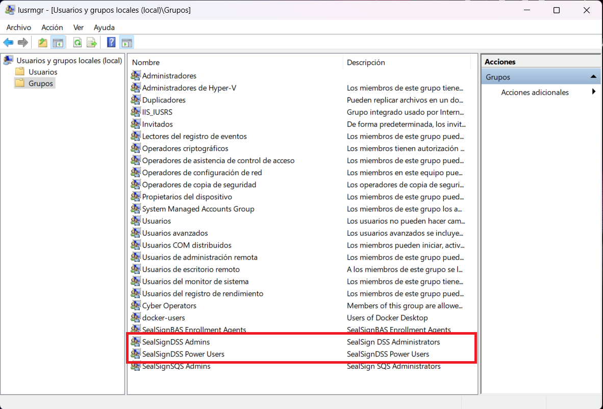
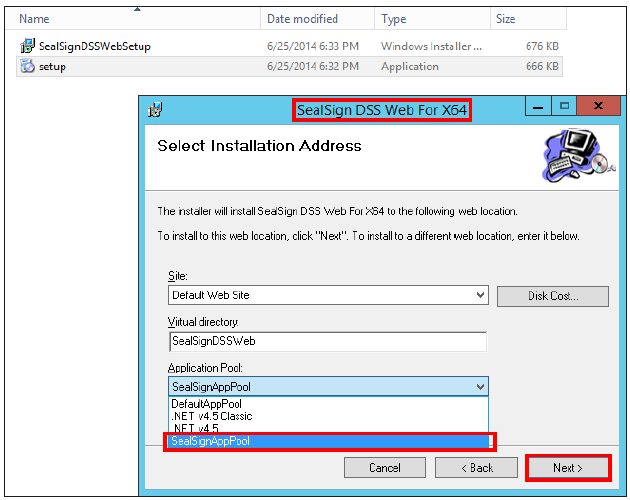
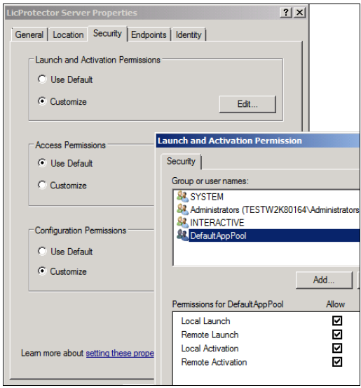

## 1. Introducción

SealSign DSS (Digital Signature Services) es un producto dirigido a facilitar la integración de la firma electrónica
en las aplicaciones corporativas. El producto está compuesto por una serie de módulos, cuyos sistemas de
instalación están basados en la tecnología MSI 3.0.

La instalación del módulo SealSign DSS va seguido de la instalación de otros módulos, un módulo o varios de
ellos dependiendo de las necesidades, siendo el módulo de DSS Service el único cuya instalación es obligatoria,
ya que es la herramienta que utilizan todos los demás.


<center><i>Image 01: Módulos de SealSign</i></center>

A continuación, se muestra un resumen con las características de cada uno.

- **Módulo DSS Web (administración y configuración)**: Este módulo es la herramienta web de
configuración y administración de la solución SealSign DSS, que se utiliza para gestionar los demás
módulos (excepto el módulo Revoke). Por tanto, su instalación es imprescindible en caso de querer
instalar cualquier otro módulo.

- **Módulo DSS Service (firma electrónica)**: Este módulo incorpora el motor de firma electrónica y los
interfaces SOA del servicio web necesario para acceder a su funcionalidad. Su instalación es
obligatoria.

- **Módulo Revoke**: Este módulo es la autoridad de validación de certificados, funciona como un
centralizador de validaciones de certificados. Es totalmente independiente de los demás y además
tiene una consola propia de administración.

- **Módulo DSS TSA (emisión de sellos de tiempo)**: Este módulo incorpora la autoridad de sellado de
tiempo, y se debe instalar solamente si se van a emitir sellos de tiempo. El módulo TSA hace uso del
módulo DSS Service para su configuración y del módulo DSS Web para su administración.

- **Módulo DSS OTP (Firma One Time Password)**: Es el módulo de SealSign OTPSS, incorpora el motor
de firma One Time Password. Utiliza el módulo DSS Service para efectuar sus tareas, basándose en
servicios web y en el módulo DSS Web para su administración.

Debido a la naturaleza del producto su instalación solo es posible en sistemas operativos Microsoft Windows
y antes de dicha instalación hay que realizar unos pasos previos fundamentales, que no se pueden obviar.

En esta guía se van a mostrar tanto dichos pasos previos como la instalación propiamente dicha de los módulos
DSS, así como su configuración. La instalación y configuración de los módulos de SealSign que no son DSS
(CKC, BSS) se contempla en otras guías.

Tanto los textos como las imágenes utilizadas en esta guía están basados en un sistema operativo Microsoft
Windows 2012, aunque cualquier administrador de sistemas podrá realizar la instalación del producto en otras
versiones.

## 2. Requisitos de instalación de SealSign DSS

SealSign DSS es una solución servidora que publica su funcionalidad a través de un interfaz SOA. Dicha solución
está diseñada para entornos corporativos que deben cumplir los siguientes requisitos:

- **Sistema operativo Microsoft Windows**. Aunque en escenarios específicos SealSign DSS se puede
instalar en sistemas operativos cliente, se recomienda instalar el producto sobre uno de los siguientes
sistemas operativos servidor: WS 2008, WS 2008 R2, WS 2012, WS 2012 R2 y W2016.

- **.NET Framework 4.6.2**

- **IIS 7**. Internet Information Server.

- **Gestor de base de datos (SQL Server, Oracle o PostGreSQL)**: Los datos de configuración, auditoría,
caché, etcétera de SealSign DSS se almacenan en una base de datos. Aunque en determinados
escenarios será posible utilizar versiones gratuitas de estas bases de datos, se recomienda utilizar las
versiones completas de SQL Server, Oracle 11g R2 y PostGreSQL 9.6 o superior.

La arquitectura de SealSign DSS descansa sobre los servicios de aplicaciones de la plataforma Microsoft, por
lo que es necesario añadir el rol de servidor de aplicaciones y el rol de servidor web (IIS) a través de la
herramienta de gestión del servidor. Los siguientes puntos detallan qué opciones deben estar configuradas en
estos servidores.

### 2.1. Instalación de roles de Sistema Operativo

SealSign DSS necesita la instalación de unos roles de sistema operativo. Para poder instalarlos es necesario
ejecutar el script InstallPrerequisites.ps1 que se encuentra ubicado en la ruta siguiente:

**\\\\SealSign_Engine/server/PrequisitesPowerShellScripts/InstallPrerequisites.ps1**

A continuación, se muestran las listas de roles y características:

- FileAndStorage-Services 
- Storage-Services 
- Web-Server 
- Web-WebServer 
- Web-Common-Http 
- Web-Default-Doc 
- Web-Dir-Browsing 
- Web-Http-Errors 
- Web-Static-Content 
- Web-Http-Redirect 
- Web-Health 
- Web-Http-Logging 
- Web-Log-Libraries 
- Web-Request-Monitor 
- Web-Performance 
- Web-Stat-Compression 
- Web-Dyn-Compression 
- Web-Security 
- Web-Filtering 
- Web-Basic-Auth 
- Web-Client-Auth 
- Web-Digest-Auth 
- Web-Cert-Auth 
- Web-IP-Security 
- Web-Url-Auth 
- Web-Windows-Auth 
- Web-App-Dev 
- Web-Net-Ext 
- Web-Net-Ext45 
- Web-Asp-Net45 
- Web-ISAPI-Ext 
- Web-ISAPI-Filter 
- Web-Mgmt-Tools 
- Web-Mgmt-Console 
- Web-Mgmt-Compat 
- Web-Metabase 
- Web-Scripting-Tools 
- Web-Mgmt-Service 
- NET-Framework-Features 
- NET-Framework-Core 
- NET-HTTP-Activation 
- NET-Framework-45-Features 
- NET-Framework-45-Core 
- NET-Framework-45-ASPNET 
- NET-WCF-Services45 
- NET-WCF-HTTP-Activation45 
- NET-WCF-TCP-PortSharing45 
- PowerShellRoot 
- PowerShell 
- PowerShell-V2 
- PowerShell-ISE 
- WAS 
- WAS-Process-Model 
- WAS-NET-Environment 
- WAS-Config-APIs 
- WoW64-Support

## 3. Configuración previa del entorno

Una vez que se dispone de los elementos indicados en el punto anterior, es necesario realizar la configuración
de estos. La instalación del producto final depende fundamentalmente de que se realicen correctamente los
siguientes pasos.

### 3.1. Configuración del Application Pool de IIS 7 o IIS 7.5

En este artículo se muestran los pasos a realizar para crear un sitio web con IIS 7, en caso de que no se
disponga de uno, o de que se quiera crear uno expresamente para SealSign DSS.

Se puede crear un nuevo Application Pool exclusivamente para el producto, aunque también es posible utilizar
uno existente siempre y cuando disponga de las configuraciones que se van a mostrar en este apartado.

A partir de la versión IIS 7.0 los *Application Pools* por defecto se ejecutan con cuentas virtuales y se recomienda
mantener dicha configuración, salvo que sea estrictamente necesario utilizar una cuenta ya existente. El uso de
cuentas virtuales es un mecanismo de seguridad, ya que dichas cuentas tienen permisos limitados. En este caso
la cuenta virtual que se va a utilizar es la que viene por defecto: *ApplicationPoolIdentity*.

La creación de un *Application Pool* de IIS se hace a partir de la consola de administración de IIS, el *IIS Manager*
y concretamente desde el menú contextual del apartado *Application Pool*. El nombre del *Application Pool* es
indiferente (*SealSignAppPool* en este caso), pero sí debe ejecutarse con la versión *4.0.30319* de .NET, además
es recomendable que el modo de integración elegido sea *Integrated* (véase imagen siguiente).


<center><i>Image 02: Creación de un nuevo Application Pool</i></center>

Una vez que se dispone de un Application Pool es necesario configurarlo y modificar ciertos valores, para ello
hay que acceder a las opciones avanzadas del Application Pool a través del menú contextual:

- En la opción Identity se establecerá la cuenta que se va a utilizar para ejecutar el Application Pool, la
cuenta virtual viene reflejada con el nombre ApplicationPoolIdentity y es la recomendable, aunque tal
y como se ha mencionado es posible elegir otra de las disponibles.

- En la opción Load User Profile hay que establecer obligatoriamente el valor a True. Esto es debido a
que el producto DSS realiza operaciones que, por la propia naturaleza de Microsoft Windows, se
guardan en un almacén de certificados en el propio registro de Microsoft Windows. Para poder
acceder a dicho almacén de certificados el Application Pool debe ser capaz de cargar el perfil de
usuario.


<center><i>Image 03: Opciones avanzadas del Application Pool creado</i></center>

### 3.2. Creación de la base de datos

Como ya se ha mencionado es necesaria la utilización de una base de datos para almacenar diversa información
que precisa el producto. En este apartado se detallan las configuraciones necesarias para las bases de datos
SQL Server, Oracle y PostGreSQL.

#### 3.2.1. SQL Server

En caso de utilizar SQL Server es necesario crear una nueva base de datos para SealSign DSS. El nombre de
dicha base de datos es indiferente (SealSignDSS en este caso), y se utilizará más adelante en las cadenas de
conexión. Una vez creada dicha base de datos es necesario realizar las siguientes acciones:

- **Ejecutar el script de creación de tablas**. En el paquete de instalación del producto se incluye un fichero
sql para SQL Server. Este archivo hay que ejecutarlo sobre la base de datos creada, y se generarán en
la misma todos los elementos que el producto necesita para su correcto funcionamiento.

**\SealSign_Engine\server\Scripts\SQL Server\SealSignDSS_vX.X_MSSQL.sql**


<center><i>Image 03: Ejecución del fichero sql en la base de datos creada</i></center>

- **Configurar los permisos de acceso a la base de datos**. En el caso de utilizar seguridad integrada para
acceder a la base de datos, es necesario proporcionar permisos de escritura (*datawriter*) y lectura
(*datareader*) al login del usuario con el que se ejecutará el *Application Pool* de IIS que contiene las
aplicaciones. En la siguiente guía de Microsoft se detalla cómo realizar esta configuración. Si no se
utiliza seguridad integrada, habrá que disponer igualmente de un usuario con los permisos
mencionados.

Tal y como se ha mencionado anteriormente, es recomendable utilizar una cuenta virtual para ejecutar el
*Application Pool* de IIS (*ApplicationPoolIdentity* en este caso), y por tanto se recomienda utilizar esta misma
cuenta para acceder a la base de datos. Esta cuenta según la nomenclatura utilizada internamente por Microsoft
es *IIS APPPOOL*. De ahí que el nombre del login sea *IIS APPPOOL\SealSignAppPool*.


<center><i>Image 05: Configuración del Login name</i></center>

#### 3.2.2. Oracle

En caso de utilizar Oracle es necesario crear un nuevo tablespace para SealSign DSS, al igual que con SQL
Server el nombre de dicho tablespace es indiferente. También es necesario disponer de una cuenta con
permisos de escritura y lectura sobre las tablas del tablespace.

Una vez creado dicho tablespace es necesario realizar las siguientes acciones:

- Instalar el componente Oracle Data Access Components (ODAC) para Microsoft Windows,
incluyendo el módulo Oracle Data Provider.

- Dar permisos de ejecución sobre el paquete de criptografía dbms_crypto de Oracle para el usuario del
tablespace.

- Ejecutar el script de creación de tablas. En el paquete de instalación del producto se incluye un fichero
sql para Oracle. Este archivo hay que ejecutarlo sobre el tablespace creado, y se generarán en el mismo
todos los elementos que el producto necesita para su correcto funcionamiento.

**\SealSign_Engine\server\Scripts\ORACLE\SealSignDSS_vX.X_ORACLE.sql**

Una vez realizadas estas configuraciones, el sistema ya está preparado para instalar los módulos necesarios de
SealSign DSS.

#### 3.2.3. PostGreSQL

En caso de utilizar PostGreSQL es necesario crear una nueva BBDD para SealSign DSS, al igual que con SQL
Server el nombre de dicho BBDD es indiferente. También es necesario disponer de una cuenta con permisos
de escritura y lectura sobre las tablas de la BBDD.

Una vez creado dicha BBDD es necesario ejecutar el script de creación de tablas. En el paquete de instalación
del producto se incluye un fichero sql para PostGreSQL. Este archivo hay que ejecutarlo sobre la BBDD creada,
y se generarán en el mismo todos los elementos que el producto necesita para su correcto funcionamiento.

**\SealSign_Engine\server\Scripts\PostgreSQL\SealSignDSS_vX.X_PostgreSQL.sql**

Una vez realizadas estas configuraciones, el sistema ya está preparado para instalar los módulos necesarios de
SealSign DSS.

### 3.3. Permisos de autorización

Es necesario agregar los usuarios que van a administrar desde SealSignDSSWeb al grupo local o de dominio SealSignDSS Admins, los usuarios que van a subir sus propios certificados y crear sus reglas de uso deben estar en el grupo SealSignDSS Power Users.



<center><i>Usuarios locales y grupos</i></center>

## 4. Instalación de los módulos de SealSign DSS

### 4.1. Módulo DSS Service (firma electrónica)

Tal y como se ha mencionado anteriormente, este módulo instala un conjunto de servicios web. Estos se basarán
tanto en el IIS como en la base de datos para efectuar su labor. Es por ello por lo que tras la instalación hay
que configurarlo para que pueda utilizar dichos servicios.

#### 4.1.1. Instalación del módulo DSS Service

La instalación del módulo se realiza como muchos programas de Microsoft Windows, es decir, siguiendo los
pasos de un asistente.

Durante la instalación, hay que indicar de la lista de sitios web disponibles, aquel en el que se desea instalar el
servicio de firma electrónica SealSign DSS, el nombre del directorio virtual y el *Application Pool* de aplicación
que se configuró en el IIS (*SealSignAppPool* en este caso).


<center><i>Image 06: Configuración durante la instalación del módulo DSS Service</i></center>

Tras la instalación se ha añadido como un programa más en la lista de programas del Panel de Control, y en el
IIS se mostrará como una aplicación web.


<center><i>Image 07: Módulo ya integrado como aplicación web en IIS</i></center>

#### 4.1.2. Configuración del módulo DSS Service

Una vez instalado el módulo es necesario configurarlo para que utilice correctamente tanto la base de datos,
como el IIS.

**CONFIGURACION DE LA CONEXION A LA BASE DE DATOS**

Se realiza en el fichero de configuración ***connectionStrings.config***. Este se encuentra ubicado en el directorio
***SealSignDSSService*** del sitio Web donde se haya instalado el producto.

**\InetPub\wwwroot\SealSignDssService**


- **SQL Server**

    Dicho fichero incluye la cadena de conexión a la base de datos creada anteriormente en SQL Server (SealSignDSS):

    ```xml
    <connectionStrings>
        <add name="SealSignDSSConnectionString"
            connectionString="Data Source=localhost;
            Initial Catalog=SealSignDSS;
            Trusted_Connection=Yes;
            persist security info=False;
            TrustServerCertificate=True" />
    </connectionStrings>
    ```

    En caso de que la base de datos utilizada sea SQL Server simplemente habrá que modificar los parámetros anteriores para adaptarse a la configuración realizada anteriormente en la base de datos. En esta dirección se puede obtener información sobre la creación de cadenas de conexión en SQL Server.

- **Oracle**

    En caso de que la base de datos sea Oracle, hay que modificar los siguientes parámetros:

    - Cambiar el valor de la clave *FactoryProvider* y establecerlo a *System.Data.OracleClient* en el fichero ***web.config*** ubicado en el mismo directorio en el que se encuentra el fichero ***connectionStrings.config***.

    - En la etiqueta *connectionStrings* hay que configurar la cadena de conexión para el acceso a Oracle. En esta dirección es posible informarse sobre la creación de cadenas de conexión en Oracle.

    - Hay que modificar el atributo connectionString de la etiqueta SealSignDSSConnectionString, y establecerlo con el siguiente formato:

    ```xml
    Data Source=(DESCRIPTION=(ADDRESS=(PROTOCOL=XXX)(HOST=XXX)(PORT=XXX))
    (CONNECT_DATA=(SID=XXX)));User Id=UserID;Password=Password;
    ```

    Un ejemplo de conexión podría ser el siguiente:

    - **Fichero web.config**:

    ```xml
        ...
        <appSettings>
            <add key="FactoryProvider" value="System.Data.OracleClient" />
            ...
        </appSettings>
        ...
    ```
    - **Fichero connectionStrings.config**:

    ```xml
    <connectionStrings>
        <add name="SealSignDSSConnectionString"
            connectionString="Data Source=(DESCRIPTION=(ADDRESS=(PROTOCOL=TCP)
            (HOST=172.54.110.112)(PORT=1521))(CONNECT_DATA=(SID=orcl)));
            User Id=SealSignDSS; Password=1234546;” />
    </connectionStrings>
    ```

- **PostgreSQL**

    En caso de que la base de datos sea PostGre, hay que modificar los siguientes parámetros:

    - Cambiar el valor de la clave *FactoryProvider* y establecerlo a *Npgsql* en el fichero ***web.config*** ubicado en el mismo directorio en el que se encuentra el fichero ***connectionStrings.config***.

    - En la etiqueta *connectionStrings* hay que configurar la cadena de conexión para el acceso a PostGre.
    En esta dirección URL https://www.connectionstrings.com/npgsql/ es posible informarse sobre la creación de cadenas de conexión en Oracle.

    - Hay que modificar el atributo connectionString de la etiqueta SealSignDSSConnectionString, y establecerlo con el siguiente formato:

    ```xml
    server=XXXX;userid=XXXX;password=XXXX;database=XXXX
    ```

    Un ejemplo de conexión podría ser el siguiente:

    **Fichero web.config**:

    ```xml
        ...
        <appSettings>
            <add key="FactoryProvider" value="Npgsql" />
            ...
        </appSettings>
        ...
    ```

    **Fichero connectionStrings.config**:

    ```xml
        <connectionStrings>
            <add name="SealSignDSSConnectionString"
                connectionString=" server=localhost;userid=postgres;password=POSTGRES;
                database=SealSignDSS”/>
        </connectionStrings>
    ```

**CONFIGURACION DEL MODULO EN EL IIS**

A la hora de acceder al servicio web, es necesario que se dispongan de los permisos necesarios. Tanto la
aplicación web como el servidor requieren de seguridad integrada de Windows (*Windows Authentication*) para
su correcto funcionamiento. Esto implica que hay que activar este tipo de autenticación obligatoriamente. La
autenticación anónima (*Anonymous Authentication*) está por defecto activada y no debe deshabilitarse, es
necesario que siga así. En cambio es opcional, (aunque recomendable dependiendo del escenario), activar la
autenticación básica (*Basic Authentication*). Gracias a esto los usuarios con tecnologías distintas a las de
Microsoft Windows (iOS, Android, Java, Linux, etcétera) podrán consumir dicho servicio web y por tanto utilizar
el producto.


<center><i>Image 09: Configuración de los permisos del módulo DSS Service en el IIS</i></center>

En caso de activar la autenticación básica es altamente recomendable utilizar SSL/TLS.


**CONFIGURACION POR SSL/TLS**

Para más información de cómo configurar IIS/SSL véase [https://learn.microsoft.com/es-ES/iis/manage/configuring-security/how-to-set-up-ssl-on-iis](https://learn.microsoft.com/es-ES/iis/manage/configuring-security/how-to-set-up-ssl-on-iis)

***Configuración de los Bindings WCF en SealSign con SSL***

Para configurar WCF en cualquiera de los módulos de SealSign para que usen SSL simplemente hay que realizar
el siguiente cambio en el `Web.config` del módulo en cuestión:

```
<!--<services configSource="servicesnossl.config"/>-->
<services configSource="servicesssl.config"/>
```

***Configuración de los Bindings WCF en SealSign sin SSL***

Para configurar WCF en cualquiera de los módulos de SealSign para que no usen SSL simplemente hay que
realizar el siguiente cambio en el `Web.config` del módulo en cuestión:

```
<services configSource="servicesnossl.config"/>
<!--<services configSource="servicesssl.config"/>-->
```

### 4.2. Módulo DSS Web (administración y configuración)

Tal y como se ha mencionado anteriormente, este módulo instala una herramienta de administración con
formato de aplicación web, que es utilizada por los demás módulos, por tanto, su instalación es obligatoria.
Este módulo se basa en el IIS para efectuar su labor, por ello, tras la instalación hay que configurarlo para que
pueda utilizar dicho servicio.

Una vez finalizada la instalación y la configuración, habría que dar permisos a un usuario en el sistema para
que administrase SealSign. El hecho de que se realice la instalación y la configuración no implica que se pueda
acceder a la web de administración.

#### 4.2.1. Instalación del módulo DSS Web

La instalación del módulo se realiza como muchos programas de Microsoft Windows, es decir, siguiendo los
pasos de un asistente. El proceso es el mismo que el llevado a cabo con anterioridad a instalar el módulo DSS
Service.

Durante la instalación, hay que indicar de la lista de sitios Web disponibles, aquel en el que se desea instalar el
servicio web de administración además del directorio virtual y el *Application Pool* de aplicación que se
configuró en el IIS (*SealSignAppPool* en este caso).



<center><i>Image 10: Configuración durante la instalación del módulo DSS Web</i></center>

Tras la instalación se ha añadido como un programa más en la lista de programas del Panel de Control de
Microsoft Windows, y en el IIS también se mostrará como una aplicación web, junto al DSS Service.


<center><i>Image 11: Módulo ya integrado como aplicación web en IIS</i></center>

#### 4.2.2. Configuración del módulo DSS Web

Para que funcione correctamente debe tener referenciado el módulo DSS Service y hay que modificar la
autenticación en el IIS.

**CONFIGURACION DE LA REFERENCIA AL MODULO DSS SERVICE**

Se realiza en el fichero de configuración ***endpoints.config***. Este se encuentra ubicado en el directorio
***SealSignDSSWeb*** del sitio Web donde se haya instalado el producto. Dicho fichero incluye entre otras
configuraciones, las direcciones de tres servicios web proporcionados por el DSS Service. Concretamente son
el servicio web de administración (*AdminService.svc*), el de auditoría (*AuditService.svc*) y el de repositorio
seguro de documentos (*SecureStorage.svc*).

En caso de que se haya realizado la instalación de los servicios establecida por defecto no será necesario
modificar este archivo.

```xml
    <client>
        <endpoint address="http://localhost/SealSignDSSService/AuditService.svc"
        ...
        </endpoint>
        <endpoint address="http://localhost/SealSignDSSService/AdminService.svc"
        ...
        </endpoint>
        <endpoint address="http://localhost/SealSignDSRService/SecureStorage.svc"
        ...
        </endpoint>
    </client>
```

En esta dirección se puede obtener información sobre los parámetros mostrados.

#### 4.2.3. Configuración del módulo en el IIS

Para el correcto funcionamiento de la aplicación web de administración es necesario modificar la autenticación
en el IIS. Para ello hay que deshabilitar el acceso para los usuarios anónimos (*Anonymous Authentication*) y
habilitar la autenticación basada en Windows (*Windows Authentication*).


<center><i>Image 12: Configuración de los permisos del módulo DSS Web en el IIS</i></center>

### 4.3. Módulo DSS TSA

Tal y como se ha mencionado anteriormente, este módulo instala la autoridad de sellado de tiempo. Al igual
que en los anteriores hay que configurar la cadena de conexión a la base de datos una vez que haya finalizado
la instalación.

#### 4.3.1. Instalación del módulo DSS TSA

La instalación del módulo se realiza como muchos programas de Microsoft Windows, es decir, siguiendo los
pasos de un asistente. El proceso es el mismo que el llevado a cabo anteriormente al instalar los módulos DSS
Service y DSS Web.


<center><i>Image 13: Configuración durante la instalación del módulo DSS TSA</i></center>

Tras la instalación se ha añadido como un programa más en la lista de programas del Panel de Control, y en el
IIS también se mostrará como una aplicación web, junto al DSS Service y al DSS Web.


<center><i>Image 14: Módulo ya integrado como aplicación web en IIS</i></center>

#### 4.3.2. Configuración del módulo DSS TSA

Se realiza en el fichero de configuración ***connectionStrings.config***. Este se encuentra ubicado en el directorio
***SealSign DSS TSA*** del sitio Web donde se haya instalado el producto. Dicho fichero por defecto incluye la cadena
de conexión a la base de datos creada anteriormente en SQL Server (*SealSignDSS*).

```xml
   <connectionStrings>
        <add name="SealSignDSSConnectionString"
            connectionString="Data Source=localhost;
            Initial Catalog=SealSignDSS;
            Trusted_Connection=Yes;
            persist security info=False;
            TrustServerCertificate=True" />
    </connectionStrings> 
```

La configuración de la cadena de conexión es exactamente la misma que la realizada anteriormente en el
módulo DSS Service. El administrador deberá seguir los pasos indicados en ese apartado para establecer la
conexión adecuada en SQL Server, Oracle o PostGreSQL.

### 4.4. Módulo DSS Revoke (Autoridad de Validación)

DSS Revoke es una autoridad de validación de certificados digitales local que permite integrar en la
organización múltiples PSCs externos manteniendo el control del proceso de validación, centralizando la
comprobación de revocación y aportando funciones de auditoría, caché, descarga de CRLs y respuestas OCSP
y listas locales de revocación.

#### 4.4.1. Instalación del módulo DSS Revoke

La instalación del módulo se realiza como muchos programas de Microsoft Windows, es decir, siguiendo los
pasos de un asistente. El proceso es el mismo que el llevado a cabo anteriormente al instalar los módulos DSS
Service y DSS Web.


<center><i>Image 15: Configuración durante la instalación del módulo DSS TSA</i></center>

Tras la instalación se ha añadido como un programa más en la lista de programas del Panel de Control, y en el
IIS también se mostrará como una aplicación web, junto al DSS Service y al DSS Web.


<center><i>Image 16: Módulo ya integrado como aplicación web en IIS</i></center>

#### 4.4.2. Configuración del módulo DSS Revoke

Se realiza en el fichero de configuración ***connectionStrings.config***. Este se encuentra ubicado en el directorio
***RevokeClientWS*** del sitio Web donde se haya instalado el producto. Dicho fichero por defecto incluye la cadena
de conexión a la base de datos creada anteriormente en SQL Server (*SealSignDSS*).

```xml
    <connectionStrings>
        <add name="SealSignDSSConnectionString"
            connectionString="Data Source=localhost;
            Initial Catalog=SealSignDSS;
            Trusted_Connection=Yes;
            persist security info=False;
            TrustServerCertificate=True" />
    </connectionStrings>
```

La configuración de la cadena de conexión es exactamente la misma que la realizada anteriormente en el
módulo DSS Service. El administrador deberá seguir los pasos indicados en ese apartado para establecer la
conexión adecuada en SQL Server, Oracle o PostGreSQL.

### 4.5. Módulo OTPSS (One Time Password Signature Service)

#### 4.5.1. Instalación del módulo OTPSS

La instalación del módulo se realiza como muchos programas de Microsoft Windows, es decir, siguiendo los
pasos de un asistente.

Durante la instalación, hay que indicar de la lista de sitios web disponibles, aquel en el que se desea instalar el
servicio de firma electrónica SealSign DSS, el nombre del directorio virtual y el Application Pool de aplicación
que se configuró en el IIS (SealSignAppPool en este caso).


<center><i>Image 17: Configuración durante la instalación del módulo OTPSS</i></center>

Tras la instalación se ha añadido como un programa más en la lista de programas del Panel de Control, y en el
IIS se mostrará como una aplicación web.


<center><i>Image 18: Módulo ya integrado como aplicación web en IIS</i></center>


#### 4.5.2. Configuración del módulo OTPSS

Se realiza en el fichero de configuración ***connectionStrings.config***. Este se encuentra ubicado en el directorio
***SealSignOTPSSService*** del sitio Web donde se haya instalado el producto. Dicho fichero incluye la cadena de
conexión a la base de datos creada anteriormente en SQL Server (*SealSignDSS*), además de otros parámetros
que hay que tener en cuenta:

**\InetPub\wwwroot\SealSignOTPSSService**

- **SQL SERVER**

    Dicho fichero incluye la cadena de conexión a la base de datos creada anteriormente en SQL Server (SealSignDSS):

    ```xml
        <connectionStrings>
            <add name="SealSignDSSConnectionString"
                connectionString="Data Source=localhost;
                Initial Catalog=SealSignDSS;Trusted_Connection=Yes;
                persist security info=False; TrustServerCertificate=True"/>
        </connectionStrings>
    ```

- **ORACLE**

    En caso de que la base de datos sea Oracle, hay que modificar los siguientes parámetros:

    - Cambiar el valor de la clave *FactoryProvider* y establecerlo a *System.Data.OracleClient* en el fichero ***web.config*** ubicado en el mismo directorio en el que se encuentra el fichero ***connectionStrings.config***.

    - En la etiqueta *connectionStrings* hay que configurar la cadena de conexión para el acceso a Oracle. En esta dirección es posible informarse sobre la creación de cadenas de conexión en Oracle.

    - Hay que modificar el atributo connectionString de la etiqueta SealSignDSSConnectionString, y establecerlo con el siguiente formato:

    ```xml
    Data Source=(DESCRIPTION=(ADDRESS=(PROTOCOL=XXX)(HOST=XXX)(PORT=XXX))
    (CONNECT_DATA=(SID=XXX)));User Id=UserID;Password=Password;
    ```

    Un ejemplo de conexión podría ser el siguiente:
    
    - **Fichero web.config**:

    ```xml
        ...
        <appSettings>
            <add key="FactoryProvider" value="System.Data.OracleClient" />
            ...
        </appSettings>
        ...
    ```

    - **Fichero connectionStrings.config**:

    ```xml
        <connectionStrings>
            <add name="SealSignDSSConnectionString"
                connectionString="Data Source=(DESCRIPTION=(ADDRESS=(PROTOCOL=TCP)
                (HOST=172.54.110.112)(PORT=1521))(CONNECT_DATA=(SID=orcl)));
                User Id=SealSignDSS; Password=1234546;” />
        </connectionStrings>
    ```
- **POSTGRESQL**

    En caso de que la base de datos sea PostGre, hay que modificar los siguientes parámetros:

    - Cambiar el valor de la clave *FactoryProvider* y establecerlo a *Npgsql* en el fichero ***web.config*** ubicado en el mismo directorio en el que se encuentra el fichero ***connectionStrings.config***.

    - En la etiqueta connectionStrings hay que configurar la cadena de conexión para el acceso a PostGre.
    En esta dirección URL https://www.connectionstrings.com/npgsql/ es posible informarse sobre la
    creación de cadenas de conexión en Oracle.

    - Hay que modificar el atributo connectionString de la etiqueta SealSignDSSConnectionString, y establecerlo con el siguiente formato:

    ```xml
    server=XXXX;userid=XXXX;password=XXXX;database=XXXX
    ```

    Un ejemplo de conexión podría ser el siguiente:

    - **Fichero web.config**:

        ```xml
            ...
            <appSettings>
                <add key="FactoryProvider" value="Npgsql" />
                ...
            </appSettings>
            ...

        ```
    - **Fichero connectionStrings.config**:

        ```xml
            <connectionStrings>
                <add name="SealSignDSSConnectionString"
                    connectionString=" server=localhost;userid=postgres;password=POSTGRES;
                    database=SealSignDSS”/>
            </connectionStrings>
        ```

## 5. Resolución de problemas de instalación

El proceso de instalación de los servicios de firma electrónica incluye un sistema de monitorización y
seguimiento de errores propio de SealSign. De esta forma todos los errores, avisos y mensajes informativos se
registran en su propio Log de aplicación integrado en Microsoft Windows. En caso de identificar algún
problema en los servicios se recomienda revisar el log SealSign DSS.


<center><i>Image 20: Visor de eventos de Microsoft Windows</i></center>

Los problemas más comunes que pueden ocurrir durante la instalación de SealSign DSS son los ocasionados
por la obtención de la licencia, y su identificador es el 3011.

```note 
    En la “Guía de monitorización de SealSign”, se incluyen todos los detalles acerca de cómo
    monitorizar el estado de salud de la plataforma y ver los posibles errores que se pueden dar
    durante su utilización.
```

### 5.1. Error 80070005

Este error se produce generalmente cuando el usuario con el que está configurado el Application Pool no tiene
permisos para instanciar el componente de gestión de licencias. Dicho componente se registra en la maquina
durante el proceso de instalación. El mensaje generado es el siguiente:

```An error has occurred obtaining license information: 
    Retrieving the COM class factory for component with CLSID {554A6D3B-2FEF-4C2F-B34C-AF6185EB2759} failed due to the following error: 80070005. at SealSignDSSLibrary.SealSignDSSLicense.InitializeLicense(String licenseFile)
```

Para solucionarlo, basta con proporcionar permisos de activación al usuario del *Application Pool*. Esto se pude
hacer con la herramienta ***DCOMCNFG.EXE***, buscando el componente ***LicProtector Server***:


<center><i>Image 21: Herramienta DCOMCNFG.EXE</i></center>

A través del botón de derecho se puede acceder a las propiedades de este elemento, donde está la pestaña
Security, desde la cual se podrá dar permisos al usuario del Application Pool.



<center><i>Image 21: Permission settingsConfiguración de permisos</i></center>

### 5.2. Error 80040154

Este error se produce generalmente en entornos de 64 bits cuando la configuración de activación del
componente de gestión de licencias se ha modificado o borrado. Dicho componente se registra en la maquina
durante el proceso de instalación.

El mensaje generado es el siguiente:

```An error has occurred obtaining license information:
    Retrieving the COM class factory for component with CLSID {554A6D3B-2FEF-4C2F-B34C-AF6185EB2759} failed due to the
    following error: 80040154. at SealSignDSSLicense.SealSignDSSLicense.InitializeLicense(String licenseFile)
```

Para regenerar la configuración de activación del componente se puede ejecutar el fichero ***DllSurrogate.reg***
provisto con los módulos de instalación.