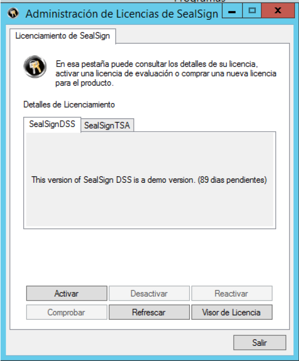
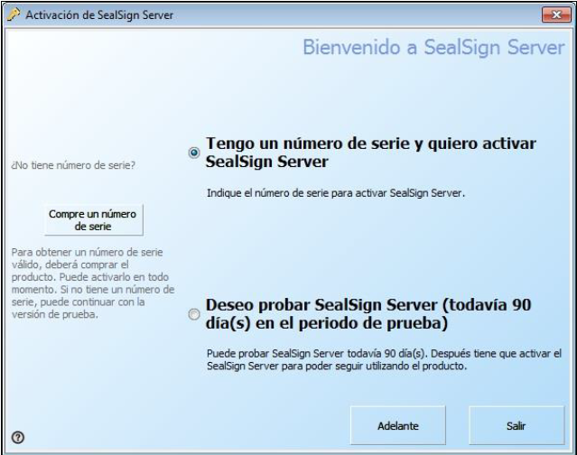
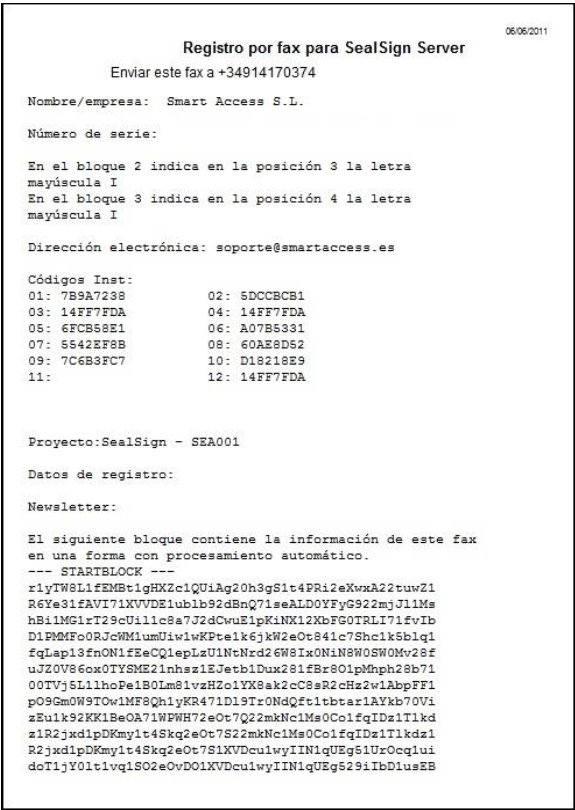
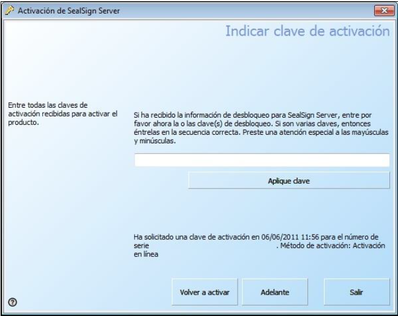

# 1. Introducción

En este documento se describirá la herramienta de licenciamiento de la familia de productos de SealSign® así
como cada una de sus opciones tanto desde el interfaz gráfico como desde línea de comandos.
Este documento es válido para cualquier producto de la familia de SealSign®, por tanto, valido para:

- SealSign® DSS
- SealSign® BSS
- SealSign® TSA
- SealSign® CKC
- SealSign® DSR
- SealSign® BAS

```note
Aunque en las imágenes de este documento aparezca “SealSign® DSS” como producto, este
documento es aplicable al resto de productos de la familia SealSign® mencionados anteriormente.
```

# 2. Administración de Licencias de SealSign® - Opciones

La Administración de licencias de SealSign® está situada en el Panel de Control. Si el sistema operativo del
equipo es Windows 2008 o superior, la Administración de licencias de SealSign® se encuentra dentro de la
categoría Programas en dicho panel de control.

El aspecto de la herramienta es el siguiente:



<center><i>Imagen 01: Administración de licencias de SealSign®</i></center>

En el interfaz se distinguen las distintas opciones que se pueden realizar sobre las licencias. Estas son:

- **Activar**: Si una licencia está en periodo de evaluación o expirada, el botón Activar estará habilitado y
su funcionamiento es el de invocar el Wizard de activación de licencias como se verá más adelante.
Una vez activado el producto, la licencia queda asociada al hardware del equipo y no se podrá reutilizar
en otro equipo de ninguna forma.

- **Desactivar**: Si una licencia está activada y se quiere desactivar para su migración a otro equipo, por
una reinstalación del servidor o por cualquier otra razón, con esta acción se desactivará el producto
localmente y se notificará al servidor para que se libere dicha licencia. Así pues, esta licencia liberada
podrá ser reutilizada en cualquier otro equipo.

- **Reactivar**: Si una licencia ha sido desactivada y quiere volver a ser reactivada en el mismo equipo,
únicamente tendremos que utilizar esta opción para que se vuelva a asociar la licencia de nuevo al
equipo local. Una vez finalizado el proceso, la licencia queda de nuevo asociada al hardware del equipo
y no se podrá reutilizar en otro equipo de ninguna forma.

- **Comprobar**: Realizar una comprobación online contra los servidores de Factum Identity del estado de
la licencia.

- **Refrescar**: Recarga la página actual de licencias.

- **Visor de Licencias**: Muestra una ventana con información más detallada de la licencia y su estado
(códigos de asociación al hardware, última verificación online, etc.).

# 3. Activación de la Licencia

## 3.1 Activación de la Licencia por Internet

Una vez instalado el producto de SealSign® en un servidor, éste debe ser activado antes de 90 días. Para
realizar la activación por internet, el administrador deberá realizar los siguientes pasos:

1. Iniciar la Administración de licencias de SealSign® desde el panel de control. Si el sistema operativo
del equipo es Windows 2008 o superior, la Administración de licencias de SealSign® se encuentra
dentro de la categoría Programas en dicho panel de control. Aparecerá la siguiente ventana:


<center><i>Imagen 02: Aspecto de la ventana "Administración de Licencias de SealSign"</i></center>

2. Pulsar el botón Activar, seleccionar la opción Tengo un número de serie y quiero activar SealSign®
Server y pulsar el botón Adelante:


<center><i>Imagen 03: Activación de SealSign® Server con número de serie</i></center>

3. Seleccionar la opción Activación en línea y pulsar el botón Adelante:


<center><i>Imagen 04: Activación de SealSign® Server. Activación en línea</i></center>

4. Rellenar los campos número de serie, nombre/empresa y correo electrónico y pulsar el botón
Adelante. Es importante introducir una dirección de correo correcta para la recepción de futuras
actualizaciones y noticias del producto:


<center><i>Imagen 05: Activación de SealSign® Server. Introducción del número de serie</i></center>

5. En la ventana de Activación en línea, si es necesario modificar los parámetros del proxy pulsando el
enlace, y pulsar el botón Adelante:


<center><i>Imagen 06: Activación de SealSign® Server. Ventana final</i></center>

6. En la ventana de resultado pulse el boton Adelante:


<center><i>Imagen 07: Activación de SealSign® Server finalizada</i></center>

Si la activación ha sido correcta, en la pestaña de Administración de Licencia de SealSign® se verá reflejado el
cambio como se muestra en la siguiente imagen:


<center><i>Imagen 08: Aspecto de la ventana "Administración de Licencias de SealSign" tras activar la licencia</i></center>

## 3.2 Activación de la licencia por correo electrónico o por fax

Si el equipo no dispone de conexión a internet, el administrador podrá realizar la activación de la licencia
mediante correo electrónico o fax. Para ello se deberán realizar los siguientes pasos:

1. Iniciar la Administración de licencias de SealSign® desde el panel de control. Si el sistema operativo
del equipo es Windows 2008 o superior, la Administración de licencias se encuentra dentro de la
categoría Programas.

2. Pulsar el botón Activar.

3. Seleccionar la opción Tengo un número de serie y quiero activar SealSign® Server y pulsar el botón
Adelante.

4. Seleccionar el tipo de activación deseado.

5. Rellenar los campos número de serie, nombre/empresa y correo electrónico y pulsar el botón
Adelante.

6. Se generará un fax o un correo electrónico similar al siguiente:


<center><i>Imagen 09: Aspecto de un fax de registro para SealSign® Server</i></center>

7. Enviar el e-mail o el fax según corresponda y pulsar el botón Adelante. Como respuesta se recibirán
2 claves de desbloqueo para poder realizar la activación.

8. Cuando se reciba la respuesta volver a entrar en el asistente mediante el botón Activar de la
herramienta Administración de licencias de SealSign®.

9. El asistente de activación requerirá ahora una clave de activación que se habrá obtenido como
respuesta al e-mail o al fax:


<center><i>Imagen 10: Introducción de la clave de activación</i></center>

10. Introducir una a una cada una de la/s clave/s de activación remitidas en la respuesta a la solicitud y
pulsar el botón Aplique la Clave para cada una de ellas.

11. Cuando se hayan introducido todas las claves, pulsar Adelante.

12. Si la activación ha sido correcta, en la pestaña de Licenciamiento se verá reflejado el cambio.

# 4. Desactivación de la Licencia

Este proceso requiere de conexión a Internet. Para realizar la desactivación, el administrador deberá realizar
los siguientes pasos:

1. Iniciar la Administración de licencias de SealSign® desde el panel de control. Si el sistema operativo
del equipo es Windows 2008 o superior, la Administración de licencias de SealSign® se encuentra
dentro de la categoría Programas en dicho panel de control.

2. Pulsamos el botón Desactivar y el proceso de desactivación se iniciará. Una vez desactivado, la licencia
quedara como:


<center><i>Imagen 11: Ventana "Administración de Licencias de SealSign" una vez activada la licencia</i></center>


<center><i>Imagen 12: Ventana "Administración de Licencias de SealSign" una vez desactivada la licencia</i></center>

# 5. Reactivación de la Licencia

Este proceso requiere de conexión a Internet. Para realizar la reactivación, el administrador deberá realizar
los siguientes pasos:

1. Iniciar la Administración de licencias de SealSign® desde el panel de control. Si el sistema operativo
del equipo es Windows 2008 o superior, la Administración de licencias de SealSign® se encuentra
dentro de la categoría Programas en dicho panel de control.

2. Pulsamos el botón Reactivar y el proceso de reactivación se iniciará. Una vez reactivado, la licencia
quedara como:


<center><i>Imagen 13: Ventana "Administración de Licencias de SealSign" una vez desactivada la licencia</i></center>


<center><i>Imagen 14: Ventana "Administración de Licencias de SealSign" una vez reactivada la licencia</i></center>

# 6. Comprobación del estado de la Licencia

Este proceso requiere de conexión a Internet. Para realizar la comprobación de estado, el administrador deberá
realizar los siguientes pasos:

1. Iniciar la Administración de licencias de SealSign® desde el panel de control. Si el sistema operativo
del equipo es Windows 2008 o superior, la Administración de licencias de SealSign® se encuentra
dentro de la categoría Programas en dicho panel de control. Aparecerá la siguiente ventana:


<center><i>Imagen 15: Ventana "Administración de Licencias de SealSign" una vez activada la licencia</i></center>

2. Pulsamos el botón Comprobar y el proceso de comprobación se iniciará. Una vez comprobado, si el
estado es correcto aparecerá un mensaje como:


<center><i>Imagen 16: Comprobación del estado de la licencia</i></center>

Si se produce algun error en la comprobacion o la licencia no es correcta aparecerá un mensaje de error en
lugar del mostrado anteriormente.

# 7. Mostrar el Visor de Licencias

Para mostrar información detallada del estado de la licencia, el administrador deberá realizar los siguientes
pasos:

1. Iniciar la Administración de licencias de SealSign® desde el panel de control. Si el sistema operativo
del equipo es Windows 2008 o superior, la Administración de licencias de SealSign® se encuentra
dentro de la categoría Programas en dicho panel de control.


<center><i>Imagen 17: Ventana "Administración de Licencias de SealSign" una vez activada la licencia</i></center>

2. Pulsamos el botón Visor de Licencia y el proceso se iniciará. Se mostrará la siguiente ventana:


<center><i>Imagen 18: Visualizador de la licencia</i></center>

En esta ventana podemos aplicar claves de activación, ver el codigo de licencia asociado al hardware del equipo
(13), la clave de activacion aplicada, la fecha del fichero de licencia asi como otros datos relevantes para
SmartAccess.

# 8. Gestión de Licencias a través de línea de comandos

En los ejemplos de línea de comandos que se mostraran a continuación se están utilizando los siguientes
supuestos:

- Se parte del directorio ***%WINDIR%\Syswow64*** en sistemas de 64 bits o en ***%WINDIR%\System32*** en sistemas de 32bits.

- Se realizarán los ejemplos con el fichero de licencias SealSignDSS.lic el cual pertenece al producto
SealSignDSS Service (Firma electrónica) de la familia SealSign®. Estos ejemplos son aplicables al resto
de productos de la familia SealSign® como dice la introducción de este documento.

**Visualizar el estado de la licencia** SealSignADM.exe -p -l SealSignDSS.lic
**Activar licencia** SealSignADM.exe -a -e email@dominio.com -s XXXXX-XXXXXXXXXX-XXXXX-XXXXX-XXXXX -l SealSignDSS.lic
**Desactivar licencia** SealSignADM.exe -x -l SealSignDSS.lic
**Reactivar licencia** SealSignADM.exe -r -l SealSignDSS.lic
**Comprobar el Estado de la Licencia** SealSignADM.exe -c -l SealSignDSS.lic
**Mostrar el Visor de Licencias** SealSignADM.exe -v -l SealSignDSS.lic