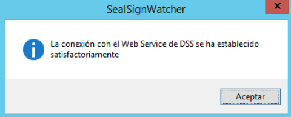
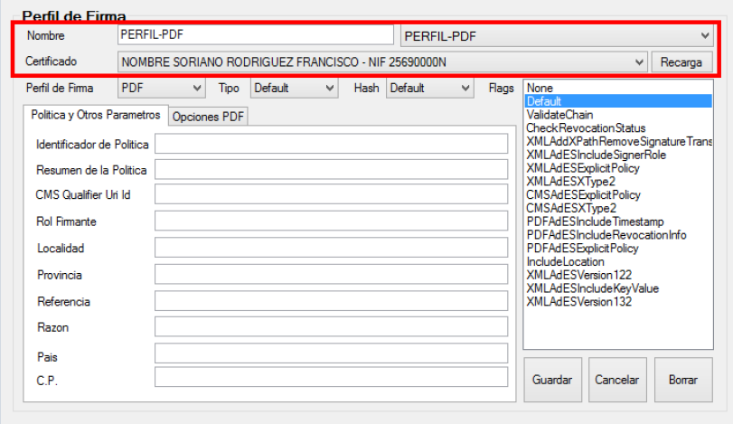
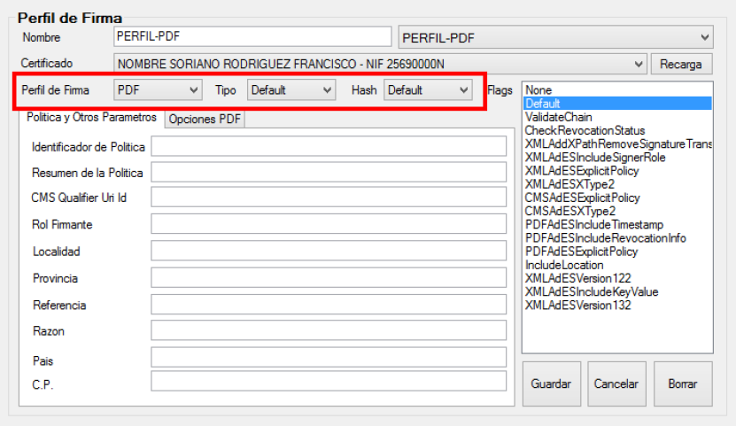
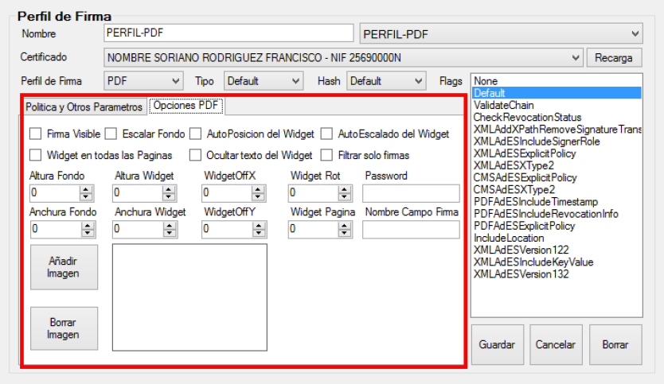
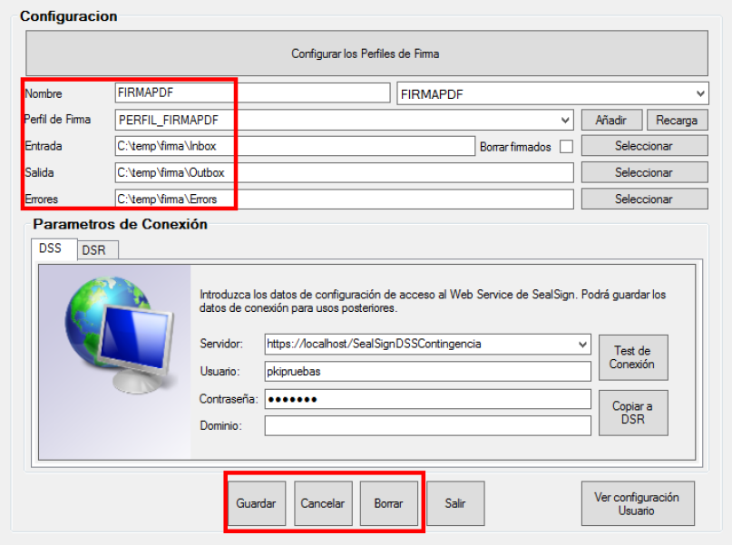

# SealSignWatcher
## 1. Introduction

**SealSignWatcher** is a massive signing solution associated with the SealSign platform. SealSignWatcher mainly consists of two key components: an agent and a configuration administration tool.

The agent is responsible for monitoring the selected folders, which is the basis for performing the massive signing. On the other hand, the administration tool is used to manage the application's various configurations, such as the connection parameters to SealSign, the folders to be monitored, and the signing profiles associated with each folder.

Summary of SealSignWatcher components:

• The agent:
1. SealSignWatcherAgent.
2. SealSignWatcherService.

• Configuration Tool:
1. SealSignWatcher.

## 2. Installation Requirements

The following elements are required for the installation:

- Windows XP SP3 Operating System or higher
- Compatibility with virtualized environments (VMWare, VirtualBox, HyperV).
- .NET Framework 4.0 Client Profile.
- At least 1GB of free disk space.

## 3. Installation

To perform the installation, the user account running the installer must have administrative privileges. A computer restart is not required to complete the installation. 
The installation is performed by running:
**SealSignWatcherSetup.msi**

To verify or check if the software is installed on the machine, open the *Control Panel* and go to the *Programs and Features* section. The system will build the list of installed software. One of the items in the list must refer to **SealSignWatcher**, as shown in the following image.

<i>*Image 01: SealSignWatcher*</i>

 

Uninstallation is performed from the *Programs and Features* option in the *Control Panel*, as with any other Microsoft Windows application. In the displayed list, locate the **SealSignWatcher** entry and select uninstall.
Please note that only users with administrative privileges can uninstall the software.

## 4. Administration

Once the SealSignWatcher module is installed, the administrative tasks can be performed. To do so, you can run the SealSignWatcher shortcut created on the desktop or in the Start menu.

The main administrative tasks are:
1. Configuring the connection to the SealSign DSS service.
2. Configuring the signing profiles.
3. Configuring the folders to be monitored and their association with the chosen profile.
4. Configuring the SealSignWatcher agent as a user agent or as a Windows service.
5. Configuring the connection to the SealSign DSR service (Optional).

### 4.1. Configuring the connection to the SealSign DSS service
To configure the connection, go to the Connection Parameters - DSS section on the main application window:

<i>*Image 02: Configuring the connection to the DSS service*</i>

 

Enter the URL of the SealSign DSS Service (for example: https://localhost/SealSignDSSService/SignatureServiceBasic.svc/BSSLB) and optionally (not required for Integrated Active Directory authentication) the User, Password, and Domain fields.

At the bottom, 4 buttons appear with the following functionality:

- Save ("Guardar"): Stores the configured profile if the connection is successful.
- Cancel ("Cancelar"): Resets the text fields to their default values.
- Delete ("Borrar"): Removes the signing profile.
- Copy to DSR ("Copiar a DSR"): Copies the DSS connection configuration to DSR.

After entering these details, click the *Test Connection* ("Test de conexión") button. If the configuration is correct, the following window appears.

<i>*Image 03: Connection successful*</i>

 

### 4.2. Configuring the signing profiles
To configure the signing profiles, click *Configure Signing Profiles* ("Configurar los perfiles de firma"), and the following window appears:

<i>*Image 04: Configuring the signing profiles*</i>

 

These parameters are detailed below:

- Name: Name of the electronic signature profile. This is a unique identifier for each profile.
- Certificate: The certificate used to perform the electronic signing of documents.

<i>*Image 05: Configuring the signing profiles (Name and Certificate)*</i>

 

- Signature Profile: Dropdown menu with the following types of signature profiles.
1. Default(CMS)
2. CMS
3. CAdESBES
4. CAdEST
5. CAdESC
6. CAdESX
7. CAdESXL
8. CAdESA
9. XMLDigSig
10. XAdESBES
11. XAdEST
12. XAdESC
13. XAdESX
14. XAdESXL
15. XAdESA
16. PDF
17. PAdESBasic
18. PAdESBES
19. PAdESLTV
20. PAdESXML
21. Office

• Type: A dropdown menu to select how the signature is stored.
1. Default: Uses the default signature storage format (Enveloped).
2. Enveloped: The signature is stored within the document.
3. Enveloping: The signature is stored in a way that wraps/contains the document inside.
4. Detached: The signature is stored separate from the document.

• Hash: Hash algorithm to use: SHA1, SHA2, etc.
Image

<i>*Image 06: Configuring the signing profiles (Signature Profile, Type, and Hash)*</i>

 

• Flags:
1. None: Does not specify any signing flags.
2. Default: Uses the default values for the signature. These values will be composed based on the options selected in the administration tool.
3. ValidateChain: Validates the certificate chain before signing.
4. CheckRevocationStatus: Checks the revocation status before signing.
5. XMLAddXPathRemoveSignatureTransform: Applies the XPath signature removal transform before signing. This flag allows signing only the document content, excluding any previously performed signatures.
6. XMLAdESIncludeSignerRole: Includes the signer's role in the XAdES signature.
7. XMLAdESExplicitPolicy: Explicitly includes the signature policy in the XAdES signature.
8. XMLAdESXType2: Performs a type 2 XAdES-X or XAdES-XL signature.
9. CMSAdESExplicitPolicy: Explicitly includes the signature policy in the CAdES signature.
10. CMSAdESXType2: Performs a type 2 CAdES-X or CAdES-XL signature.
11. PDFAdESIncludeTimestamp: Includes timestamp information in the PAdES signature.
12. PDFAdESIncludeRevocationInfo: Includes revocation information in the PAdES signature.

<i>*Image 07: Configuring the signing profiles (Flags)*</i>

 

• Policy and Other Parameters: Displays a form for configuring the following parameters associated with advanced signatures.
1. Policy Identifier: Text string that specifies the identifier of the policy applied to the signature.
2. Policy Summary: Text string that specifies the summary of the policy applied to the signature.
3. Signer Role: Text string that specifies the role of the signer.
4. City/Locality: Text string that specifies the locality where the signature is performed.
5. State/Province: Text string that specifies the state or province where the signature is performed.
6. Reference: Reference within the XML document to which the signature should be applied.
7. Reason: Text string indicating the reason for the signature.
8. Country: Text string that specifies the country where the signature is performed.
9. Postal Code: Text string that specifies the postal code where the signature is performed.

<i>*Image 08: Configuring the signing profiles (Policy and Other Parameters)*</i>

 

• PDF Options: signature parameters available only if PDF or any of the PAdES formats are selected in the Signature Profile dropdown:
1. Password: PDF decryption password.
2. Signature Field Name: Allows specifying the name of a field in the PDF document where the signature will be saved.
3. Visible Signature: Boolean indicating whether the signature widget will be visible in the document resulting from the signing operation.
4. Image (Add/Delete Image): Background image to be included in the signature widget. The format must be JPG. By default, it automatically scales to fit the widget size while maintaining its aspect ratio.
5. Scale Background: Boolean indicating whether the background image will automatically adjust to the widget size.
6. Background Width: Width of the original image specified in PDFSignatureBackground or the width of the original image to crop.
7. Background Height: Height of the original image specified in PDFSignatureBackground or the height of the original image to crop.
8. Widget AutoPosition: Boolean that indicates whether the signature widget will be automatically positioned or if the values of the WidgetOffX and WidgetOffY parameters will be used. If autopositioning is enabled, the widget will appear in the top-right corner of the page.
9. WidgetOffX: Specifies in pixels the X coordinate, measured from the bottom-left corner of the page, where the signature widget will appear.
10. WidgetOffY: Specifies in pixels the Y coordinate, measured from the bottom-left corner of the page, where the signature widget will appear.
11. Widget AutoScale: Boolean indicating whether the signature widget will be automatically resized or if the Widget Height and Widget Width values will be used.
12. Widget Height: Height of the signature widget in pixels.
13. Widget Width: Width of the signature widget in pixels.
14. Widget Rot: Specifies the rotation angle of the signature widget. Its possible values are 0, 90, 180, or 270.
15. Widget on All Pages: Indicates whether the signature widget should be included on all pages of the document.
16. Widget Page: Indicates the page number where the signature widget will be included.
17. Filter only signatures: In signature verification, indicates whether only document-type signatures or any other signature included in the PDF will be validated.
18. Hide Widget Text: Boolean indicating whether the widget will hide the automatic text describing the signer.

<i>*Image 09: PDF Options*</i>

 

Finally, under the "Flags" list, the following buttons are available: *Save* ("Guardar") button, which stores the configuration encrypted in the registry; *Cancel* ("Cancelar"), which resets the form fields; and *Delete* ("Borrar"), which resets the form fields and removes the configuration from the registry.

### 4.3. Configuring folders to monitor and association with the chosen profile
The main screen is shown in the figure below:

<i>*Image 10: Folder configuration.*</i>

 

In this window, we enter the data of the folder to be monitored, such as:

- Name: Name of the Profile configuration. This is an identifying value for each monitored folder configuration.
- Signature Profile: Signature profile associated with the configuration.
- Input: Origin folder of the documents to be signed in bulk.
- Output: Destination folder for the documents once they are signed.
- Errors: Folder where documents that could not be signed will be placed.

At the bottom of this window, there are buttons to manage this data:

- The Save ("Guardar") button stores the configuration encrypted in the registry.
- The Cancel ("Cancelar") button resets the form fields.
- The Delete ("Borrar") button resets the form fields and removes the configuration from the registry.
SealSignWatcher supports multiple configurations, but only one per input folder.

### 4.4. Configuring the SealSignWatcher agent as a user agent or as a Windows service
On the initial screen, there is a button responsible for configuring the running mode. There are two options:

- As a user agent, where the agent runs when the user logs in. To activate this mode, click the *View User configuration* ("Ver configuración usuario) button.
- As a Windows service, where the agent runs as a service and starts when the computer boots up. To activate this mode, click the "View Service configuration" button.

*Note: It is important to highlight that these two options will be available only if the application is run with administrator privileges; otherwise, they will not appear and the application will run in User Agent mode.*

### 4.5. Configuring the connection to the SealSign DSR service (Optional)
To configure the connection, in the main application window there is a section regarding the Connection Parameters, DSR:

Enter the URL of the SealSign DSR Service and optionally (not required for Integrated Active Directory authentication) the "User", "Password", and "Domain" fields, and click the "Test Connection" button. If the configuration is correct, a message will appear indicating that the connection was established successfully.

The following buttons related to this action are also included:

- The Save button saves the profile if the connection is successful.
- The Cancel button resets the text fields to their default values.
- The Delete button deletes the profile.
- The Copy to DSS button copies the DSR connection configuration to DSS.

There is an additional configuration parameter in DSR:
- Write result to DSR only: If checked, electronically signed files are not output to the configured Output directory; instead, they are stored only in the SealSign DSR document repository. If unchecked, electronically signed files are stored both in the Output directory configured in the profile and in the SealSign DSR document repository.
