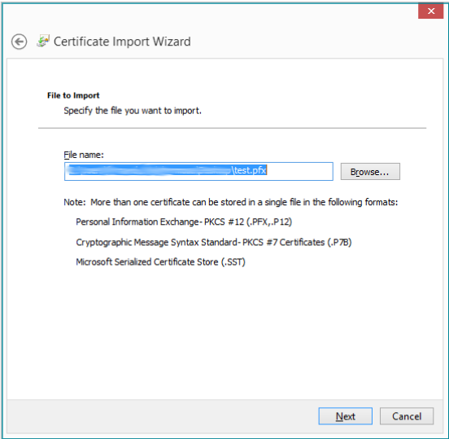
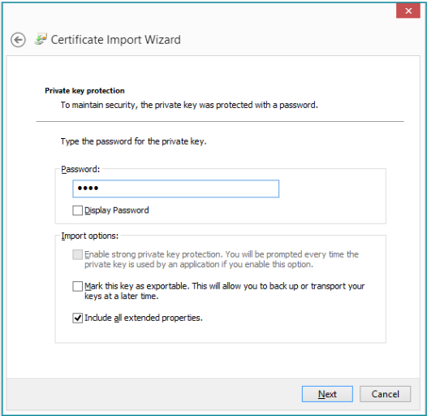
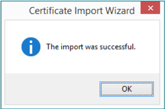
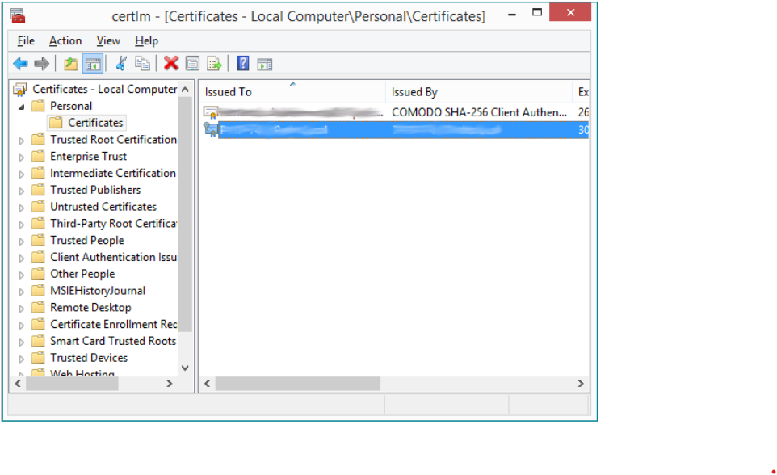
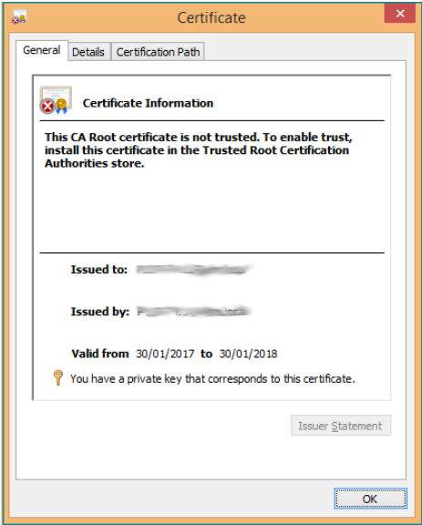
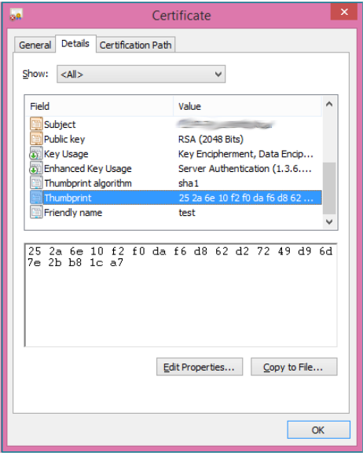
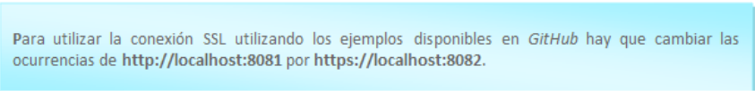
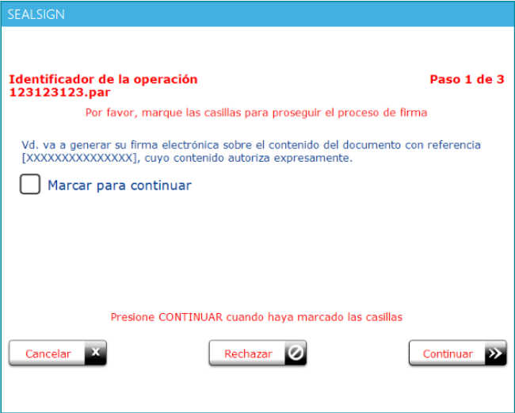
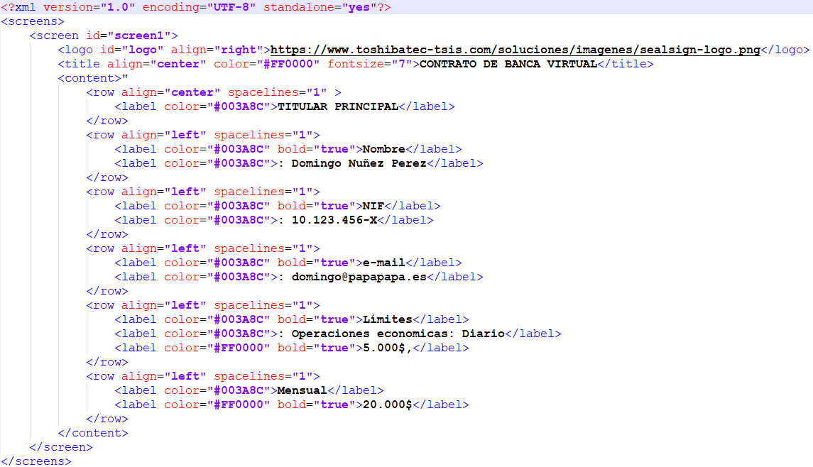

# SealSign Signature Client (ClickOnce)
## 1. Introducción

  El cliente ClickOnce de SealSign viene a sustituir en entornos Windows al Applet de Java. Su despliegue está basado en la tecnología ClickOnce de Microsoft que permite el despliegue de aplicaciones por internet. Para más información deberá visitarse el sitio de Microsoft. El cliente es capaz de comunicarse de forma bidireccional con el navegador que ha lanzado la petición de firma para conseguir un comportamiento similar a la integración del Applet con el navegador utilizando JavaScript.
  
  Esta comunicación se consigue utilizando SignalR de Microsoft. Para más información sobre SignalR puede visitarse el sitio oficial de SignalR.

  Desde el siguiente enlace podran acceder a un proyecto que contiene un ejemplo de como integrarse con el cliente de firma SealSign Signature Cliente (ClickOnce):
   - https://github.com/FactumID/SealSignClickOnceClientWebExample

## 2. Requisitos mínimos

  - El cliente funciona con .Net Framework 4.7.2 o superior
  - Los sistemas operativos soportados son:
    - Windows 7
    - Windows 8
    - Windows 10
    - Windows Server 2008 R2
    - Windows Server 2012
  - Los navegadores compatibles con SignalR son:
    - Microsoft Edge
    - Google Chrome a partir de la versión 50
    - Mozilla Firefox a partir de la versión 46

## 3. Tareas comunes

  #### 3.1. Instalación

  El cliente se distribuye como un **instalador MSI** que se instala **por equipo**, por lo que requiere elevación (permisos de administrador). La instalación:

  - Crea el icono de SealSign Signature Client en el escritorio.
  - Crea un acceso directo en el menú Inicio.
  - Configura el cliente para que arranque al iniciar sesión en Windows para todos los usuarios.

  

  *Imagen 01: Icono de SealSign ClickOnce*

  El instalador se puede ejecutar de tres formas:

  - Haciendo doble clic sobre el fichero `.msi`.
  - Desde la línea de comandos: `msiexec /i SealSign-Signature-Client-Setup.msi`
  - De forma silenciosa, sin interfaz de usuario: `msiexec /i SealSign-Signature-Client-Setup.msi /qn`

  ###### Parámetros del instalador

  El instalador acepta las siguientes propiedades en la línea de comandos. Todas son opcionales.

  | Parámetro | Finalidad |
  |---|---|
  | `UPDATEURL` | Dirección `https` del fichero `installer-version.json` donde el cliente comprueba si hay una versión nueva. El instalador debe estar en el mismo servidor y puerto que ese fichero. Si se omite, el equipo conserva el valor que ya tuviera y, si no, la dirección incluida en el paquete (si la hay). |
  | `AUTOMATICUPDATES` | `1` = este equipo busca actualizaciones, `0` = no las busca. Prevalece sobre la preferencia del usuario y bloquea la opción del menú. Si se omite, decide el usuario. |
  | `SIGNALR_HTTP_PORT` | Puerto HTTP local en el que escucha el cliente. Por defecto: `8081`. La web lo usa en `http://localhost:<puerto>/signalr`. Debe estar entre 1 y 65535, sin ceros a la izquierda, y ser distinto del puerto HTTPS. |
  | `SIGNALR_HTTPS_PORT` | Puerto HTTPS local en el que escucha el cliente. Por defecto: `8082`. La web lo usa en `https://localhost:<puerto>/signalr`. Mismas reglas que el puerto HTTP. Al cambiarlo se reconfigura automáticamente el enlace del certificado. |

  Todos los parámetros se conservan al actualizar o reparar: reinstalar sin ellos mantiene lo que el equipo ya tuviera. Si un puerto no es válido, el instalador se detiene con un mensaje.

  Ejemplos:

  ```cmd
  msiexec /i SealSign-Signature-Client-Setup.msi UPDATEURL=https://firma.miempresa.com/sealsign/installer-version.json AUTOMATICUPDATES=1
  ```

  ```cmd
  msiexec /i SealSign-Signature-Client-Setup.msi SIGNALR_HTTP_PORT=9081 SIGNALR_HTTPS_PORT=9082 /qn
  ```

  :::warning
  En entornos on-premise es obligatorio configurar el origen del sitio web permitido; de lo contrario la firma no funcionará. Ver el apartado 3.2.
  :::

  ###### Migración desde la versión anterior de ClickOnce

  En el primer arranque de cada usuario, el cliente elimina automáticamente los restos de la instalación ClickOnce antigua:

  - Su proceso en ejecución.
  - Su entrada en Programas y características.
  - Los accesos directos `.appref-ms` (escritorio y menú Inicio).
  - Su entrada de arranque con Windows.

  No hay que hacer nada manualmente.

  ###### Desinstalación

  Desinstale el cliente desde Programas y características. Se eliminan el enlace SSL, los certificados que creó el cliente y la directiva de Firefox (solo si la creó el propio cliente).

  #### 3.2. Autorizar el origen del sitio web (AllowedOrigins)

  El cliente solo atiende a sitios web autorizados. Con el valor vacío, acepta por defecto `https://sealsign.es`, `https://pre.sealsign.es` y `https://cert.sealsign.es`, por lo que **en SaaS no hay que hacer nada**. En entornos **on-premise** es **obligatorio** autorizar el origen de su sitio web.

  :::warning
  Rellenar este valor **sustituye** a los valores por defecto, no se suma a ellos. Si también utiliza sealsign.es, inclúyalo en la lista.
  :::

  El cliente lo lee del registro de Windows:

  - Clave: `HKEY_CURRENT_USER\Software\Factum Identity\SealSign Signature Client`
  - Valor: `AllowedOrigins`
  - Tipo: `REG_SZ` (un origen) o `REG_MULTI_SZ` (varios orígenes). El cliente lo crea vacío la primera vez que se abre.

  Un origen es el esquema, el dominio y el puerto si lo lleva, sin ruta. La comparación es exacta y no distingue mayúsculas de minúsculas: sin comodines y sin barra final.

  | Correcto | Incorrecto |
  |---|---|
  | `https://firma.miempresa.com` | `https://firma.miempresa.com/firmar` (lleva ruta) |
  | `http://localhost:4200` | `firma.miempresa.com` (falta el esquema) |

  Un solo origen:

  ```cmd
  reg add "HKCU\Software\Factum Identity\SealSign Signature Client" /v AllowedOrigins /t REG_SZ /d "https://firma.miempresa.com" /f
  ```

  Varios orígenes, separados por `\0`:

  ```cmd
  reg add "HKCU\Software\Factum Identity\SealSign Signature Client" /v AllowedOrigins /t REG_MULTI_SZ /d "https://firma.miempresa.com\0http://localhost:4200" /f
  ```

  Para comprobar cómo ha quedado:

  ```cmd
  reg query "HKCU\Software\Factum Identity\SealSign Signature Client" /v AllowedOrigins
  ```

  También puede editarse a mano con `regedit`.

  A tener en cuenta:

  - Es por usuario de Windows: cada persona que use el cliente en el equipo necesita el valor en su propio perfil.
  - Hay que cerrar y volver a abrir el cliente después de cambiarlo; la lista se lee al arrancar.
  - Un origen no autorizado recibe un HTTP 403, que el navegador muestra como un error de conexión o de CORS.

  #### 3.3. Despliegue masivo (GPO, Intune, SCCM)

  ###### Instalación del MSI

  - Con `msiexec` y los parámetros del apartado 3.1, lanzado desde Intune, SCCM o un script.
  - Con **instalación de software por GPO**. **No** admite propiedades del MSI, por lo que en ese caso los puertos se imponen mediante la directiva de registro (ver apartado 3.4) y los ajustes de actualización se pueden escribir en HKLM mediante script o preferencias de GPO (ver apartado 3.5).

  ###### Distribución de AllowedOrigins

  **Opción A - Preferencias de directiva de grupo (recomendada)**. Es declarativa, no necesita ningún script y se revierte con la misma facilidad con la que se aplica.

  1. Abrir la Consola de administración de directivas de grupo (GPMC) y editar el GPO que se aplique a los usuarios afectados.
  2. Ir a: Configuración de usuario → Preferencias → Configuración de Windows → Registro → Nuevo → Elemento de Registro.
  3. Rellenar la ficha:

  | Campo | Valor |
  |---|---|
  | Acción | Actualizar |
  | Subárbol | `HKEY_CURRENT_USER` |
  | Ruta de la clave | `Software\Factum Identity\SealSign Signature Client` |
  | Nombre de valor | `AllowedOrigins` |
  | Tipo de valor | `REG_MULTI_SZ` |
  | Datos del valor | `https://firma.miempresa.com` (un origen por línea) |

  4. Aceptar y enlazar el GPO a la unidad organizativa que contenga a esos usuarios.

  Se aplica en el siguiente inicio de sesión. Para forzarlo en el momento, ejecutar `gpupdate /force` en el equipo.

  **Opción B - Script de inicio de sesión**. El mismo resultado se consigue con un script de inicio de sesión, publicado desde Configuración de usuario → Directivas → Scripts, o desde Intune o SCCM ejecutándolo en contexto de usuario, usando `reg add` como se muestra en el apartado 3.2.

  #### 3.4. Puertos de conexión

  El cliente escucha en dos puertos locales, HTTP y HTTPS (por defecto 8081 y 8082). Se pueden cambiar desde el icono de la bandeja: clic derecho sobre el icono y "Configuración" → "Puertos de conexión".

  

  *Imagen 23: Submenú "Configuración" del cliente*

  

  *Imagen 24: Ventana "Puertos de conexión"*

  - Guardar requiere permisos de administrador (aviso de UAC).
  - El cliente reinicia su servidor local en caliente; no hace falta cerrarlo.
  - Se muestra una confirmación antes de aplicar el cambio.
  - Si el cliente no puede escuchar en los nuevos puertos, ofrece restaurar los anteriores.
  - Al cambiar el puerto HTTPS se reconfigura automáticamente el enlace del certificado.

  La ventana puede mostrar estos mensajes:

  | Mensaje | Significado |
  |---|---|
  | Número no válido | El puerto debe ser un entero entre 1 y 65535. |
  | Los puertos deben ser distintos | HTTP y HTTPS no pueden usar el mismo puerto. |
  | Puerto en uso por otra aplicación | Solo es un aviso: permite guardar igualmente. |
  | "Gestionado por la organización" | El campo está bloqueado por una directiva. |

  ###### Dónde se guardan los puertos

  - Clave: `HKEY_LOCAL_MACHINE\SOFTWARE\WOW6432Node\Factum Identity\SealSign Signature Client`
  - Valores: `SignalRHttpPort` y `SignalRHttpsPort`, de tipo `DWORD`. Solo se acepta un DWORD entre 1 y 65535.

  ###### Orden de prioridad

  Para cada puerto, gana el primer valor válido:

  | Orden | Origen | Ubicación |
  |---|---|---|
  | 1 | Directiva | `HKLM\SOFTWARE\Policies\Factum Identity\SealSign Signature Client` (mismos nombres DWORD) |
  | 2 | Equipo | `HKLM\SOFTWARE\WOW6432Node\Factum Identity\SealSign Signature Client` (lo escribe el instalador) |
  | 3 | Usuario | `HKCU\Software\Factum Identity\SealSign Signature Client` |
  | 4 | Por defecto | 8081 y 8082 |

  La directiva es la forma en que un GPO impone los puertos, y bloquea el campo en la ventana. Si los puertos se cambian en el registro o por directiva, hay que reiniciar el cliente; guardar desde la ventana no lo requiere.

  #### 3.5. Actualizaciones

  El cliente puede buscar versiones nuevas y actualizarse.

  

  *Imagen 21: Menú del icono de la bandeja*

  "Comprobar actualizaciones" lanza una comprobación manual. Muestra "Ya tienes la última versión" o la ventana de actualización.

  

  *Imagen 22: Menú con "Comprobar actualizaciones" en gris*

  La opción aparece en gris cuando las actualizaciones automáticas están desactivadas (el usuario desmarcó "Buscar actualizaciones automáticamente", o se instaló con `AUTOMATICUPDATES=0`) o cuando el equipo no tiene dirección de actualización (`UpdateManifestUrl` vacío).

  La opción "Buscar actualizaciones automáticamente" está en el submenú "Configuración" (Imagen 23). Cuando la fija el administrador, aparece en gris con el aviso "Gestionado por el administrador".

  ###### Cómo funciona

  - Al arrancar, el cliente comprueba en silencio. Si hay una versión más reciente, la opción del menú pasa a decir "Actualización disponible".
  - Al iniciar una firma aparece una ventana no bloqueante, sin interrumpir la firma.
  - La ventana tiene una casilla "No volver a mostrar este mensaje", que silencia solo esa versión.
  - "Actualizar" descarga el instalador, verifica su firma, pide UAC, cierra el cliente y lo vuelve a abrir tras instalar.

  

  *Imagen 25: Ventana "Actualización disponible"*

  ###### Quién decide

  Gana la primera fuente que tenga valor:

  | Orden | Origen | Ubicación |
  |---|---|---|
  | 1 | Equipo | `HKLM\SOFTWARE\WOW6432Node\Factum Identity\SealSign Signature Client`, valor `AutomaticUpdates` (`REG_SZ` "0" o "1", lo escribe `AUTOMATICUPDATES`) |
  | 2 | Usuario | `HKCU\Software\Factum Identity\SealSign Signature Client`, valor `AutomaticUpdates` |
  | 3 | Ninguno | Se buscan actualizaciones |

  Vacío no es lo mismo que 0: vacío significa que el equipo no dice nada, y entonces decide el usuario. Use `REG_SZ`, no `DWORD`.

  ###### Dirección de actualización

  `UpdateManifestUrl`, en la misma clave `HKLM\SOFTWARE\WOW6432Node\Factum Identity\SealSign Signature Client`, escrito por `UPDATEURL`. La rama `WOW6432Node` es obligatoria: el cliente es una aplicación de 32 bits.

  ###### Requisitos del servidor de actualizaciones on-premise

  - Tanto el manifiesto como el instalador deben servirse por `https`.
  - El instalador debe estar en el mismo servidor y puerto que `installer-version.json`.
  - El MSI debe llevar una firma Authenticode válida de Factum; en caso contrario se rechaza.

  #### 3.6. Configuración del cliente JavaScript

  En este tutorial se explica en detalle cómo configurar un entorno con SignalR, y en el ejemplo alojado en el gitHub de Factum se encuentra todo el código necesario para hacerlo funcionar. Una vez lanzado, el cliente se queda escuchando en los puertos configurados (por defecto 8081 HTTP y 8082 HTTPS, ver apartado 3.4). En la parte de JavaScript habrá que:

  - Referenciar al código JavaScript del hub, situada en la URL: `http://localhost:<puerto http>/signalr/hubs` o `https://localhost:<puerto https>/signalr/hubs` (por defecto 8081 y 8082)

  - Indicar cuál es la URL del hub. 
  ```javascript
  $.connection.hub.url = "http://localhost:8081/signalr"; // o "https://localhost:8082/signalr" (use los puertos configurados)
  ```

  - El nombre del hub de SignalR es sealSignHub. 
  ```javascript
  var hub = $.connection.sealSignHub;
  ```
  - La  aplicación  realiza  llamadas  a  diferentes métodos del cliente JavaScript, tanto  para notificar que está  realizando  alguna  tarea,  como  para  notificar  que  ha  terminado  esa  tarea,  o  para  indicar  al navegador que debe redireccionar a una URL. Los métodos son:
    - Navigate:la aplicación comunica al cliente que debe navegar a la URL que le pasa por parámetro. Normalmente será una de las URLs que se han definido como de éxito, cancelación, rechazo o error. Uso: 
      ```javascript
      hub.client.Navigate = function (url) {  }
      ```
    - AsyncOperationStarted:la  aplicación  notifica  al  cliente  que  ha  comenzado  una  operación asíncrona y de larga duración. A partir de este punto el cliente JavaScriptdebería ceder el control al   componente ClickOnce.   Adjunta   un   mensaje   con   los   detalles   de   la   operación.   Uso: 
      ```javascript
      hub.client.AsyncOperationStarted = function(message){ }
      ```
    - AsyncOperationCompleted:la  aplicación  notifica  al  cliente  que  ya  ha  terminado  y  que  puede tomar el control. La función recibira por parametro un Json con la información del estado del proceso de firma realizado, junto al documento en Base64.

      Json recibido por parametro:

      ```json 
      { 
        "Content":null, // Documento en Base64
        "Custody":false, // Si se configuró la custodia documental
        "FileName":null, // Nombre del documento
        "BiometricSignatureGraph":"", // Grafo de la firma en formato jpg
        "Signed":false, // Si la firma se ha realizado 
        "Status":"Canceled", // Estatus de la firma en formato texto (Canceled, CanceledExternally, Rejected, Finish)
        "Error":false, // Si se producido un error
        "ErrorMessage":null, // Mensaje de error 
        "IsExternalBiometricSignature":false, // Si es una firma externa
        "IsCertificateSignature":false, // Si es una firma con certificado
        "IsBiometricSignature":true // Si es una firma biométrica
      } 
      ```
      Uso: 
      ```javascript
      hub.client.AsyncOperationCompleted = function(response){ }
      ```
    - AsyncOperationInProgress: la aplicación notifica al cliente que ya hay una firma en curso. Uso: 
      ```javascript
      hub.client.AsyncOperationInProgress = function(){ }
      ```

  #### 3.7. Configuración de la versión del servidor

  El  cliente  soporta  tanto  la  versión  3.2  como  la  4.0  de  SealSign,  pero  hay  que  indicar  qué  versión  se  está utilizando. Para configurar la versión que se está utilizando hay que llamar al método setServerVersion con alguno de estos dos valores:

  - V32: para utilizar la versión 3.2
  - V40: para utilizar la versión 4.0 o posteriores

  Si no se llamara a la función, por defecto se utilizará la versión 3.2.

## 4. Casos de uso

  #### 4.1. Ejecución del cliente y lanzar al arrancar Windows

  Una vez instalado el cliente aparecerá el icono en el escritorio, para lanzarlo sólo hay que hacer click en él, aparecerá el siguiente mensaje.

  

  *Imagen 02: Mensaje del Cliente*

  El cliente se puede configurar para que se arranque cuando se inicie sesión en Windows, para ello hay que hacer click con el botón derecho sobre el icono de la bandeja e ir a “Configuración” → “Ejecutar al arrancar el equipo”. El MSI deja esta opción activada para todos los usuarios. Un usuario estándar la ve en gris; un administrador puede cambiarla (aviso de UAC).

  

  *Imagen 23: Submenú “Configuración” del cliente*

  #### 4.2. Utilizar conexión SSL

  Para utilizar la conexión segura **SSL (HTTPS)** es necesario tener **instalado el SealSign Signature Client**.

  Con el instalador MSI, HTTPS se configura durante la instalación sin pedir nada al usuario.

  El cliente prepara lo siguiente:

  - Un certificado autofirmado `CN=localhost` en el almacén del equipo local, de confianza como certificado raíz.
  - El enlace de ese certificado al puerto HTTPS.
  - La directiva de Firefox `EnterpriseRootsEnabled`, solo si no existía ya.

  Si el cliente se instala de otra forma, o SSL aún no se ha configurado, la primera vez que se lance el cliente aparecerá una ventana del sistema solicitando permiso para realizar cambios en el equipo:

  - **Usuarios con privilegios de administrador**  
      Se les pedirá confirmar la autorización.

  - **Usuarios sin privilegios de administrador**  
      Se les pedirá introducir credenciales de administrador.

  ---

  #### Comportamiento cuando no se autoriza la configuración SSL

  Si la autorización **no se acepta** o **no se proporcionan** las credenciales necesarias, la configuración SSL **no se aplicará** y el cliente de firma funcionará mediante una **conexión HTTP**.

  Además, **cada vez que se cierre y se vuelva a abrir el cliente de firma**, volverá a aparecer la solicitud de autorización o de credenciales. Si el usuario rechaza el aviso de UAC, no se le vuelve a preguntar para ese puerto.

  ---

  #### Cómo evitar que aparezca la solicitud de autorización

  Para evitar que esta solicitud aparezca repetidamente, puede **desactivar la gestión automática de SSL**:

  1. Localice el icono del cliente de firma en la **bandeja del sistema**.

  2. Vaya a “Configuración” y desmarque la opción **“Configurar HTTPS local automáticamente”**.

  Con esto el cliente dejará de solicitar autorización en cada arranque.

  ---

  #### Activación correcta de la conexión SSL (HTTPS)

  Si la autorización se acepta o las credenciales se introducen correctamente:

  - El cliente de firma configurará SSL automáticamente.

  - A partir de ese momento se conectará mediante **HTTPS** por **el puerto HTTPS configurado (8082 por defecto)**.

  ---

  #### Nota importante para entornos con muchos usuarios sin privilegios

  En entornos donde **la mayoría de usuarios no tiene privilegios de administrador** y **introducir credenciales manualmente en cada equipo no es viable**, se recomienda el siguiente procedimiento:

  1. Instale el cliente de firma SealSign.

  2. **No introduzca credenciales** cuando se le soliciten.

  3. Desactive **“Configurar HTTPS local automáticamente”** desde el submenú “Configuración” de la bandeja del sistema.

     

  4. Ejecute el apartado **4.2.1** de esta documentación.

  ###### 4.2.1. Configuración del certificado

  Para poder utilizar una conexión SSL entre la web y el cliente de SealSign hay que instalar un certificado en el equipo cliente y enlazarlo al puerto HTTPS configurado (8082 por defecto).

  Instalación del certificado en el almacén. El certificado a instalar tiene que contener la clave pública y la clave privada. Para instalarlo hacemos doble click sobre el archivo. Se muestra un asistente para hacer la instalación.

  

  *Imagen 04: Asistente de importación de certificados*

  Seleccionamos el almacén “Equipo local” y pulsamos “Siguiente”. En la siguiente pantalla, pulsamos “Siguiente”.

  

  *Imagen 05: Elección del certificado a importar*

  En la siguiente pantalla introducimos la contraseña del certificado y pulsamos “Siguiente”

  

  *Imagen 06: Protección de la clave privada*

  En la siguiente pantalla marcar la opción “Colocar todos los certificados en el siguiente almacén” y seleccionar el almacén “Personal” y pulsar “Siguiente”.

  

  *Imagen 07: Ubicación de los certificados*

  En la ventana de resumen, pulsar “Finalizar”

  

  *Imagen 08: Finalización de la importación*

  Si no hay ningún problema deberíamos ver el siguiente mensaje:

  

  *Imagen 09: Certificado importado correctamente*

  Una vez instalado el certificado, se lanza el administrador de certificados, para ello pulsamos la tecla Windows + R  e  introducimos  “certlm.msc”,  dentro  del  almacén Personal buscamos  el  certificado  que  importamos anteriormente.

  

  *Imagen 10: Almacén de certificados*

  Haciendo doble click sobre el certificado se mostrarán los detalles del mismo.

  

  *Imagen 11: Propiedades del certificado*

  En la pestaña detalles seleccionar la propiedad “Huella digital”

  

  *Imagen 12: Huella digital del certificado*

  Con ese valor, hay que abrir la consola en modo administrador y ejecutar el siguiente comando: 
  ```
  netsh http add sslcert certhash=<certificate hash> ipport=0.0.0.0:<https port> appid={00112233-4455-6677-8899-AABBCCDDEEFF}
  ```
  Con esta última instrucción se asocia el certificado al puerto HTTPS.

  

  ###### 4.2.2. Utilizar SSL

  Para que el cliente utilice una conexión SSL hay que seleccionar la opción.
  - Referenciar al código JavaScript del hub, situada en la URL: `https://localhost:<puerto https>/signalr/hubs` (el puerto HTTPS configurado, 8082 por defecto)
  - Indicar cuál es la URL del hub. `$.connection.hub.url = "https://localhost:<puerto https>/signalr";`

  #### 4.3. Firma Digital

  Aquí se describe qué funciones se publican para realizar la firma digital de documentos, así como las funciones del cliente JavaScript que se invocan para notificar el progreso y la finalización del proceso.

  ###### 4.3.1. Filtrado de certificados

  A la hora de realizar la firma digital se pueden filtrar los certificados que se mostrarán en el listado. El filtrado se puede hacer por issuer, por hash y por serial number:
  - **setCertificateIssuerFilter**: Filtra por issuer, recibe como parámetro los issuers válidos separados por ‘|’. Se usa para mostrar únicamente los certificados del DNIe: hub.server.setCertificateIssuerFilter('AC DNIE 001');
  - **setCertifciateHashFilter**: Filtra por hash, recibe como parámetro el hash del certificado con el que se firmará. Uso:hub.server.setCertificateHashFilter('[HASH]');
  - **setCertificateSerialFilter**: Filtra por el serial number del certificado. Uso: hub.server.setCertificateSerialFilter('[SERIAL NUMBER]');

  ###### 4.3.2. Reinicio de filtros

  Para eliminar todos los filtros establecidos a los certificados hay que llamar a la función resetCertificateFilters.

  ###### 4.3.3. Carga de un certificado local

  Se puede realizar la firma de un documento utilizando un certificado almacenado en local, para ello hay que llamar a la función loadLocalCertificate, para dejar de usar ese certificado hay que llamar a la función clearLocalCertificate. 

  ###### 4.3.4. Firma del documento 

  Se puede realizar el proceso de firma de las siguientes formas. 

  - **Parámetros**: Todas las sobrecargas de método digitalSign reciben como primer parámetro un array de string donde se parametriza la firma, estos parámetros son: 
    - URI del documento. 
    - URL del servicio. 
    - URL de éxito. 
    - URL de error. 
    - URL de cancelación. 
    - Usuario de autenticación básica. 
    - Contraseña de autenticación básica. 

  Todos los parámetros son obligatorios, si alguno de ellos debe pasarse vacío se pasará como null. 

  - **digitalSign (string[])**: Se firma el documento según los parámetros pasados utilizando la configuración por defecto del document provider. 
  - **digitalSign (string[], string)**: Se firma el documento según los parámetros pasados utilizando la configuración del document provider pasada como segundo argumento. 
  - **digitalSignUrl(string[], string)**: Se firma el documento que se encuentra en la URL dada. Se utiliza el document provider con la configuración por defecto. 
  - **digitalSignUrl(string[], string, string)**: Se firma el documento que se encuentra en la URL dada. El último parámetro son los parámetros para utilizar con el document provider. 
  - **digitalSignBase64(string[], string)**: Se firma el documento que se ha pasado como parámetro en base 64. Se utiliza el document provider con la configuración por defecto. 
  - **digitalSignBase64(string[], string, string)**: Se firma el documento que se ha pasado como parámetro en base 64. El último parámetro son los parámetros para utilizar con el document provider. 
  - **digitalMultiSign (string[], string)**: Se firma una lista de documentos utilizando la configuración por defecto del document provider 
  - **digitalMultiSign (string[], string, string)**: Se firma una lista de documentos que se han pasado como parámetro. El último parámetro son los parámetros para utilizar con el document provider. 

  ###### 4.3.5. Uso de Remote Document Provider

  Para utilizar los Remote Document Providerhay que configurar los parámetros de configuración, para ello hay que seguir los siguientes pasos:
  - Configurar la versión del servidor a la 4.0 realizando una llamada al método setServerVersion con el valor ‘V40’.
  - Llamar a la función setDSSRemoteProviderConfiguration con los siguientes parámetros:
    - url: la url donde está alojado el Remote Document Provider.
    - domain: dominio del usuario con el que se va a autenticar la llamada al Remote Document Provider.
    - user: usuariocon el que se va a autenticar la llamada al Remote Document Provider.
    - password: contraseña del usuario con el que se autenticará la llamada al Remote Document Provider.
    
  Importante: si llamada necesita ser autenticada, la autenticación será básica.

  #### 4.4 Firma Biométrica 

  ###### 4.4.1 Requisitos previos para poder realizar la firma biometrica

  - En caso de realizar la firma con tabletas ePad-Ink es necesario tener instalado en el ordenador el driver de ePad de 32 bits.
  - En caso de realizar la firma con una wacom STU-540 o superior se debe tener instalado en el ordenador Java de 32 bits 

  ###### 4.4.2 Configuración del dispositivo

  Las siguientes funciones solo afectan a los dispositivos Wacom: 

  - **setClearImage**: Establece la imagen de fondo de la tableta cuando se completa el proceso de firma. La imagen se pasa en base64. 
  - **setClearImageUrl**: Establece la imagen de fondo de la tableta cuando se completa el proceso de firma. La imagen está alojada en la URL pasada por parámetro. 
  
  ###### 4.4.3 Firma del documento

  - **Parámetros**: El primer parámetro de las diferentes firmas de los métodos de firma biométrica es un array de string que configura el comportamiento del componente. 
    - URI del documento 
    - URL del servicio 
    - URL del documento a firmar 
    - Padding X esquina inferior izquierda 
    - Padding Y esquina inferior izquierda 
    - URL de éxito 
    - URL de error 
    - URL de cancelación 
    - URL de rechazo 
    - Usuario de autenticación básica 
    - Contraseña de autenticación básica 
    - Color de fondo del título de la vista de aceptación 
    - Título de la vista de aceptación 
    - Color del título de la vista de aceptación 
    - Identificador 
    - Etiqueta “Paso” 
    - Etiqueta “de” 
    - Botón Firmar – Pantalla de firma 
    - Botón Continuar - en todas las pantallas 
    - Botón Borrar – Pantalla de Firma 
    - Botón Cancelar – en todas las pantallas 
    - Botón Rechazar – en todas las pantallas 
    - Texto OPCIONAL superior en la pantalla de firma 
    - XML con la configuración del formulario de las pantallas previas (Opcional, se puede dejar en blanco en caso de que no se deseen mostrar pantallas previas)  
    _**NOTA: Este parámetro es opcional solo en versiones superiores a la v4.4**_
    - XML con la configuración del formulario de la pantalla final con el panel de firma (Opcional, se puede dejar en blanco en caso de que no se desee personalizar la pantalla final)  
    _**NOTA: Este parámetro se añade apartir de versiones superiores a la 4.4**_
    - Parámetros de personalizacion global (Tipo de letra, Ancho y alto de la venta, Tamaño de letra) 
  - **Formulario de pantallas previas**: Para el proceso de firma manuscrita se puede añadir un formulario en el que el usuario deba seleccionar varios checks para poder avanzar en el proceso y, finalmente, realizar la firma. La configuración de este formulario es el último parámetro de los descritos en el apartado anterior.

  Este es un ejemplo de un XML válido: 

  

  En el XML se definen las pantallas que va a haber con el nodo screen. Cada nodo screen puede tener varios controles dentro, estos controles pueden ser o bien etiquetas, definidas en los nodos text, o checkboxes, definidos en los nodos checkbox. Estos checkboxes pueden ser obligatorios para poder avanzar en el proceso de firma. Si son obligatorios o no se define en el atributo mandatory del nodo checkbox del fichero XML, si su valor es 1 es obligatorio y si es 0 es opcional. 

  Además de esta configuración de pantallas, se utilizan algunos de los parámetros para configurar el look & feel. 

  

  - **Formulario de personalización de pantalla final**: Para el proceso de firma manuscrita se puede añadir un formulario XML donde el usuario puede personalizar la pantalla final donde se introduce el garabato de la firma. Esta personalización no permite modificar los botones que aparecen en pantalla final ni la linea de guia para la firma.

  Este es un ejemplo de un XML válido: 

  

  Es recomendable descargar el código de ejemplo desde la página de GitHub de FactumID para familiarizarse con esos parámetros y ver cómo afectan a la pantalla. 

    - **bioSign(string[])**: Lanza el proceso de firma parametrizado con la configuración que se pasa por argumento. Usa el document provider asociado a la URI del documento y su parametrización por defecto. 
    - **bioSign(string[], string)**: Lanza el proceso de firma parametrizado con la configuración que se pasa por argumento. Usa el document provider asociado a la URI del documento al que se le pasan los parámetros del segundo argumento. 
    - **bioSignUrl(string[], string)**: Lanza el proceso de firma parametrizado con la configuración que se pasa por argumento. Se firma el documento del que se ha dado su URL, usa el document provider asociado a la URI del documento y su parametrización por defecto.  
    - **bioSignUrl(string[], string, string)**: Lanza el proceso de firma parametrizado con la configuración que se pasa por argumento. Se firma el documento del que se ha dado su URL, usa el document provider asociado a la URI del documento al que se le pasan los parámetros del segundo argumento.  
    - **bioSignBase64(string[], string)**: Lanza el proceso de firma parametrizado con la configuración que se pasa por argumento. Se firma el documento que se ha puesto en el segundo parámetro en base64, usa el document provider asociado a la URI del documento y su parametrización por defecto. 
    - **bioSignBase64(string[], string, string)**: Lanza el proceso de firma parametrizado con la configuración que se pasa por argumento. Se firma el documento que se ha puesto en el segundo parámetro en base64, usa el document provider asociado a la URI del documento al que se le pasan los parámetros del segundo argumento. 

  ###### 4.4.4 Uso de Remote Document Provider

  Para utilizar los Remote Document Provider hay que configurar los parámetros de configuración, para ello hay que seguir los siguientes pasos:
  - Configurar la versión del servidor a la 4.0 realizando una llamada al método setServerVersion con el valor ‘V40’.
  - Llamar a la función setDSSRemoteProviderConfiguration con los siguientes parámetros:
    - url: la url donde está alojado el Remote Document Provider.
    - domain: dominio del usuario con el que se va a autenticar la llamada al Remote Document Provider.
    - user: usuario con el que se va a autenticar la llamada al Remote Document Provider.
    - password: contraseña del usuario con el que se autenticará la llamada al Remote Document Provider.
    
  Importante:si llamada necesita ser autenticada, la autenticación será básica.

  #### 4.5 Enrollment

  - **Parámetros**: El primer parámetro de las diferentes firmas de los métodos de firma biométrica es un array de string que configura el comportamiento del componente. 
    - URL del servicio 
    - URL de éxito 
    - URL de error 
    - URL de cancelación 
    - Usuario de autenticación básica 
    - Contraseña de autenticación básica 
    - Usuario al que se le hara el enrollment (Opcional), de no pasar este parámetro el enrollment se le aplicara al usuario que autentica el servicio 
    - Texto del botón Cancelar 
    - Texto del botón Borrar 
    - Texto del botón Firmar 
    - Parámetros de personalizacion global (Tipo de letra, Ancho y alto de la venta, Tamaño de letra) 
    - XML con la configuración del formulario del panel de firma 

  La configuración de este formulario es el último parámetro de los descritos en el apartado anterior. 

  Este es un ejemplo de un XML válido: 

  

  En el XML se define las pantalla que va a haber con el nodo screen. Además de esta configuración de pantallas, se utilizan algunos de los parámetros para configurar el look & feel, como el color de letra, el logo, y el tamaño de los textos.  

  - **bioEnrollment (string[])**: Lanza el proceso de enroolment presencial de firma parametrizado con la configuración que se pasa por argumento. Usa el document provider asociado a la URI del documento y su parametrización por defecto.


  #### 4.6 Ventana
  Para cerrar la ventana se puede invocar al método de javascript closeWindow

  ```javascript
  hub.server.closeWindow();
  ```
  NOTA: Al llamar a la función CloseWindow, se cerrará la ventana de firma, y en la función AsyncOperationComplete se indicará en la respuesta el estado ```CanceledExternally```, lo que significa que el proceso de firma ha sido cancelado externamente.

  #### 4.7 Lanzar procesos externos
  Función que ejecuta un comando y que permite lanzar procesos externos desde el app de firma. Uso: 

  ```javascript
  hub.server.launchExternalApp(command);
  ```

## 5. Solución de problemas

Para solventar posibles errores con el cliente de firma **SealSign Signature Client**, intente aplicar alguna de las acciones de la siguiente lista:

#### 1. La web no consigue conectar con el cliente
- Compruebe que el origen del sitio web está autorizado en `AllowedOrigins` (ver apartado 3.2). Un origen no autorizado recibe un HTTP 403, que el navegador muestra como un error de conexión o de CORS.
- Compruebe que el cliente está en ejecución (icono en la bandeja del sistema).
- Compruebe que los puertos configurados en el cliente (apartado 3.4) coinciden con los que usa la web.

---

#### 2. Avisos de "problema de conexión SignalR"
El cliente muestra un aviso en la bandeja del sistema cuando no puede arrancar su servidor local. Según la causa:
- **Puerto en uso por otra aplicación**: cambie los puertos (apartado 3.4).
- **Acceso denegado**: ejecute o reconfigure el cliente con permisos de administrador.
- **Certificado SSL no enlazado al puerto**: vuelva a activar “Configurar HTTPS local automáticamente” o siga el apartado 4.2.1.

---

#### 3. El instalador se detiene con un error de puerto
El instalador valida `SIGNALR_HTTP_PORT` y `SIGNALR_HTTPS_PORT` y se detiene con un mensaje si no son válidos. Compruebe que cada uno es un número entre 1 y 65535, sin ceros a la izquierda (`09081` se rechaza), y que los dos son distintos.

---

#### 4. Cierre y Reinicie el Cliente de Firma
- Cierre el aplicativo **SealSign Signature Client** manualmente desde la barra de tareas.
- Refresque la caché del navegador y lance el proceso de firma nuevamente.  

> **Nota:**  
> La caché se puede refrescar ejecutando el comando:  
> ```plaintext
> CTRL + SHIFT + R
> ```  
> en la página [sealsign.es](https://sealsign.es).


###### Cómo cerrar el aplicativo:
Haga **clic derecho** en el icono de **SealSign** que se encuentra en ejecución en la barra de tareas y selecciónelo para cerrarlo.


---

#### 5. Reinstale el Cliente de Firma
- Desinstale el aplicativo **SealSign Signature Client** desde Programas y características.  
- Vuelva a ejecutar el instalador MSI.  
- Refresque la caché del navegador (CTRL + SHIFT + R en [sealsign.es](https://sealsign.es)).  
- Lance el proceso de firma de nuevo.

---

#### 6. Pruebe con un Navegador Distinto
- Intente realizar la firma con un navegador distinto al que se está usando.  
- **Si funciona con el nuevo navegador**, notifique al soporte el error, indicando el nombre del navegador donde se produjo el problema.

---

#### 7. Eliminación Completa del Cliente de Firma (Última Opción)
Si las opciones anteriores no solucionan el problema, elimine todo rastro del cliente de firma siguiendo estos pasos:

1. Verifique que el aplicativo `SealSign Signature Client` no se encuentra en ejecución.  
2. Desinstálelo desde Programas y características.
3. Si el equipo fue migrado desde la versión anterior de ClickOnce y quedan restos de ella, elimine además el contenido de las siguientes rutas en el explorador de archivos de Windows:  
  - ```plaintext
    %UserProfile%\AppData\Local\Apps
    ```
  - ```plaintext
    %UserProfile%\AppData\Roaming\11paths
    ```
4. Ejecute un CMD como administrador y ejecute el siguiente comando (también solo para instalaciones migradas desde la versión anterior de ClickOnce):  
   ```bash
   reg delete HKCU\SOFTWARE\Classes\clickonce
   ```

#### Información a Remitir al Departamento de Soporte

En caso de que ninguna de las acciones anteriormente comentadas haya solventado el problema, se deberá remitir la siguiente información al departamento de soporte:

- 🖥️ **Tipo/Modelo** y **nombre del ordenador** en el que se está llevando a cabo la firma.  
- 🌐 **Nombre y versión del navegador** que se está usando para realizar la firma.  
- ✍️ **Tipo/Modelo de la tableta digital**, en caso de estar realizando una firma biométrica.  
- 🖼️ **Evidencias o capturas del error** que se está produciendo.  
- 📝 **Breve descripción de los pasos** que ejecutó el firmante al momento de realizar la firma.  
- 📂 **Adjunte el log** que se encuentra en la siguiente ruta:  

```plaintext
%APPDATA%\SealSignBSSClient\SealSignBSSLog.log
```
