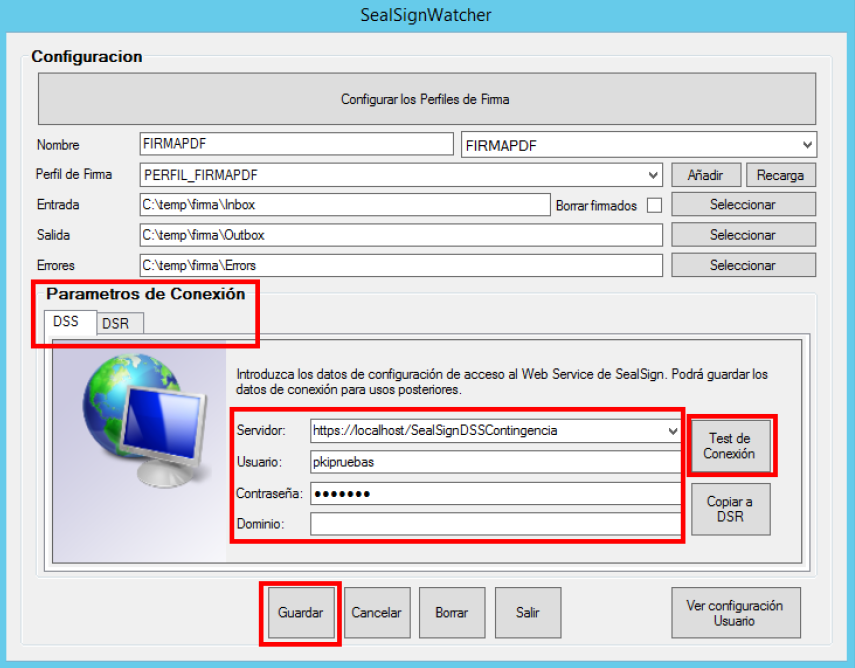
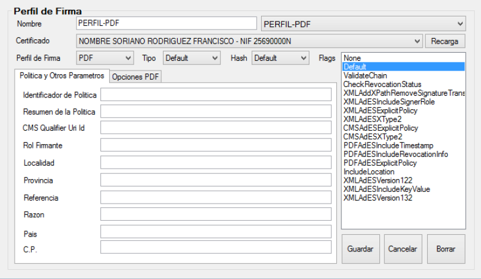
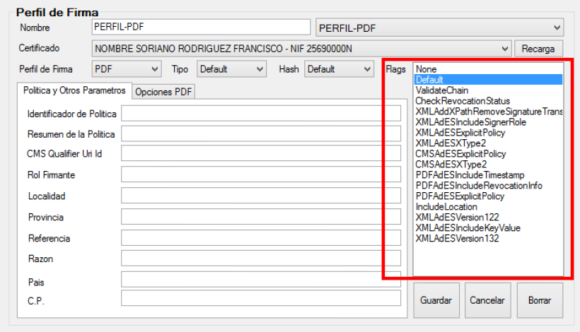
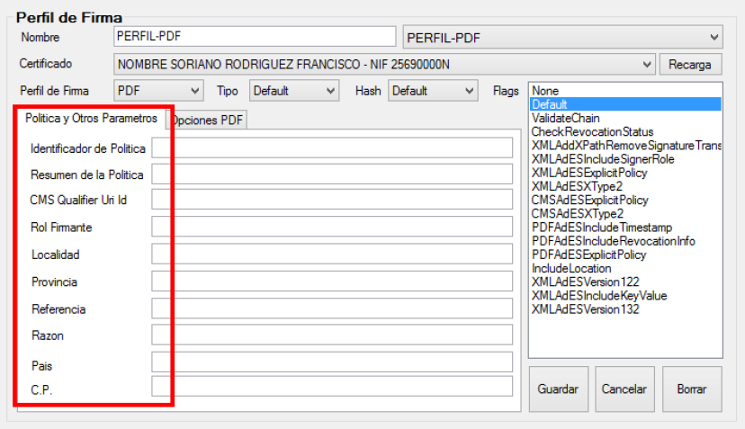

# SealSignWatcher
## 1. Introducción

**SealSignWatcher** es una solución de firma masiva asociada a la plataforma SealSign. SealSignWatcher
consta principalmente de dos partes fundamentales: un agente y una herramienta de administración de la
configuración.

El agente es el encargado de la monitorización de las carpetas seleccionadas a partir de la cual
se realiza la firma masiva. Por otro lado, la herramienta de administración es utilizada para la gestión de las
distintas configuraciones de la aplicación, tales como los parámetros de conexión a SealSign, las carpetas a
monitorizar y los perfiles de firma asociados a cada carpeta.

Resumen de los componentes de SealSignWatcher:

• El agente:
1. SealSignWatcherAgent.
2. SealSignWatcherService.

• Herramienta de Configuración:
1. SealSignWatcher.

## 2. Requisitos de instalación

Para la instalación son necesarios los siguientes elementos:

- Sistema Operativo Windows XP SP3 o superior
- Compatibilidad con entornos virtualizados (VMWare, VirtualBox, HyperV).
- .NET Framework 4.0 Client Profile.
- Al menos 1Gb de espacio libre en disco.

## 3. Instalación

Para realizar la instalación es necesario que la cuenta del usuario que ejecute la instalación tenga
privilegios administrativos. La instalación no requiere reiniciar el equipo para completarse.
La instalación se realiza ejecutando el archivo
**SealSignWatcherSetup.msi**

Para verificar o comprobar si el equipo tiene instalado el software hay que abrir el *Panel de Control*, y dirigirse
a la sección *Programas y características*. El sistema construirá la lista del software instalado. Uno de los
elementos de la lista debe hacer referencia a **SealSignWatcher** tal y como se puede apreciar en la siguiente
imagen.

<i>*Imagen 01: SealSignWatcher*</i>

 

La desinstalación se realiza desde la opción *Programas y características* del *Panel de
Control*, como cualquier otro programa más de Microsoft Windows. En la lista mostrada, hay que buscar la
entrada **SealSignWatcher** y desinstalarla.
Hay que tener en cuenta que solo un usuario con permisos administrativos puede desinstalar.

## 4. Administración

Una vez instalado el módulo SealSignWatcher vamos a mostrar cuales son las tareas de administración. Para ello se puede ejecutar el enlace directo que se crea en el escritorio o bien en el menú de inicio llamado SealSignWatcher.

Las tareas principales de administración son:
1. Configuración de la conexión al servicio de SealSign DSS.
2. Configuración de los perfiles de firma.
3. Configuración de las carpetas a monitorizar y la asociación al perfil elegido.
4. Configurar el agente de SealSignWatcher como agente de usuario o como servicio de Windows.
5. Configuración de la conexión al servicio de SealSign DSR (Opcional).

### 4.1. Configuración de la conexión al servicio de SealSign DSS
Para realizar la configuración de la conexión, en la ventana principal de la aplicación hay un apartado referente a los Parámetros de Conexión, DSS:

<i>*Imagen 02: Configuración de la conexión al servicio DSS*</i>

 

En el formulario que aparece hay que introducir la URL del Servicio de SealSign DSS, por ejemplo: https://localhost/SealSignDSSService/SignatureServiceBasic.svc/BSSLB y opcionalmente (no es necesario en caso de autenticación integrada en el Directorio Activo) los campos Usuario, Contraseña y Dominio.

En la parte inferior aparecen 4 botones cuya funcionalidad es la siguiente:

- Guardar: Almacena el perfil configurado si la conexión es satisfactoria.
- Cancelar: Restablece los valores por defecto de los campos de texto.
- Borrar: Elimina el perfil de firma.
- Copiar a DSR: Copia la configuración de conexión de DSS a DSR.

Tras incluir dichos datos hay que pulsar el botón *Test de Conexión*, que hará que aparezca la siguiente ventana en caso de que la configuración sea correcta.

<i>*Imagen 03: Conexión satisfactoria*</i>

 

### 4.2. Configuración de los perfiles de firma
Para realizar la configuración de los perfiles de firma pulsamos el botón “Configurar los Perfiles de Firma” y aparecerá la siguiente ventana:

<i>*Imagen 04: Configuración de los perfiles de firma*</i>

 

A continuación, se detallan por partes cada uno de estos parámetros:

- Nombre: Nombre del perfil de firma electrónica. Es un dato identificativo único por perfil.
- Certificado: Certificado asociado con el que se realizará la firma electrónica de documentos.

<i>*Imagen 05: Configuración de los perfiles de firma (Nombre y Certificado)*</i>

 

- Perfil de Firma: Desplegable con los siguientes tipos de de perfil de firma .
1. Default(CMS)
2. CMS
3. CAdESBES
4. CAdEST
5. CAdESC
6. CAdESX
7. CAdESXL
8. CAdESA
9. XMLDigSig
10. XAdESBES
11. XAdEST
12. XAdESC
13. XAdESX
14. XAdESXL
15. XAdESA
16. PDF
17. PAdESBasic
18. PAdESBES
19. PAdESLTV
20. PAdESXML
21. Office

• Tipo: Desplegable para elegir cómo se va a almacenar la firma.
1. Default: Utiliza el formato de almacenamiento de firma por defecto (Enveloped).
2. Enveloped: La firma se almacena contenida dentro del documento.
3. Enveloping: La firma se almacena de manera que contiene el documento en su interior.
4. Detached: La firma se almacena separada del documento.

• Hash: Algoritmo de Hash a usar: SHA1, SHA2, etc.
Imagen

<i>*Imagen 06: Configuración de los perfiles de firma (Perfil de Firma, Tipo y Hash)*</i>

 

• Flags:
1. None: No especifica ningún flag de firma.
2. Default: Utiliza los valores por defecto para la firma. Estos valores se compondrán a partir de las opciones marcadas en la herramienta de administración.
3. ValidateChain: Valida la cadena de certificados antes de firmar.
4. CheckRevocationStatus: Comprueba el estado de revocación antes de realizar la firma.
5. XMLAddXPathRemoveSignatureTransform: Aplica la transformación de eliminación de firma de XPath antes de firmar. Este flag permite firmar únicamente el contenido del documento sin incluir otras firmas realizadas previamente.
6. XMLAdESIncludeSignerRole: Incluye el rol del firmador en la firma XAdES.
7. XMLAdESExplicitPolicy: Incluye la política de firma de manera explícita en la firma XAdES.
8. XMLAdESXType2: Realiza una firma XAdES-X o XAdES-XL de tipo 2.
9. CMSAdESExplicitPolicy: Incluye la política de firma de manera explícita en la firma CAdES.
10. CMSAdESXType2: Realiza una firma CAdES-X o CAdES-XL de tipo 2.
11. PDFAdESIncludeTimestamp: Incluye la información de sello de tiempo en la firma de tipo PAdES.
12. PDFAdESIncludeRevocationInfo: Incluye la información de revocación en la firma de tipo PAdES.

<i>*Imagen 07: Configuración de los perfiles de firma (Flags)*</i>

 

• Política y Otros Parámetros: Muestra un formulario para incluir los siguientes parámetros asociados a
firmas avanzadas.
1. Identificador de Política: Cadena de texto que permite especificar el identificador de la política que se
aplica a la firma.
2. Resumen de la Política: Cadena de texto que permite especificar el resumen de la política que se aplica
a la firma.
3. Rol Firmante: Cadena de texto que permite especificar el rol del firmante.
4. Localidad: Cadena de texto que permite especificar la localidad donde se realiza la firma.
5. Provincia: Cadena de texto que permite especificar la Provincia donde se realiza la firma.
6. Referencia: Referencia dentro del documento XML sobre la que se quiere aplicar la firma.
7. Razón: Cadena de texto que permite indicar el motivo por el que se realiza la firma.
8. País: Cadena de texto que permite especificar el país donde se realiza la firma.
9. C.P.: Cadena de texto que permite especificar el código postal donde se realiza la firma.

<i>*Imagen 08: Configuración de los perfiles de firma (Política y Otros Parámetros)*</i>

 

• Opciones PDF: Parámetros exclusivos de firma si se ha elegido en el desplegable Perfil de firma la opción
PDF o alguno de los formatos PAdES:
1. Password: Contraseña de descifrado de PDF.
2. Nombre Campo Firma: Permite especificar el nombre de un campo del documento PDF en el que se
guardará la firma.
3. Firma Visible: Booleano que indica si el widget de la firma será visible en el documento resultante de
la operación de firma.
4. Imagen (Añadir/Borrar Imagen): Imagen de fondo que se incluirá en el widget de firma. El formato
debe ser JPG. Por defecto se ajustará dentro del tamaño del widget conservando su proporción.
5. Escalar Fondo: Booleano que indica si la imagen de fondo se ajustará automáticamente al tamaño del
widget.
6. Anchura Fondo: Ancho de la imagen original especificada en PDFSignatureBackground o ancho de la
imagen original que se quiere recortar.
7. Altura Fondo: Altura de la imagen original especificada en PDFSignatureBackground o altura de la
imagen original que se quiere recortar.
8. AutoPosicion del Widget: Booleano que permite indicar si el widget de firma se posicionará de manera
automática o si se utilizarán los valores de los parámetros WidgetOffX y WidgetOffY. Si se habilita la
posición automática, el widget aparecerá en la esquina superior derecha de la página.
9. WidgetOffX: Permite indicar en pixels el valor de la coordenada X, tomada desde el ángulo inferior
izquierdo de la página, en el que aparecerá el widget de firma.
10. WidgetOffY: Permite indicar en pixels el valor de la coordenada Y, tomada desde el ángulo inferior
izquierdo de la página, en el que aparecerá el widget de firma.
11. Auto Escalado del Widget: Booleano que permite indicar si el widget de firma se redimensionará de
manera automática o si se utilizarán los valores de los parámetros Altura Widget y Anchura Widget.
12. Altura Widget: Altura en pixels del widget de firma.
13. Anchura Widget: Anchura en pixels del widget de firma.
14. Widget Rot: Permite indicar el ángulo de rotación del widget de firma. Sus posibles valores son 0, 90,
180 o 270.
15. Widget en todas las Páginas: Indica si el widget de firma se debe incluir en todas las páginas del
documento.
16. Widget Página: Indica el número de página en el que se incluirá el widget de firma.
17. Filtrar solo firmas: En la verificación de la firma indica si solamente se validarán las firmas de tipo
documento o cualquier otra firma incluida en el PDF.
18. Ocultar Texto del Widget: Booleano que indica si el widget ocultará el texto automático de descripción
del firmante.

<i>*Imagen 09: Opciones PDF*</i>

 

Finalmente, bajo el listado de "Flags" aparecen los botones "Guardar" que almacena la configuración en registro
cifrada, "Cancelar" que inicializa los campos del formulario y "Borrar" que inicializa los campos del formulario
y elimina la configuración del registro.

### 4.3. Configuración de las carpetas a monitorizar y asociación al perfil elegido
La pantalla principal es como la siguiente figura:

<i>*Imagen 10: Configuración de las carpetas.*</i>

 

En esta ventana introducimos los datos de la carpeta a monitorizar tales como:

- Nombre: Nombre de la configuración del Perfil. Es un dato identificativo de cada configuración de carpeta
a monitorizar.
- Perfil de Firma: Perfil de firma asociado a la configuración.
- Entrada: Carpeta origen de los documentos que se firmaran de forma masiva.
- Salida: Carpeta destino de los documentos una vez firmados.
- Errores: Carpeta en la que se volcaran documentos cuya firma no ha podido ser realizada.

Al final de esta ventana aparecen unos botones para gestionar dichos datos:

- El botón Guardar almacena la configuración en registro cifrada.
- El botón Cancelar inicializa los campos del formulario.
- El botón Borrar inicializa los campos del formulario y elimina la configuración del registro.
SealSignWatcher soporta múltiples configuraciones, pero solo una por carpeta de entrada.

### 4.4. Configurar el agente de SealSignWatcher como agente de usuario o como servicio de Windows
En la pantalla inicial existe un botón encargado de
configurar cual será el modo de funcionamiento en ejecución. Existen dos opciones:

- Como agente de usuario, en el cual el agente se ejecuta cuando el usuario inicia sesión. Para activar
este modo, pulse el botón “Ver configuración Usuario”.
- Como servicio de Windows, en el cual el agente se ejecuta como un servicio y arranca cuando el equipo
se inicia. Para activar este modo, pulse el botón “Ver configuración Servicio”.

*Nota: Es importante destacar que estas dos opciones estarán disponibles solo si el aplicativo es ejecutado con
privilegios de administrador, de lo contrario, no aparecerá y el aplicativo se ejecutará en modo Agente de
Usuario.*

### 4.5. Configuración de la conexión al servicio de SealSign DSR (Opcional)
Para realizar la configuración de la conexión, en la ventana principal de la aplicación hay un apartado referente
a los Parámetros de Conexión, DSR:

Se introduce la URL del Servicio de SealSign DSR y opcionalmente (no necesarios para autenticación integrada
en Directorio Activo) los campos "Usuario", "Contraseña" y "Dominio" y se pulsa el botón “Test de Conexión”. Si
la configuración es correcta aparece un mensaje comunicando que la conexión se ha realizado correctamente.

Se incluyen además los siguientes botones relacionados con esta acción:

- El botón Guardar guarda el perfil si la conexión es satisfactoria.
- El botón Cancelar restablece los valores por defecto de los campos de texto.
- El botón Borrar borra el perfil.
- El botón Copiar a DSS copia la configuración de conexión de DSR a DSS.

Existe un parámetro de configuración adicional en DSR:
- Escribir resultado solo en DSR: Si está chequeado, los ficheros firmados electrónicamente no se
vuelcan al directorio configurado de Salida, sino que se
almacenan únicamente en el repositorio documental SealSign DSR. Si no está chequeado, los ficheros
firmados electrónicamente se almacenan tanto en el directorio de Salida configurado en el perfil como en el repositorio documental SealSign DSR.