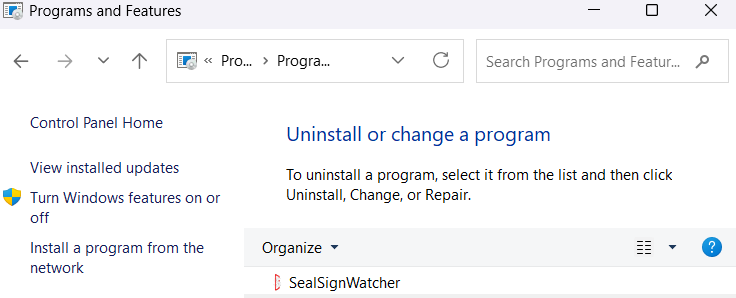

# SealSignWatcher
## 1. Introducción

**SealSignWatcher** es una solución de firma masiva asociada a la plataforma SealSign. SealSignWatcher
consta principalmente de dos partes fundamentales: un agente y una herramienta de administración de la
configuración.

El agente es el encargado de la monitorización de las carpetas seleccionadas a partir de la cual
se realiza la firma masiva. Por otro lado, la herramienta de administración es utilizada para la gestión de las
distintas configuraciones de la aplicación, tales como los parámetros de conexión a SealSign, las carpetas a
monitorizar y los perfiles de firma asociados a cada carpeta.

Resumen de los componentes de SealSignWatcher:

• El agente:
1. SealSignWatcherAgent.
2. SealSignWatcherService.

• Herramienta de Configuración:
1. SealSignWatcher.

## 2. Requisitos de instalación

Para la instalación son necesarios los siguientes elementos:

- Sistema Operativo Windows XP SP3 o superior
- Compatibilidad con entornos virtualizados (VMWare, VirtualBox, HyperV).
- .NET Framework 4.0 Client Profile.
- Al menos 1Gb de espacio libre en disco.

## 3. Instalación

Para realizar la instalación es necesario que la cuenta del usuario que ejecute la instalación tenga
privilegios administrativos. La instalación no requiere reiniciar el equipo para completarse.
La instalación se realiza ejecutando el archivo
**SealSignWatcherSetup.msi**

Para verificar o comprobar si el equipo tiene instalado el software hay que abrir el *Panel de Control*, y dirigirse
a la sección *Programas y características*. El sistema construirá la lista del software instalado. Uno de los
elementos de la lista debe hacer referencia a **SealSignWatcher** tal y como se puede apreciar en la siguiente
imagen.

<i>*Image 01: SealSignWatcher*</i>

 

La desinstalación se realiza desde la opción *Programas y características* del *Panel de
Control*, como cualquier otro programa más de Microsoft Windows. En la lista mostrada, hay que buscar la
entrada **SealSignWatcher** y desinstalarla.
Hay que tener en cuenta que solo un usuario con permisos administrativos puede desinstalar.